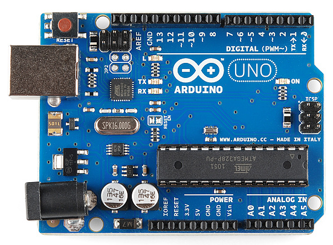
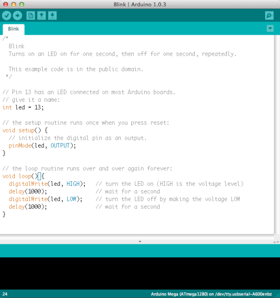
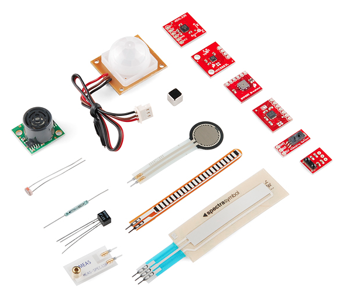
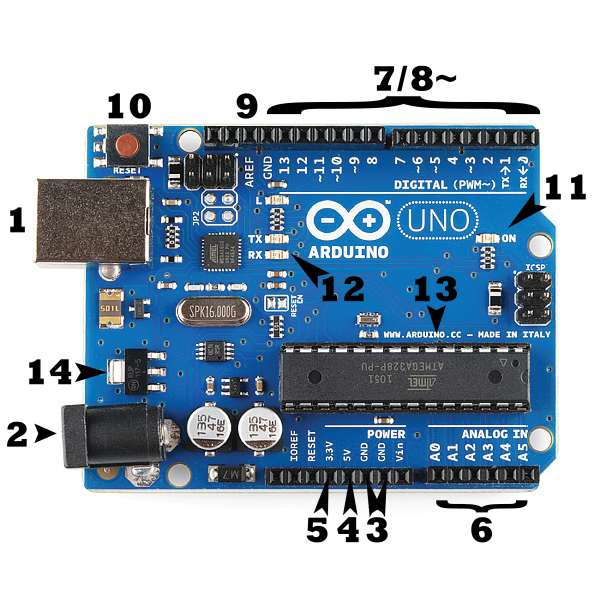
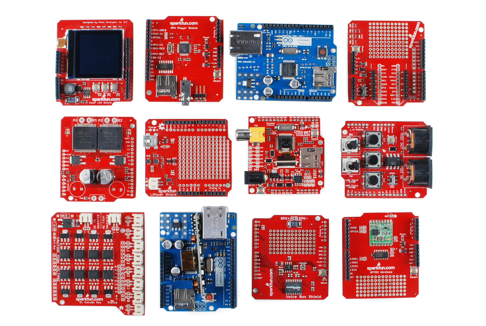

# Arduinoとは何か

Arduinoは、電子工作プロジェクトを作るためのオープンソースのプラットフォームである。
Arduinoは、物理的にプログラム可能な回路基板（しばしば[マイクロコントローラ](./integrated-circuits.md)と呼ばれる）と、パソコン上で動作するソフトウェア（統合開発環境、IDE）の2つから構成される。
このソフトウェアを使って、コードを書き、それを実際の基板に書き込む。

Arduinoプラットフォームは、電子工作を始めたばかりの人たちの間で非常に人気があり、それには理由がある。
これまでのプログラム可能な回路基板の多くとは異なり、Arduinoは新しいコードを基板に書き込むのに別売りの専用機器（プログラマー）を必要としない。USBケーブルを使うだけでよい。
さらに、Arduino IDEはC++を簡略化したような言語を使うため、プログラミングを学ぶのが簡単である。
そして最後に、Arduinoはマイクロコントローラの機能を扱いやすい形に引き出した、標準的なフォームファクタを提供している。

Unoは、Arduinoファミリーの中でも特に人気の高い基板であり、初心者にとってすばらしい選択肢である。
Unoに何が載っているか、それで何ができるかについては、このチュートリアルの後半で説明する。

信じられないかもしれないが、Arduino基板上のLEDを点滅させるには、わずか10行ほどのコードで十分である。
今の時点ではコードの意味が完全には分からなくても心配は要らない。
このチュートリアルと、このサイトに用意されている数多くのArduino関連チュートリアルを読み進めていけば、あっという間に理解できるようになるはずである。

このチュートリアルで扱う内容:

- Arduinoで実現できるプロジェクトにはどのようなものがあるか
- 一般的なArduino基板に何が載っているか、そしてそれがなぜ必要か
- Arduino基板のさまざまな種類
- Arduinoとあわせて使うと便利な部品

参考になるチュートリアル:

Arduinoは、あらゆるスキルレベルの人にとってすばらしい道具である。
とはいえ、基本的な電子工学の知識をあらかじめ理解しておくと、Arduinoでの学習がずっと楽しくなる。
Arduinoのすばらしい世界に飛び込む前に、少なくとも次のような概念をある程度理解しておくことをおすすめする。

- [電気とは何か](./what-is-electricity.md)
- [電圧、電流、抵抗とオームの法則](./voltage-current-resistance-and-ohms-law.md)
- [回路とは何か](./what-is-a-circuit.md)
- [極性](./polarity.md)
- [集積回路](./integrated-circuits.md)
- [ロジックレベル](./logic-levels.md)
- [デジタルロジック](./digital-logic.md)
- [アナログとデジタルの違い](./analog-vs-digital.md)

## Arduinoで何ができるのか

Arduinoのハードウェアとソフトウェアは、アーティスト、デザイナー、趣味人、ハッカー、初心者、そしてインタラクティブなモノや空間を作りたいと考えるあらゆる人のために設計されている。
Arduinoは、ボタン、LED、モーター、スピーカー、GPSユニット、カメラ、インターネット、さらにはスマートフォンやテレビとまでやり取りできる。
この柔軟性に加え、Arduinoのソフトウェアが無料であること、ハードウェア基板が手頃な価格であること、ソフトウェアとハードウェアの両方が学びやすいことから、非常に大きなユーザーコミュニティが生まれ、Arduinoを使った実に多種多様なプロジェクトのコードや作り方が公開されてきた。

ロボットや、暖かい手袋型のヒーティングパッド、正直すぎる占いマシン、さらにはダイスを振るガントレット型のデバイスまで、Arduinoはほぼどんな電子工作プロジェクトの頭脳としても使うことができる。

これはまだほんの入り口にすぎない。
Arduinoを使ったプロジェクトの例をもっと見てみたいなら、次のようなリソースが参考になる。

- Instructables
- Arduino Playground
- The ITP Physical Computing Wiki
- LadyAda
- Make: Projects
- もちろん、learn.sparkfun.comにも数多くのArduinoチュートリアルが用意されている

## 基板には何が載っているのか

Arduino基板にはさまざまな種類があり（異なる用途に応じて使い分けられる）、下の写真とは見た目が少し異なるものもあるが、たいていのArduinoは次のような部品の大部分を共通して備えている。

### 電源（USB／バレルジャック）

すべてのArduino基板には、電源に接続する何らかの方法が必要である。
Arduino UNOは、パソコンから伸びるUSBケーブルからでも、バレルジャックで終端された壁面電源からでも電源を取ることができる。
上の写真では、USB接続が**(1)**、バレルジャックが**(2)**とラベル付けされている。

USB接続は、Arduino基板にコードを書き込む手段でもある。

**注記：** 20ボルトを超える電源は絶対に使用しないこと。Arduinoに過大な電圧がかかり、破損してしまう。たいていのArduinoモデルで推奨される電圧は6〜12ボルトである。

### ピン（5V、3.3V、GND、アナログ、デジタル、PWM、AREF）

Arduinoのピンは、回路を組み立てるために配線を接続する場所である（たいてい[ブレッドボード](./how-to-use-a-breadboard.md)や[配線](./working-with-wire.md)と組み合わせて使う）。
たいてい黒いプラスチックの「ヘッダー」が付いており、配線をそのまま差し込むだけで接続できる。
Arduinoにはいくつかの種類のピンがあり、それぞれ基板上にラベルが付けられ、異なる機能を持つ。

- **GND (3)**：「グラウンド（Ground）」の略。Arduinoには複数のGNDピンがあり、どれを使って回路をグラウンドに接続してもよい。
- **5V (4) と 3.3V (5)**：想像どおり、5Vピンは5ボルトの電力を、3.3Vピンは3.3ボルトの電力を供給する。Arduinoと組み合わせて使う単純な部品の多くは、5Vまたは3.3Vで問題なく動作する。
- **アナログ (6)**：「Analog In」というラベルの下にあるピン（UNOではA0からA5まで）はアナログ入力ピンである。これらのピンは、温度センサーのようなアナログセンサーからの信号を読み取り、コード側で扱えるデジタルの値に変換できる。
- **デジタル (7)**：アナログピンの反対側にあるのがデジタルピン（UNOでは0番から13番まで）である。これらのピンは、ボタンが押されたかどうかを調べるデジタル入力にも、LEDを点灯させるデジタル出力にも使える。
- **PWM (8)**：一部のデジタルピン（UNOでは3、5、6、9、10、11番）の横にチルダ（~）が付いていることに気づいたかもしれない。これらのピンは通常のデジタルピンとしても使えるが、パルス幅変調（PWM）と呼ばれる機能にも使える。今のところは、これらのピンがアナログ出力のようなふるまい（LEDを徐々に明るくしたり暗くしたりするなど）をシミュレートできる、と考えておけばよい。
- **AREF (9)**：アナログリファレンス（基準電圧）の略。たいていの場合、このピンには手を触れなくてよい。アナログ入力ピンの上限として、外部の基準電圧（0〜5ボルトの間）を設定するために使われることがある。

### リセットボタン

Arduinoにはリセットボタン**(10)**が付いている。
これを押すと、リセットピンが一時的にグラウンドに接続され、Arduinoに書き込まれているコードが再起動する。
コードが繰り返し実行されない場合でも、何度もテストしたいときにとても便利な機能である。

### 電源LEDインジケーター

回路基板の「UNO」という文字の下、少し右側に、「ON」という文字の横に小さなLED**(11)**がある。
このLEDは、Arduinoを電源に接続すると点灯するはずである。
もしこのランプが点灯しなければ、何かがおかしい可能性が高い。回路をもう一度確認してみよう。

### TXとRXのLED

TXは送信（transmit）、RXは受信（receive）の略である。
これらの表記は電子工学の世界でよく見かけるもので、[シリアル通信](./serial-communication.md)を担当するピンを示している。
Arduino UNOでは、TXとRXの表記はデジタルピンの0番と1番の横、そしてTXとRXのインジケーターLED**(12)**の横という2か所に現れる。
これらのLEDは、Arduinoがデータを受信または送信しているとき（新しいプログラムを基板に書き込んでいるときなど）に、視覚的な手がかりを与えてくれる。

### メインIC

金属製の脚がたくさん付いた黒い部品が、IC（[集積回路](./integrated-circuits.md)）**(13)**である。
これはArduinoの頭脳だと考えればよい。
Arduinoに搭載されているメインICは基板の種類によって多少異なるが、たいていATMEL社のATmegaシリーズのICが使われている。
新しいプログラムをArduinoソフトウェアから書き込む前に、基板の種類とあわせてICの種類を知っておく必要がある場合があるため、この点は覚えておくとよい。
この情報はたいていICの上面に印字されている。

### 電圧レギュレータ

電圧レギュレータ**(14)**は、Arduino上で実際に操作する部品ではないが、それが何のためにそこにあるのかを知っておくとよい。
電圧レギュレータは、その名のとおり、Arduino基板に取り込む電圧の大きさを制御している。
一種の門番のようなもので、回路を傷める恐れのある過大な電圧をはじいてくれる。
もちろん限界はあるので、20ボルトを超える電源をArduinoに接続してはいけない。

## Arduinoファミリー

Arduinoにはさまざまな基板があり、それぞれ異なる能力を持っている。
また、オープンソースハードウェアであることの利点として、他の人々がArduino基板を改造したり派生版を作ったりすることで、さらに多くのフォームファクタや機能が生まれている。
Arduinoの世界に入ったばかりの人に向いている選択肢をいくつか紹介する。

### Arduino Uno (R3)

Unoは、最初のArduinoとしてすばらしい選択肢である。
始めるのに必要なものはすべて揃っており、余計なものは何もない。
14本のデジタル入出力ピン（うち6本はPWM出力として使える）、6本のアナログ入力、USB接続、電源ジャック、リセットボタンなどを備えている。
マイクロコントローラを動かすために必要なものはすべて内蔵されており、USBケーブルでパソコンに接続するか、AC-DCアダプタや電池で電源を供給するだけで使い始められる。

### LilyPad Arduino

これはLilyPad Arduinoのメイン基板である。
LilyPadは、Leah Buechleyによって開発され、LeahとSparkFunが共同で設計したウェアラブルなe-テキスタイル技術である。
それぞれのLilyPadは、大きな接続パッドと平らな背面を持つように工夫されており、[導電糸](./lilypad-basics-e-sewing.md)を使って布に縫い付けることができる。
LilyPadには、e-テキスタイル専用に作られた入力、出力、電源、センサー用の基板ファミリーもある。
水洗いすらできるものもある。

### RedBoard

SparkFunでは数多くのArduinoを使っており、常にもっともシンプルで安定した基板を探し求めている。
どの基板も少しずつ違い、私たちが求めるすべての機能を備えたものはなかったため、お気に入りの機能をすべて組み合わせた独自バージョンを作ることにした。

RedBoardは、Arduino IDEを使ってUSB Mini-Bケーブル経由でプログラムできる。
Windows 8でもセキュリティ設定を変更する必要なく動作する（UNOとは異なり、署名済みのドライバーを使っているため）。
使用しているUSB/FTDIチップのおかげで安定性が高く、背面が完全に平らなためプロジェクトへの組み込みも簡単である。
基板を接続し、ボードメニューから「Arduino UNO」を選ぶだけでコードを書き込む準備が整う。
RedBoardはUSB経由でもバレルジャック経由でも電源を供給でき、基板上の電源レギュレータは7〜15VDCの範囲に対応している。

### Arduino Mega (R3)

Arduino Megaは、いわばUNOの兄貴分である。
非常に多くの（なんと54本もの）デジタル入出力ピン（うち14本はPWM出力として使える）、16本のアナログ入力、USB接続、電源ジャック、リセットボタンを備えている。
マイクロコントローラを動かすために必要なものはすべて内蔵されており、USBケーブルでパソコンに接続するか、AC-DCアダプタや電池で電源を供給するだけで使い始められる。
ピンの数が多いため、大量のデジタル入出力を必要とするプロジェクト（多数のLEDやボタンを使うものなど）にとても便利である。

### Arduino Leonardo

Leonardoは、USB機能を内蔵した単一のマイクロコントローラを採用した、Arduinoとして初めての開発ボードである。
これにより、より安価でシンプルな構成が可能になった。
また、基板自体がUSBを直接処理するため、コンピュータのキーボードやマウスなどをエミュレートできるコードライブラリも利用できる。

## Arduinoを拡張する仲間たち

Arduino基板そのものは見た目こそかっこいいが、単体ではあまり多くのことができない。何かと組み合わせる必要がある。
このサイトには数多くのチュートリアルが用意されているが、Arduinoに簡単に組み合わせられる一般的な種類のものについてはあまり語られてこなかった。
このセクションでは、プロジェクトに命を吹き込むためのもっとも便利な道具として、基本的な**センサー**とArduinoの**シールド**を紹介する。

### センサー

簡単なコードを書くだけで、Arduinoは実に多種多様な**センサー**を制御し、やり取りできるようになる。
光、温度、曲げ具合、圧力、近接、加速度、一酸化炭素、放射線、湿度、気圧など、あらゆるものを測定できるセンサーが存在する。

### シールド

さらに、**シールド**と呼ばれるものもある。
これは基本的に、Arduinoの上に重ねて装着できる、あらかじめ作られた回路基板であり、モーターの制御、インターネットへの接続、セルラー通信やその他の無線通信、LCD画面の制御など、さまざまな追加機能を提供してくれる。

シールドについてさらに詳しく知りたい場合は、次のようなリソースを参照してほしい。

- ShieldList.org
- ShieldStravaganza!!!（SparkFunが扱うシールドを簡単に紹介する動画シリーズ）

## まとめ

これでArduinoファミリーについて、プロジェクトにどの基板を使えばよいか、そしてプロジェクトをさらに一歩進めるためのセンサーやシールドが数多く存在することが分かったはずである。
Arduinoについてさらに詳しく知りたいなら、次のようなチュートリアルもおすすめである（いずれも英語）。

- [Choosing an Arduino for Your Project（プロジェクトに合ったArduinoの選び方）](https://learn.sparkfun.com/tutorials/choosing-an-arduino-for-your-project)：多種多様なArduino基板の世界を概観し、プロジェクトに合わせて基板を選ぶ前に知っておくべき違いを解説する。
- [Installing Arduino IDE（Arduino IDEのインストール）](https://learn.sparkfun.com/tutorials/installing-arduino-ide)：Windows、Mac、Linuxのそれぞれで、Arduinoのソフトウェアをインストールし、動作確認するまでの手順を紹介する。
- [Data Types in Arduino（Arduinoにおけるデータ型）](https://learn.sparkfun.com/tutorials/data-types-in-arduino)：Arduinoのプログラミング環境でよく使われるデータ型と、その意味を学べる。

ハードウェア関連のチュートリアルとしては、次のようなものもおすすめである。

- [ブレッドボードの使い方](./how-to-use-a-breadboard.md)
- [配線の基本](./working-with-wire.md)
- [LilyPadの基礎：導電糸で縫う](./lilypad-basics-e-sewing.md)
- [プロジェクトへの電源供給](./how-to-power-a-project.md)

タグ: Arduino、シールド、プロジェクトを始める、技術

---

出典：[What is an Arduino?](https://learn.sparkfun.com/tutorials/what-is-an-arduino)（SparkFun Learn）を日本語に翻訳し、再構成した。
原文は [CC BY-SA 4.0](https://creativecommons.org/licenses/by-sa/4.0/) ライセンスで公開されており、本ページも同ライセンスの下で提供する。
