# 電気とは何か

電気は身の回りのいたるところにある。
スマートフォン、パソコン、照明、はんだごて、エアコンといった技術を動かしているのも電気であり、現代の生活の中でそこから逃れるのは難しい。
電気から離れようとしても、雷雨の稲妻から私たちの体の中のシナプスまで、自然の中でも電気は絶えず働いている。
では、電気とは正確には何なのか。
これは非常に難しい問いであり、掘り下げて問い続けても、確定的な答えはなく、電気が周囲とどう相互作用するかを表す抽象的なモデルがあるだけである。

電気は自然界のいたるところで起きる現象であり、さまざまな姿をとる。
このチュートリアルでは、電子機器を動かしている電気、つまり**電流**としての電気に焦点を当てる。
目標は、電源から配線を通って電気がどのように流れ、LEDを光らせ、モーターを回し、通信機器を動かしているのかを理解することである。

電気は簡潔には**電荷の流れ**と定義されるが、この一言の背後には多くのことが隠れている。
電荷はどこから来るのか。
どうやってそれを動かすのか。
どこへ動いていくのか。
電荷の移動が、どうして機械的な動きや発光を引き起こすのか。
疑問は尽きない。
電気とは何かを説明するには、物質や分子よりもさらに奥、私たちが日常で関わるあらゆるものを構成する原子のレベルまでズームインする必要がある。

このチュートリアルは、[力](https://ja.wikipedia.org/wiki/力_(物理学))、[エネルギー](https://ja.wikipedia.org/wiki/エネルギー)、[原子](https://ja.wikipedia.org/wiki/原子)、[場](https://ja.wikipedia.org/wiki/場_(物理学))といった、物理学の基礎的な理解を土台にしている。
それぞれの概念は簡単にしか触れないので、必要に応じて他の資料もあわせて参照してほしい。

## 原子の世界へ

電気の基礎を理解するには、まず生命と物質を構成する基本要素の1つである原子に注目する必要がある。
原子には水素、炭素、酸素、銅といった化学元素として100種類以上の形があり、多くの種類の原子が組み合わさることで分子ができ、それが私たちの目に見え、手で触れられる物質を作り上げている。

原子は*非常に*小さく、大きくてもせいぜい300ピコメートル程度である（3×10⁻¹⁰メートル、つまり0.0000000003メートル）。
仮に1円玉ならぬ純銅製の硬貨があったとすると、その中には3.2×10²²個（32,000,000,000,000,000,000,000個）もの銅原子が含まれることになる。

電気のしくみを説明するには、原子ですら十分に小さいとは言えない。
さらにもう1段階掘り下げて、原子を構成する要素である陽子、中性子、電子を見ていく必要がある。

### 原子を構成する要素

原子は、電子、陽子、中性子という3種類の異なる粒子の組み合わせでできている。
どの原子にも中心に**原子核**があり、そこに陽子と中性子が密集している。
その原子核の周りを、複数の電子が軌道を描いて回っている。

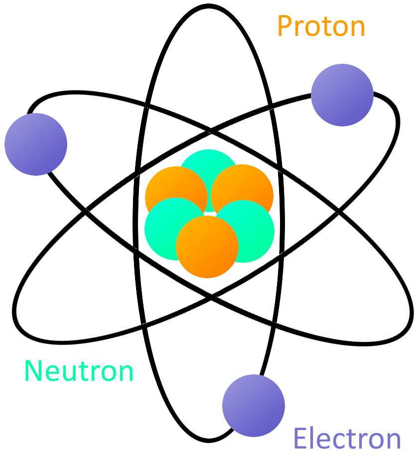

すべての原子には、少なくとも1個の陽子が含まれている。
原子に含まれる陽子の数は重要な意味を持ち、その原子がどの化学元素にあたるかを決める。
たとえば陽子が1個の原子は水素、29個の原子は銅、94個の原子はプルトニウムである。
この陽子の数のことを、その原子の**原子番号**と呼ぶ。

陽子の相棒である中性子にも重要な役割があり、陽子を原子核の中にとどめておくとともに、その原子の同位体を決めている。
ただし電気のしくみを理解するうえでは重要ではないので、このチュートリアルでは深入りしない。

電気のしくみにとって決定的に重要なのは電子である（名前からしてそれらしい響きがあるのに気づいただろうか）。
もっとも安定した、釣り合いの取れた状態では、原子の電子の数は陽子の数と等しくなる。
下の[ボーアの原子模型](https://ja.wikipedia.org/wiki/ボーアの原子模型)のように、29個の陽子を持つ原子核（つまり銅原子）の周りには、同じ29個の電子が取り巻いている。

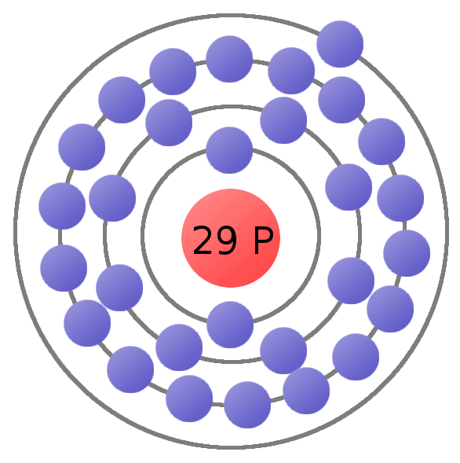

原子の中の電子は、すべてが永久に原子に縛りつけられているわけではない。
原子の一番外側の軌道にある電子は**価電子**と呼ばれる。
十分な外力が加われば、価電子は原子の軌道から離れて自由な状態になれる。
この**自由電子**こそが、電荷を動かすことを可能にし、電気そのものを成り立たせている。
ここで、電荷についてもう少し詳しく見ていこう。

## 電荷の流れ

このチュートリアルの冒頭で述べたとおり、電気は電荷の流れとして定義される。
**電荷**は、質量や体積、密度と同じように物質が持つ1つの性質であり、測定できる量である。
質量の大きさを数値で表せるのと同じように、電荷の大きさも数値で表せる。
電荷について押さえておくべき重要な点は、**正**（+）と**負**（-）という2つの種類があることである。

電荷を動かすには**電荷キャリア**が必要であり、ここで原子を構成する粒子、特に電子と陽子についての知識が役に立つ。
電子は常に負の電荷を持ち、陽子は常に正の電荷を持つ。
中性子はその名のとおり中性であり、電荷を持たない。
電子と陽子は、電荷の種類こそ違うが、電荷の**量**そのものは同じである。

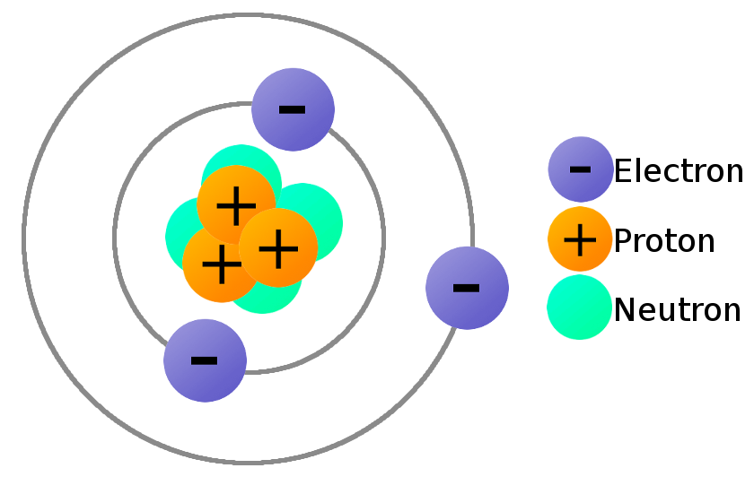

電子と陽子が電荷を持つことが重要なのは、それによって力を及ぼし合えるようになるからである。
その力こそが静電気力である。

### 静電気力

**静電気力**（[クーロンの法則](https://ja.wikipedia.org/wiki/クーロンの法則)とも呼ばれる）は、電荷どうしのあいだに働く力である。
同じ種類の電荷どうしは反発し合い、異なる種類の電荷どうしは引き合う。
**異なる符号は引き合い、同じ符号は反発する**というわけである。

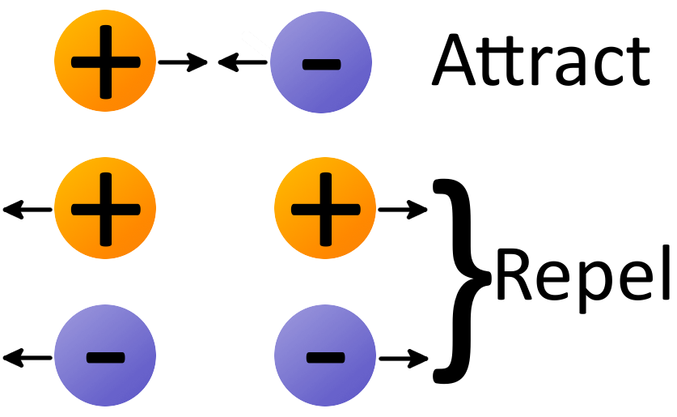

2つの電荷に働く力の**大きさ**は、両者の距離によって決まる。
2つの電荷が近づくほど、その力（引き合う力にせよ反発する力にせよ）は大きくなる。

この静電気力のおかげで、電子は他の電子を押しのけ、陽子には引き寄せられる。
この力は原子を1つにまとめておく「のり」の一部であると同時に、電子（そして電荷）を流すために必要な道具でもある。

### 電荷を流す

これで、電荷を流すために必要な道具がすべてそろった。
原子の中の**電子**は、常に負の電荷を持っているため、**電荷キャリア**として働ける。
原子から電子を1個引き離し、動かすことができれば、電気を作り出せる。

電荷を流すための元素としてよく使われる銅の原子モデルを考えてみよう。
釣り合いの取れた状態の銅原子は、原子核に29個の陽子を持ち、その周りを同じ29個の電子が回っている。
電子は原子核からの距離がそれぞれ異なる軌道を回っている。
原子核に近い電子ほど中心への引力が強く働き、遠い軌道にある電子ほどその引力は弱い。
原子の一番外側にある電子は**価電子**と呼ばれ、原子から自由にするのに必要な力がもっとも小さい。

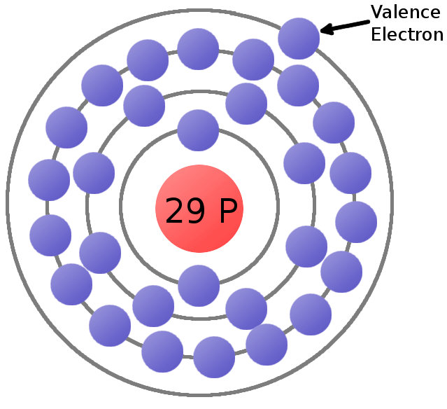

価電子に対して、別の負の電荷で押しやるか、正の電荷で引き寄せるかして十分な静電気力を加えれば、その電子を原子の軌道から弾き出し、自由電子にできる。

次に、無数の銅原子で満たされた銅線を考えてみよう。
**自由電子**が原子と原子のあいだの空間を漂っていると、その空間にある周囲の電荷から押されたりつつかれたりする。
そうした混沌の中で、自由電子はやがて新しい原子に取りつく先を見つける。
そのとき、飛び込んできた電子の負電荷が、その原子の別の価電子を弾き飛ばす。
すると、今度はその新しい電子が自由な空間を漂い、同じことを繰り返そうとする。
この連鎖反応が次々と続くことで、**電流**と呼ばれる電子の流れが生まれる。

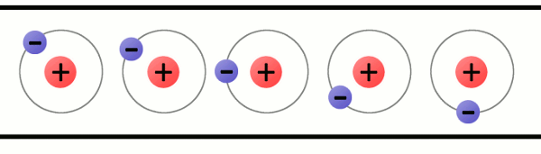

### 導電性

元素の種類によって、電子を放出しやすいものとそうでないものがある。
できるだけ多くの電子を流したいなら、価電子をあまり強く抱え込まない原子を使うのがよい。
ある元素の**導電性**は、電子が原子にどれだけ強く束縛されているかを表す指標である。

導電性が高く、電子が動きやすい元素は**導体**と呼ばれる。
これは、電線や、電子の流れを助ける他の部品を作るときに使いたい種類の材料である。
銅、銀、金といった金属は、たいてい優れた導体として選ばれる代表格である。

導電性が低い元素は**絶縁体**と呼ばれる。
絶縁体には、電子の流れを妨げるという重要な役割がある。
ガラス、ゴム、プラスチック、空気などが代表的な絶縁体である。

## 静電気と電流

先に進む前に、電気が取りうる2つの形、静電気と電流について整理しておく。
電子工作で扱うことが多いのは電流のほうだが、静電気についても理解しておく価値がある。

### 静電気

**静電気**は、絶縁体によって隔てられた物体の上に、正負それぞれの電荷が偏って蓄積している状態を指す。
静電気（「静止した」電気）は、2つの電荷のかたまりが互いにつながる道筋を見つけ、電荷の偏りが解消されるまで、そのまま存在し続ける。

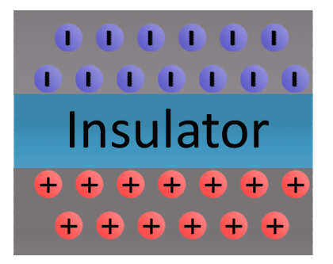

電荷が均衡を取り戻す道筋を見つけると、**静電気放電**が起きる。
このとき電荷どうしの引き合う力は非常に強くなり、空気やガラス、プラスチック、ゴムといった優れた絶縁体の中でさえ電荷が流れてしまう。
静電気放電は、電荷がどんな媒質を通り、どんな表面へ移動するかによっては人体に害を及ぼすこともある。
空気の隙間を通って電荷が均衡を取り戻すとき、移動する電子が空気中の電子と衝突して励起し、光としてエネルギーを放出することで、目に見える火花になることがある。

大きな静電気放電の中でも特に劇的な例が**雷**である。
雲の集まりが、別の雲の集団や地面に対して十分な電荷を蓄えると、その電荷は均衡を取り戻そうとする。
雲が放電すると、大量の正（あるいは負）の電荷が地面から雲へ、あるいはその逆へと空気中を駆け抜け、あの見慣れた現象を引き起こす。

風船を頭にこすりつけて髪の毛を逆立てたり、[床の上をすり足で歩いて](http://www.youtube.com/watch?v=3PPDmDnxcEc)フワフワのスリッパで（もちろんうっかりと）家の猫にショックを与えてしまったりするときにも、身近な静電気を体験できる。
どちらの場合も、異なる種類の材料をこすり合わせる摩擦によって電子が移動している。
電子を失った側の物体は正に帯電し、電子を受け取った側の物体は負に帯電する。
この2つの物体は、電荷の均衡を取り戻す方法を見つけるまで、互いに引き合い続ける。

電子工作を扱ううえでは、静電気そのものを気にする場面はあまり多くない。
気にするとすれば、たいていは静電気放電から繊細な電子部品を守ろうとする場面である。
静電気対策としては、ESD（静電気放電）対応のリストストラップを身につけたり、非常に高い電荷のスパイクから回路を守る専用の部品を組み込んだりする方法がある。

### 電流

**電流**は、私たちの電子機器のすべてを動かしている電気の形である。
この形の電気は、電荷が**絶えず流れ続けられる**ときに存在する。
電荷が集まってじっとしている静電気とは対照的に、電流は動的であり、電荷は常に動き続けている。
このチュートリアルの残りの部分では、この形の電気に焦点を当てていく。

#### 回路

電流が流れるには、[回路](./what-is-a-circuit.md)、つまり導電性の材料でできた、途切れることのない閉じたループが必要である。
回路は、端から端までつながった1本の導線だけの単純なものでもよいが、実用的な回路には通常、電線と、電気の流れを制御する他の部品が組み合わされている。
回路を作るうえで守るべきただ1つのルールは、**絶縁体による隙間を作らない**ことである。

銅原子で満たされた電線があり、そこに電子の流れを起こしたいとする。
そのためには、*すべて*の自由電子が、おおむね同じ方向へ流れていける行き先を持っている必要がある。
銅は優れた導体であり、電荷を流すのにうってつけである。
銅線でできた回路のどこかが切れていると、電荷は空気中を流れられず、切れた場所より内側にある電荷もどこへも行けなくなる。

逆に、電線が端から端までつながっていれば、すべての電子は隣り合う原子を持つことになり、みなおおむね同じ方向へ流れていける。

ここまでで、電子が*どうやって*流れるのかは理解できた。
しかし、そもそも電子を流れさせるきっかけは何なのか。
そして、いったん電子が流れ始めたら、電球を光らせたりモーターを回したりするのに必要なエネルギーはどうやって生み出されるのか。
それを理解するには、電場について知る必要がある。

## 電場

物質の中を電子がどう流れて電気になるのかは、これでひととおり理解できた。
電気について知るべきことは、ほぼこれですべて、と言いたいところだが、もう少しだけ続きがある。
ここからは、電子の流れを引き起こす源が必要になる。
たいていの場合、その源になるのが**電場**である。

### 「場」とは何か

**場**とは、目に見える接触を伴わない物理的な相互作用をモデル化するための道具である。
場は物理的な姿を持たないため目には見えないが、その効果は紛れもなく現実のものである。

私たちが無意識のうちによく知っている場の1つが、[地球の重力場](https://ja.wikipedia.org/wiki/地球の重力)、つまり巨大な物体が他の物体を引き寄せる効果である。
地球の重力場は、地球の中心を向く一群のベクトルとしてモデル化でき、地表のどこにいても、その力によって中心へ向けて押されているのを感じる。

地球のどこにいても、地表面という条件下では重力場の強さはほぼ均一に感じられるが、実際には場の強さはあらゆる場所で一様ではない。
場の発生源から離れるほど、その効果は弱くなる。
地球の重力場の大きさも、地球の中心から離れるほど小さくなる。

これから電場について見ていくが、地球の重力場のしくみを思い出しておくとよい。
両者にはよく似た点が多い。
重力場は質量を持つ物体に力を及ぼし、電場は電荷を持つ物体に力を及ぼす。

### 電場

**電場**は、電気がどのように生まれ、流れ続けるのかを理解するための重要な道具である。
電場は、**電荷どうしのあいだの空間に働く、引く力や押す力**を表す。
地球の重力場と比べたとき、電場には大きな違いが1つある。
地球の重力場は（他のあらゆるものが地球に比べてあまりに軽いため）基本的に他の物体を引き寄せるだけだが、電場は電荷を引き寄せるのと同じくらいの頻度で押しのけもする。

電場の向きは、その場の中に**正の試験電荷**を置いたときにその電荷が動く方向として定義される。
試験電荷は無限に小さいものとし、電荷自体が場に影響を与えないようにする。

まずは、正と負、それぞれ単独の電荷が作る電場を考えてみよう。
正の試験電荷を負の電荷の近くに置くと、その試験電荷は**負**の電荷に引き寄せられる。
そのため、単独の負電荷については、あらゆる方向から中心に向かって**内向き**の矢印で電場を描く。
同じ試験電荷を別の**正**の電荷の近くに置くと、今度は反発して外向きに動くため、正電荷からは**外向き**に矢印を描く。

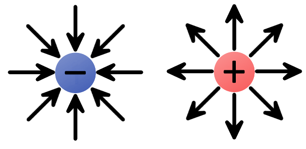

複数の電荷を組み合わせると、より複雑な電場を作れる。

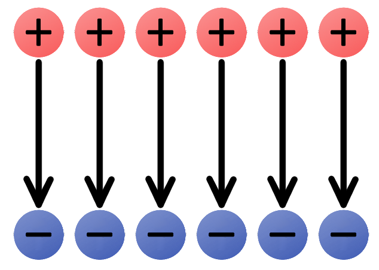

上の一様な電場は、正の電荷から離れ、負の電荷に向かう向きを指している。
ここに小さな正の試験電荷を落としたと想像すると、矢印の向きに沿って動くはずである。
すでに見たとおり、電気とはたいてい電子、つまり負の電荷の流れであり、電子は電場と**逆向き**に流れる。

電場は、電流を流すのに必要な押す力を与えてくれる。
回路の中の電場は、いわば電子ポンプのようなものであり、負の電荷を大量に蓄えた源が電子を押し出し、その電子は回路の中を、正の電荷が集まった側へ向かって流れていく。

## 電位（エネルギー）

電気を利用して回路や機器を動かすとき、私たちが実際にしているのはエネルギーの変換である。
電子回路は、エネルギーを蓄え、それを熱や光、運動といった別の形へと変換できなければならない。
回路に蓄えられたこのエネルギーを**電気的な位置エネルギー**と呼ぶ。

### エネルギーと位置エネルギー

位置エネルギーを理解するには、まずエネルギーそのものを理解しておく必要がある。
**エネルギー**とは、ある物体が別の物体に対して*仕事*をする能力、すなわちその物体をある距離だけ動かす能力として定義される。
エネルギーには**さまざまな形**があり、力学的エネルギーのように目に見えるものもあれば、化学エネルギーや電気エネルギーのように目に見えないものもある。
どんな形であれ、エネルギーは**運動エネルギー**と**位置エネルギー**という2つの状態のどちらかをとる。

物体が動いているとき、その物体は**運動エネルギー**を持つという。
運動エネルギーの大きさは、物体の質量と速さによって決まる。
一方、**位置エネルギー**は、物体が静止しているときに持つ**蓄えられたエネルギー**であり、その物体を動かしたときにどれだけの仕事ができるかを表す。
位置エネルギーは、一般には私たちが制御できるエネルギーである。
物体が動き出すと、その位置エネルギーは運動エネルギーへと変換される。

再び重力を例にとってみよう。
[ブルジュ・ハリファ](https://ja.wikipedia.org/wiki/ブルジュ・ハリファ)の最上階でじっと静止しているボウリングの球には、大きな位置エネルギー（蓄えられたエネルギー）がある。
球を落とすと、重力場に引かれて地面に向かって加速していく。
球が加速するにつれて、位置エネルギーは運動エネルギー（運動によるエネルギー）へと変換されていく。
やがて球の持つエネルギーはすべて運動エネルギーに変換され、それが衝突した相手へと受け渡される。
球が地面に達したとき、その位置エネルギーは非常に小さくなっている。

### 電気的な位置エネルギー

重力場の中の質量が重力による位置エネルギーを持つのとちょうど同じように、電場の中の電荷は**電気的な位置エネルギー**を持つ。
ある電荷の電気的な位置エネルギーは、その電荷が静電気力によって動き出したときにどれだけのエネルギーを運動エネルギーに変換でき、どれだけの仕事ができるかを表す。

塔の上に置かれたボウリングの球と同じように、別の正電荷のすぐ近くにある正電荷は高い位置エネルギーを持つ。
自由に動けるようにすると、この電荷は同符号の電荷から反発されて離れていく。
逆に、負電荷の近くに置かれた正の試験電荷は低い位置エネルギーを持ち、これは地面に置かれたボウリングの球に相当する。

何かに位置エネルギーを与えるには、それをある距離だけ動かすという**仕事**をする必要がある。
ボウリングの球の場合、その仕事とは、重力に逆らって163階分の高さまで運び上げることである。
同様に、正電荷を電場の矢印に逆らって動かす（別の正電荷に近づける、あるいは負電荷から遠ざける）にも仕事が必要になる。
場の上流へ進むほど、必要な仕事は大きくなる。
同じように、負電荷を正電荷から電場に逆らって引き離そうとするときにも仕事が必要になる。

電場の中にある電荷の電気的な位置エネルギーは、その電荷の種類（正か負か）、電荷の量、そして場の中でのその位置によって決まる。
電気的な位置エネルギーは、ジュール（*J*）という単位で測られる。

### 電位

**電位**は、電気的な位置エネルギーという考え方をさらに一歩進め、**電場にどれだけのエネルギーが蓄えられているか**を表す概念である。
これも、電場のふるまいをモデル化するのに役立つ考え方の1つである。
電位は、電気的な位置エネルギーとは*別のもの*なので注意してほしい。

電場中のある地点における電位は、その地点における**電気的な位置エネルギーを電荷量で割った値**として定義される。
こうして電荷の量という要素を式から取り除くことで、電場のその場所がどれだけの位置エネルギーを与えうるかという情報だけが残る。
電位の単位はジュール毎クーロン（*J/C*）であり、これを**ボルト**（V）と定義する。

どんな電場にも、私たちにとって特に重要な2つの地点がある。
1つは電位が高い地点で、正電荷が持ちうる位置エネルギーが最大になる場所であり、もう1つは電位が低い地点で、電荷が持ちうる位置エネルギーが最小になる場所である。

電気を論じるときにもっともよく登場する言葉の1つが**電圧**である。
電圧とは、電場の中の2点間における電位の差のことである。
電圧を見れば、その電場がどれだけの押す力を持っているかがわかる。

ここまでで、電位と位置エネルギーという材料がそろい、電流を作り出すために必要なものはすべて手に入った。
実際に電流を作ってみよう。

## 電気を実際に動かしてみる

素粒子物理学、場の理論、位置エネルギーを学んできたことで、電気を流すのに十分な知識が身についた。
実際に回路を組んでみよう。

まず、電気を作るために必要な材料を振り返っておく。

- 電気の定義は**電荷の流れ**である。通常、この電荷を運ぶのは自由に流れる電子である。
- 負の電荷を持つ**電子**は、導電性材料の原子にゆるく結びついている。少し力を加えるだけで、電子を原子から解放し、おおむね一定の方向へ流すことができる。
- 導電性材料でできた閉じた**回路**が、電子が途切れず流れ続けるための道筋を提供する。
- 電圧の源が必要である。

### ショート回路

電池は、化学エネルギーを電気エネルギーに変換する身近なエネルギー源である。
電池には2つの端子があり、それぞれが回路の残りの部分に接続される。
一方の端子には負の電荷が過剰にあり、正の電荷はもう一方に集まっている。
これはまさに、今にも働き出そうとしている電位差そのものである。

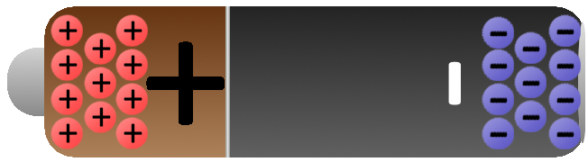

導電性の銅原子で満たされた電線をこの電池につなぐと、その電場が銅原子の中の負に帯電した自由電子に影響を及ぼす。
負極端子に押され、正極端子に引かれることで、銅の中の電子は原子から原子へと移動し、私たちが電気として知っている電荷の流れを作り出す。

電流が流れ始めて1秒経っても、電子自体が実際に移動した距離は*ごくわずか*、せいぜい1センチメートルの何分の1かにすぎない。
それにもかかわらず、電流によって生み出されるエネルギーは*膨大*であり、特にこの回路には流れを遅くしたりエネルギーを消費したりするものが何もない場合はなおさらである。
純粋な導体だけをエネルギー源に直接つなぐのは**よくない考え**である。
エネルギーは系の中を非常に速く移動し、電線の中で熱に変換され、電線の融解や発火につながりかねない。

### 電球を光らせる

そのエネルギーを無駄にし、電池と電線を壊してしまうのではなく、何か役に立つことをする回路を組んでみよう。
一般に、電気回路は電気エネルギーを光や熱、運動といった別の形のエネルギーに変換する。
電池と電球を電線でつなげば、それだけで単純ながら機能する回路になる。

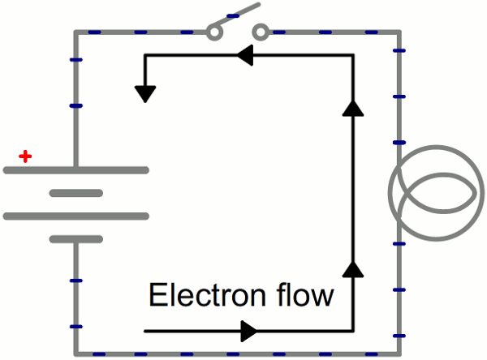

電子自体はかたつむりのようにゆっくりとしか動かないが、電場は回路全体にほぼ瞬時に（実際には光速に近い速さで）影響を及ぼす。
回路のどこにいる電子であっても、電位が低い場所にいても高い場所にいても、あるいは電球のすぐそばにいても、等しく電場の影響を受ける。
スイッチが閉じて電子が電場にさらされると、回路中のすべての電子がほぼ同時に流れ始めたように見える。
電球にもっとも近い電荷は、回路の中を一歩進んだところで、すぐに電気エネルギーを光（や熱）へと変換し始める。

## まとめ

このチュートリアルで扱えたのは、電気という大きな全体のほんの入り口にすぎない。
まだ扱っていない概念は数多く残っている。
ここから先は、[電圧、電流、抵抗とオームの法則](./voltage-current-resistance-and-ohms-law.md)のチュートリアルに進むとよい。
電場（電圧）と電子の流れ（電流）について理解した今なら、その2つの相互作用を支配する法則の理解へ、大きく近づいているはずである。

電気の基礎に関する、他の入門レベルのチュートリアルも紹介しておく。

- [回路とは何か](./what-is-a-circuit.md)
- [電力](./electric-power.md)
- [直列回路と並列回路](./series-and-parallel-circuits.md)

もう少し実践的な内容を学びたいなら、次のような基礎スキル系のチュートリアルもおすすめである。

- [テスターの使い方](./how-to-use-a-multimeter.md)
- [配線の基本](./working-with-wire.md)
- [LilyPadの基礎：導電糸で縫う](./lilypad-basics-e-sewing.md)

タグ: 概念、電気工学、物理学

---

出典：[What is Electricity?](https://learn.sparkfun.com/tutorials/what-is-electricity)（SparkFun Learn）を日本語に翻訳し、再構成した。
原文は [CC BY-SA 4.0](https://creativecommons.org/licenses/by-sa/4.0/) ライセンスで公開されており、本ページも同ライセンスの下で提供する。
