# 配線の基本

「電線（ワイヤー）」という言葉を耳にしたとき、たいていの人が思い浮かべるのは、直径数ミリから数センチほどの、柔軟で円筒形の金属の線だろう。
ワイヤーという言葉は機械的な用途にも電気的な用途にも使われるが、このチュートリアルでは電気配線に絞って説明する。

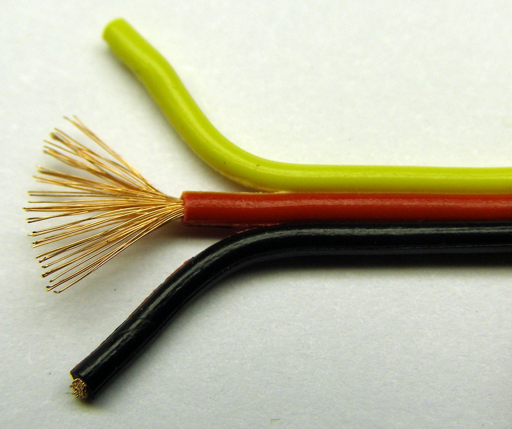

電線は現代社会を支える基盤の1つである。
家の中でも、照明をつけたり、コンロを温めたり、電話で話したりするのに電線が使われている。
電線は、[電流](./voltage-current-resistance-and-ohms-law.md)をある場所から別の場所へ流すために使われる。
ほとんどの電線は、金属の芯を絶縁体で覆った構造をしている。
**絶縁体**とは、内部の電荷が自由に動けず、そのため電流を通さない材料のことである。
完璧な絶縁体というものは存在しないが、ガラスや紙、テフロンのように抵抗率の高い材料は、優れた絶縁体として使われる。
被覆があるのは、むき出しの電線に触れることで電流が人の体を通ってしまったり（よくない）、意図せず別の電線に接触してしまったりするのを防ぐためである。

参考になるチュートリアル:

- [電圧、電流、抵抗とオームの法則](./voltage-current-resistance-and-ohms-law.md)
- スルーホールのはんだ付け
- [メートル法の接頭辞とSI単位](./metric-prefixes-and-si-units.md)

## より線と単線

電線には、単線とより線の2つの形式がある。

### 単線

**単線**は、1本の金属線（ストランドとも呼ばれる）だけでできている。
単線でよく知られる用途の1つが[ワイヤーラップ](https://ja.wikipedia.org/wiki/ワイヤラッピング)である。

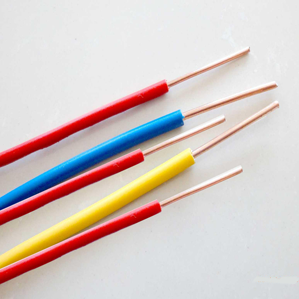

### より線

**より線**は、複数本の細い単線を1本にまとめたものである。
同じ太さの単線に比べて、はるかに柔軟である。

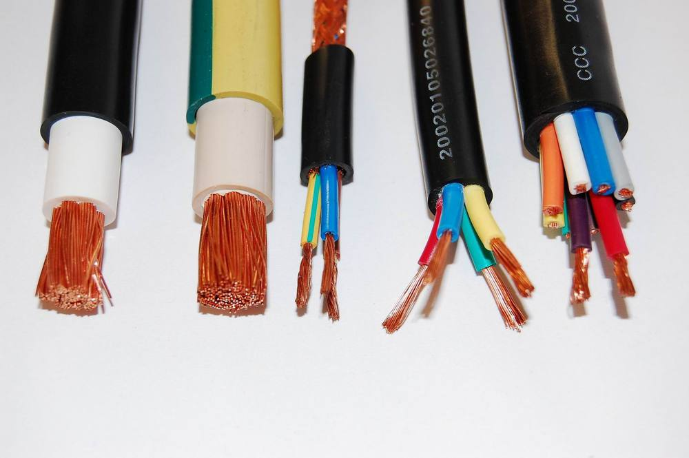

### 単線とより線、それぞれの使いどころ

より線は同じ太さの単線より柔軟なので、ロボットアームのように頻繁に動かす必要がある配線に向いている。
逆に、[ブレッドボードやプロトボード](./how-to-use-a-breadboard.md)で[回路](./what-is-a-circuit.md)を試作するときのように、ほとんど動かす必要がない場面では単線が使われる。
単線であれば、ブレッドボードの穴やプリント基板のスルーホールにまっすぐ差し込みやすい。

より線をブレッドボードやスルーホールに使おうとすると、太さによっては、差し込むときに線がばらけてしまい、かなり扱いにくくなることがある。

> [!NOTE]
> ヒント：より線をねじ端子やブレッドボード、スルーホールに接続したいときは、線をひとまとめによじり、先端にはんだを軽く染み込ませる「予備はんだ（テニング）」をしてみるとよい。
> ただし、予備はんだをした先端のはんだ付け部分は、機械的な応力や熱サイクルによって割れることがある点には注意が必要である。

## 電線の太さ

電線の直径を表す言葉として「ゲージ」が使われる。
ゲージは、その電線が安全に扱える[電流](./voltage-current-resistance-and-ohms-law.md)の量を判断するのに使われる。
ゲージには電気用と機械用があるが、このチュートリアルでは電気用のゲージだけを扱う。
ゲージの規格には主に[AWG（アメリカン・ワイヤー・ゲージ）](https://ja.wikipedia.org/wiki/%E7%B1%B3%E5%9B%BD%E3%83%AF%E3%82%A4%E3%83%A4%E3%82%B2%E3%83%BC%E3%82%B8%E8%A6%8F%E6%A0%BC)と[SWG（スタンダード・ワイヤー・ゲージ）](https://ja.wikipedia.org/wiki/Standard_Wire_Gauge)の2種類があるが、両者の違いはこのチュートリアルではそれほど重要ではない。

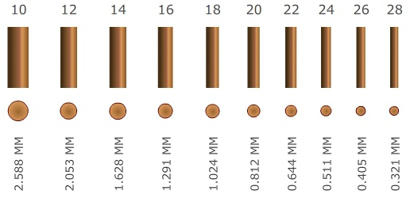

電線が流せる電流量は、電線の材質、長さ、状態などいくつかの要因によって決まる。
一般に、太い電線ほど多くの電流を流せる。

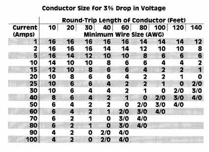

SparkFunでは、試作やブレッドボード用にたいてい**22 AWG**の電線を使っている。
ブレッドボードやPCBで使うなら、単線のほうが穴にきれいに収まるので都合がよい。
はんだ付けを伴うその他の試作や製作では、より線が第一候補になる。
ただし、1本の電線に流す電流が多すぎないように注意すること。
発熱して溶けてしまうことがある。

より細い配線が必要な場合は、**30 AWG**のワイヤーラップ用電線という選択肢もある。

> [!NOTE]
> ヒント：ワイヤーラップは、もともと試作回路を組むために使われていた技法である。
> 今日ではあまり一般的ではなくなったが、表面実装部品やPCBの小さなピンへの接続、スペースの限られたプロジェクト、基板の修理（いわゆる「グリーンワイヤー修理」）などには今でも有用である。
> 太い電線を継ぎ足す（スプライスする）ときにも、ワイヤーラップは役に立つ。

## 電線の被覆を剥く方法

安全で長持ちする電気接続は、きれいで正確な被覆剥きから始まる。
下の金属線を傷つけずに外側のプラスチック被覆だけを取り除くことが重要である。
もし電線に傷が入ってしまうと、接続が切れたり、ショートが起きたりすることがある。

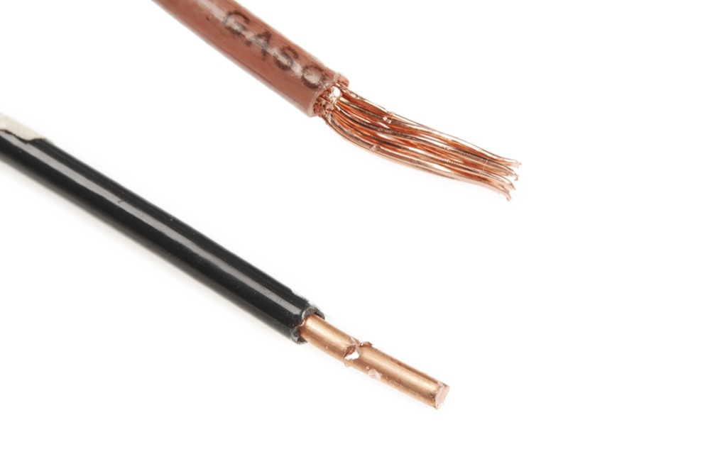

### 道具

#### 手動式ワイヤーストリッパー

シンプルな手動式の[ワイヤーストリッパー](https://www.sparkfun.com/products/12630)は、ハサミのような一対の刃でできている。
太さの異なる複数の切り欠きがあり、電線の太さに合った切り欠きを選ぶことが、電線を傷めないために非常に重要である。
メーカーによっては、ロック機構やエルゴノミックなハンドル、ねじを切断する機能が付いていることもある。

> [!NOTE]
> 警告：ホームセンターで売っている多くのワイヤーストリッパーは、細いゲージ（22〜30番）の電線を剥けないことがある。
> 試作を始めるなら、22 AWG以下の細い電線も剥ける道具を選ぶこと。
> 30 AWG（ワイヤーラップ用電線）まで剥ける道具であれば、なおよい。

ナイフでも被覆を剥くこと自体はできるが、金属部分に傷を入れたり切り込んでしまったりする恐れがある。
ナイフで電線の被覆を剥くのは、刃が滑って大怪我につながりかねないため、非常に危険でもある。

#### 自動調整式ワイヤーストリッパー

**自動調整式**のワイヤーストリッパーもあり、電線を歯の中央に置いてハンドルを握るだけで自動的に被覆を剥いてくれる。
ほとんどどんな電線でも、毎回きれいに剥ける。
メーカーによっては、被覆付きと被覆なしの電線を切断したり圧着したりする機能が付いていることもある。

> [!NOTE]
> ヒント：自動調整式のワイヤーストリッパーは、ケーブルのシースを剥いたり、複数本の被覆線を同時に剥いたりするのにも便利である。

#### ワイヤーラップツール

ワイヤーラップツールを使ってピンに電線を巻きつける場合、道具の中央にストリッパーの刃が内蔵されていて、細い電線の被覆を剥けるようになっていることが多い。
電線を刃のあいだに挟んで引っ張るだけでよい。

### 手動式ワイヤーストリッパーで被覆を剥く

電線の先端から1/4インチ（あるいは必要な長さ）のところで、適切な切り欠きを使ってハンドルを握り、少しひねると、被覆が切れて緩む。
そのままワイヤーストリッパーを電線の先端側へ引っ張ると、被覆がすっと抜ける。

### コツと注意点

電線の太さと、ストリッパーの切り欠きのサイズを正しく合わせることが重要である。
切り欠きが大きすぎると被覆が剥けず、逆に小さすぎると電線自体を傷つけてしまう。
切り欠きが小さすぎると刃が閉じすぎて、下の金属線に食い込んでしまう。
より線の場合、外側の数本が切り取られてしまい、電線全体の太さが減り、強度も落ちてしまう。
単線の場合、傷が入るとその部分の強度と柔軟性が大きく落ち、曲げたときに折れる可能性が大きく高まる。

もし誤って電線に傷を入れてしまったら、その部分を切り落として、もう一度やり直すのがもっとも確実である。

## 電線を継ぎ足す（スプライス）方法

まず、ワイヤーストリッパーで両方の電線の先端の被覆を剥く。
より線を使う場合は、先端をよじって線をまとめ、はんだ付けの前に予備はんだをしておくとよい。

むき出しになった部分を覆えるだけの長さに熱収縮チューブを切り、あらかじめどちらかの電線に通しておく。
このとき、これから継ぎ足す部分から離れた位置までチューブをずらしておくことを忘れないようにする。

2本の電線の先端を向かい合わせ、むき出しの部分どうしを触れさせる。
はんだ付け用のマットにテープで固定して、電線どうしを押さえておく。

> [!NOTE]
> ヒント：テープで固定する以外にも、「第三の手（クリップスタンド）」や3Dプリントした固定具を使う方法もある。

電線にはんだを流し込む。
はんだごてを電線に当てすぎないように注意する。
被覆が溶けて、想定より広い範囲がむき出しになってしまうことがある。

電線の裏側にもしっかりはんだが回っていることを確認する。

電線を裏返し、反対側にもはんだを行き渡らせる。
必要であればフラックスとはんだを追加する。

熱収縮チューブを使う場合は、接続部分にかぶせてスライドさせ、はんだごてやヒートガンで熱を加えて収縮させる。
仕上がると、熱収縮チューブがむき出しだった部分をきれいに覆う。

> [!NOTE]
> ヒント：他にも継ぎ足しの方法はいろいろある。
> 電線どうしをよじり合わせる方法（互い違いにねじる「ツイストヘリックス」や、同じ方向にねじる方法）や、フックのように引っ掛けてからよじる「ウェスタンユニオン splice（別名リネマンズ splice）」もあり、これは主に単線向けだがより線にも使える。
> 上級者向けには、電線を途中で完全に切断せずに分岐させる「ウェスタンTスプライス」もある。
> これは、限られたスペースの中でプルアップ抵抗のような部品を追加したいときに便利で、電線の途中の被覆をカッターやはんだごてで剥き、別の電線や端子を巻きつけてはんだ付けする。
> 仕上げに熱収縮チューブやホットグルーで絶縁するとよい。

## 電気コネクタを圧着する方法

**電気コネクタ**は、機械的な組み立てによって電気回路どうしをつなぐための部品である。
接続は一時的なこともあれば、恒久的なこともある。
[電気コネクタには何百もの種類がある](https://learn.sparkfun.com/tutorials/connector-basics)が、電線どうしをつなぐものもあれば、電線を端子につなぐものもある。

代表的なコネクタをいくつか紹介する。
左上の**絶縁スプライスコネクタ**は、2本の電線の端をつなぐためのものである。
その右にある**フォーク型端子**（スペード端子、開放リング端子とも呼ばれる）は、ねじ端子のソケットに差し込んで使うのに便利で、ねじを軽く緩めておけば取り付けられる。
中央の**リング端子**もねじ端子への接続によく使われ、フォーク型よりも信頼性の高い接続が得られるが、取り付けや取り外しの際にねじを完全に外す必要がある。
右上の**オス型スペード端子**（ブレード端子）は、右下に示した**メス型スペード端子**（ダブルクリンプ）に差し込んで使う。
これらのコネクタには、フランジ付きフォークやロック機構付きリング端子など、用途に応じたさまざまな派生形もある。

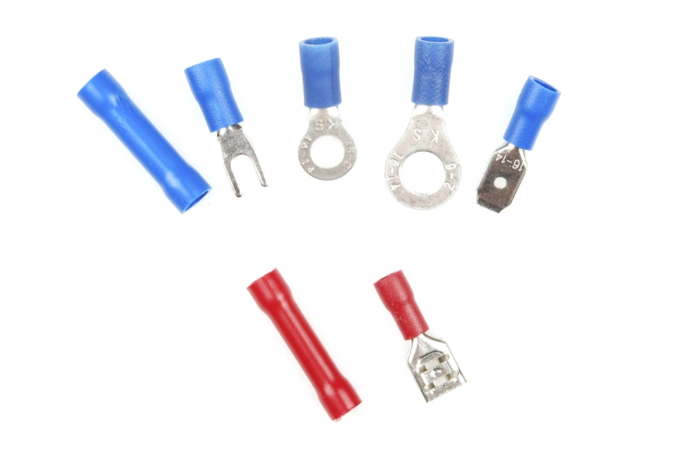

これらのコネクタにはサイズや定格の違いもあり、たとえば1/4インチと2.8mmのメス型スペード端子ではサイズが異なる。
確実な接続を得るには、コネクタのサイズをきちんと合わせる必要がある。

### 圧着（クリンプ）とは何か

ここで言う[圧着（クリンプ）](<https://ja.wikipedia.org/wiki/%E5%9C%A7%E7%9D%80%E5%B7%A5%E5%85%B7)>)とは、金属を変形させることで2つの金属部品を組み合わせ、一方が他方を保持するように接合する方法を指す。
この変形部分そのものを「クリンプ」と呼ぶ。

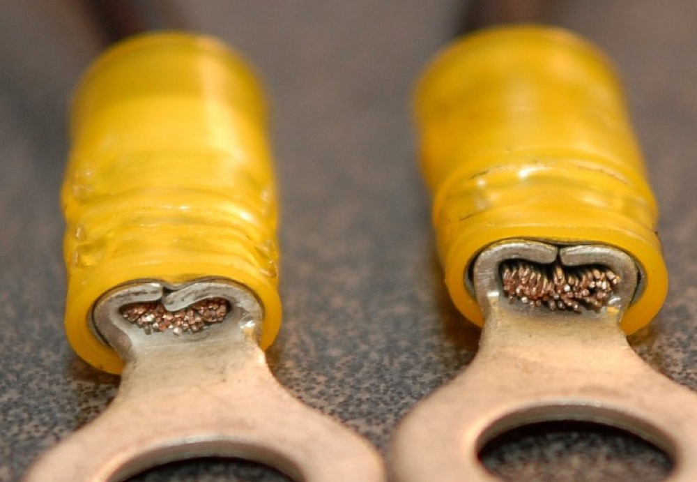

### 道具

電線にコネクタを圧着するには、圧着ピンに応じた専用の工具が必要になる。
圧着ピンの種類に応じて、いくつかのスタイルの圧着工具が存在する。

#### ラチェット式圧着工具

もっとも優れた圧着工具には、ラチェット機構が内蔵されている。
ハンドルを握るとラチェットがかかり、あご（ジョー）が途中で開かないようになっている。
十分な圧力がかかると、ラチェットが外れて圧着済みの部品が解放される。
これにより、必ず十分な圧力がかかったことを保証できる。
このタイプの工具は、あごの接触面も広く作られている。

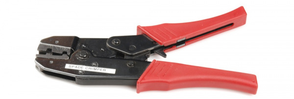

コネクタのサイズによって、工具の「ダイ」（圧着工具の先端部分）のサイズも変わる。

#### 手動式圧着工具

手動式の圧着工具でも、ほぼ同じ結果を得られるが、使う側により高い注意力が求められる。
このタイプの工具は一般に頑丈さに劣り、コネクタに対してあごが正しく揃っているか、圧着のたびに気を配る必要がある。
位置がずれると、望ましくない圧着になってしまう。
通常の使用による摩耗で、あごが完全に閉じなくなってくることもある。
基本的には、できる限り強く握れば十分である。

> [!NOTE]
> 警告：ペンチは圧着工具ではない。
> ハンマーもバイスも、ニードルノーズプライヤーも、平らな石も同様である。
> 正しい圧着工具を正しく使えば、電線とコネクタのバレル部分のあいだに「コールドウェルド（常温接合）」ができる。
> よく圧着された部分を輪切りにすると、電線とコネクタが一体化した固い形になっているのがわかる。
> 間違った道具を使うと、この状態にはならない。
> なぜこれほどの完成度が求められるのか。
> 圧着が不十分だと、電線とコネクタのあいだに空気の隙間ができてしまう。
> その隙間に湿気がたまり、湿気が腐食を招き、腐食が抵抗を生み、抵抗が発熱を招き、最終的には断線につながりかねないからである。

### クイックディスコネクトコネクタを圧着する

単線に圧着接続を使うことについては賛否両論がある。
単線を圧着すると、その部分が弱点になり、断線につながると考える人も多い。
また、単線は端子の形に合わせて変形しにくいため、より線に比べて圧着がゆるみやすいとも言われる。
どうしても単線を使う必要がある場合は、圧着した後にその部分を[はんだ付け](https://learn.sparkfun.com/tutorials/how-to-solder-through-hole-soldering)しておくとよい。

まず、端子のサイズに合った太さの電線を選ぶ（あるいはその逆）。
ここでは、圧着した接続部分に電線がなじみやすいより線を使うことを前提とする。
次に電線の被覆を剥く。
むき出しにする長さは、コネクタの金属製バレル部分の長さと同じくらい、たいてい1/4インチ程度にする。
剥いた電線がバレルの中にほとんど隙間なく収まれば、コネクタのサイズは適切である。

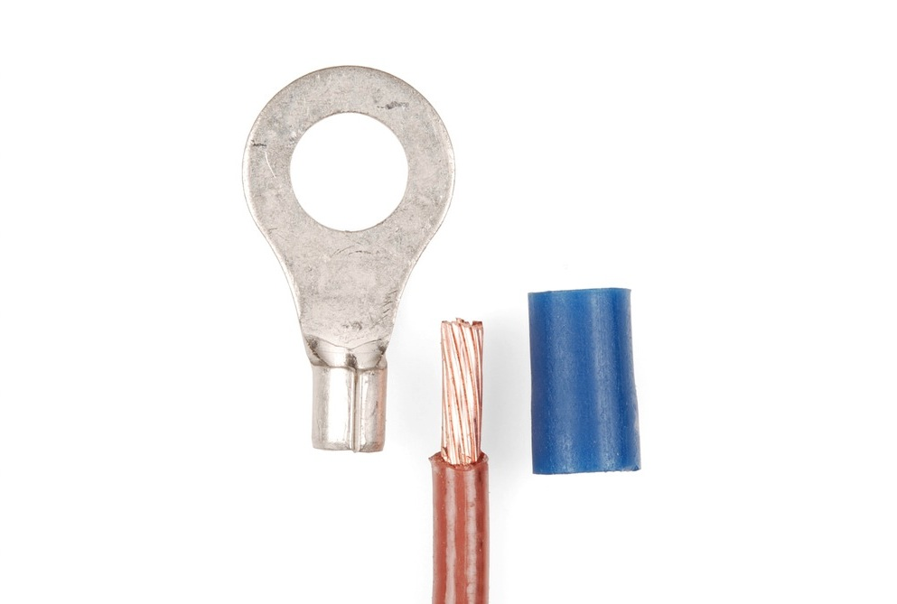

電線は、被覆がバレルの端に触れるところまで挿入する。

電線と端子を圧着工具に差し込む。
端子の被覆の色と、圧着工具に示された色の位置を合わせる必要がある。
たとえば端子の被覆が赤なら、工具の赤い印の位置を使う。
工具に色の表示がなければ、側面のゲージ表示を使う。

端子はバレル側を上にして水平に置き、工具はそのバレルに対して垂直に、リング側にもっとも近い位置に当てる。
圧着を仕上げるには、工具をかなりの力で握り込む。
一般に、圧着を「やりすぎる」ことはほぼ不可能である。

圧着が終わったら、電線とコネクタを強い力で引っ張っても外れないことを確認する。
もし外れてしまうなら、圧着は正しくできていない。
実際に使う場所に取り付けてから失敗するよりは、この段階で失敗を見つけておくほうがよい。

> [!NOTE]
> ヒント：電線がバレルに収まらない、あるいはゆるすぎる場合は、電線かコネクタのサイズや種類が合っていない。
> 必要であれば、電線とコネクタのあいだにはんだを追加することもできる。
> ただし、正しく圧着された接続は気密性の高い常温接合になっており、本来はんだは不要である。
> はんだを追加すると、機械的な振動や熱サイクルによる応力が接合部に加わりやすくなり、かえって断線の原因になることがある。
> はんだ付けは接合部の抵抗を増やすこともあるが、低電力の用途であれば、その違いが問題になることはほとんどない。

### 圧着ピンを圧着する

電気コネクタには何百もの種類があることをもう一度思い出してほしい。
設計によっては、プラスチック製のハウジングに差し込む形のコネクタもある。
バレルで電線を締め付ける代わりに、電線とその被覆それぞれを挟み込む2組の圧着タブ（「羽根」）を持つものもある。
被覆用の圧着タブは、電線を引っ張る力を逃がす「ストレインリリーフ」の役割を果たす。
圧着ピンには、プラスチックハウジングに挿入したときに使うロック用のタブや、位置決め用のストッパーが付いていることもある。

たとえば、既製のプレミアムジャンパー線には、0.1インチ間隔のPTHパッドを持つPCBに接続するためのこの種のピンが使われている。

この作業は、より小さなピンを扱うため少し根気が必要になる。
慣れていないと時間がかかることもあるが、プロジェクトに合わせた自由な長さや構成のケーブルを自作できるようになる。

まず、電線を切って被覆を剥く。
電線の太さは、圧着ピンの仕様に合わせる必要がある。
ここでは、圧着ピンのデータシートが推奨する22 AWGのより線を使い、[JST RCYコネクタ](https://www.sparkfun.com/products/10501)に接続する。
金属帯から圧着ピンを切り離した後、電線の芯を導通用のタブに、被覆を絶縁用のタブに合わせて、電線が仕様に合っているか確認する。

十分に被覆を剥けていたら、圧着ピンを工具のあごの片方に差し込む。
絶縁タブを内側に少し曲げる必要があるかもしれない。
ここでは大きいほうのあごを使う。

工具のみぞをよく確認しながら、圧着ピンをダイに差し込む。
あごの片側には半円形のみぞが2つ、もう片側には1つ切られている。
みぞが2つあるほうでタブを圧着する。
さらに、ダイの半分は絶縁タブ用にくぼんでいる。

> [!NOTE]
> 警告：圧着ピンを正しく差し込まないと、ラチェット式の工具ではタブを十分に圧着できない。
> その結果、電線とピンがきちんと導通せず、ピン自体が壊れてしまうことがある。
> 工具が途中の位置で固まってしまった場合は、ハンドルのすぐ上にある安全解除ピンを操作する必要がある。

ラチェット式の工具をゆっくり閉じて圧着ピンを固定し、剥いた電線を差し込む。
圧着ピンの絶縁タブがダイと面一になるよう、位置を調整する必要があるかもしれない。

準備ができたら、ハンドルをゆっくりとさらに握り込み、タブの圧着を進める。
うまくいかない場合は、ハンドルのすぐ上の安全解除ピンを操作する。
ラチェットが自動的に外れるまでハンドルを握り続ければ、圧着は完了である。

圧着したピンを工具から慎重に取り外す。
タブの様子を確認する。
うまくいっていなければ、もう一度あごに差し込んで圧着し直す必要があるかもしれない。

準備ができたら、圧着したピンをそれぞれのハウジングに挿入する。
ロック用のタブと、プラスチックハウジング側の穴の位置を合わせることを忘れないようにする。

正しく挿入できれば、電線はハウジングにカチッと収まるはずである。

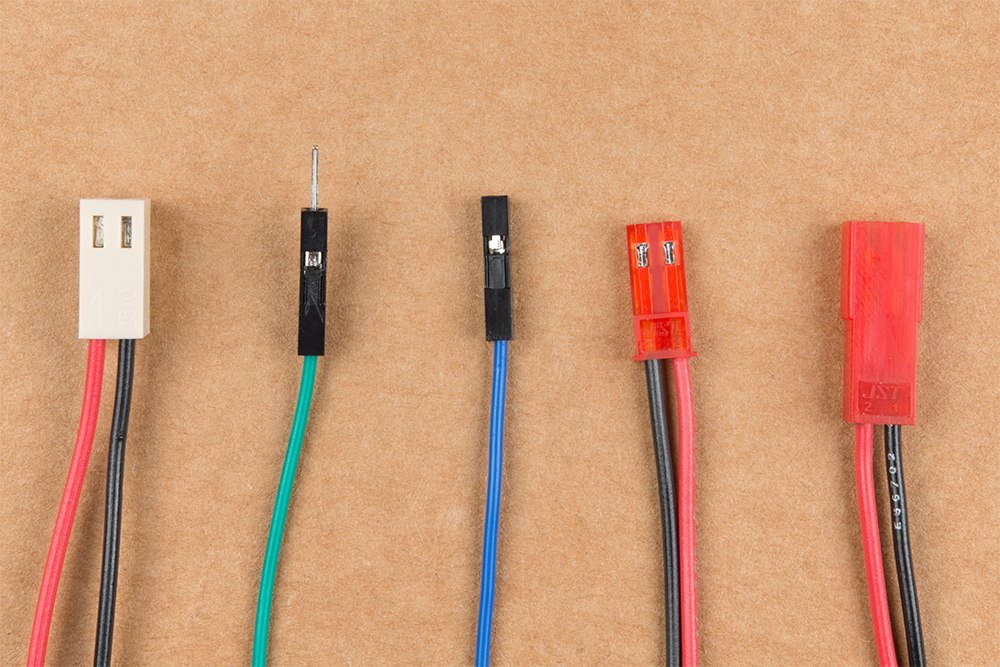

### よくある失敗

クイックディスコネクトや圧着ピンを圧着するときによくある失敗をいくつか挙げる。

電線に対してコネクタのサイズが合っていない、あるいはコネクタに対して電線のサイズが合っていない。

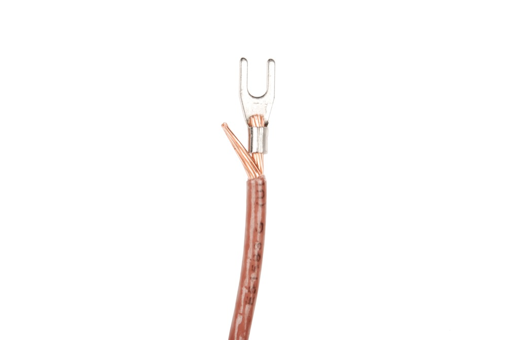

被覆を剥きすぎないよう注意すること。

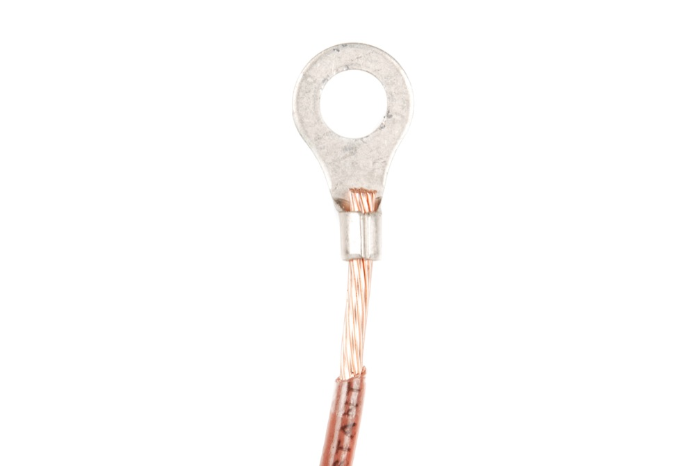

害があるとは限らないが、電線がバレルの先から出すぎているのも望ましくない。
その場合は、余った部分を切りそろえるとよい。

## ワイヤーラップツールの使い方

> [!NOTE]
> 注意：ワイヤーラップは細いゲージの電線を使うため、スペースの限られたプロジェクトには最適だが、電線が細い分、大きな電力を扱うことはできない。

30 AWGの電線をワイヤーラップツールの刃のあいだに挟み、引っ張って被覆を剥く。

端子に十分巻きつけられるだけの長さを剥いておく。
だいたい1インチほどあれば十分である。

むき出しにした電線を、側面の切り欠きの穴に差し込む。
切り欠きのある側に電線を入れ、円筒の側面の溝に沿わせる。

電線をヘッダーピン（ポスト）に差し込む。
ここでは、ミニブレッドボードに挿した[オスヘッダーピン](https://www.sparkfun.com/products/12693)を例にしている。

> [!NOTE]
> 注意：スタック可能なメスヘッダーピンは、ワイヤーラップツールと電線と一緒にねじれてしまうことがある。
> 巻きつけには、オスヘッダーピンを使うことをおすすめする。

工具を時計回りに回して、四角いヘッダーピンに電線を巻きつけていく。
もう片方の手で電線とヘッダーピンを押さえながら、剥いた部分がすべて巻き終わるまで回し続ける。

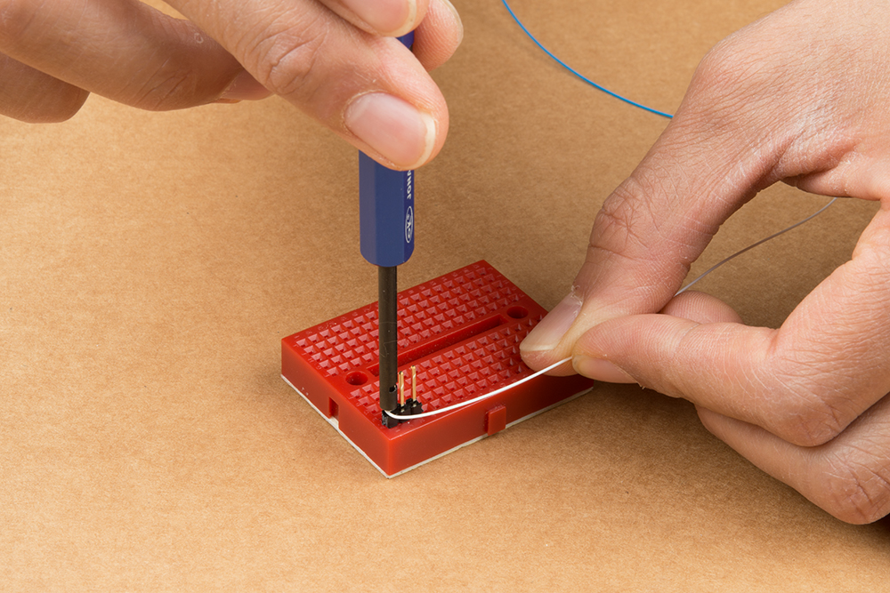

ピンから工具を外す。
仕上がると、電線の被覆はピンの根元から始まっているはずである。
より確実で恒久的な接続にしたい場合は、電線とピンのあいだにはんだを追加するとよい。

同じピンにさらに接続を増やしたい場合は、最初の巻きつけの上にもう1本の電線を巻けばよい。
何本重ねられるかは、ヘッダーピンの長さによる。
マイコンやLED、抵抗のヘッダーに、試作用としてワイヤーラップツールを使ってみるのもよいだろう。

### 巻きつけた電線を外す

ピンから電線を外したいときは、工具の反対側の端を使って反時計回りに回す。
巻きつけが緩んだら、電線をピンから引き抜く。

## 配線の取り回し

### 電線をより合わせる

プロジェクトで使う長い電線は、より合わせて（編んで）おくとよい。
より合わせることには、いくつかの利点がある。

- プロジェクトが整理された状態を保てる
- 可動部分によって電線が引っ張られるのを防げる
- 接続そのものが補強される

以下は、非アドレサブルLED用に4本のリード線を編み合わせる例である。
編むには、両手の人差し指と親指を使い、まず1組の電線を反時計回りにねじる。
ここでは緑と赤の電線を先にねじった。

もう1組の電線も反時計回りにねじる。

ねじった2組の電線を、今度は時計回りにねじり合わせる。

仕上がると、プロジェクトの配線が扱いやすく整理された状態になる。

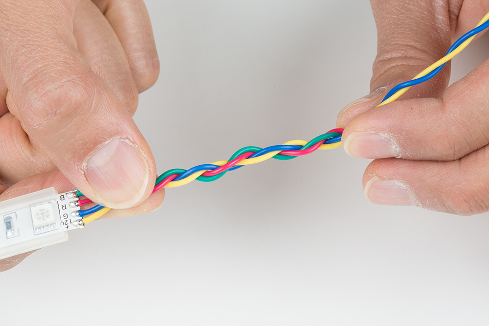

> [!NOTE]
> ヒント：長い電線をねじり合わせるときは、電動ドリルを使うと楽である。

### スリーブとケーブルキャリア

スリーブや[ケーブルキャリア](https://www.sparkfun.com/products/13207)も、可動部分から配線を守るのに役立つ。

### 複雑な配線にラベルを付ける

付箋やテープ、マーカーを使って電線にラベルを付けておくと、同じ色の電線を使っているときや、配線が複雑なとき、トラブルシューティングをするときに、どの配線がどこにつながっているかを把握しやすくなる。

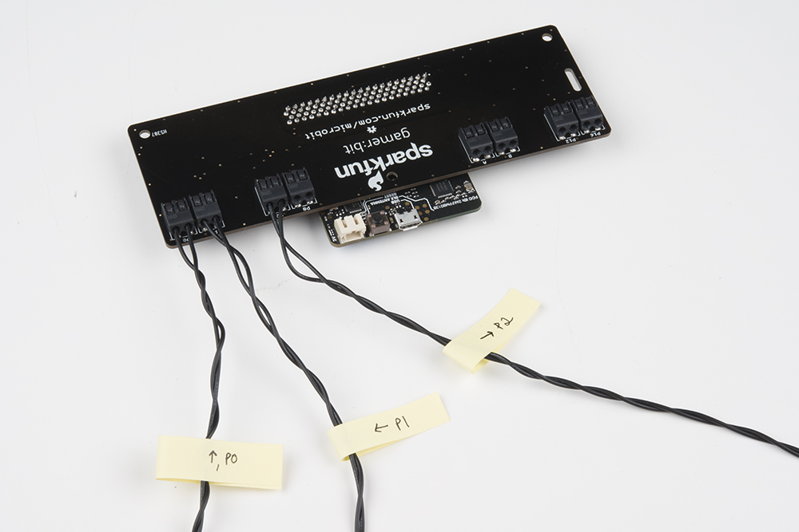

## まとめ

これで、電気配線とその使いどころについて、ひととおり理解できたはずである。
試作でも、改造でも、最終的な製品作りでも、電線は頼れる存在になってくれる。
電気配線に関連する、次のようなチュートリアルもぜひ確認してほしい。

- 電線は、自分の[回路](./what-is-a-circuit.md)を作るうえでもっとも基本的な要素である。
- [コネクタの基礎](./connector-basics.md)を確認してほしい。
- 試作を始めたいなら、[ブレッドボード](./how-to-use-a-breadboard.md)のチュートリアルから始めるとよい。
- 接続にもっと柔軟性が欲しいなら、ウェアラブル作品に[導電糸](./lilypad-basics-e-sewing.md)を使ってみるのもよい。

タグ: 電気工学、プロトタイピング、スキル、はんだ付け、ツール

---

出典：[Working with Wire](https://learn.sparkfun.com/tutorials/working-with-wire)（SparkFun Learn）を日本語に翻訳し、再構成した。
原文は [CC BY-SA 4.0](https://creativecommons.org/licenses/by-sa/4.0/) ライセンスで公開されており、本ページも同ライセンスの下で提供する。
