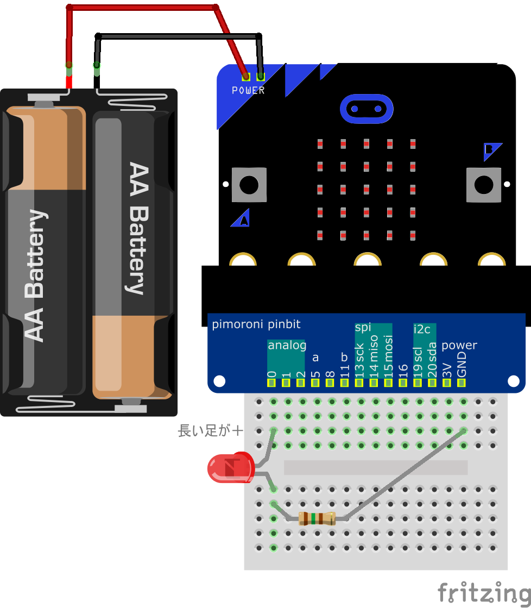
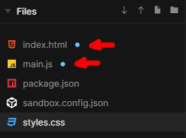
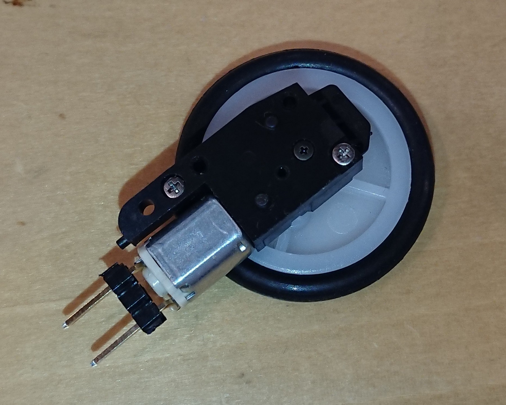

# 1. GPIO の使い方

# 概要

CHIRIMEN with micro:bit (以下 CHIRIMEN microbit) を使ったプログラミングを通じて、Web GPIO API の使い方を学びます。

CHIRIMEN microbit の基本的な操作方法は「[L チカしてみよう](GPIO_starter.md)」で既に確認済みの前提で進めます。

# 1. 準備

## 用意するもの

このチュートリアル全体で必要になるハードウエア・部品は下記の通りです。

- [L チカしてみよう](GPIO_starter.md) に記載の「基本セット」とフィジカルコンピューティングセットの中の以下のパーツ」
- microbitブレークアウトボード × 1
- ブレッドボード x 1
- タクトスイッチ (2pin, 4pin を使う場合は向きに注意) x 1
- ジャンパーワイヤー (オス-オス) x 4
- [Nch MOSFET (2SK4017)](http://akizukidenshi.com/catalog/g/gI-07597/)
- リード付き抵抗 (1KΩ) x 1
- リード付き抵抗 (10KΩ) x 1
- [ちびギアモータ](https://tiisai.dip.jp/?p=2676) x 1

## CHIRIMEN with micro:bit の起動と L チカの確認

- ついでに [L チカしてみよう](GPIO_starter.md) の 「4. L チカをやってみよう」を実施して、L チカが正しく動作することを確認してください。

## CHIRIMEN microbit の基本のおさらい

- CHIRIMEN microbit では、各種 example の配線図とコードが `https://chirimen.org/chirimen-micro-bit/examples/` においてある
<!-- - CHIRIMEN microbit で利用可能な GPIO Port 番号と位置は壁紙を見よう-->
- LED には方向がある。足が長い方 (アノード) を GPIO ポートに、反対 (カソード) を GND 側に繋ぐ。抵抗はどちら側でもよい
- CHIRIMEN microbit では Web アプリからの GPIO の制御に [Web GPIO API](http://browserobo.github.io/WebGPIO) を利用する

# 2. マウスクリックで LED の ON/OFF を制御してみる

それでは、実際にプログラミングしてみましょう。

[L チカしてみよう](GPIO_starter.md) では、[codesandbox](https://codesandbox.io/) に読み込み済みのコードを使って L チカの example コードを少し触ってみるだけでしたが、今度は最初から書いてみます。

## a. 部品と配線について

このパートでは「[L チカしてみよう](GPIO_starter.md)」で実施した L チカの配線をそのまま利用します。必要な部品も同じです。


LED は、0 番ポートに接続しておいてください。



## b. HTML/CSS を記載する

さて、まずはボタンと LED の状態インジケータを画面上に作ってみましょう。
HTML に `<button>` と `<div>` 要素を 1 つづつ作ります。

[codesandbox](https://codesandbox.io/)にアクセスし、`Create a sandbox`ボタンを押し、Static ("静的な"Webページの意味) でコード編集を始めます。

この画面のFilesパネルの index.html を選んで`<body>`要素以下に下記コードを挿入します。

```html
<button id="onoff">LED ON/OFF</button>
<div id="ledView"></div>
```

`<body>`要素内には、LEDを点灯・消灯させる`<button>`要素とLEDの点灯状態のインジケーターとなる`ledView`要素を置きます。

`<button>`要素には後述のコードの`controlLed()`関数

次に`ledView` 要素にはスタイルを付けて黒い丸として表示させましょう。こちらはFilesパネルで、下図のように赤で囲んだボタンを押し、紫の部分に`styles.css`と書き込み`Enter`キー、


新しいスタイルシートを作成して以下を記載します。記載が完了したら保存(FileメニューでSave or `CTRL+S`)を忘れずに。

```css
#ledView {
  width: 60px;
  height: 60px;
  border-radius: 30px;
  background-color: black;
}
```


最後に、HTML に戻って、今作成したスタイルシートを読み込む`link`要素と、[Web GPIO API](http://browserobo.github.io/WebGPIO) を利用可能にする Polyfill を読み込ませましょう。
先ほど追加した `ledView` のすぐ下に下記の要素を記載します。

```html
<link rel="stylesheet" href="styles.css" />
<script src="https://chirimen.org/chirimen-micro-bit/polyfill/microBitBLE.js"></script>
```


## c. ボタンに反応する画面を作る

GPIO を実際に使う前に、まずは「ボタンを押したら LED の ON/OFF 状態を表示する画面を切り替える」部分を作ってみます。　実際のLEDはまだ登場しません。

早速 JavaScript を書いていきましょう。先ほど同様Filesパネルで、下図のように赤で囲んだボタンを押し、紫の部分に`main.js`と書き込み`Enter`キー、


main.jsを作成して以下を記載します。記載が完了したら保存(FileメニューでSave or `CTRL+S`)を忘れずに。

```js
window.onload = mainFunction;

function mainFunction() {
  var onoff = document.getElementById("onoff");
  onoff.onclick = controlLed;
};

var v = 0;
function controlLed() {
  v = v === 0 ? 1 : 0;
  var ledView = document.getElementById("ledView");
  ledView.style.backgroundColor = v === 1 ? "red" : "black";
};
```
このコードでは、最初の行でコンテンツが読み込まれたタイミングでmainFunction()関数を呼び出しています。

mainFunction()関数は、
 `onoff` 要素(LEDのON/OFFボタン)を取得し、それをクリックされたときに起動する関数（イベントハンドラ）を指定ています。

controllLed()関数は、上で指定している関数のコードです。
関数が呼ばれるたびに、`ledview` の色を赤⇔黒交互に書き換えるものです。

最後に、index.htmlに戻り、作ったコードを読み込ませます。先ほど挿入した`<script>`タグの次の行に追加しましょう。記載が完了したら保存(FileメニューでSave or `CTRL+S`)を忘れずに。
```html
<script src="main.js"></script>
```

ここまでできたら 準備編と同様、画面右上のボタンを押し別ウィンドでウェブアプリを起動しましょう。
`LED ON/OFF` ボタンが表示されたら、ボタンをクリックしてみてください。ディスプレイの丸が、赤 → 黒 → 赤 → 黒 → 赤 → 黒 → とクリックする都度切り替えできるようになったら成功です。

注記：codesandboxでは右側のパネルにウェブアプリが開かれています。これはmicrobitをBluetooth接続しない限りはうまく動作するのですが、次項以降でmicrobitを接続しようとすると動作しなくなりますので、別ウィンドで開くことを慣れておきましょう。



## d. ボタンに LED を反応させる

画面ができたので、いよいよ Web GPIO を使った LED 制御コードを書きます。一度 L チカの時に学んだことを思い出せばできるはずです。

### microbitを接続する
microbitの接続はユーザインターフェースで発動する必要がありましたね。そこでCONNECTボタンをhtmlに設置します。

index.htmlのパネルに移り、`<body>`要素以下の最初の行に以下を追加します。記載が完了したら保存(FileメニューでSave or `CTRL+S`)を忘れずに。
```html
<button id="connect">CONNECT</button>
```

次に、main.jsのパネルに戻ります。mainFunction内に 上記のボタンに反応してmicrobitを接続・初期化する関数路呼び出すコードを追加します。追加する場所はmainFunction関数の先頭か末尾が良いでしょう。
```js
var connectButton = document.getElementById("connect");
connectButton.onclick = connect;
```

そして、上記で指定した関数を追加します。追加する場所はmain.jsの末尾で良いでしょう。

```js
var gpioPort0;
async function connect() {
  var microBitBle = await microBitBleFactory.connect();
  var gpioAccess = await microBitBle.requestGPIOAccess();
  var mbGpioPorts = gpioAccess.ports;
  gpioPort0 = mbGpioPorts.get(0);
  await gpioPort0.export("out");
};
```
これで、`CONNECT`ボタンによるmicrobitの接続が実装できました。

### LEDをボタンのステータスに応じてON/OFFさせる
controlLed()関数内の末尾に以下を追加するだけで実装完了です。
```js
gpioPort0.write(v);
```

main.js全体のコードは以下のようになっているはずです。
```js
window.onload = function mainFunction() {
  var onoff = document.getElementById("onoff");
  onoff.onclick = controlLed;
  var connectButton = document.getElementById("connect");
  connectButton.onclick = connect;
};

var v = 0;
function controlLed() {
  v = v === 0 ? 1 : 0;
  var ledView = document.getElementById("ledView");
  ledView.style.backgroundColor = v === 1 ? "red" : "black";
  gpioPort0.write(v);
}
var gpioPort0;
async function connect() {
  var microBitBle = await microBitBleFactory.connect();
  var gpioAccess = await microBitBle.requestGPIOAccess();
  var mbGpioPorts = gpioAccess.ports;
  gpioPort0 = mbGpioPorts.get(0);
  await gpioPort0.export("out");
}
```

index.htmlのほうはこのようになります。

```html
<!DOCTYPE html>
<html lang="en">
  <head>
  :
  </head>
  <body>
    <button id="connect">CONNECT</button>
    <button id="onoff">LED ON/OFF</button>
    <div id="ledView"></div>
    <link rel="stylesheet" href="styles.css" />
    <script src="https://chirimen.org/chirimen-micro-bit/polyfill/microBitBLE.js"></script>
    <script src="main.js"></script>
  </body>
</html>
```

css, html, jsとも、変更を確定するために、忘れず保存(FileメニューでSave or `CTRL+S`)しましょう。それぞれのファイルごとに保存が必要です。保存できていないものはFilesパネルで青丸が付いています。



ここまでできたら、画面右上のボタンを押し別ウィンドでウェブアプリを起動しましょう。

これで、CONNECTボタンクリックでmicrobitと接続した後、LED ON/OFFボタンクリックに反応して LED がON/OFFできたら成功です。

[L チカしてみよう](GPIO_starter.md) の L チカのパートでも簡単に説明しましたが、ここでもういちど GPIO を使う流れをおさらいします。

CONNECTボタンで呼び出されるconnect()関数を見ましょう。

### microBitBle = await microBitBleFactory.connect()

接続したmicrobitへのアクセスの窓口となるmicroBitBleインスタンスを取得します。`microBitBleFactory.connect()`は非同期処理でmicrobitへの接続を行う非同期メソッドですので `await` で完了を待ってから次の処理を行います。

### await navigator.requestGPIOAccess()

まずは **Web GPIO を利用する `GPIOAccess` インタフェースを取得** します。`requestGPIOAccess()` も同様には非同期処理でインターフェイス初期化を行う非同期メソッドですので `await` で完了を待ってから次の処理を行います。

<!-- async/await を使わずプロミスでコードを書きたい場合は返されるプロミスの `then` にコールバック関数を登録してください。初期化が完了したら `GPIOAccess` パラメータ付きでコールされます。 -->

### gpioAccess.ports.get()

`GPIOAccess.ports` は利用可能なポートオブジェクトの一覧 ([Map](https://developer.mozilla.org/docs/Web/JavaScript/Reference/Global_Objects/Map)) です。

`gpioAccess.ports.get(2)` のようにすることで利用可能なポートオブジェクトの一覧から、 **GPIO ポート番号 2 を指定して `port` オブジェクトを取得** しています。

### await port.export()

`port.export("out")` により取得した GPIO ポートを **「出力モード」で初期化** しています。この初期化処理も非同期処理となっているため、`await` を付けて完了を待ってから次の処理に進めます。

GPIO ポートにかける電圧を Web アプリで変化させたい時には「出力モード」を指定する必要があります。一方、GPIO ポートはもうひとつ「入力モード」があり、これは GPIO ポートの状態 (電圧の High/Low 状態) を読み取りたい時に利用します。入力モードについてはスイッチを使う例の中で説明します。


次にボタンを押したときに呼び出されるcontrolLed()関数を見ます。

### port.write()

`port.write()` は、出力モードに指定した **GPIO ポートの電圧を切り替える** API です。
`port.write(1)` で、指定したポートから HIGH (microbit では 3V) の電圧がかかり、`port.write(0)` で LOW(0V) になります。

<!--

-->

# 3. マウスクリックのかわりにタクトスイッチを使ってみる

それでは、さきほどまで書いたコードをベースに、マウスクリックの替わりにスイッチを利用するよう変更していきます。今回は一般的に「タクトスイッチ」と呼ばれるものを利用します。

### タクトスイッチについて

「タクトスイッチ」は[アルプス電気の商標](http://www.alps.com/j/trademark/)ですが、電子部品屋さん等ではアルプス電気製ではないスイッチも、同様の形状・配線のものは「タクトスイッチ」として売られています。

- [秋月電気の「タクトスイッチ」一覧](http://akizukidenshi.com/catalog/c/ctactsw/)

本チュートリアルでは次のような仕様の「電気部品屋さん等でタクトスイッチとして売られてるスイッチ」を使います。

- SPST (Single-Pole Single-Throw、1 回路 1 接点)
- プッシュボタンが 1 つで押し込みでスイッチ ON、離すとスイッチ OFF (モーメンタリ動作)

タクトスイッチには 2 端子のものだけでなく、端子が 4 つあるタクトスイッチも多いので注意が必要です。4 ピンのタクトスイッチではどの端子間が常に接続されており、どの端子間がボタンによってオンオフされるか注意してください。

[タクトスイッチの製品ページ](https://www.alps.com/prod/info/J/HTML/Tact/SnapIn/SKHW/SKHWALA010.html) などにも回路図がありますが、端子が出ている向き (次の図では縦方向) は常に接続されており、それと直行する (横) 方向がボタンによって切り替わります。次の図では左の 4pin スイッチと右の 2pin スイッチ (とジャンパーワイヤ) が同じ回路となります。


## a. 準備：画面のボタンをモーメンタリ動作に変えておく

これまでに作成したプログラムは「ブラウザ画面のボタンをクリックしたら LED の HIGH/LOW を切り替える」というものでした。

クリック後は変更後の状態が維持されます。これは「オルタネート」のスイッチと同じ動きです。一方で、今回用意したタクトスイッチは「モーメンタリ」のものです。

### スイッチの動作：オルタネートとモーメンタリ

- オルタネート : 状態をトグル (切り替え) します。一度ボタンを押すと ON になりボタンから手を離しても OFF に変わりません。次にボタンを押すと OFF になります。ボタンから手を離しても ON に変わることはありません。
- モーメンタリ : 押している間だけ ON になります。スイッチから手を離すと OFF に戻ります (タクトスイッチはこちら)。

画面のマウス操作がオルタネートでタクトスイッチがモーメンタリと、2 つの動作が混在すると整合性がとれないので、ブラウザ画面のボタンを「モーメンタリ」に合わせて変更しましょう。

下記のように、現在は `onclick` イベントで切り替えています。クリックイベントは、「マウスのボタンを押して離す」ことで発生します。

```js
var v = 0;
function controlLed() {
  v = v === 0 ? 1 : 0;
  ledView.style.backgroundColor = v ? "red" : "black";
  gpioPort0.write(v);
};
```

これを、マウスボタンを押した時と離した時にそれぞれオンオフさせる～押している間だけオンになる「モーメンタリ」動作にするには、

- マウスのボタンを押す → LED を ON
- マウスのボタンを離す → LED を OFF

```js
  onoff.onmousedown = onLed;
  onoff.onmouseup = offLed;
```

```js
function onLed() {
  ledView.style.backgroundColor = "red";
  gpioPort0.write(1);
};
function offLed() {
  ledView.style.backgroundColor = "black";
  gpioPort0.write(0);
};
```

これでマウスもタクトスイッチも同じ挙動になりそうです。

さて、タクトスイッチから操作する時も同じ処理を呼ぶことになるので、ここで LED の ON/OFF と `ledView` のスタイル切り替えをまとめて関数化しておきましょう。すると次のようなコードになります:

```js

mainFunction();

async function mainFunction() {
  var connectButton = document.getElementById("connect");
  connectButton.onclick = connect;  
  var onoff = document.getElementById("onoff");
  onoff.onmousedown = onLed;
  onoff.onmouseup = offLed;
};

function onLed() {
  ledOnOff(1);
};

function offLed() {
  ledOnOff(0);
};

function ledOnOff(v) {
  var ledView = document.getElementById("ledView");
  if (v === 0) {
    gpioPort0.write(0);
    ledView.style.backgroundColor = "black";
  } else {
    gpioPort0.write(1);
    ledView.style.backgroundColor = "red";
  }
}

```

## b. 部品と配線について

今回追加するのは下記部品です。

- 前述のタクトスイッチ × 1
- ジャンパーワイヤー（オス-オス）× 2 (写真ではオス・メスですが、オス・オスが必要)


下図のように、さきほどの LED の配線にタクトスイッチを追加しましょう。この図の例では 2 ピンのタクトスイッチを使っていますが、4 ピンの場合も黄色と黒のジャンパーワイヤの間にボタンでオンオフが切り替わるよう向きに注意してスイッチを配置してください。

<!-- TODO: 4pin タクトスイッチの図も用意してリンクしてあげたい -->


### 今回のスイッチは「プルアップ」回路で接続

上記回路ではスイッチが下記のように接続されています。

- Port 2 にスイッチを接続
- GND にスイッチの反対側を接続

これでどのようになるかというと、下記のようになります。

- スイッチを押す前は、Port 2 は HIGH (3V)
- スイッチを押している間、Port 2 は LOW (0V)

どうしてこうなるのでしょうか。実は、microbit の GPIO ポートは、初期状態で「プルアップ」を設定できます。そしてプルアップとは、回路を初期状態で「HIGH にしておく」ことです。
<!--

-->

今回の回路では、Port 2 を利用しています。
さきほどの動作となるメカニズムは下記の通りです。


この動作を頭に入れておきましょう。

## c. スイッチに反応するようにする (port.read()を使ってみる)

いよいよ、スイッチに対応させます。まずは、単純に「GPIO ポートの状態を読み込む」 `port.read()` を使います。

`port.read()` で GPIO を読み込むコードは次のように書けます:

```js
var gpioAccess = await microBitBle.requestGPIOAccess(); // writeと一緒。
var port = gpioAccess.ports.get(2); // Port 2 を取得
await port.export("in"); // Port 2 を「入力モード」に。
var val = await port.read(); // Port 2の状態を読み込む
```

### await port.export()

`port.export("in")` により取得した **GPIO ポートを「入力モード」で初期化** しています。このモードは GPIO ポートにかかる電圧を Web アプリ側から読み取りたい時に使います。初期化は非同期処理であり `await` で完了を待つ必要があることに注意してください。このときCHIRIMEN microbitではプルアップがデフォルトで設定されます。(2番目の引数で"down"を指定するとプルダウンにもできる。)

### await port.read()

`port.export("in")` で入力モードに設定した **GPIO ポートの現時点の状態を読み取ります**。読み取りは非同期処理になるので `await` で完了を待つようにしてください。

<!-- プロミスでコードを書きたい場合は `port.read().then((data)=>{ ... });` のように書きます。 -->

上記コードで GPIO ポートの読み取りが１度だけ行えますが、今回は「スイッチが押され状態を監視する」必要がありますので、定期的に `port.read()` を繰り返して GPIO ポートの状態を監視する必要があります。

例えば単純に一定時間毎に決まった処理をする `setInterval()` でポーリング (定期問い合わせ) 処理するとこんなコードになります:

```js
  var gpioAccess = await microBitBle.requestGPIOAccess(); // writeと一緒。
  var port = gpioAccess.ports.get(2)); // Port 2 を取得
  await port.export("in"); // Port 2 を「入力モード」に。
  setInterval(() => {
    var val = await port.read(); // Port 5の状態を読み込む
    //
    // ここにswitchの状態による処理を書き足す
    //
  }, 100); // 100ms 毎に実行
```

一応これでも動作しますが、この場合 `setInterval()` のポーリング間隔を極端に短くすると `port.read()` の読み取り結果が返って来る前に、次の Interval で読み取り要求してしまうようなケースも発生します。

場合によっては、こうした「順序の乱れ」が意図しない不具合を招くことも考えられます。

順序の乱れが生じないようにするには `setInterval()` で一定時間毎に実行するのではなく、一定時間の待ち時間を入れて繰り返す処理にします。これで順序が維持されるポーリング処理となります (これならポーリング間隔を短くしても不具合が生じません):

```js
var gpioAccess = await microBitBle.requestGPIOAccess(); // writeと一緒。
var port = gpioAccess.ports.get(2); // Port 2 を取得
await port.export("in"); // Port 2 を「入力モード」に。
for (;;) {
  var val = await port.read(); // Port 5の状態を読み込む
  //
  // ここにswitchの状態による処理を書き足す
  //
  await sleep(100); // 100ms 秒待ってから繰り返す
}
```

LED の処理と組み合わせた全体のコードは次のようになります。LED表示用とスイッチ検出用のport変数が被らないように注意します。:

```js
import "./styles.css";

mainFunction();

async function mainFunction() {
  var connectButton = document.getElementById("connect");
  connectButton.onclick = connect;

  var onoff = document.getElementById("onoff");
  onoff.onmousedown = onLed;
  onoff.onmouseup = offLed;
}

function onLed() {
  ledOnOff(1);
}

function offLed() {
  ledOnOff(0);
}

function ledOnOff(v) {
  var ledView = document.getElementById("ledView");
  if (v === 0) {
    gpioPort0.write(0);
    ledView.style.backgroundColor = "black";
  } else {
    gpioPort0.write(1);
    ledView.style.backgroundColor = "red";
  }
}

var gpioPort0, gpioPort2;
async function connect() {
  var microBitBle = await microBitBleFactory.connect();
  var gpioAccess = await microBitBle.requestGPIOAccess();
  var mbGpioPorts = gpioAccess.ports;
  gpioPort0 = mbGpioPorts.get(0);
  await gpioPort0.export("out");
  gpioPort2 = gpioAccess.ports.get(2); // タクトスイッチのポート番号
  await gpioPort2.export("in");
  await readSwitchLoop();
}

async function readSwitchLoop() {
  for (;;) {
    var val = await gpioPort2.read(); // Port 2の状態を読み込む
    val = val === 0 ? 1 : 0; // スイッチは Pull-up なので OFF で 1、LED は OFF で 0 なので反転させる
    ledOnOff(val);
    await sleep(100);
  }
}
```

さて、ここまで出来たらスイッチを押してみてください。LED が押してる間だけ点灯したら成功です。(変更したファイルの保存を忘れずに)

ただ、このコードでは今度はブラウザ画面上の「LED ON/OFF」ボタンを押したときに正しく点灯しなくなってしまっています。スイッチの状態を読んで LED を切り替える処理がポーリング動作しているため、スイッチが押されていないとすぐに LED が消えてしまいます。

## d. スイッチに反応するようにする (port.onchange())

これまで一通り `port.read()` を使ったスイッチの制御方法を見てきましたが、実は Web GPIO API には「入力モード」の GPIO ポートの状態に応じて処理する方法がもうひとつ用意されています。それが `port.onchange()` です。

`port.onchange()` の説明は後回しにして、さきほどのサンプルを `port.onchange()` を使ったコードに書き換えてみます。

```js
import "./styles.css";

mainFunction();

async function mainFunction() {
  var connectButton = document.getElementById("connect");
  connectButton.onclick = connect;

  var onoff = document.getElementById("onoff");
  onoff.onmousedown = onLed;
  onoff.onmouseup = offLed;
}

function onLed() {
  ledOnOff(1);
}

function offLed() {
  ledOnOff(0);
}

function ledOnOff(v) {
  var ledView = document.getElementById("ledView");
  if (v === 0) {
    gpioPort0.write(0);
    ledView.style.backgroundColor = "black";
  } else {
    gpioPort0.write(1);
    ledView.style.backgroundColor = "red";
  }
}

var gpioPort0, gpioPort2;
async function connect() {
  var microBitBle = await microBitBleFactory.connect();
  var gpioAccess = await microBitBle.requestGPIOAccess();
  var mbGpioPorts = gpioAccess.ports;
  gpioPort0 = mbGpioPorts.get(0);
  await gpioPort0.export("out");
  gpioPort2 = gpioAccess.ports.get(2); // タクトスイッチのポート番号
  await gpioPort2.export("in");
  gpioPort2.onchange = toggleLed;
}

function toggleLed(val) {
  // スイッチは Pull-up なので OFF で 1、LED は OFF で 0 と反転させる
  ledOnOff(val === 0 ? 1 : 0);
};

```

コードを見ていただけたらお気づきかもしれません。 `port.onchange` は **入力モードの GPIO ポートの「状態変化時に呼び出される関数を設定する」** 機能です。

`port.read()` を使ったコードと異なりポーリング処理が不要となり、コードも簡潔になりました。

ポーリングによる LED 制御処理を行なっていないので、ブラウザ画面のボタンも正しく反応できるようになります。

# 4.LED のかわりに ギアモータ（ちびギアモータ）を動かしてみる

Web GPIO API の機能が一通り確認できましたので、次は違う部品も制御してみましょう。

ここでは、**MOSFET** を使って ギアモータ（ちびギアモータ）の単純な ON/OFF を制御してみましょう。
  >Note1: CHIRIMEN with micro:bit フィジカルコンピューティングセット(スターターキット)ではギアモータの一例として、ちびギアモータをセットに含めています。ここまで「ギアモータ」と「ちびギアモータ」を併記してきましたが、以下では「ちびギアモータ」とのみ記載します。ちびギアモータ以外のギアモータを利用する場合には製品の仕様をご確認の上お試しください。

  >Note2: micro:bitのGPIOポートは流せる電流の上限が決められています。[1ピンあたり流せる電流が5mA、より詳しい情報はリンクを参照してください。](https://tech.microbit.org/hardware/edgeconnector/#gpio-capabilities) また電圧も3Vに限定されています。小さなLED数個の場合はこの条件内で使えますが、モーターやソレノイド、パワーLEDなどは直結できません。このようなケースに使えます。

## MOSFET とは

[MOSFET](https://ja.wikipedia.org/wiki/MOSFET) とは[電界効果トランジスタ (FET)](https://ja.wikipedia.org/wiki/%E9%9B%BB%E7%95%8C%E5%8A%B9%E6%9E%9C%E3%83%88%E3%83%A9%E3%83%B3%E3%82%B8%E3%82%B9%E3%82%BF) の一種で、主にスイッチング素子として利用される (小さな電圧の変更で大きな電流・電圧のオンオフを切り替える) 部品です。

今回は Nch MOSFET「[2SK4017](http://akizukidenshi.com/catalog/g/gI-07597/)」を利用します。


プルダウンのGPIOポートを使った典型的な回路は以下のようになります。
  >Note: 図のVCCは、基本的にはmicrobitの3V端子ではありません。DC負荷用に別に用意した電源を使用するべきです。ちびギアモータを使った次章の例では、モータの消費電力が十分小さいため例外的にRaspberry Pi3の3V端子から電力を得ています。一方GNDはRaspbeery Pi3と、このDC負荷用電源とを共に接続します。
  

<!--

-->

## ギアモータとは

ギアモータとは、モーターに減速機（ギヤ）を組み合わせることにより、低回転、高トルクを出せる駆動装置です。

今回はとても小型なギアモータである、[ちびギアモータ](https://tiisai.dip.jp/?p=2676)を利用します。

|  |  |
| --- | --- |
|  |  |

## a. 部品と配線について

ちびギアモータ本体に加え、以下のものを用意します。


次に、先ほどの「タクトスイッチを押したら LED をつけたり消したり」する回路から、LED と LED 用の抵抗を一旦外して、MOSFET と抵抗、ちびギアモータを次のように配置します。


回路図の配置を多少調整していますが、黄色のジャンパーピンと黒のジャンパーピンの間をスイッチでオンオフできるように配線するのは同じです。手持ちのスイッチやジャンパワイヤに合わせて上手く配線してみてください。

※上の回路図例は 2pin のタクトスイッチを利用したものになっています。4pin のタクトスイッチを利用した回路図例は[こちら](imgs/section1/DC3motor.png)をご覧ください。

さて、それでは遊んでみましょう。

## b. コードは... 書き換えなくて良い

実は、この回路は先ほどまでのコード **「d. スイッチに反応するようにする (port.onchange())」** と同じコードで動きます。
LED が点灯する替わりにちびギアモータが動くようになりました。電圧を加える対象のデバイスが変わっただけで、プログラムで制御する、スイッチのオンオフに連動して電圧を変える処理は同じだからです。

<!--  TODO: アニメーション画像が用意でき次第挿入 -->

## c. しかし... (オチ w)

スイッチを押してギアモータが回るだけなら、3V → タクトスイッチ → ギアモータ →GND と繋げば **プログラムを書かなくても出来る！！！！**

...... スイッチではなく何かセンサーの値に連動するようにしましょう。(続く...)

# まとめ

このチュートリアルでは、実際にコードを書きながら Web GPIO API の基本的な利用方法を学びました。
- CHIRIMEN micro bitを接続し、Web GPIO APIを有効にする 
(UI要素`onclick`〜`microBitBleFactory.connect()`)
- Web GPIO API を使った GPIO 出力ポートの設定と出力処理までの流れ (`microBitBle.requestGPIOAccess()`〜`port.write()`）
- Web GPIO API を使った GPIO 入力ポートの設定と読み出し処理の流れ (`microBitBle.requestGPIOAccess()`〜`port.read()`）
- Web GPIO API を使った GPIO 入力ポートの設定と変化検知受信の流れ (`microBitBle.requestGPIOAccess()`〜`port.onchange()`)

このチュートリアルで書いたコードは以下のページで参照できます:

- [GitHub リポジトリで参照](https://chirimen.org/chirimen-micro-bit/examples/GPIO4/)
- [codesandboxで参照](https://codesandbox.io/s/github/chirimen-oh/chirimen-micro-bit/tree/master/examples/GPIO4)
- ブラウザで開くページ (各ステップ)
<!--
  - [画面のボタンで画面の要素の色を変える](examples/section1/s1_1.html)
  - [他面のボタンで LED が光り画面の要素の色も変わる](examples/section1/s1_2.html)
  - [マウスで画面のボタンを押している間だけ LED が光る](examples/section1/s1_3.html)
  - [タクトスイッチを押している間だけ LED が光る](examples/section1/s1_4.html)
  - [画面のボタンまたはタクトスイッチを押している間だけ LED が光る](examples/section1/s1_5.html)
-->
次の『[センサーを使ってみよう](I2C_starter.md)』では Web I2C API を使ってセンサーの値を読み出す手順を学習します。
