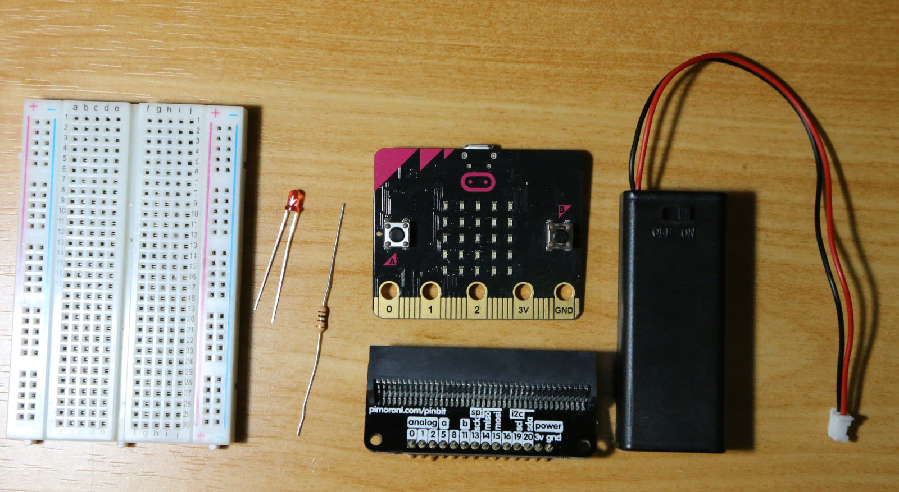
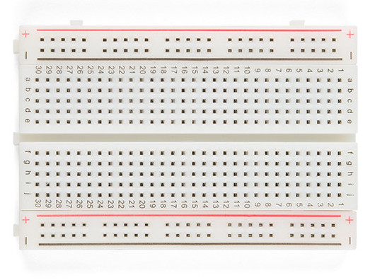
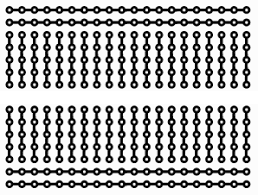
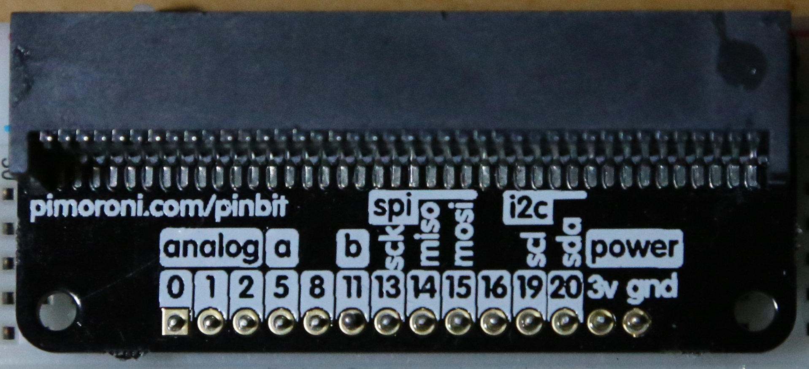

<!--
---
layout: tutorial
lang: ja
permalink: /microbit/GPIO_starter
---
-->

# L チカしてみよう (初めての GPIO)

# 1. はじめに

まずは CHIRIMEN with micro:bit (以下 CHIRIMEN microbit) を使って Web アプリから「L チカ」(LED を点けたり消したり) するプログラミングをしてみましょう。CHIRIMEN microbit の基本的な操作方法を学び、実際に L チカするコードを読み書きします。

## CHIRIMEN with micro:bit とは

CHIRIMEN with micro:bit は、PC上のウェブアプリを組むだけで、様々なセンサーやアクチュエータ(モーター等)デバイスをコントロールするIoTシステムをプロトタイピングできるプログラミング環境です。micro:bitを経由することで、(PCに繋げることが難しい) 様々なデバイスを簡単につなげることができます。
[Web GPIO API](http://browserobo.github.io/WebGPIO) や [Web I2C API](http://browserobo.github.io/WebI2C) といった JavaScript でハードを制御する API を活用したプログラミングにより、Web アプリ上で microbit に接続した電子パーツを直接制御できます。　また、microbitが内蔵するLEDや加速度センサー等も利用することができます。


# 2. 事前準備 (機材確認)

既に準備編で必要な材料を揃え、環境設定や動作確認が済んでいますね。　それでは進めていきましょう！
### L チカに必要となるパーツ

準備編で動作を確認した以下に加えて、
- PC
- micro:bit
- 電池ボックス

基本セット及びフィジカルコンピューティングセットの中の下記パーツを用意しましょう。


- microbitブレークアウトボード × 1
- ブレッドボード × 1
- リード付き LED × 1
- リード付き抵抗器 (150-470Ω ※お使いの LED により。スターターキットは 150Ω を使用します。) × 1
<!--- ジャンパーワイヤー (オス-オス) x 2-->

<!--
# 3. CHIRIMEN with micro:bit を起動してみよう
-->

# 4. 「L チカ」をやってみよう

いよいよ L チカに挑戦してみましょう。

## そもそも「L チカ」って何？

「L チカ」とは、LED を点けたり消したりチカチカ点滅させることです。今回は「LED を点ける」「LED を消す」をプログラムで繰り返し実行することで実現します。

- 参考：[LED（発光ダイオード）](https://ja.wikipedia.org/wiki/%E7%99%BA%E5%85%89%E3%83%80%E3%82%A4%E3%82%AA%E3%83%BC%E3%83%89)

## 配線してみよう

最初に注意事項、電池は最後に繋ぎます。配線が全て済んでからmicrobitを起動するためです。

LEDを microbit と正しく配線する必要があります。LED は 2 本のリード線が出ていますが、長い方がアノード（+側）、短い側がカソード（-側）です。

L チカのための配線図は以下の通りです。


LED のリード線の方向に注意しながら、この図の通りにジャンパーワイヤやブレッドボードを使って配線してみましょう。

配線図では LED の上側のリード線が長い方がアノード (+側) です。microbitの0番ピンに接続しましょう。`schematic.png`で使用されている抵抗は"120Ω"です。使用する抵抗は、LED にあったものを使用してください。

実際に配線してみると、こんな感じになりました。



### 参考

- ブレッドボードの構造 (上図の実体配線図のブレッドボードは、- +のライン(電源ライン)が省略されている、より小型のブレッドボードです)

  | 外観 | 内部の接続状態 |
  | ---- | ---- |
  |  |  |

- [ブレッドボードの使い方をくわしく知る](https://www.sunhayato.co.jp/problem-solving/howto_SAD-101.html)
- [LED の使い方](https://www.marutsu.co.jp/pc/static/large_order/led)
- [抵抗値の読み方](http://www.jarl.org/Japanese/7_Technical/lib1/teikou.htm)
- [Raspberry Pi の GPIO](https://tool-lab.com/make/raspberrypi-startup-22/)
- [テスターを使って抵抗値を確かめる](http://startelc.com/elcLink/tester/elc_nArtcTester2.html#chapter-2)

 microbitにハートマークが表示されているはずです。表示されていない場合は電池ボックスを外した後、配線図の通り配線されているか、もう一度しっかり確認してみましょう。

## example を実行してみる

配線がうまくできたら、さっそく動かしてみましょう。PCのブラウザを起動し、
L チカのためのサンプルコードは[こちらにアクセス](https://codesandbox.io/s/github/chirimen-oh/chirimen-micro-bit/tree/master/examples/GPIO1)してください。

```
https://codesandbox.io/s/github/chirimen-oh/chirimen-micro-bit/tree/master/examples/GPIO1
```
準備編と同様、画面右上のボタンを押し別ウィンドでウェブアプリを開きます。開いたら、アプリのなかの`connect`ボタンを押し　出現するダイアログでmicrobitを接続します。

先ほど配線した LED が点滅しているはずです！

## ブラウザ画面

[](imgs/section0/browser.png)

## L チカの様子



<!-- TODO: ファイルサイズの小さい WebM 動画などに -->

L チカに成功しましたか？！

## うまくいかなかったら?

配線に誤りがないか (特にジャンパーワイヤを指す microbit 側のピン)、複数のタブで同じ L チカコードを開いていないかなどを確認しても原因が分からない場合、`F12` キーやブラウザのメニュー → 「その他のツール」→「デベロッパーツール」で `Console` を開いて何かエラーメッセージが出ていないか確認してください。詳しくは [トラブルシューティングページ](debug.md) を参考にしてください。

# 5. コードを眺めてみよう

ソースコードは、ウェブアプリのタブから戻れば、ウィンド上に開かれていますね！

<!--
## 留意事項

その前に一つ注意です。CHIRIMEN microbit での GPIO などの操作には排他制御があり、複数のウェブアプリが同時に一つのmicrobitと接続はできません。

既に開いているウィンドウを確実に閉じるには、一度ブラウザを閉じてから、再度ブラウザを起動すると確実です (通常はタブだけ消しても十分です)。



-->
それでは、コードを眺めてみましょう。

## HTML

初めの状態では、最初に読み込まれるhtmlのコードが表示されています。

<!--
FIXME: 参照に失敗している

```html


``` -->

最初の`<script>`要素で`https://chirimen.org/chirimen-micro-bit/polyfill/microBitBLE.js` という JavaScript ライブラリを読み込んでいます。これは [Web GPIO API](http://browserobo.github.io/WebGPIO) と、[Web I2C API](http://browserobo.github.io/WebI2C) という W3C でドラフト提案中の 2 つの API への [Polyfill (新しい API を未実装のブラウザでも同じコードが書けるようにするためのライブラリ)](https://developer.mozilla.org/ja/docs/Glossary/Polyfill) で、最初に読み込むとそれ以降のコードで GPIO や I2C を操作する JavaScript API が使えるようになります。

2番目の`<script>`要素でこれから読むメインのコードが読み込まれています。

そして、最初の`<input>`要素が、このウェブアプリの起動ポイントになります。ユーザがConnectボタンを押すことで、次項のJavaScriptコードで定義された`connect()`関数が呼び出されます。

### Note:
CHIRIMEN microbit は[Web Bluetooth](https://developer.mozilla.org/docs/Web/API/Web_Bluetooth_API)を使ってワイヤレス通信し、microbitをコントロールしています。ワイヤレスで他のデバイスと接続し情報をやり取りするという特性から、webBluetoothで接続を開始する際にいくつかのセキュリティ上の制限が設けられています。
- 独立したウィンドウでのみ有効(iframeで使えない)
- httpsによるページでのみ有効
- ユーザインターフェースにより、ユーザの指示を受け付けた時のみ有効

`connect()`関数が`<input>`要素を介しユーザの指示で呼び出されるようになっているのはこの制限のためです。

## JavaScript

画面左側のFilesパネルからmain.jsを選択すると、JavaScriptコード `main.js` が表示・編集できます。

<!--

FIXME: 参照に失敗している
```javascript

```

-->

### 注記

CHIRIMEN microbit はウェブブラウザをプログラムの実行環境として用いてシステムを構築します。ウェブブラウザが実行できるプログラムのプログラミング言語は JavaScript です。JavaScript を学んだことのない人は、まず[こちらの資料「JavaScript 1 Day 講習」](https://r.chirimen.org/1dayjs)を履修しましょう。

## 非同期処理について

物理デバイス制御やネットワーク通信などを行う際には、応答待ち中にブラウザが停止しないよう非同期処理を使う必要があります。
本チュートリアルではこれを [async 関数](https://developer.mozilla.org/docs/Web/JavaScript/Reference/Statements/async_function) で記述しています。非同期処理を知らない人や async 関数を使ったことがない人は、必要に応じて[こちらの資料「非同期処理 (async await 版)」](appendix0.md) も参照してください。

非同期処理を使いこなすのは難しいですが、本チュートリアルでは次のルールでコードを書けば大丈夫です:

- **非同期関数の呼び出し時には前に `await` を付けて呼び出す**
  - 非同期関数呼び出し前に `await` を付けるとその処理が終わってから次のコードが実行されます
  - GPIO や I2C の初期化、ポートの設定などは非同期関数なので `await` キーワードを付けて呼び出します
- **非同期処理を含む関数は前に `async` を付けて非同期関数として定義する**
  - `async function 関数名() { ... }` のように頭に `async` を付けると非同期関数となります

非同期関数を `await` なしで呼び出すと返り値は Promise オブジェクトとなるため Promise について理解しておかなければ返り値の判断や実行順序が入れ替わって意図せぬ挙動になります。例えば、ポートの初期化を `await` なしで呼び出すと、初期化完了前に次の行の処理を続け、初期化未完了のハードを操作しようとして失敗したり、ネットワーク通信完了前に受信データを読みだそうとして失敗します。

ハードを触るときは常に非同期呼び出しをする (その処理を含む関数も入れ子で非同期呼び出しする) と決めておけば迷うことなく、コードの実行順序も上から下に見たとおりの順番で実行されて読みやすくなります。

### Note:

本チュートリアルで非同期処理を async 関数に統一している理由は、記述がシンプルで初心者も読み書きしやすいコードになるからです。この機能は比較的新しい JavaScript 言語機能 (ECMASCript 2017) ですが、microbit 上で使う上で問題はありません ([様々なウェブブラウザでのサポート状況](https://caniuse.com/#feat=async-functions))。

## 処理の解説

今回の JavaScript ファイルで、最初に呼び出されるコードは `async function connect()`関数 です。

ここで、まず`microBitBleFactory.connect()`という関数で、microbitとBluetoothによる接続を行い、microbitBleインスタンスを取得します。

取得した`mirobitBle`インスタンスに対し、先ほど出て来た [Web GPIO API](http://browserobo.github.io/WebGPIO) を使い、`gpioAccess` という GPIO にアクセスするためのインタフェースを取得しています。

**関数の呼び出しに `await` 接頭詞を付けることに注意してください。** この関数は非同期関数ですが、その処理の完了を待ってから次の処理をする必要があります。そして `await` 接頭詞を使うので、それを含む関数(`mainFunction()`)は async 接頭詞を付けて非同期関数として定義しなければなりません。

コードを読み進める前に、ここで少し GPIO について記載しておきたいと思います。

## GPIO とは

[GPIO](https://ja.wikipedia.org/wiki/GPIO)は、「General-purpose input/output」の略で汎用的な入出力インタフェースのことです。

microbitブレークアウトボードに実装されている ピンヘッダ端子(pin:bitの場合14本ある)から GPIO を利用することができます。（全てのピンが GPIO として利用できるわけではありません）

CHIRIMEN microbit では microbitブレークアウトボード が提供する 0,1,2,5,8,11,13,14,15,16番ピンが GPIOとしてWeb アプリから利用可能です。

microbit の GPIO 端子は、GND 端子との間に、0V もしくは 3.3V の電圧を印加(出力)したり、逆に 0V もしくは 3.3V の電圧を検知(入力)したりすることができます。LED は数 mA の電流を流すことによって点灯できる電子部品のため、印加する電圧を 3.3V(点灯)、0V(消灯) と変化させることで L チカが実現できるのです。

詳しくは[こちらのサイトの解説](https://tool-lab.com/make/raspberrypi-startup-22/)などを参考にしてみましょう。


## micro:bitの端子について


- micro:bit 本体には、プリント基板上に金メッキされた電極がたくさんついています。このようなタイプの端子をエッジコネクターと呼びます
  - この信号端子にジャンパーワイヤを結線するのはあまり簡単ではありません(ただし丸い穴が開いた大きな端子はワニ口クリップ付き電線でくわえて使える設計になっている)。そこでmicro:bitブレークアウトボードを使います。ブレークアウトボードは14本しか端子が出ていませんが、下図のように実はもっと沢山の端子があることがわかります。
  - microbit ブレークアウトボード
  

- [信号端子の説明図](https://tech.microbit.org/hardware/edgeconnector/#edge-connector-pins)
  - GPIO端子は`P+数字`の端子。ただし他の信号と共用されている端子があります。たとえば`P5`は`BUTTON A`と共用。
  - そこでCHIRIMEN with micro:bitでGPIOとして使用できるのは[このページに記載された端子](https://chirimen.org/chirimen-micro-bit/guidebooks/diff_rpi3.html#%E4%BD%BF%E7%94%A8%E3%81%A7%E3%81%8D%E3%82%8Bgpio%E3%83%9D%E3%83%BC%E3%83%88)になっています。
- その他
  - [micro:bitの端子仕様がまとめられたページ](https://tech.microbit.org/hardware/edgeconnector/)
  - [I2C](https://tech.microbit.org/hardware/i2c/) - 19,20番ポート (I2Cについては[後のチュートリアル](I2C_starter.md)で学びます)
  - [その他micro:bitハードウェア全般](https://tech.microbit.org/hardware/)


## GPIOPort の処理

さて、コードに戻りましょう。 **`var port = gpioAccess.ports.get(0);` で GPIO の 0 番ポートにアクセスするためのオブジェクト** を取得しています。続いて、 **`await port.export("out")` で GPIO の 0 番を「出力設定」にしています**。これにより LED への電圧の切り替えが可能になっています。

そして、一番下に定義した`LEDblink()`関数を呼び出しています。

この関数では`await sleep(1000)` で 1000ms = 1 秒 待機させて無限ループを作っています。そのループの中で、`port.write(1)` と `port.write(0)` を交互に呼び出し、GPIO 0 番に対する電圧を 3.3V → 0V → 3.3V → 0V と繰り返し設定しています。

LED は一定以上の電圧 (赤色 LED だと概ね 1.8V 程度、青色 LED だと 3.1V 程度) 以上になると点灯する性質を持っていますので、3.3V になったときに点灯、0V になったときに消灯を繰り返すことになります。

まとめると下図のような流れになります。


## example を修正してみよう

JavaScript のペイン (コードが表示されているところ) をクリックするとカーソルが表示されコード修正も可能です。
試しにいろいろ変えてみましょう。

- 点滅周期を早くしたり遅くしたりしてみる
- 点灯する時間と消灯する時間を変えてみる
- GPIO ポートを他のポートに変えてみる (ジャンパーワイヤも指定番号の GPIO ピンに配線する)
  - [使用できるポート](https://chirimen.org/chirimen-micro-bit/guidebooks/diff_rpi3.html#%E4%BD%BF%E7%94%A8%E3%81%A7%E3%81%8D%E3%82%8Bgpio%E3%83%9D%E3%83%BC%E3%83%88)
- index.html にボタンなどのインターフェースを作ってみて、押すと LED が反応するようにする
- などなど...

# まとめ

このチュートリアルでは、下記を実践してみました。

- ブレッドボードを使って配線してみた
- L チカのサンプルを動かしてみた
- L チカのコードを変更してみた

## このチュートリアルで書いたコードは以下のページで参照できます:

- codesandboxで開くページ(チュートリアルではこれを使いました)
  - [https://codesandbox.io/s/github/chirimen-oh/chirimen-micro-bit/tree/master/examples/GPIO1](https://codesandbox.io/s/github/chirimen-oh/chirimen-micro-bit/tree/master/examples/GPIO1)
- ブラウザで開くページ
  - [https://chirimen.org/chirimen-micro-bit/examples/GPIO1/index.html](https://chirimen.org/chirimen-micro-bit/examples/GPIO1/index.html)
- GitHub リポジトリで参照
  - [https://github.com/chirimen-oh/chirimen-micro-bit/blob/master/examples/GPIO1/](https://github.com/chirimen-oh/chirimen-micro-bit/blob/master/examples/GPIO1/)

### その他の CHIRIMEN microbitの様々なサンプルコード
　次章で説明するコードやその他のさらに多くのコードが以下で参照できます

- ブラウザで開くページ (codesandboxのリンクもあります)
  - [https://chirimen.org/chirimen-micro-bit/examples/](https://chirimen.org/chirimen-micro-bit/examples/)
- GitHub リポジトリで参照
  - [https://github.com/chirimen-oh/chirimen-micro-bit/blob/master/examples/](https://github.com/chirimen-oh/chirimen-micro-bit/blob/master/examples/)


次の『[GPIO の使い方](GPIO_basic.md)』では GPIO の入力方法について学びます。
