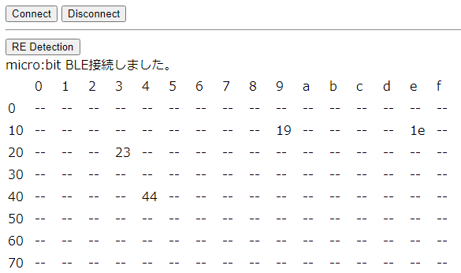

# 3. I2C の使い方

# 概要

CHIRIMEN with micro:bit（以下 「CHIRIMEN microbit」） を使ったプログラミングを通じて、Web I2C API の使い方を学びます。

[前回](section2.md) は温度センサを使いながら Web I2C API の基本的な利用方法を学びました。今回は温度センサ以外のI2Cセンサの使い方を見ていきましょう。

ここでは例として光センサ、距離センサ、加速度センサの 3 つについて詳しく説明しますが、最後に「他の I2C モジュールも使ってみる」として紹介しているように、CHIRIMEN ではそれ以外にも多くの I2C デバイス (あるいは I2C の ADC を使って様々なアナログセンサ類) が簡単に扱えるようになっており、 [examples ページ](https://chirimen.org/chirimen-micro-bit/examples/#i2c) に回路図とサンプルコードが用意されています。各自興味のあるセンサを順に試していってください。

今回からは、スターターキットに入っている部品を超えたチュートリアルになります。必要なパーツを各自調達する必要があります。

## 前回までのおさらい

本チュートリアルを進める前に前回までのチュートリアルを進めておいてください。

- [準備編](hello_microbit.md)
- [L チカしてみよう](GPIO_starter.md)
- [GPIO の使い方](GPIO_basic.md)
- [センサーを使ってみよう](I2C_starter.md)

前回までのチュートリアルで学んだことは下記のとおりです。

- 各種 example が  [examples ページ](https://chirimen.org/chirimen-micro-bit/examples/#i2c)に配線図と一緒に置いてある
- Web アプリからの GPIO の制御には [Web GPIO API](http://browserobo.github.io/WebGPIO) を利用する
- GPIO ポートは「出力モード」で LED の ON/OFF などが行え「入力モード」では GPIO ポートの状態を読み取れる
- デバイスの初期化などは非同期処理であり [async と await を用いて処理する](appendix0.md)
- Webアプリからの I2C 制御には [Web I2C API](http://browserobo.github.io/WebI2C) を利用する
- I2C モジュールはドライバライブラリを使い SlaveAddress を指定して初期化してから操作する

# 1.準備

## 用意するもの

- [L チカしてみよう](GPIO_starter.md) に記載の[「基本ハードウエア」](imgs/pc_mbit_usb_con.jpg)
- [microbitブレークアウトボード](imgs/pinbit.jpg) x 1
- [ブレッドボード](imgs/breadboardImg.jpg)

上記に加え今回紹介するセンサが必要となりますが、センサについては各センサの説明のパートに記載します。

# 2. 光センサを使ってみる

光の強度 (明るさ) に反応するセンサを使ってみましょう。

## a. 部品と配線について

「1.準備」のパートに記載したものに加え、下記を用意してください。

- [BH1750 (光センサ)](https://wiki.dfrobot.com/Light_Sensor__SKU_SEN0097_) x 1

Raspberry Piとの接続方法については、下記回路図を参照ください。


## b. 接続確認とexampleの実行

[i2cdetect webAppで接続を確認](https://chirimen.org/chirimen-micro-bit/examples/i2cdetect/index.html)しておきましょう。

SlaveAddress `0x23` が見つかれば接続OKです。次に [exampleのcodesandbox](https://codesandbox.io/s/github/chirimen-oh/chirimen-micro-bit/tree/master/examples/I2C_BH1750) を動かします。

[https://codesandbox.io/s/github/chirimen-oh/chirimen-micro-bit/tree/master/examples/I2C_BH1750](https://codesandbox.io/s/github/chirimen-oh/chirimen-micro-bit/tree/master/examples/I2C_BH1750)

いつもの通り、別ウィンドでwebAppsを起動し、CONNECTボタンを押しmicro:bitを接続すると・・

画面左上の `LIGHT[lx] :	`に表示されてる数値が明るさです。センサに当たる光を遮断してみてください。数値が小さくなるはずです。逆にセンサに LED の光を直接当てると数値が大きくなることが確認できるでしょう。

## c. コード解説

example のコードから、光センサに関係する部分を見ていきます。今回はドライバーライブラリの中までは深入りせずに、アプリケーションの流れを追ってみましょう。ADT7410(又はSHT31) の時とほとんど同じであることがわかるはずです。

### c-1. index.html

下記がindex.htmlの中から主要な部分を抜き出したコードです。

index.html
```html
    : 
    <script type="text/javascript" src="https://chirimen.org/chirimen-micro-bit/polyfill/microBitBLE.js"></script>
    <script type="text/javascript" src="https://cdn.jsdelivr.net/npm/@chirimen/bh1750"></script>
    <script src="./main.js" defer></script>
    :
  <body>
    :
    <table>
      <tr>
        <td>LIGHT[lx] : </td>
        <td id="light"></td>
      </tr>
    </table>
  </body>
```

HTML は ADT7410(又はSHT31) の時とほとんど同じです。ドライバーライブラリは、`https://cdn.jsdelivr.net/npm/@chirimen/bh1750` に変わりました。

### c-2. main.js

次に、main.jsを見てみましょう。(重要な部分以外は削っています)

main.js
```javascript
function connect(){
    microBitBle = await microBitBleFactory.connect();
    var i2cAccess = await microBitBle.requestI2CAccess();
    var i2cPort = i2cAccess.ports.get(1);
    bh1750 = new BH1750(i2cPort);
    await bh1750.init();
    await bh1750.set_sensitivity(128);
    readData();
}
 
function readData(){
  while (readEnable) {
    var val = await bh1750.measure_high_res();
    light.innerHTML = val;
    await sleep(300);
}
```

`main.js` も温度センサとほとんど同じです。最初に UIボタン経由でconnect()を呼び出しmicro:bitを接続した後、I2C デバイスを操作するため I2CAccess、Port と順に取得したら SlaveAddress と一緒にドライバに渡して初期化し、あとはセンサーの値を読みたいときに `read()` の代わりに `measure_high_res()` します。詳しく見てみましょう。

### var light = new BH1750(port, 0x23)

ここで光センサ用の **ドライバーライブラリのインスタンス生成** を行なっています。

ライブラリ名が変わっただけで ADT7410(又はSHT31) と同様に、`port` オブジェクトと、SlaveAddress をパラメータで渡しています。

### bh1750.init()

`init()` で **I2C ポートを開いてセンサーを初期化** します。

内部ではインスタンス生成時に指定したportオブジェクトと `slaveAddress(0x23)` を用いて `I2CPort.open()` を行ない、返却される `I2CSlaveDevice` を保存後に `resolve()` で呼び出し元に処理を返しています。

### bh1750.measure_high_res()

BH1750 の仕様に基づく **データ読み出し処理** をここで実施しています。


# 3. 測距センサを使ってみる

モノまでの距離を測定する測距センサ (I2C-VL53L0X) を使ってみましょう。

## a. 部品と配線について

「1.準備」のパートに記載したものに加え、下記を用意してください。

- [測距センサ(I2C-VL53L0X)](https://www.switch-science.com/catalog/2894/) x 1

raspi との接続方法については、こちらの回路図を参照ください。


このセンサモジュールは 4 本のピンヘッダ経由で接続します。あらかじめピンヘッダをハンダ付けしておいてください。また、製品によってはチップ表面に黄色の保護フィルムがついているものがあります。剥して使用してください。

ピンの加工例 (保護フィルムが残っている状態)


## b. 接続確認と example の実行

[i2cdetect webAppで接続を確認](https://chirimen.org/chirimen-micro-bit/examples/i2cdetect/index.html)しておきましょう。

SlaveAddress `0x52` が見つかれば接続OKです。次に[codesandboxでexample](https://codesandbox.io/s/github/chirimen-oh/chirimen-micro-bit/tree/master/examples/I2C3_VL53L0X)を動かします。

[codesandbox](https://codesandbox.io/s/github/chirimen-oh/chirimen-micro-bit/tree/master/examples/I2C3_VL53L0X)

センサの前面 (VIN、GND、SCL、SDA等の文字が書いてある方) に手を近づけたり離したりしてみてください。距離の値が変化するはずです。

> VL53L0X が計測できる距離は およそ 3〜200 cm (30-2000 mm) までです。

## c.コード解説

example のコードから、測距センサに関係する部分を見ていきます。

### c-1. index.html
下記が`VL53L0X.html`の中から主要な部分を抜き出したコードです。

VL53L0X.html
```html
    :
    <script type="text/javascript" src="https://chirimen.org/chirimen-micro-bit/polyfill/microBitBLE.js"></script>
    <script type="text/javascript" src="https://chirimen.org/chirimen/gc/i2c/i2c-VL53L0X/node_modules/@chirimen-raspi/chirimen-driver-i2c-vl53l0x/VL53L0X.js"></script>
    <script type="text/javascript" src="main.js"></script>
    :
  <body>
    :
    <input type="button" value="Connect" onclick="connect();"/> 
    <div id="msg">---</div>
    :
  </body>
```

HTML は ADT7410(又はSHT31) の時とほとんど同じです。ドライバーライブラリは `VL53L0X.js` に変わりました。

### c-2. main.js

次に、`main.js` を見てみましょう。(重要な部分以外は削っています)

main.js
```javascript
async function connect(){
	microBitBle = await microBitBleFactory.connect();
	var i2cAccess = await microBitBle.requestI2CAccess();
	var i2cPort = i2cAccess.ports.get(1);
	vl53 = new VL53L0X(i2cPort, 0x29);
	await vl53.init();
	readEnable = true;
	readData();
}
:
async function readData(){
	while ( readEnable ){
		var distance = await vl53.getRange();
		msg.innerHTML= distance + "mm";
		await sleep(1000);
	}
}
```

`main.js` も温度センサとほとんど同じです。

### vl53 = new VL53L0X(i2cPort, 0x29)

ドライバーライブラリのインスタンス生成処理です。

### await vl53.init()

こちらも、内部で `I2CSlaveDevice` インタフェースを取得する処理で、他のセンサと同様です。

### distance = await vl53.getRange()

測距センサ VL53L0X の仕様に基づくデータ読み出し処理をここで実施しています。計測範囲内に遮蔽物がない場合には値が数値で得られないことに注意してください。


# 4. 加速度、角加速度センサを使ってみる

傾きなどに反応するセンサを使ってみましょう。

## a. 部品と配線について

「1.準備」のパートに記載したものに加え、下記を用意してください。

- 加速度、角加速度センサ([MPU 6050](https://www.switch-science.com/catalog/5025/)) x 1

raspi との接続方法については、下記回路図を参照ください。


## b. 接続確認とexampleの実行

i2cdetect で接続を確認しておきましょう。

`$ i2cdetect -y -r 1`

SlaveAddress `0x68` が見つかれば接続OKです。次に [codesandboxでexample](https://codesandbox.io/s/github/chirimen-oh/chirimen-micro-bit/tree/master/examples/I2C_MPU6050) を動かします。

[https://codesandbox.io/s/github/chirimen-oh/chirimen-micro-bit/tree/master/examples/I2C_MPU6050](https://codesandbox.io/s/github/chirimen-oh/chirimen-micro-bit/tree/master/examples/I2C_MPU6050)

画面の左上に表示されている `Gx` `Gy` `Gz` が加速度センサの値、`Rx` `Ry` `Rz` が角加速度を表しています。センサを動かすと数値が変化するはずです。

## c. コード解説

exampleのコードを見てみましょう。

### c-1. index.html

下記が`index.html`の中から主要な部分を抜き出したコードです。

index.html
```html
    :
    <script type="text/javascript" src="https://chirimen.org/chirimen-micro-bit/polyfill/microBitBLE.js"></script>
    <script type="text/javascript" src="https://cdn.jsdelivr.net/npm/@chirimen/mpu6050"></script>
    <script type="text/javascript" src="main.js"></script>
    :
  <body>
    :
    <table>
      <tr>
          :
        <td>Gx</td>
        <td id="gx"></td>
          :
        <td>Gy</td>
        <td id="gy"></td>
          :          :
        <td>Rz</td>
        <td id="rz"></td>
      </tr>
    </table>
  </body>
```

今回のドライバーライブラリは、`https://cdn.jsdelivr.net/npm/@chirimen/mpu6050` です。そして出力が `Gx` `Gy` `Gz` `Rx` `Ry` `Rz` と6つの値を表示するため要素が6つに変わりましたが、それ以外はこれまでとほとんど同じです。

### c-2. main.js

次に、`main.js` を見てみましょう。(重要な部分以外は削っています)

main.js

```javascript
:
async function connect(){
    microBitBle = await microBitBleFactory.connect();
    var i2cAccess = await microBitBle.requestI2CAccess();
    var i2cPort = i2cAccess.ports.get(1);
    mpu6050 = new MPU6050(i2cPort, 0x68);
    await mpu6050.init();
    :
    readData();
}

async function readData(){
    :
    while ( readEnable ){
        var val = await mpu6050.readAll();
        temp.innerHTML = val.temperature;
        gx.innerHTML = val.gx;
        gy.innerHTML = val.gy;
        gz.innerHTML = val.gz;
        rx.innerHTML = val.rx;
        ry.innerHTML = val.ry;
        rz.innerHTML = val.rz;
        await sleep(1000);
    }
}
```

main.js もこれまでの他のセンサーとほとんど同じです。

### var mpu6050 = new MPU6050(port, 0x68);

ここで加速度センサ用のドライバーライブラリのインスタンス生成を行なっています。

### mpu6050.init()

これまでのドライバーライブラリ同様に `init()` では、インスタンス生成時に指定した `port` オブジェクトと `slaveAddress(0x68)` を用いて `I2CPort.open()` を行ない、返却される `I2CSlaveDevice` を保存後に`resolve()`で呼び出し元に処理を返しています。

### mpu6050.readAll()

`readAll()` では、`Gx` `Gy` `Gz` `Rx` `Ry` `Rz` の値が一度に返却されます。


# 5. 演習: 複数のセンサを組み合わせて使ってみよう

下記のような組み合わせで2つのセンサを繋いで動かしてみましょう。

- 「温度センサ (ADT7410)」か、「湿度・温度センサ(SHT31)」か、「距離センサ (VL53L0X)」のどちらか 1つ
- 「光センサ (BH1750)」か「加速度センサ (MPU6050)」のどちらか１つ

  > ここでは、SHT31 と BH1750 を使った例をご紹介します

## a. 部品と配線について

「1.準備」のパートに記載したものに加え、下記を用意してください。

- ブレッドボード x 1
- ジャンパー線 (使用する I2C モジュールの数に応じて必要数用意してください)
  
  > 画像にある LED と抵抗はこの項目では特に必要ありません。

## b. モジュールを複数接続する

I2C モジュールを複数利用するのは一見難しそうに見えるかもしれませんが、実際には I2C モジュールの各ピン (`VDD` `GND` `SDA` `SCL`) を並列に接続すれば問題なく動作します。

### b-1. I2C モジュール側の準備をする

ブレッドボードに挿せるよう、 I2C モジュールの各ピンにジャンパ線を接続します。

### b-2. ブレッドボードにジャンパ線を接続する

- ブレッドボードに I2C モジュールからつながっている4本のジャンパ線を接続していきます。このとき、`VDD` `GND` `SDA` `SCL` をブレッドボードの同じ列につなぐようにしてください。

  > 使用する I2C モジュールによって、ピンアサイン( `VDD` `GND` `SDA` `SCL` の順番)が異なることがあります。各モジュールのデータシートや本体の印字、CHIRIMEN の Exapmles 等を参考にして間違いの無いように接続して下さい。


**補足：接続を簡単に行える Grove という規格のデバイスを用いれば、 Grove Hub というパーツで簡単に複数のデバイスを接続することが可能です。長所短所ともにありますので、詳しくは [Grove 編チュートリアル](grove.md)をご覧ください。**

[i2cdetect webApp](https://chirimen.org/chirimen-micro-bit/examples/i2cdetect/index.html)を使って、センサーの接続を確認します。下図のように、Slave Address 0x23(BG1750), 0x44(SHT31)が確認できれば、配線はうまくできています。



## c. コードを編集する

実際に2つのモジュールからデータを取得するコードを書いてみましょう。

- モジュール毎にコードを書き、それらを一つにまとめることで2つ以上のモジュールの制御ができます。

### c-0. 利用するモジュール各々のコードを用意する

[Examples](https://chirimen.org/chirimen-micro-bit/examples/) 等を参考にして、それぞれのモジュール用のコードを用意します。

  > 自分で一からコーディングする場合には不要です。

### c-1. HTML を書く

それでは[codesandbox](https://codesandbox.io/)を使ってプログラムを組んでいきます。

- 各モジュールの HTML 参考にしながら HTML を書きましょう

  まずは head 部分です

  ```html
  <!DOCTYPE html>
  <html>
    <head>
      <meta charset="UTF-8" />
      <title>SHT31 & BH1750</title>
      <script type="text/javascript" src="https://chirimen.org/chirimen-micro-bit/polyfill/microBitBLE.js"></script>
      <script type="text/javascript" src="https://cdn.jsdelivr.net/npm/@chirimen/sht30"></script>
      <script type="text/javascript" src="https://cdn.jsdelivr.net/npm/@chirimen/bh1750"></script>
      <script src="./main.js" defer></script>
    </head>
  ```

   head 内ではセンサを利用するのに必要な JavaScript (以下 js ) を全て読み込みます

   -  `polyfill.js` は chirimen を正しく動作させるために必要です。詳しくは[こちら](https://developer.mozilla.org/ja/docs/Glossary/Polyfill)などをご確認ください。

   - `sht30` は SHT31(SHT30兼用) のドライバで、SHT31 を利用するのに必要です。

   - `bh1750` は BH1750 のドライバで、BH1750 利用するのに必要です。
  
   - `main.js` は2つのモジュールからデータを読み込むためにここで用意(自分でコーディング)する js です。詳しくは後述します。

  続いて、body を書いていきます。

  ```html
    <body>
      <input type="button" value="Connect" onclick="connect()"/>
      <p id="head_sht30">TEST</p>
      <p id="head_bh1750">TEST</p>
    </body>
  </html>
  ```

  センサから取得した値を表示するための場所を用意しました。

  - `<p id="head_sht30">TEST</p>` は SHT30 からのデータを表示するパラグラフです。

  - `<p id="head_bh1750">TEST</p>` は BH1750 からのデータを表示するパラグラフです。

  - どちらも、値の更新は `main.js` から行います(ここでは "TEST" の部分がそれぞれの値で更新されるようにします)。`main.js` の書き方は次の項をご覧ください。

### c-2. JavaScript(main.js) を書く

- c-1. ではHTMLを書いて、取得したデータ(値)を表示する＜場所＞を用意しましたので、次は js で実際にデータを＜取得するための＞コードを書いていきましょう。

  ```javascript
  var microBitBle;
  var readEnable;
  var sht30, bh1750;
  async function connect() {
    microBitBle = await microBitBleFactory.connect();
    var i2cAccess = await microBitBle.requestI2CAccess();
    var port = i2cAccess.ports.get(1);
  
    sht30 = new SHT30(port, 0x44);
    bh1750 = new BH1750(port, 0x23);
    await sht30.init();
    await bh1750.init();
    await bh1750.set_sensitivity(128);
    readEnable = true;
    readData();
  }
  
  async function readData() {
    var head_sht30 = document.getElementById("head_sht30");
    var head_bh1750 = document.getElementById("head_bh1750");
    while (readEnable) {
      try {
        var shtValue = await sht30.readData();
        head_sht30.innerHTML = shtValue.humidity + "," + shtValue.temperature;
      } catch (error) {
        console.log("sht30 error:" + error);
      }

      try {
        var val = await bh1750.measure_low_res();
        head_bh1750.innerHTML = val;
      } catch (error) {
        console.log("bh1750 error:" + error);
      }
  
      sleep(500);
    }
  }
  ```
  
  基本的にはそれぞれのモジュール用の `main.js` を合わせただけですので、各々の細かい内容については各センサーの解説をご確認ください。
  
  では、どこに注意して、或いはどこを修正して2つの `main.js` を1つにまとめれば良いのでしょうか？

  → 主に、

  - `i2cAccess` と `port` の初期化は1回だけ行えば良いため、最初に1度のみ書く。
  
  - 変数名を重複させないように適宜変更する。（例：`head` など）

  などの点に注意してをつけましょう。

# 6. 他の I2C モジュールも使ってみる

前回からこれまでに 4 つの I2C センサを使ってみました。

CHIRIMEN microbit には、他にも [examples](https://chirimen.org/chirimen-micro-bit/examples/#i2c)に例えば下記のような I2C モジュールの examples が含まれています。それぞれの回路図、デイバスドライバ、サンプルコードもあるので、お手持ちのデバイスを使ってみてください。

- PCA9685 : 「[PCA9685 16-CHANNEL 12-BIT PWM/SERVO DRIVER](https://www.adafruit.com/product/815)」(I2C経由でLEDやサーボモータを16個まで制御可能なモジュール)の接続例です。
- ads1115 : 「[ADS1115搭載 16BitADC 4CH 可変ゲインアンプ付き](https://www.switch-science.com/catalog/1138/)」の接続例です。サンプルの回路図では可変抵抗器を繋いでいますが、圧力、曲げ、水滴 (濡れ)、土壌水分、などいろいろ安価で売られているアナログセンサを接続して利用できます。
- i2c-S11059 : 「[S11059 カラーセンサ](http://akizukidenshi.com/catalog/g/gK-08316/)」(カラーセンサ)の接続例です。
- i2c-VEML6070 : 「[VEML6070 紫外線センサ](https://learn.adafruit.com/adafruit-veml6070-uv-light-sensor-breakout/overview)」(紫外線センサ)の接続例です。
- i2c-multi-sensors : 2つのセンサ（ADT7410とgrove-light）を利用する例です。

- i2c-grove-gesture : 「[Grove Gesture](http://wiki.seeed.cc/Grove-Gesture_v1.0/)」(簡単なジェスチャーを判定するセンサ)の接続例です。
- i2c-grove-oledDisplay : 「[Grove OLED Display](https://www.seeedstudio.com/Grove-OLED-Display-0.96%26quot%3B-p-781.html)」(Grove端子で接続できるOLED Display)の接続例です。
- i2c-grove-touch : 「[Grove Touch Sensor](http://wiki.seeed.cc/Grove-I2C_Touch_Sensor/)」(Grove端子で接続できるタッチセンサ)の接続例です。
  >最後の 3 デバイスは Grove 規格に対応したものです。Grove の利用方法や説明については、[こちらのチュートリアル](grove.md)をご確認ください。


## I2C デバイスを複数使う場合の注意事項
I2Cデバイスを同時に接続して使用するとき、重要な注意事項があります。それは I2C アドレスの衝突です。チュートリアル2-2 の図に書かれているように I2C デバイスは個々のアドレスを持っています。このアドレスは I2C デバイスの製品ごとに固有のアドレスが設定されていますが、偶然同じアドレスを持ったデバイスを手にすることもあります。

**アドレスが衝突しているデバイスは同時に接続できません。** このチュートリアルで使ったデバイスのアドレスを以下の表に掲載します。`NativeAddr` がそのデバイスのオリジナルの状態のアドレスです。すでに衝突しているものがいくつかあるのがわかると思います。

一方、I2C デバイスのによってはこのアドレスを変更でき、アドレスの衝突を回避できる場合があります。但しアドレスの変更は JavaScript から行うのではなく、デバイスの基板上でハードウェア的（電気的）に設定するジャンパによって設定します。（ジャンパはピンヘッダとして用意され、ジャンパ線などで設定できるものもありますが、多くの場合は半田を盛ってジャンパとするタイプです。詳しくは各デバイスを購入すると付属しているデータシートを参照してください。）

下表の `ChangedAddr` はアドレス変更可能なデバイスでジャンパーを設定し、他のデバイスのアドレスと衝突しないようにする例です。

| Device              | NativeAddr | ChangedAddr |
| ------------------- | ---------- | ----------- |
| ADT7410             | 0x48       | => 0x49     |
| ADS1115             | 0x48       |             |
| VEML6070            | 0x38, 0x39 |             |
| S11059              | 0x2a       |             |
| PCA9685             | 0x40       | => 0x41     |
| grove-touch         | 0x5a       |             |
| grove-oledDisplay   | 0x3c       |             |
| grove-gesture       | 0x73       |             |
| grove-light         | 0x29       |             |
| grove-accelerometer | 0x53       |             |


# まとめ

このチュートリアルでは 下記について学びました。

- Grove I2C Hubを使ったI2Cモジュールの接続方法
- 光センサ (Grove) の使い方
- 距離センサ (VL53L0X) の使い方
- 三軸加速度センサ (Grove) の使い方
- 複数のセンサの取扱い方

このチュートリアルで扱ったコードは以下のページで参照できます:

- ブラウザで開くページ
  - 光センサ(BH1750): [codesandbox](https://codesandbox.io/s/github/chirimen-oh/chirimen-micro-bit/tree/master/examples/I2C_BH1750), [github](https://github.com/chirimen-oh/chirimen-micro-bit/blob/master/examples/I2C_BH1750/)
  - 測距センサ (VL53L0X): [codesandbox](https://codesandbox.io/s/github/chirimen-oh/chirimen-micro-bit/tree/master/examples/I2C3_VL53L0X), [github](https://github.com/chirimen-oh/chirimen-micro-bit/blob/master/examples/I2C3_VL53L0X/)
  - ３軸ジャイロ＋３軸加速度センサー(MPU6050): [codesandbox](https://codesandbox.io/s/github/chirimen-oh/chirimen-micro-bit/tree/master/examples/I2C_MPU6050), [github](https://github.com/chirimen-oh/chirimen-micro-bit/blob/master/examples/I2C_MPU6050/)
  - 複数センサの利用 (SHT31 + BH1750): [codesandbox](https://codesandbox.io/s/github/chirimen-oh/chirimen-micro-bit/tree/master/examples/I2C_MULTI), [github](https://github.com/chirimen-oh/chirimen-micro-bit/blob/master/examples/I2C_MULTI/)

次のCHIRIMEN with micro:bit チュートリアルでは、『[Web GPIO APIとWeb I2C APIを組み合わせたプログラミング](section4.md)』に挑戦します！
