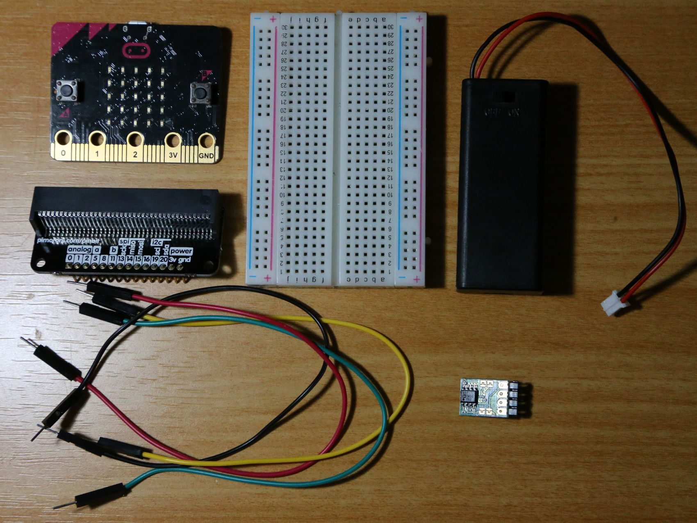
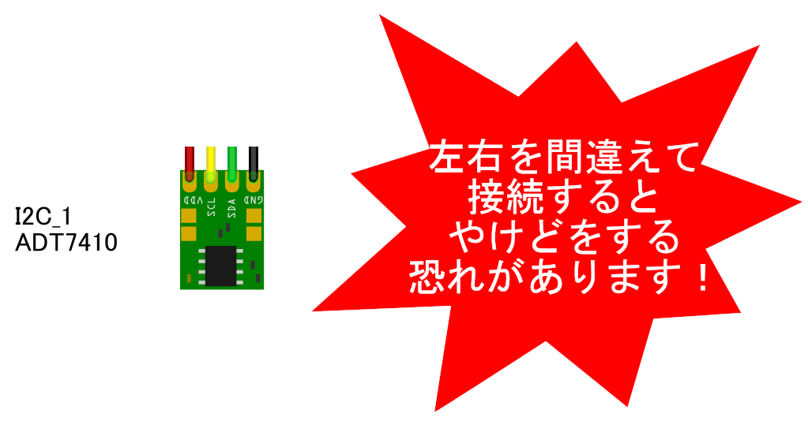
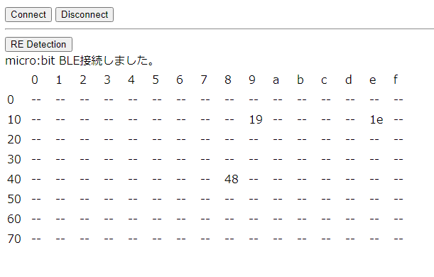
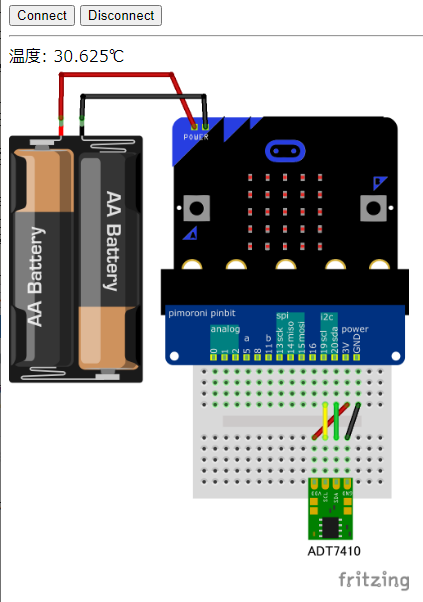

# 2. I2C センサーを使ってみよう (初めての I2C)

# 概要

CHIRIMEN with micro:bit （以下「CHIRIMEN microbit」）を使ったプログラミングを通じて、[Web I2C API](http://browserobo.github.io/WebI2C) の使い方を学びます。

## 前回までのおさらい

本チュートリアルを進める前に「[L チカしてみよう](GPIO_starter.md)」と、「[GPIO の使い方](GPIO_basic.md)」で CHIRIMEN microbit の基本的な操作方法とプログラミング方法を確認しておいてください。

前回までのチュートリアルで学んだことは下記のとおりです。

- 各種 example が [`https://chirimen.org/chirimen-micro-bit/examples/`](https://chirimen.org/chirimen-micro-bit/examples/) 配下に配線図と一緒に置いてある
- 利用可能な GPIO Port 番号・種類と位置は壁紙を見よう
- Web アプリからの GPIO の制御には [Web GPIO API](http://browserobo.github.io/WebGPIO) を利用する
- GPIO ポートは「出力モード」で LED の ON/OFF などが行え「入力モード」では GPIO ポートの状態を読み取れる
- デバイスの初期化などは非同期処理であり [async と await を用いて処理する](../ty51822r3/appendix0.md)

# 1. 準備

## 用意するもの

このチュートリアル全体で必要になるハードウエア・部品は下記の通りです。

- [L チカしてみよう](section0.md) に記載の「基本ハードウエア」
- ジャンパーワイヤー (メス-メス) x 4
- [温度センサ (ADT7410)](http://akizukidenshi.com/catalog/g/gM-06675/) x 1
<!--
- [湿度・温度センサ (SHT31)](http://akizukidenshi.com/catalog/g/gK-12125/) x 1 ??
-->
**注意:** 秋月電子の ADT7410 モジュール付属の細いピンヘッダはブレッドボードへの差し込み専用で、ジャンパーワイヤのソケットに刺すと接触不良となります。 **通常の太さのピンヘッダをハンダ付けしてください。**

# 2. I2C とは

[I2C](https://ja.wikipedia.org/wiki/I2C) とは 2 線式の同期式シリアル通信インタフェースです。「アイ・スクエア・シー」とか「アイ・ ツー・シー」などと読みます。I2C では SDA（シリアルデータ）と SCL（シリアルクロック）の 2 本の線で通信を行います。


上図のように、i2c の SDA、SCLは複数のモジュール間で共有され、これを「I2C バス」と言います。I2C ではマスターとスレーブの間で通信が行われます。常にマスター側からスレーブ側に要求が行われ、スレーブ側からマスター側へ要求を行うことはできません。

マスターは、スレーブが持つ「SlaveAddress (スレーブアドレス)」を指定して、特定のスレーブとの通信を行います。このため、同じ I2C バス上に同じ SlaveAddress のスレーブを繋ぐことはできません。


通信するモジュール同士が同一基板上にない場合には、SDA、SCL の 2 本の通信線に加え電源や GND の線を加えて 4 本のケーブルを用いて接続するのが一般的です。電源電圧はデバイスに応じたものを繋ぐ必要があります。

詳細は下記をご参照ください。

- [I2C](https://ja.wikipedia.org/wiki/I2C) - Wikipedia
- I2C バス仕様書 最新版（[日本語](https://www.nxp.com/docs/ja/user-guide/UM10204.pdf)、[English](http://www.nxp.com/documents/user_manual/UM10204.pdf)）
- [I2C の使い方](http://www.picfun.com/i2cframe.html)（後閑哲也氏サイト)

ここでは I2C の概要として下記を押さえておきましょう。

- I2C には複数のモジュールが繋がる（I2C バス）
- I2C に繋がるモジュールにはマスターとスレーブがある
- I2C では必ずマスターからスレーブに対して通信要求が行われる
- I2C スレーブは SlaveAddress を持っている
- 同じ I2C バスに同じ SlaveAddress のスレーブは繋げない

# 3. 温度センサー(ADT7410)を使ってみる

それでは実際に I2C に対応したモジュールを使ってみましょう。CHIRIMEN microbit では [`https://chirimen.org/chirimen-micro-bit/examples/#i2c`](https://chirimen.org/chirimen-micro-bit/examples/#i2c) にセンサーなど、いくつかの I2C モジュールを使うサンプルが登録されています。

この中から、ADT7410 という温度センサーモジュールを使ってみたいと思います。microbit と ADT7410 との接続方法(回路図)と example コードは [codesandboxではこちら](https://codesandbox.io/s/github/chirimen-oh/chirimen-micro-bit/tree/master/examples/I2C1_ADT7410)に登録されています。[gitHubで見るにはこちらです](https://github.com/chirimen-oh/chirimen-micro-bit/blob/master/examples/I2C1_ADT7410/)

> I2C バス上、microbit がマスター、ADT7410 がスレーブになります。

## a. 部品と配線について

必要な部品について、以下の回路図の画像を見ててください。


<!--

-->
図を見ながらジャンパーワイヤ 4 本で ATD7410 を接続します。 **ADT7410 は 4 本のジャンパーピンを左右逆に繋いでしまうと、短時間で非常に高温になり故障するだけでなく火傷してしまいます** ので、配線には注意してください。



下記が microbit(のブレークアウトボード) 側の接続ピンの位置を拡大した図になります。間違えないよう接続してください。


実際に配線した写真は以下の通りです。ADT7410 の表裏にも注意してください。


## b. 接続がうまくいったか確認する

ここで、[`i2cdetect webApp`](https://chirimen.org/chirimen-micro-bit/examples/i2cdetect/index.html) を使って ADT7410 が正しく接続・認識できているか、その SlaveAddress は何か確認してみましょう。


正しく接続できていれば (配線を誤ってセンサーを壊してない限り) 下記のような画面が表示されるはずです。



`48`という表示が見えます。これは 16 進数表示であり `0x48` という意味です。`0x48` は、ADT7410 の SlaveAddress と思われますが、念のためデータシートも確認してみましょう。(19,1eは常に表示されるSlaveAddressで、今はひとまず無視してください。)

> [ADT7410 のデータシート](http://www.analog.com/media/en/technical-documentation/data-sheets/ADT7410.pdf)

データシートの P.17 に「SERIAL BUS ADDRESS」の項があり、ここに SlaveAddress の記載があります。ADT7410 は`0x48`がデフォルトの SlaveAddress で、A0,A1 ピンの HIGH/LOW により SlaveAddeess の下位 2bit を変更できることがわかります。


(ADT7410 Data Sheet より抜粋)

[秋月電子の ADT7410 モジュール](http://akizukidenshi.com/catalog/g/gM-06675/) の場合、3V に接続している端子側に A0A1 と書かれた端子に半田を付けてショートさせることで SlaveAddress を変更できます。他のデバイスと SlaveAddress が被ってしまった場合や複数の温度センサーを同時に接続したい場合に変更してください。

試しに、一度 microbit の 3V に接続している線を抜いて、もう一度 `[`i2cdetect webApp`](https://chirimen.org/chirimen-micro-bit/examples/i2cdetect/index.html) を実行してみてください。


`0x48` が見つからなくなりました。これで、間違いなく ADT7410 の SlaveAddress が`0x48`となっていることが確認できました。再度、先ほど外した 3V の線を戻して ADT7410 に電源を供給しておいてください。

ここで使用した SlaveAddress を確認する `[`i2cdetect webApp`](https://chirimen.org/chirimen-micro-bit/examples/i2cdetect/index.html) は WebI2C を使って実装したもです。WebI2C 版の i2c-detect を利用中は他のページから I2C デバイスを操作できません。確認が済んだらタブを閉じるようにしましょう。

## c. example を実行してみる

配線と SlaveAddress が確認できましたので、さっそく動かしてみましょう。ADT7410 のためのサンプルコードは[codesandboxに登録されています](https://codesandbox.io/s/github/chirimen-oh/chirimen-micro-bit/tree/master/examples/I2C1_ADT7410) に格納されています。ブラウザでアクセスし、いつものようにボタンを押し、開いたwebAppsの`Connect`ボタンを押すと下記のような画面になります。



画面の数値が温度（摂氏）になります。ADT7410 センサに触ると、ゆっくりと温度が上がるはずです。

ADT7410 は I2C という通信方式でセンサーデータを送出するモジュールです。この情報を Web I2C API 経由で Web アプリが読み取り、画面に情報を表示しているわけです。

# 4. 温度センサー (ADT7410) example のコードを読んでみる

それでは、コードを見てみましょう。

[codesandboxに登録されています](https://codesandbox.io/s/github/chirimen-oh/chirimen-micro-bit/tree/master/examples/I2C1_ADT7410)のFilesパネルの `index.html`、`main.js` をみてみます。

## d-1. index.html

下記が index.html の中から主要な部分を抜き出したコードです。

index.html

```html
  :
  <script type="text/javascript" src="https://chirimen.org/chirimen-micro-bit/polyfill/microBitBLE.js"></script>
  <script type="text/javascript" src="https://chirimen.org/chirimen/gc/i2c/i2c-ADT7410/node_modules/@chirimen-raspi/chirimen-driver-i2c-adt7410/ADT7410.js"></script>
  <script type="text/javascript" src="main.js"></script>
  :
  <body>
    :
  <input type="button" value="Connect" onclick="connect();"/> 
  <div id="msg">---</div>
    :
  </body>
```

まず最初に読み込んでいるのが `microBitBLE.js`。Web GPIO API の時に出てきたものと同じ Web GPIO API と Web I2C API の Polyfill です。

次に読み込んでいるのが、`ADT7410.js`。このファイルは、Web I2C API を使って ADT7410 との通信を行うためのドライバー (ハードウェアを操作する為のライブラリ) です。

最後に読み込んでいる `main.js` が、ドライバーライブラリを使ってこのアプリケーションの動作を記述している部分です。

## d-2. main.js

次に、`main.js` を見てみましょう。

main.js

```js
var microBitBle;
var adt7410;
var readEnable;

async function connect(){
	microBitBle = await microBitBleFactory.connect();
	var i2cAccess = await microBitBle.requestI2CAccess();
	var i2cPort = i2cAccess.ports.get(1);
	adt7410 = new ADT7410(i2cPort, 0x48);
	await adt7410.init();
	readEnable = true;
	readData();
}

async function disconnect(){
	readEnable = false;
	await microBitBle.disconnect();
}

async function readData(){
	var readVal;
	while ( readEnable ){
		readVal = await adt7410.read();
		console.log('readVal:', readVal);
		msg.innerHTML= "温度: " + readVal + "℃";
		await sleep(1000);
	}
}
```

ここで、microbitに接続し、そこに接続された温度センサーの情報を定期的に取得し、画面に出力する処理が行われています。
少し詳し解説してみます。

### await microBitBleFactory.connect()

これは前の章までで説明済みですUI経由で呼び出されないといけない点がポイントですね。

### await microBitBle.requestI2CAccess()

Web I2C API を利用するための **`I2CAccess` インタフェースを取得** するための最初の API 呼び出しです。この関数も非同期処理ですので `await` で処理完了を待機し、その結果正しくインタフェースが取得されたら `i2cAccess` オブジェクトに保持します。

### i2cAccess.ports.get()

`I2CAccess.ports` は、利用可能な I2C ポートの一覧です。

```js
var i2cPort = i2cAccess.ports.get(1);
```

CHIRIMEN microbit で利用可能な I2C ポート番号は`1`番だけです。ポート番号に`1` を指定して **`port` オブジェクトを取得** しています。

### adt7410 = new ADT7410(i2cPort,0x48)

ドライバーライブラリ[(ADT7410.js)]("https://chirimen.org/chirimen/gc/i2c/i2c-ADT7410/node_modules/@chirimen-raspi/chirimen-driver-i2c-adt7410/ADT7410.js)を使い **ATD7410 を操作する為のインスタンスを生成** しています。

### await adt7410.init()

ドライバーライブラリのインスタンス (adt7410) の `init()` メソッドを通じて **I2C ポートを開いてセンサーを初期化** しています。

具体的に内部では、インスタンス生成時に指定した `port` オブジェクトと `slaveAddress(0x48)` を用いて `I2CPort.open()` を行なっています。`I2CPort.open()` が成功すると、`I2CSlaveDevice` という I2C ポートへデータ書き込みや読み込みなどを行うインタフェースが返されます。`I2CSlaveDevice` インタフェースは、ライブラリ内に保存され、その後の処理でこのインターフェースを使って I2C デバイスである adt7410 と通信可能になります。

### await adt7410.read()

**ADT7410 の仕様に基づくデータ読み出し処理です**。

ドライバーライブラリ[(ADT7410.js)]("https://chirimen.org/chirimen/gc/i2c/i2c-ADT7410/node_modules/@chirimen-raspi/chirimen-driver-i2c-adt7410/ADT7410.js)内部では、`I2CSlaveDevice.read8()` という API を 2 回呼び出すことで、温度データの [MSB](https://ja.wikipedia.org/wiki/最上位ビット), [LSB](https://ja.wikipedia.org/wiki/最下位ビット) を 8bit ずつ読み出し、両方の読み出しが終わった時点で MSB と LSB を合成、16bit データとしたのちに、温度データに変換して返却しています。

### Web I2C API に着目して流れをまとめると

ADT7410 ドライバーライブラリの内部の処理をまとめると次の通りです。

1. **I2C の準備:** await navigator.requestI2CAccess() で I2CAccess インタフェースを取得
2. **ポートの準備:** i2cAccess.ports.get(1) で、1 番ポートの `port` オブジェクトを取得
3. **デバイス初期化:** await port.open(0x48) で、SlaveAddress 0x48 番の I2CSlaveDevice インタフェースを取得
4. **データ読み込み:** i2cSlave.read8() で 温度データ を読み込み (ADT7410 の場合、常に 2 回セット)

この流れは、ADT7410 以外の他の I2C デバイスでも基本的に同様になります。

I2C デバイスにより変わるのは、`port.open()`に指定する SlaveAddress と、[5.の実際の処理](5度センサーadt7410の値をドライバーを使わずに読むコードを書いてみる) になります。

CHIRIMEN microbit ではいろいろなデバイスのサンプルコードとドライバーを回路図と共に [example として用意されています](https://chirimen.org/chirimen-micro-bit/examples/#i2c)。Examples に無い I2C デバイスでも、上記流れを押さえておけば対応するコードを書くのはそれほど難しくありません。

I2Cデバイスのドライバーライブラリは[CHIRIMEN for Raspberry Pi](https://chirimen.org/chirimen/gc/top/)と共通です。[CHIRIMEN with micro:bitとCHIRIMEN for Raspberry Piの違いはこちらに記載](https://chirimen.org/chirimen-micro-bit/guidebooks/diff_rpi3.html)されていますので、違いに注意して[CHIRIMEN for Raspberry PiのExamples](https://chirimen.org/chirimen/gc/top/examples/)を参考にすればさらに多くのI2Cデバイスを利用できるでしょう。

新たな I2C デバイスへの対応方法については、「[CHIRIMEN で I2C デバイスを使ってみる](https://qiita.com/tadfmac/items/04257bfe982ba0f050bb)」も参考にしてください (CHIRIMEN microbit ではなく、CHIRIMEN 専用ボード向けの記事ですが、Web I2C API への対応観点では同じ方法論で対応が可能です)

# 5. 温度センサーの値をドライバーを使わずに読んでみる

それでは、ADT7410 ドライバー内部での処理の流れがだいたいわかったところで、ドライバーを使わずに自力で値を読み込むコードを一応書いてみましょう。

example と同じコードを書いても面白くないので、今回は`i2c-ADT7410.js`は使わずに、[codesandbox](https://codesandbox.io/) を使って一通り温度を読み込む処理を書いてみましょう。

もし、ブラウザで他のCHIRIMEN webAppsを開いている場合、一度閉じておいてください。

## codesandbox で HTML を書く

それでは始めましょう。JSFiddle の HTML ペインに Polyfill の読み込みと、温度表示用のタグだけ書きます。

```html
  <script type="text/javascript" src="https://chirimen.org/chirimen-micro-bit/polyfill/microBitBLE.js"></script>
  <script type="text/javascript" src="main.js"></script>
  :
  <body>
  <input type="button" value="Connect" onclick="connect();"/> 
  <div id="msg">---</div>
  </body>
```

こんな感じで良いでしょう。

## JavaScript を書いてみる

次に JavaScript です。今回は定期的なポーリング処理が必要になるので、[GPIO の使い方 c. スイッチに反応するようにする (port.read()を使ってみる)](gpio_basic#c--portread) の時に書いたコードが参考になります。

```js
var microBitBle;
var i2cSlaveDevice;

async function connect(){
	microBitBle = await microBitBleFactory.connect();
	msg.innerHTML=("micro:bit BLE接続しました。");
	var i2cAccess = await microBitBle.requestI2CAccess();
	var i2cPort = i2cAccess.ports.get(1);
	i2cSlaveDevice = await i2cPort.open(0x48);
	readData();
}

async function readData(){
	var readVal;
	while ( true ){
		var MSB = await i2cSlaveDevice.read8(0x00); // これ以下の３行が肝です
		var LSB = await i2cSlaveDevice.read8(0x01);
		var temperature = ((MSB << 8) | (LSB & 0xff)) / 128.0;
		console.log('temperature:', temperature);
		msg.innerHTML= "温度: " + temperature + "℃";
		await sleep(1000);
	}
}
```

JavaScript を書いたら、いつものようにボタンを押して別ウィンドでwebAppsを実行してみてください。

ADT7410 を指で触って温度が変わることを確認してみてください。

最後に、[ここにドライバーを使わないでADT7410を使ったコードを置いてあります](https://codesandbox.io/s/github/chirimen-oh/chirimen-micro-bit/tree/master/examples/I2C1b_ADT7410)

# まとめ

このチュートリアルでは下記について学びました。

- I2C の基礎知識
- i2cdetect を使った Raspi に接続された I2C モジュールの SlaveAddress 確認方法
- Web I2C API を使った処理の流れ
- ADT7410 温度センサーの制御方法

このチュートリアルで書いたコードは以下のページで参照できます:

- ADT7410 温度センサー (ドライバを使ったコード例) [codesandbox](https://codesandbox.io/s/github/chirimen-oh/chirimen-micro-bit/tree/master/examples/I2C1_ADT7410), [github](https://github.com/chirimen-oh/chirimen-micro-bit/blob/master/examples/I2C1_ADT7410/)
- ADT7410 温度センサー (ドライバを使わないコード例) [codesandbox](https://codesandbox.io/s/github/chirimen-oh/chirimen-micro-bit/tree/master/examples/I2C1b_ADT7410), [github](https://github.com/chirimen-oh/chirimen-micro-bit/blob/master/examples/I2C1b_ADT7410/)

次の『[チュートリアル 4. I2C の使い方](I2C_basic.md)』では加速度センサーなど他のセンサーも触っていきます。
