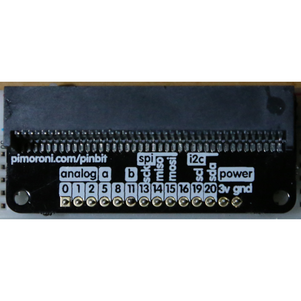
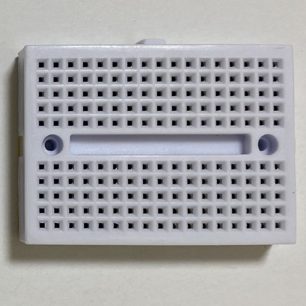
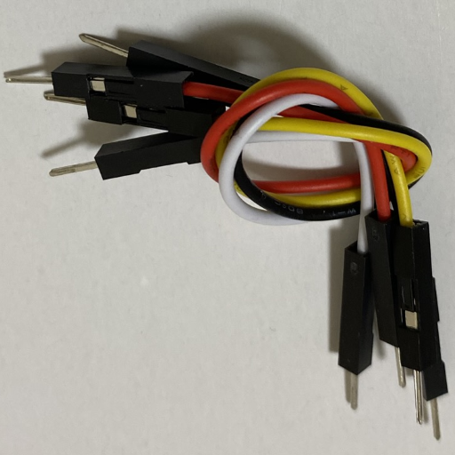
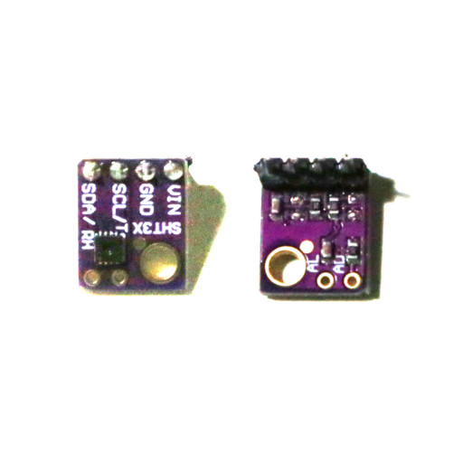
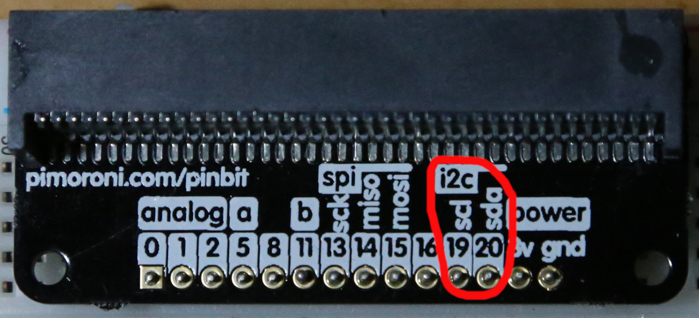
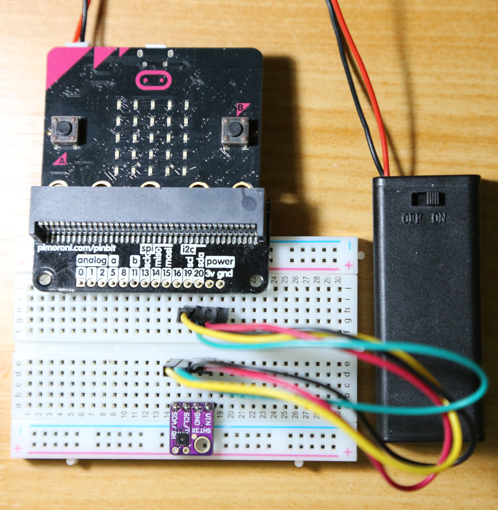
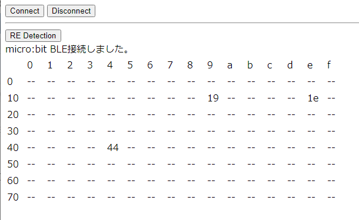
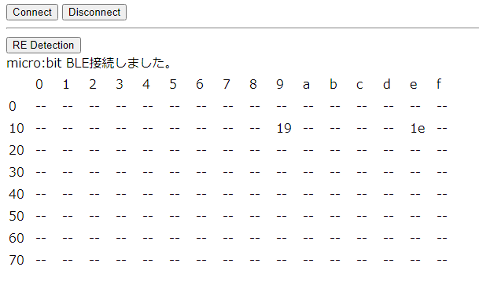
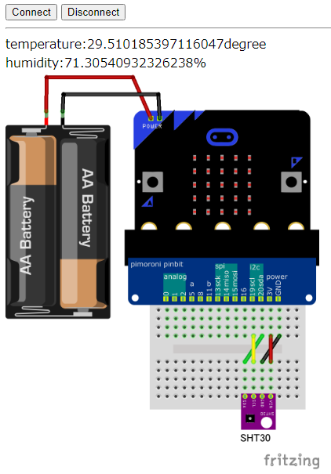
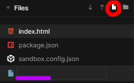

# 2. I2C センサーを使ってみよう (初めての I2C)

# 概要

CHIRIMEN with micro:bit （以下「CHIRIMEN microbit」）を使ったプログラミングを通じて、I2Cデバイスと[Web I2C API](http://browserobo.github.io/WebI2C) の使い方を学びます。

## 前回までのおさらい

本チュートリアルを進める前に「[L チカしてみよう](GPIO_starter.md)」と、「[GPIO の使い方](GPIO_basic.md)」で CHIRIMEN microbit の基本的な操作方法とプログラミング方法を確認しておいてください。

前回までのチュートリアルで学んだことは下記のとおりです。

- 各種 example が [`https://chirimen.org/chirimen-micro-bit/examples/`](https://chirimen.org/chirimen-micro-bit/examples/) 配下に配線図と一緒に置いてある
- Web アプリからの GPIO の制御には [Web GPIO API](http://browserobo.github.io/WebGPIO) を利用する
- GPIO ポートは「出力モード」で LED の ON/OFF などが行え「入力モード」では GPIO ポートの状態を読み取れる
- デバイスの初期化などは非同期処理であり [async と await を用いて処理する](../ty51822r3/appendix0.md)

# 1. 準備

## 用意するもの

このチュートリアル全体で必要になるハードウエア・部品は下記の通りです。以下の部品はスターターキットに入っています。

- [L チカしてみよう](section0.md) に記載の[「基本ハードウエア」](imgs/pc_mbit_usb_con.jpg)
- [microbitブレークアウトボード](imgs/pinbit.jpg) x 1
- [ブレッドボード](imgs/breadboardImg.jpg)
- ジャンパーワイヤー (オス-オス) x 4
- [湿度・温度センサ (SHT31)](http://akizukidenshi.com/catalog/g/gK-12125/) x 1 (SHT30もほぼ同じように使えます([データシート](https://www.sensirion.com/fileadmin/user_upload/customers/sensirion/Dokumente/2_Humidity_Sensors/Datasheets/Sensirion_Humidity_Sensors_SHT3x_Datasheet_digital.pdf)によると測定範囲精度が違う))

| ブレークアウトボード | ブレッドボード | ジャンパーワイヤー | SHT31 |
| -- | -- | -- | -- |
|  |  |  |  |

<!--
**注意:** 秋月電子の ADT7410 モジュール付属の細いピンヘッダはブレッドボードへの差し込み専用で、ジャンパーワイヤのソケットに刺すと接触不良となります。 **通常の太さのピンヘッダをハンダ付けしてください。**
-->

# 2. I2C とは

[I2C](https://ja.wikipedia.org/wiki/I2C) とは 2 線式の同期式シリアル通信インタフェースです。「アイ・スクエア・シー」とか「アイ・ ツー・シー」などと読みます。I2C では SDA（シリアルデータ）と SCL（シリアルクロック）の 2 本の線で通信を行います。


上図のように、i2c の SDA、SCLは複数のモジュール間で共有され、これを「I2C バス」と言います。I2C ではマスターとスレーブの間で通信が行われます。常にマスター側からスレーブ側に要求が行われ、スレーブ側からマスター側へ要求を行うことはできません。

マスターは、スレーブが持つ「SlaveAddress (スレーブアドレス)」を指定して、特定のスレーブとの通信を行います。このため、同じ I2C バス上に同じ SlaveAddress のスレーブを繋ぐことはできません。


通信するモジュール同士が同一基板上にない場合には、SDA、SCL の 2 本の通信線に加え電源や GND の線を加えて 4 本のケーブルを用いて接続するのが一般的です。電源電圧はデバイスに応じたものを繋ぐ必要があります。

詳細は下記をご参照ください。

- [I2C](https://ja.wikipedia.org/wiki/I2C) - Wikipedia
- I2C バス仕様書 最新版（[日本語](https://www.nxp.com/docs/ja/user-guide/UM10204.pdf)、[English](http://www.nxp.com/documents/user_manual/UM10204.pdf)）
- [I2C の使い方](http://www.picfun.com/i2cframe.html)（後閑哲也氏サイト)

ここでは I2C の概要として下記を押さえておきましょう。

- I2C には複数のモジュールが繋がる（I2C バス）
- I2C に繋がるモジュールにはマスターとスレーブがある
- I2C では必ずマスターからスレーブに対して通信要求が行われる
- I2C スレーブは SlaveAddress を持っている
- 同じ I2C バスに同じ SlaveAddress のスレーブは繋げない

# 3. 湿度・温度センサー(SHT31)を使ってみる

それでは実際に I2C に対応したモジュールを使ってみましょう。CHIRIMEN microbit では [`https://chirimen.org/chirimen-micro-bit/examples/#i2c`](https://chirimen.org/chirimen-micro-bit/examples/#i2c) にセンサーなど、いくつかの I2C モジュールを使うサンプルが登録されています。

この中から、SHT31 という湿度と温度の両方が測定できるセンサーモジュールを使ってみたいと思います。microbit と SHT31 との接続方法(回路図)と example コードは [codesandboxではこちら](https://codesandbox.io/s/github/chirimen-oh/chirimen-micro-bit/tree/master/examples/I2C7_SHT30)に登録されています。[gitHubで見るにはこちらです](https://github.com/chirimen-oh/chirimen-micro-bit/blob/master/examples/I2C7_SHT30/)

> I2C バス上、microbit がマスター、SHT31 がスレーブになります。

## a. 部品と配線について

まずは以下の配線図を見てください。


### I2Cデバイスモジュールの接続について
I2Cデバイスは一般的に小さなチップ部品です。下の拡大写真で緑で囲んだものがSHT31の本体で 上下に出ている微細な端子を接続して使いますが、微細過ぎてプロトタイピングには向きません。そこでブレッドボードで使いやすい端子に変換したモジュールが販売されています。モジュールには**赤で囲んだように端子名の記載**があります。これを**micro:bitの端子名と一致させて結線**することでI2Cデバイスが正しく接続されます。(電源端子はVIN,V+,3V,VCCなど別名になっていることがあります)


下記が microbit(のブレークアウトボード) 側の接続ピンの位置を拡大した図になります。間違えないよう接続してください。



### 配線しよう
図を見ながらジャンパーワイヤ 4 本で SHT31 を接続します。 

実際に配線した写真は以下の通りです。sht31 の表裏にも注意し、micro:bitとSHT31モジュールのピン名が合うように結線してください。



## b. 接続がうまくいったか確認する

ここで、[`i2cdetect webApp`](https://chirimen.org/chirimen-micro-bit/examples/i2cdetect/index.html) を使って SHT31 が正しく接続・認識できているか、その SlaveAddress は何か確認してみましょう。


正しく接続できていれば (配線を誤ってセンサーを壊してない限り) 下記のような画面が表示されるはずです。



`44`という表示が見えます。これは 16 進数表示であり `0x44` という意味です。`0x44` は、SHT31 の SlaveAddress と思われますが、念のためデータシートも確認してみましょう。(19,1eは常に表示されるSlaveAddressで、今はひとまず無視してください。)

> [SHT31/SHT30 のデータシート](https://www.sensirion.com/fileadmin/user_upload/customers/sensirion/Dokumente/2_Humidity_Sensors/Datasheets/Sensirion_Humidity_Sensors_SHT3x_Datasheet_digital.pdf) 

データシートの P.9 にI2C Address in Hex. representation、ここに SlaveAddress の記載があります。SHT31 は`0x44`がデフォルトの SlaveAddress で、ADDR ピンの HIGH/LOW により SlaveAddeess を0x44か0x45に変更できることがわかります。

> **留意事項 (秋月電子のSHT31モジュール)**
>
> [秋月電子の SHT31 モジュール](http://akizukidenshi.com/catalog/g/gK-12125/) の場合、[モジュール説明書](http://akizukidenshi.com/download/ds/akizuki/AE-SHT3x_manu_v1.0.pdf)によると、ADDR端子は基板上でプルアップされていることがわかります。そのためSlaveAddressは0x45になっています。　ADRと書かれた端子を隣のGND端子と半田を付けてショートさせることで SlaveAddress を0x44に変更できます。他のデバイスと SlaveAddress が被ってしまった場合や複数の温度センサーを同時に接続したい場合に変更してください。

試しに、一度 microbit の 3V に接続している線を抜いて、もう一度 [`i2cdetect webApp`](https://chirimen.org/chirimen-micro-bit/examples/i2cdetect/index.html) を実行してみてください。



`0x44` が見つからなくなりました。これで、間違いなく SHT31 の SlaveAddress が`0x44`となっていることが確認できました。再度、先ほど外した 3V の線を戻して SHT31 に電源を供給しておいてください。

ここで使用した SlaveAddress を確認する [`i2cdetect webApp`](https://chirimen.org/chirimen-micro-bit/examples/i2cdetect/index.html) は WebI2C を使って実装したもです。i2c-detect webAppを利用中は他のページから I2C デバイスを操作できません。確認が済んだらタブを閉じるようにしましょう。

## c. example を実行してみる

配線と SlaveAddress が確認できましたので、さっそく動かしてみましょう。SHT31 のためのサンプルコードは[codesandboxに登録されています](https://codesandbox.io/s/github/chirimen-oh/chirimen-micro-bit/tree/master/examples/I2C7_SHT30) に格納されています。ブラウザでアクセスし、いつものようにボタンを押し、開いたwebAppsの`Connect`ボタンを押すと下記のような画面になります。



画面の数値が温度（摂氏）と湿度（％）になります。SHT31 センサに触ると、ゆっくりと温度と湿度が上がるはずです。

SHT31 は I2C という通信方式でセンサーデータを送出するモジュールです。この情報を Web I2C API 経由で Web アプリが読み取り、画面に情報を表示しているわけです。

# 4. 湿度・温度センサー (SHT31) example のコードを読んでみる

それでは、コードを見てみましょう。

codesandboxに登録されている[サンプルコード](https://codesandbox.io/s/github/chirimen-oh/chirimen-micro-bit/tree/master/examples/I2C7_SHT30)のFilesパネルの `index.html`、`main.js` をみてみます。

## d-1. index.html

下記が index.html の中から主要な部分を抜き出したコードです。

index.html

```html
  :
  <script type="text/javascript" src="https://chirimen.org/chirimen-micro-bit/polyfill/microBitBLE.js"></script>
  <script type="text/javascript" src="https://chirimen.org/chirimen/gc/contrib/examples/i2c-SHT30/node_modules/@chirimen-raspi/chirimen-driver-i2c-sht30/SHT30.js"></script>
  <script type="text/javascript" src="main.js"></script>
  :
  <body>
    :
  <input type="button" value="Connect" onclick="connect();"/> 
  <div id="msg">---</div>
    :
  </body>
```

まず最初に読み込んでいるのが `microBitBLE.js`。Web GPIO API の時に出てきたものと同じ Web GPIO API と Web I2C API の Polyfill です。

次に読み込んでいるのが、`SHT30.js`。このファイルは、Web I2C API を使って SHT31 との通信を行うためのドライバー (ハードウェアを操作する為のライブラリ) です。

最後に読み込んでいる `main.js` が、ドライバーライブラリを使ってこのアプリケーションの動作を記述している部分です。

## d-2. main.js

次に、`main.js` を見てみましょう。

main.js

```js
var microBitBle;
var sht;
var readEnable;

async function connect(){
	microBitBle = await microBitBleFactory.connect();
  :
	var i2cAccess = await microBitBle.requestI2CAccess();
	var i2cPort = i2cAccess.ports.get(1);
	sht = new SHT30(i2cPort, 0x44);
	await sht.init();
	readEnable = true;
	readData();
}
:
async function readData(){
	while ( readEnable ){
		var shtData = await sht.readData();
		msg.innerHTML= "temperature:" + shtData.temperature + "degree  <br>humidity:"+ shtData.humidity + "%";
		await sleep(1000);
	}
}
```

ここで、microbitに接続し、そこに接続された温湿度センサーの情報を定期的に取得し、画面に出力する処理が行われています。
少し詳し解説してみます。

### await microBitBleFactory.connect()

これは前の章までで説明済みですUI経由で呼び出されないといけない点がポイントですね。

### await microBitBle.requestI2CAccess()

Web I2C API を利用するための **`I2CAccess` インタフェースを取得** するための最初の API 呼び出しです。この関数も非同期処理ですので `await` で処理完了を待機し、その結果正しくインタフェースが取得されたら `i2cAccess` オブジェクトに保持します。

### i2cAccess.ports.get()

`I2CAccess.ports` は、利用可能な I2C ポートの一覧です。

```js
var i2cPort = i2cAccess.ports.get(1);
```

CHIRIMEN microbit で利用可能な I2C ポート番号は`1`番だけです。ポート番号に`1` を指定して **`port` オブジェクトを取得** しています。

### sht = new SHT30(i2cPort, 0x44)

ドライバーライブラリ[(SHT30.js)](https://chirimen.org/chirimen/gc/contrib/examples/i2c-SHT30/node_modules/@chirimen-raspi/chirimen-driver-i2c-sht30/SHT30.js)を使い **SHT31 を操作する為のインスタンスを生成** しています。 2番目のパラメータでSlaveAddressを指定しています。(SlaveAddress0x45のモジュールはここを0x45に変更する)

### await sht.init()

ドライバーライブラリのインスタンス (sht) の `init()` メソッドを通じて **I2C ポートを開いてセンサーを初期化** しています。

具体的に内部では、インスタンス生成時に指定した `port` オブジェクトと `slaveAddress(0x44)` を用いて `I2CPort.open()` を行なっています。`I2CPort.open()` が成功すると、`I2CSlaveDevice` という I2C ポートへデータ書き込みや読み込みなどを行うインタフェースが返されます。`I2CSlaveDevice` インタフェースは、ライブラリ内に保存され、その後の処理でこのインターフェースを使って I2C デバイスである sht30 と通信可能になります。

### await sht.read()

**SHT31 の仕様に基づくデータ読み出し処理です**。

ドライバーライブラリ[(SHT30.js)](https://chirimen.org/chirimen/gc/contrib/examples/i2c-SHT30/node_modules/@chirimen-raspi/chirimen-driver-i2c-sht30/SHT30.js)内部では、まず`I2CSlaveDevice.write8()`というAPIで、I2Cデバイス内部のレジスタ0x2Cに0x06を書き込んでいます。これはSHT31を High repeatability measurementモードに設定しています。その後`wait()`関数で100ms待機します。次に`I2CSlaveDevice.readBytes()` という API で 8bitデータを6バイト連続で読み配列に投入しています。　温度データは0バイト目、1バイト目、　湿度データは3バイト目と4バイト目をそれぞれデータの [MSB](https://ja.wikipedia.org/wiki/最上位ビット), [LSB](https://ja.wikipedia.org/wiki/最下位ビット) として MSB と LSB を合成、16bit データとしたのちに、温度及び湿度データに変換して返却しています。 ([ドライバライブラリをgithubで見てみる](https://github.com/chirimen-oh/chirimen/blob/master/gc/contrib/examples/i2c-SHT30/node_modules/%40chirimen-raspi/chirimen-driver-i2c-sht30/SHT30.js))

### Web I2C API に着目して流れをまとめると

SHT30 ドライバーライブラリの内部の処理をまとめると次の通りです。

1. **I2C の準備:** await navigator.requestI2CAccess() で I2CAccess インタフェースを取得
2. **ポートの準備:** i2cAccess.ports.get(1) で、1 番ポートの `port` オブジェクトを取得
3. **デバイス初期化:** await port.open(0x48) で、SlaveAddress 0x48 番の I2CSlaveDevice インタフェースを取得
4. **測定モード設定** await i2cSlave.write8(0x2C, 0x06) で、High repeatability モードに
5. **100ms待機** await sleep(100)
6. **データ読み込み:** i2cSlave.readBytes(6) で 温度・湿度データ を配列に読み込み (SHT31 の場合、0,1バイトが温度, 3,4バイトが湿度。それぞれMSB,LSBの順)

この流れは、SHT31 以外の他の I2C デバイスでも基本的に同様になります。

I2C デバイスにより変わるのは、`port.open()`に指定する SlaveAddress と、[5.の実際の処理](#section-5) になります。

CHIRIMEN microbit ではいろいろなデバイスのサンプルコードとドライバーを回路図と共に [example として用意されています](https://chirimen.org/chirimen-micro-bit/examples/#i2c)。Examples に無い I2C デバイスでも、上記流れを押さえておけば対応するコードを書くのはそれほど難しくありません。

I2Cデバイスのドライバーライブラリは[CHIRIMEN for Raspberry Pi](https://chirimen.org/chirimen/gc/top/)と共通です。[CHIRIMEN with micro:bitとCHIRIMEN for Raspberry Piの違いはこちらに記載](https://chirimen.org/chirimen-micro-bit/guidebooks/diff_rpi3.html)されていますので、違いに注意して[CHIRIMEN for Raspberry PiのExamples](https://chirimen.org/chirimen/gc/top/examples/)を参考にすればさらに多くのI2Cデバイスを利用できるでしょう。

新たな I2C デバイスへの対応方法については、「[CHIRIMEN で I2C デバイスを使ってみる](https://qiita.com/tadfmac/items/04257bfe982ba0f050bb)」も参考にしてください (CHIRIMEN microbit ではなく、CHIRIMEN 専用ボード向けの記事ですが、Web I2C API への対応観点では同じ方法論で対応が可能です)

# 5. 温度センサーの値をドライバーを使わずに読んでみる

それでは、SHT30 ドライバー内部での処理の流れがだいたいわかったところで、ドライバーを使わずに自力で値を読み込むコードを一応書いてみましょう。

example と同じコードを書いても面白くないので、今回は`SHT30.js`は使わずに、[codesandbox](https://codesandbox.io/) を使って一通り温度を読み込む処理を書いてみましょう。

もし、ブラウザで他のCHIRIMEN webAppsを開いている場合、一度閉じておいてください。

## codesandbox で HTML を書く

それでは始めましょう。前回同様[codesandbox](https://codesandbox.io/)のStaticテンプレートからはじめます。index.htmlは、

```html
<!DOCTYPE html>
<html>
  <head>
    <meta charset="UTF-8" />
  </head>
  <script src="https://chirimen.org/chirimen-micro-bit/polyfill/microBitBLE.js"></script>
  <script src="main.js">	</script>
  <body>
	  <input id="cnct" type="button" value="Connect" ></input>
	  <div id="msg">---</div>
  </body>
</html>
```

こんな感じで良いでしょう。

## JavaScript を書いてみる

次に JavaScript です。今回は定期的なポーリング処理が必要になるので、[GPIO の使い方 c. スイッチに反応するようにする (port.read()を使ってみる)](gpio_basic#c--portread) の時に書いたコードが参考になります。

Filesパネルでmain.jsを作りましょう。下図赤〇を押した後紫部分にmain.js



コードはこのようになります。

```js
var i2cSlaveDevice;
window.onload = function() {
  document.getElementById("cnct").addEventListener("click", connectMbit);
};
async function connectMbit() {
  var microBitBle = await microBitBleFactory.connect();
  msg.innerHTML = "micro:bit BLE接続しました。";
  var i2cAccess = await microBitBle.requestI2CAccess();
  var i2cPort = i2cAccess.ports.get(1);
  i2cSlaveDevice = await i2cPort.open(0x44);
  readData();
}
async function readData() {
  while (true) {
    await i2cSlaveDevice.write8(0x2C, 0x06);
    await sleep(100);
    var shtData= await i2cSlaveDevice.readBytes(6);
    var temperature = ((((shtData[0] * 256.0) + shtData[1]) * 175) / 65535.0) - 45; // celsius
    var humidity = 100 * (shtData[3] * 256 + shtData[4]) / 65535.0
    console.log("temperature:", temperature);
    msg.innerHTML = "温度: " + temperature + "℃<br>" + "湿度: " + humidity + "％";
    await sleep(1000);
  }
}
```

JavaScript を書いたら、いつものようにボタンを押して別ウィンドでwebAppsを実行してみてください。

SHT31 を指で触って温度や湿度が変わることを確認してみてください。

最後に、[ここにドライバーを使わないでSHT31を使ったコードを置いてあります](https://codesandbox.io/s/github/chirimen-oh/chirimen-micro-bit/tree/master/examples/I2C7b_SHT30)

# まとめ

このチュートリアルでは下記について学びました。

- I2C の基礎知識
- i2cdetect を使った Raspi に接続された I2C モジュールの SlaveAddress 確認方法
- Web I2C API を使った処理の流れ
- SHT31 温度センサーの制御方法

このチュートリアルで書いたコードは以下のページで参照できます:

- SHT31 湿度・温度センサー (ドライバを使ったコード例) [codesandbox](https://codesandbox.io/s/github/chirimen-oh/chirimen-micro-bit/tree/master/examples/I2C7_SHT30), [github](https://github.com/chirimen-oh/chirimen-micro-bit/blob/master/examples/I2C7_SHT30/)
- SHT30 湿度・温度センサー (ドライバを使わないコード例) [codesandbox](https://codesandbox.io/s/github/chirimen-oh/chirimen-micro-bit/tree/master/examples/I2C7b_SHT30), [github](https://github.com/chirimen-oh/chirimen-micro-bit/blob/master/examples/I2C7b_SHT30/)

次の『[チュートリアル 4. I2C の使い方](I2C_basic.md)』では加速度センサーなど他のセンサーも触っていきます。
