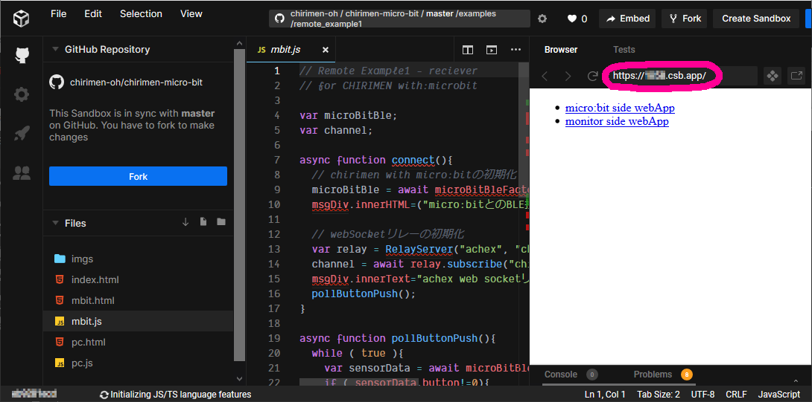

# 概要
IoT編その１に続き、その２はGPIOにモーターを繋げて遠隔からコントロールしてみます。

# 準備

## 用意するもの

- 準備編 に記載の「基本セット」とフィジカルコンピューティングセットの中の以下のパーツ」
  - 電池ボックス
  - micro:bit
  - PC
  - microbitブレークアウトボード × 1
  - ブレッドボード x 1
  - ジャンパーワイヤー (オス-オス) x 4
  - [Nch MOSFET (2SK4017)](http://akizukidenshi.com/catalog/g/gI-07597/)
  - リード付き抵抗 (1KΩ) x 1
  - リード付き抵抗 (10KΩ) x 1
  - [ちびギアモータ](https://tiisai.dip.jp/?p=2676) x 1
- 遠隔から操作するためのスマートフォン

## 回路図
以下のように回路を組み立てます。([2. GPIO の使い方](GPIO_basic.md))で作った回路からタクトスイッチを除いただけのものです。


## 動かしてみる

* micro:bitを繋ぐPC側(データ送信側)で[こちらを開きます。](https://codesandbox.io/s/github/chirimen-oh/chirimen-micro-bit/tree/master/examples/remote_example4?file=/mbit.js)
* codesandboxのBrowserフレームのURLを覚えておき、
 
* スマートフォンでブラウザを開き、覚えたURLを開きます。
  * **controller side webApp** リンクを開きます。
* PC側は、これまで通り右上のを押して、新しいウィンドを開きます。
  * **micro:bit side webApp** リンクを開きます。
  * これまで通り[connect]ボタンを押して、micro:bitを接続します。
* スマートフォン側のLED/MOTOR ONを押すとモーターが回転し、OFFを押すとモーターが停止します。

## コード解説

### センシング(micro:bit)側

#### mbit.html

* codesandboxのFilesパネルで[mbit.html](https://codesandbox.io/s/github/chirimen-oh/chirimen-micro-bit/tree/master/examples/remote_example4?file=/mbit.html)を選びます。
* 内容はIoT編 その1とほとんど同じです。
* `<script>`要素で3つのjavascriptコードを読み込んでいます。
  * RelayServer.js
  * microBitBLE.js
  * mbit.js
* `<input>`要素：
これも説明不要ですね
* `<div id="msgDiv">` 要素：
確認用のメッセージ表示用

#### mbit.js

* Filesパネルで[mbit.js](https://codesandbox.io/s/github/chirimen-oh/chirimen-micro-bit/tree/master/examples/remote_example4?file=/mbit.js)を選びます。自分で書くべきコード部分です。
* `async function connect()` 

  **mbit.html**の`<input>`ボタンを押すとこの初期化関数が呼び出されます。
* ```
	// GPIOポート0の初期化
	var gpioAccess = await microBitBle.requestGPIOAccess();
	var mbGpioPorts = gpioAccess.ports;
	gpioPort0 = mbGpioPorts.get(0);
	await gpioPort0.export("out"); //port0 out
  ```
  
  ポート0を出力にしてオープンしています。[2. GPIO の使い方](GPIO_basic.md)の内容と同じです。

* ```
	// webSocketリレーの初期化
	var relay = RelayServer("achex", "chirimenSocket" );
	channel = await relay.subscribe("chirimenLED");
  ```
  
  IoT編その１と同じです。なお任意文字列のチャンネル名を`chirimenLED`に変えてあります。

* `channel.onmessage = controlLED;`

  relayServerからメッセージを受け取ったら、関数`controlLED`を呼び出すように設定します。
IoT編その１はmicro:bit側は情報の送り側でしたが、今回はスマホからの指示を受け取る側ですから立場が逆になります。

* ```
  function controlLED(messge){
  	if ( messge.data =="LED ON"){
  		gpioPort0.write(1);
      channel.send("LEDをオンにしました");
  	} else if ( messge.data =="LED OFF"){
  		gpioPort0.write(0);
      channel.send("LEDをオフにしました");
  	}
  }
  ```

  メッセージの内容を見て、`LED ON`だったらGPIOポート0をHighにします。今回はモーターをつないでいるのでモーターが回転します。`LED OFF`なら停止です。

  ここで一つ注目、GPIOを変化させた後チャンネルに動作完了を通知するメッセージを送っています。(`channel.send()`という部分) こうすることで、コマンドが受け付けられたことを他のwebAppsが確認できるようになります。
  


### 遠隔コントローラー側

#### pc.html

* Filesパネルで[pc.html](https://codesandbox.io/s/github/chirimen-oh/chirimen-micro-bit/tree/master/examples/remote_example4?file=/pc.html)を選びます。
* `<script>`要素で読み込むjavascriptコードはIoT編その１と同じ2個です
  * RelayServer.js
  * pc.js　：　
  これが自分で書くコードです。
* 2個の`<input>`要素で、それぞれ`OnLED()`, `OffLED()`を呼んでいます。

#### pc.js

* Filesパネルで[pc.js](https://codesandbox.io/s/github/chirimen-oh/chirimen-micro-bit/tree/master/examples/remote_example4?file=/pc.js)を選びます。
* `onload = async function()`
このコンテンツのロードが完了したら実行される関数。
* ```
	var relay = RelayServer("achex", "chirimenSocket" );
	channel = await relay.subscribe("chirimenLED");
  ```

  mbit.jsと同じコードでrelayServerに接続します。トークンとチャンネル名が同じである必要があります。

* ```
	channel.onmessage = getMessage;
  ```

  ```
  function getMessage(msg){ // メッセージを受信したときに起動する関数
	messageDiv.innerText = msg.data;
  }
  ```

  mbit.js側でここで注目と書いた、動作確認の応答メッセージを表示するコードです。

* ```
  function OnLED(){ // LED ON
  	channel.send("LED ON");
  }
  function OffLED(){ // LED OFF
  	channel.send("LED OFF");
  }
  ```

  それぞれ`LED ON`, `LED OFF`コマンドをチャンネルに送信します。


## 色々なデバイスを遠隔制御してみる
I2Cデバイスを含め、様々なデバイスを遠隔制御するサンプルが、[CHIRIMEN with micro:bitのexamples](https://chirimen.org/chirimen-micro-bit/examples/#%E3%83%AA%E3%83%A2%E3%83%BC%E3%83%88%E3%82%B3%E3%83%B3%E3%83%88%E3%83%AD%E3%83%BC%E3%83%AB-relayserverjs%E3%82%92%E4%BD%BF%E3%81%84%E3%81%BE%E3%81%99)に掲載されています。試してみましょう。