# Hello micro:bit - 準備編

このドキュメントはCHIRIMEN with micro:bitを使う上で最初の一歩となる以下を学習するチュートリアルです。

- CHIRIMEN with micro:bitをセットアップしよう。
- 内蔵センサーやLEDをコントロールするwebAppsを動かしてみよう。

# 機材の準備
以下の機材が準備できていることを確認しましょう。
| CHIRIMEN with micro:bit 基本セット (パーソナルコンピュータを除く) | フィジカルコンピューティングセット|
| ----- | ----- |
| 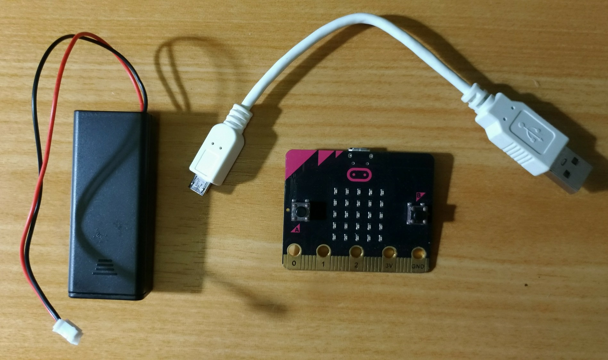 <!----> | 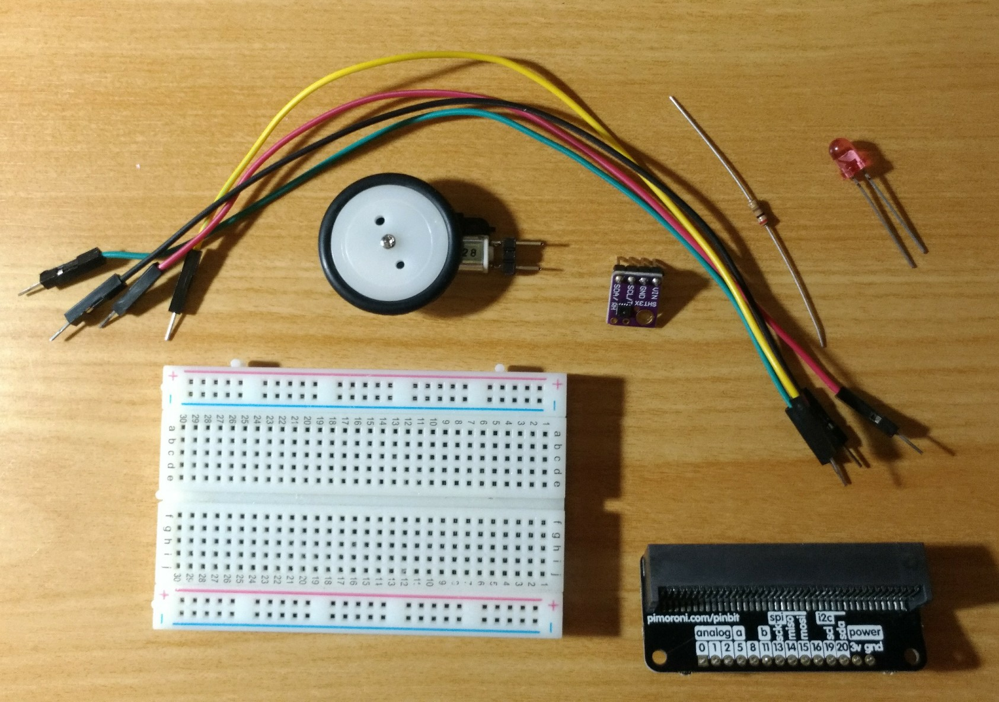 <!----> |

- CHIRIMEN for Raspi 基本セット(内蔵センサーだけ試せます) 
準備編ではこの基本セットだけを使います。
  - 以下の条件を備えたパーソナルコンピュータ
    - Bluetoothインターフェース搭載
      - USB Bluetoothドングルでも動作します(例: [ELECOM LBT-UAN05C2](https://www.elecom.co.jp/products/LBT-UAN05C2.html))
    - Windows10 もしくは MacOS
      - linux PCでも動作する可能性はありますがディストリビューションが多岐にわたるので自己責任で試してください
    - 対応ブラウザ: [Google Chrome](https://www.google.com/chrome/) もしくは [Microfott Edge](https://www.microsoft.com/edge)
    - インターネット接続環境
  - [micro:bit](https://www.sengoku.co.jp/mod/sgk_cart/detail.php?code=EEHD-55WL)
  - microUSB ケーブル
  - [micro:bit用電池ボックス](https://www.switch-science.com/catalog/5277/)(及び電池)

- フィジカルコンピューティングセット (スターターキット) 
本編では部品が揃っていることだけを確認しましょう。
  - micro:bit用ブレークアウトボード
    - このチュートリアルでは[pimoroni pin:bit](https://www.sengoku.co.jp/mod/sgk_cart/detail.php?code=EEHD-5AWW)を使用しています
    - 他に[SparkFun micro:bit Breakout (with Headers)](https://www.sengoku.co.jp/mod/sgk_cart/detail.php?code=EEHD-56JS)、ジェネリック品 mbit などが使用できますが、ピン配列の差異に注意して配線してください。
  - ブレッドボード (通常サイズまたはミニサイズ) × 1
  - リード付き LED × 1
  - リード付き抵抗器 (150-470Ω) x 1
  - ちびギアモータ(ピンヘッダ付き)
  - ジャンパーワイヤー (オス-オス) x 4
  - [SHT30 温度・湿度センサーモジュール](https://www.amazon.co.jp/dp/B07HBSLLSY/) (ピンヘッダ半田付け済み)

-----
# 1. CHIRIMEN with micro:bitをセットアップしよう

## micro:bitにCHIRIMENサポートプログラム(CHIRIMEN BLE brigde)を書き込む
- PCのBluetoothを有効にする
- USBケーブルを使ってmicrp:bitとPCを繋ぐ
  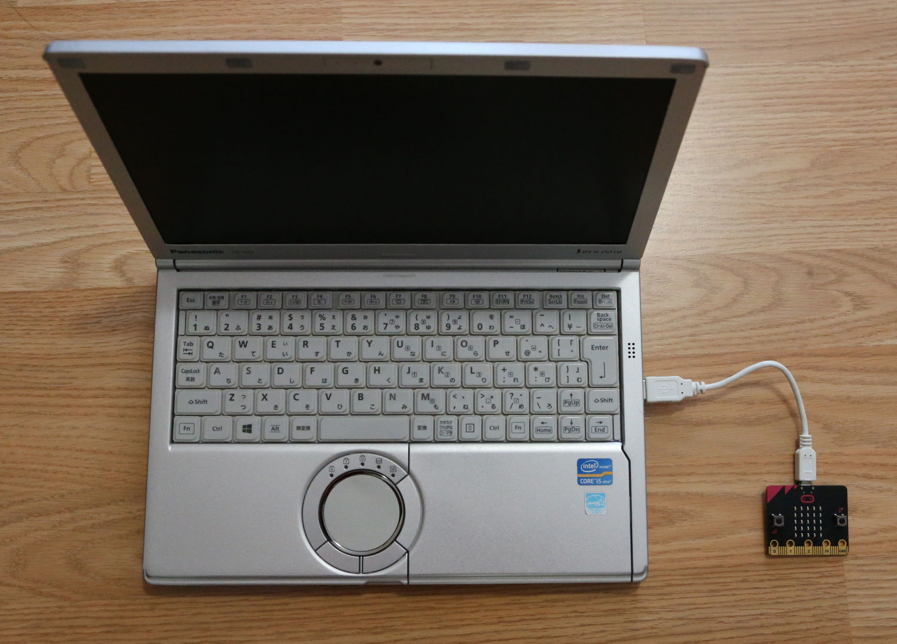
-　micro:bitにCHIRIMEN サポートプログラムを書き込む
  - ブラウザで<a href="https://chirimen.org/chirimen-micro-bit/guidebooks/link2original.html#https://makecode.microbit.org/_Jh51P7beW6Kb" target="_blank">こちらのページ(https://makecode.microbit.org/_Jh51P7beW6Kb)</a>にアクセス
 
- 以下の手順でプログラムを書き込む
  | 1 このボタンを押す | 2 このボタンを押す | 3 このボタンを押す |
  | -- | -- | -- |
  | 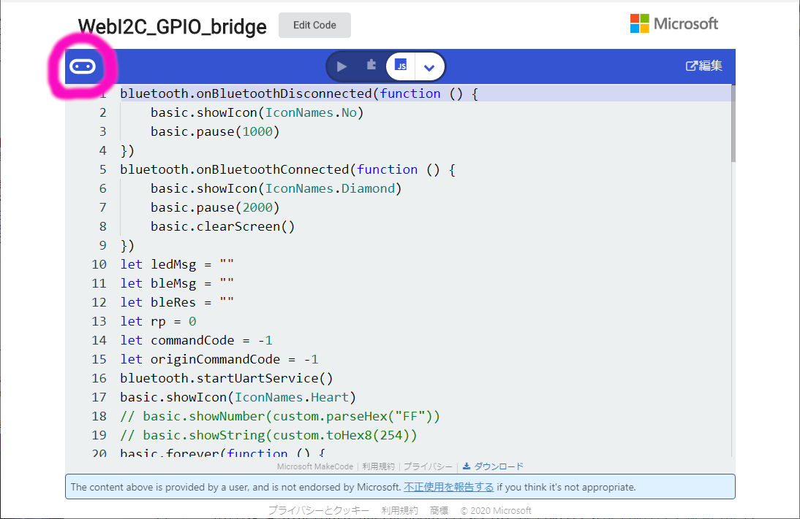 | 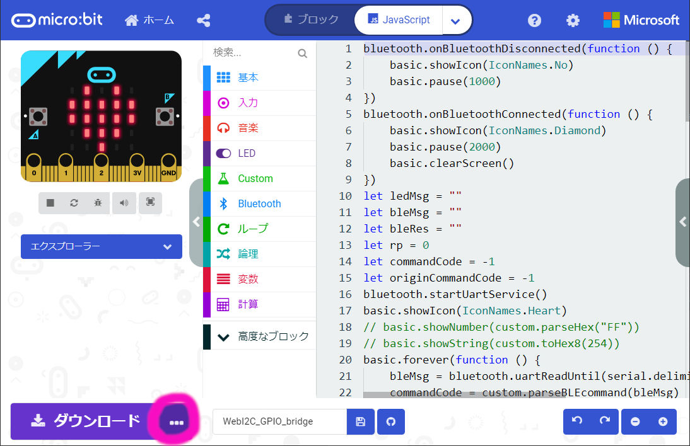 | 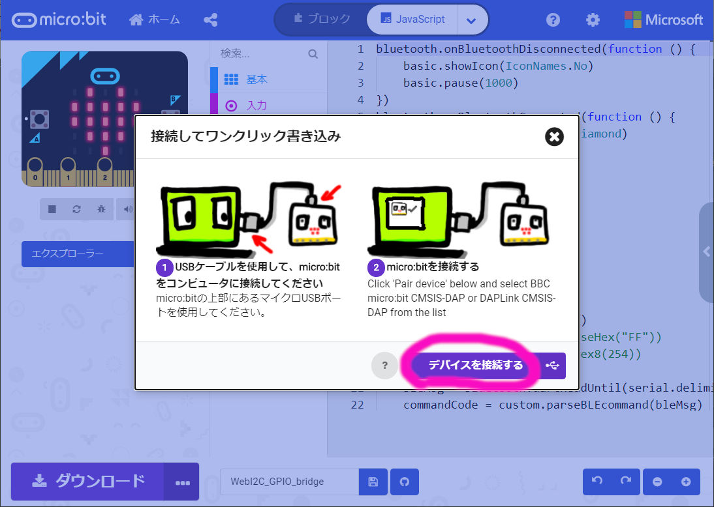 |

  | 4 ピンクの部分を選んだ後、赤のボタンを押す | 5 このボタンを押す | 6 ハートマークが表示されれば完了 |
  | -- | -- | -- |
  | 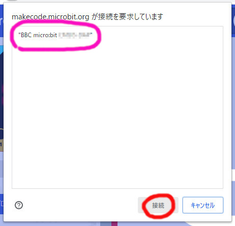 | 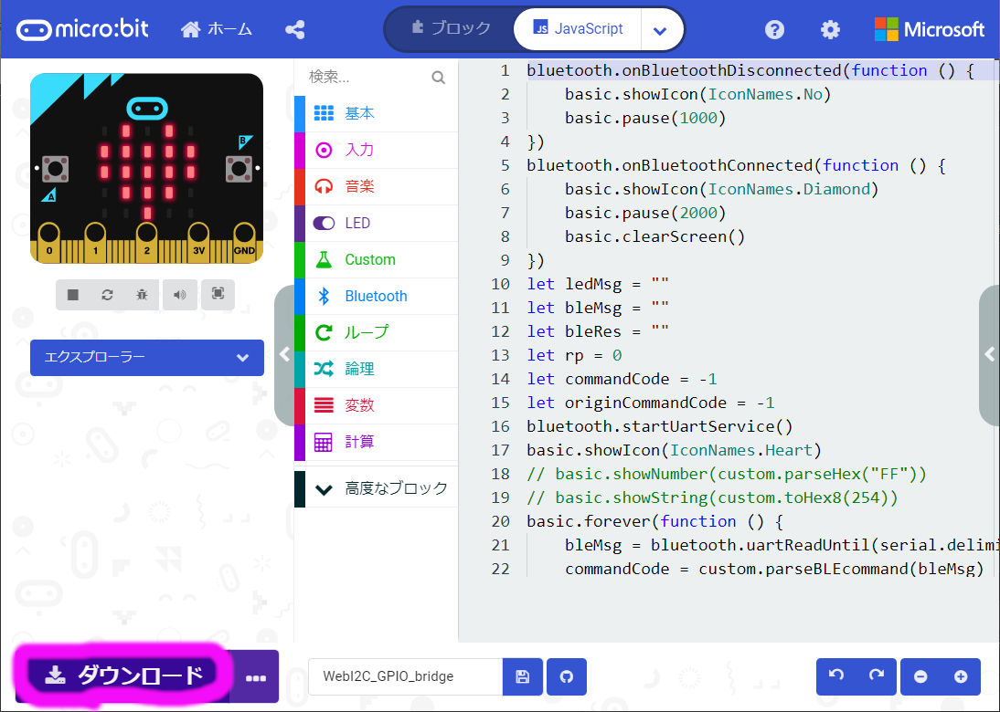 | 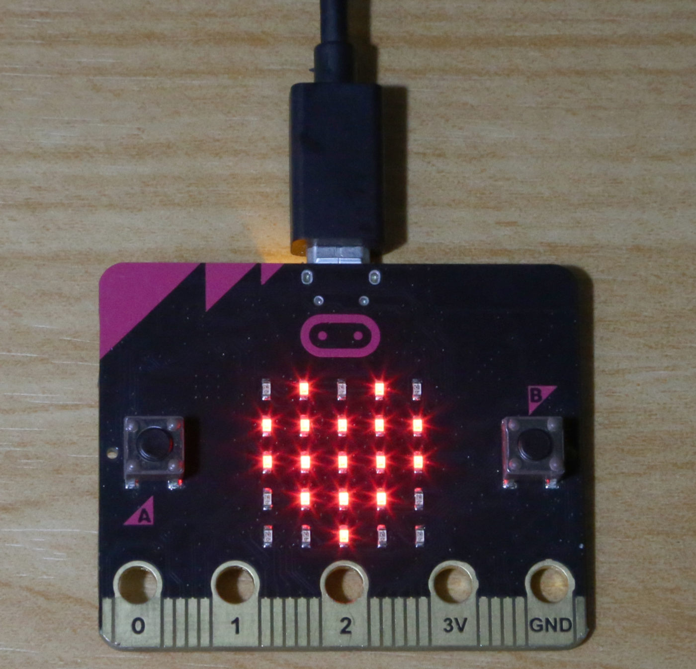 |

- CHIRIMEN with micro:bitを使ったIoTプロトタイピングでは、PCのブラウザで動くウェブアプリの開発だけを行います。**micro:bitへのプログラムの書き込みは今回一度だけ行えば以降必要ありません**
  - 他の一般的なmicro:bitを使ったプログラミングを行うときは単に上書きしてください。その後、CHIRIMEN with micro:bitを使ったIoTプロトタイピングに戻るときには再度この手順を行ってCHIRIMENサポートプログラムをmicro:bitに書き込んでください。
  - [CHIRIMEN with micro:bitのシステム構成はこちら](https://chirimen.org/chirimen-micro-bit/guidebooks/systemConfiguration.html)

-----

# 2. micro:bitの内蔵デバイスを使ってみよう

## micro:bitをバッテリーで駆動する
- PCとmicro:bitの間のUSB接続を切り離します
- micro:bitの電源端子に電池ボックスを繋ぎます

- ハートマークが表示されているのを確認
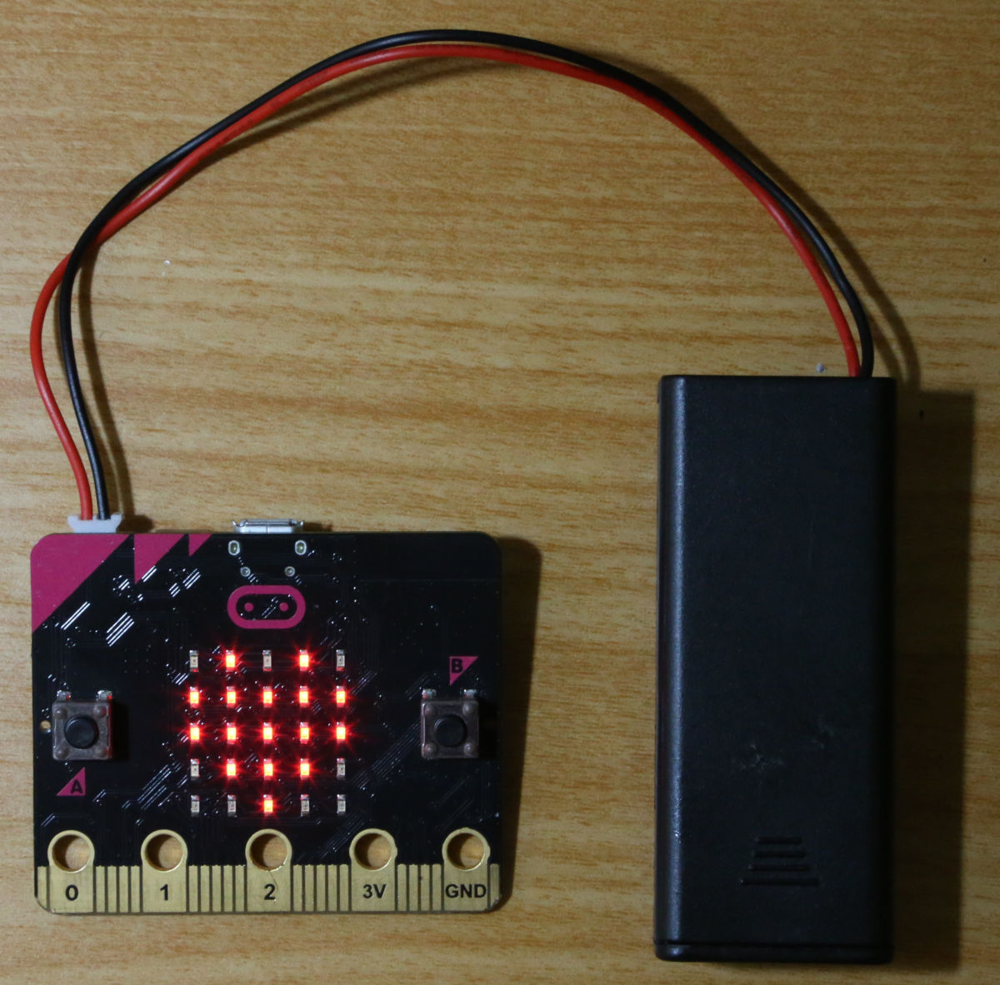

## codesandboxを使って、micro:bitを操作するウェブアプリを動かす
- [このページ](https://codesandbox.io/s/github/chirimen-oh/chirimen-micro-bit/tree/master/examples/Embed?module=main.js)にアクセスする
  - [codesandbox](https://codesandbox.io/)(web上でプログラミングができるサービス)でCHIRIMEN with micro:bitのサンプルを読み込みます。
  - 画面上でソースコードを改変することもできます。File-Save`(CTRL+S)`で変更を反映(変更したコードにはランダムな文字列のURLが振られるので、それをどこかに控えておきます)
- 矢印で示したボタンを押し、新しいタブでウェブアプリを動かす **(注：新しいタブで動かさないと正常に動作しません)**
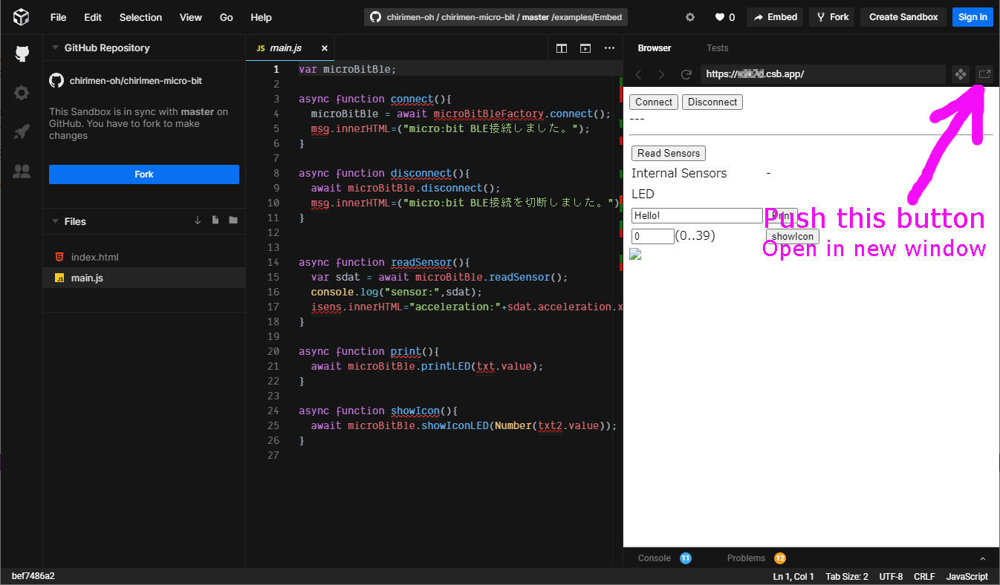 
- 新しいタブでサンプルのウェブアプリが開いたら、そのCONNECT ボタンを押す。
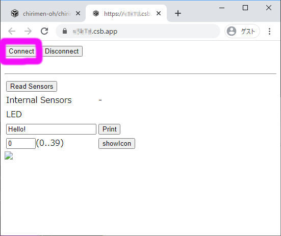 
- Bluetooth接続ダイアログが出るので、接続先のmicro:bitを選択し(ピンクの〇)、ペア設定ボタン(赤い〇)を押す
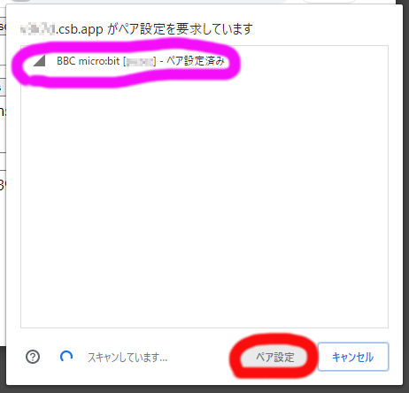 
  - これでウェブアプリがBluetoothを使ってmicro:bitに接続しました。*（参考：micro:bitに◇マークが一瞬表示されます）*
  - *接続に失敗した場合は、micro:bit背面リセットボタンを押しハートマークが表示されてから、ウェブアプリのタブをリロードして再度CONNECTを押してみます*
- ウェブアプリのUIを操作すると、micro:bitをコントロールできます
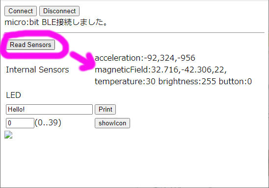 

# 3. 動作確認完了

お疲れ様でした！　CHIRIMEN with micro:bitによるIoTプロトタイピング環境の準備ができました。

## 次はフィジカルコンピューティングセットを使った、**デバイス操作～基礎編**に進みましょう
