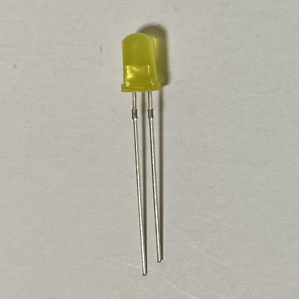
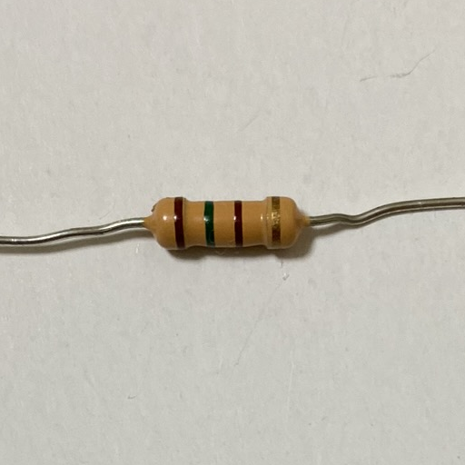
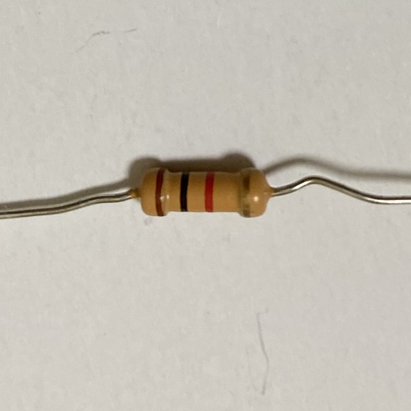
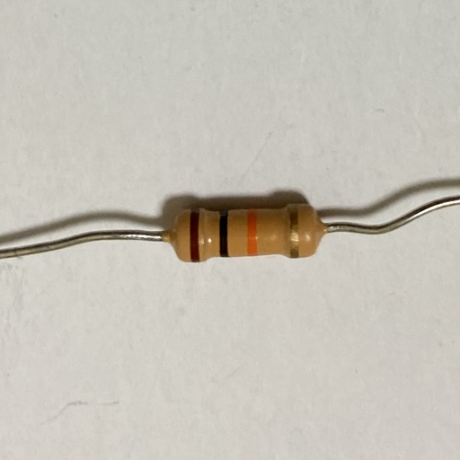
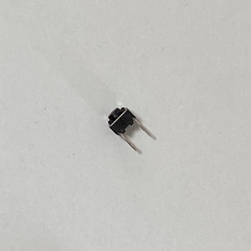
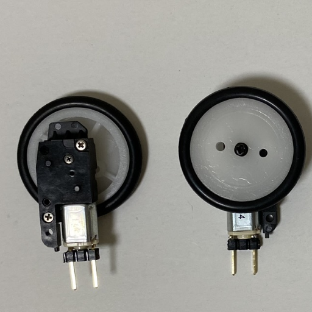
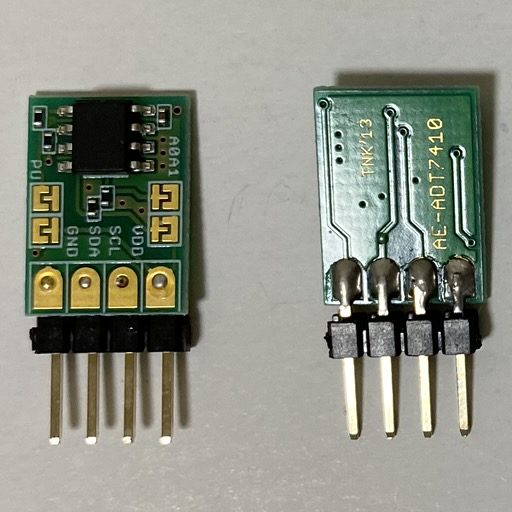

# Hello micro:bit - 準備編

このドキュメントはCHIRIMEN with micro:bitを使う上で最初の一歩となる以下を学習するチュートリアルです。

- 学習に必要な材料を揃えよう
- CHIRIMEN with micro:bitをセットアップしよう
- 内蔵センサーやLEDをコントロールするwebAppsを動かしてみよう

# 機材の準備
以下の機材が準備できていることを確認しましょう。

## CHIRIMEN with micro:bit 基本セット
|基本セット (パーソナルコンピュータを除く)  -  電池ボックス, micro:bit, microUSBケーブル |
| ----- |
|   |

## フィジカルコンピューティングセット(スターターキット)

|  |  |  |
| --- | --- | --- |
| micro:bitブレークアウトボード | ブレッドボード | ジャンパー(オス-オス4本) |
|  |  |  |
| リード付きLED (赤or黄or緑) | リード抵抗 (150Ω)　茶緑茶金 | リード抵抗 (1KΩ)　茶黒赤金 |
|  |  |  |
 リード抵抗 (10KΩ) 茶黒橙金 | タクトスイッチ | Nch MOSFET (2SK4017) |
|  |  |  |
| ちびギアモータ | ADT7410 | 又はSHT30 |
|  |  |  |

<!--
| ブレークアウトボード | ブレッドボード | ジャンパーワイヤー | リード付き LED | リード抵抗 (150Ω) | リード抵抗 (1KΩ) | リード抵抗 (10KΩ) | タクトスイッチ | Nch MOSFET | ちびギアモータ | SHT30 |
| --- | --- | --- | --- | --- | --- | --- | --- | --- | --- | --- |
|  |  |  |  |  |  |  |  |  |  |  |
-->

<!--
|   |   |
-->

- CHIRIMEN for Raspi 基本セット(内蔵センサーだけ試せます) 
準備編ではこの基本セットだけを使います。
  - 以下の条件を備えたパーソナルコンピュータ
    - Bluetoothインターフェース搭載
      - USB Bluetoothドングルでも動作します(例: [ELECOM LBT-UAN05C2](https://www.elecom.co.jp/products/LBT-UAN05C2.html))
    - Windows10 もしくは MacOS
      - linux PCでも動作する可能性はありますがディストリビューションが多岐にわたるので自己責任で試してください
    - 対応ブラウザ: [Google Chrome](https://www.google.com/chrome/) もしくは [Microfott Edge](https://www.microsoft.com/edge)
    - インターネット接続環境
  - [micro:bit](https://www.sengoku.co.jp/mod/sgk_cart/detail.php?code=EEHD-55WL)
  - microUSB ケーブル
  - [micro:bit用電池ボックス](https://www.switch-science.com/catalog/5277/)(及び電池)

- フィジカルコンピューティングセット (スターターキット) 
本編では部品が揃っていることだけを確認しましょう。
  - micro:bit用ブレークアウトボード
    - このチュートリアルでは[pimoroni pin:bit](https://www.sengoku.co.jp/mod/sgk_cart/detail.php?code=EEHD-5AWW)を使用しています
    - 他に[SparkFun micro:bit Breakout (with Headers)](https://www.sengoku.co.jp/mod/sgk_cart/detail.php?code=EEHD-56JS)、[ジェネリック品](https://ja.aliexpress.com/item/4001118934669.html) の [m:bit](https://ja.aliexpress.com/item/4000143210124.html) などが使用できますが、ピン配列の差異に注意して配線してください。
  - ブレッドボード (通常サイズまたはミニサイズ) × 1
  - リード付き LED × 1
  - タクトスイッチ × 1
  - ジャンパーワイヤー (オス-オス) x 4
  - [Nch MOSFET (2SK4017)](http://akizukidenshi.com/catalog/g/gI-07597/) x 1
  - リード抵抗 (150Ω) x 1 (茶・緑・茶・金)
  - リード抵抗 (1KΩ) x 1 (茶・黒・赤・金)
  - リード抵抗 (10KΩ) x 1 (茶・黒・橙・金)
  - [ちびギアモータ(ピンヘッダ付き)](https://tiisaishop.dip.jp/product/sgm/)
  - I2Cセンサーモジュール(以下のいずれか)
    - [ADT7410 温度センサーモジュール](http://akizukidenshi.com/catalog/g/gM-06675/) (ピンヘッダ半田付け済み)
    - [SHT30 温度・湿度センサーモジュール](https://www.amazon.co.jp/dp/B07HBSLLSY/) (ピンヘッダ半田付け済み)

-----
# 1. CHIRIMEN with micro:bitをセットアップしよう

## micro:bit に CHIRIMEN サポートプログラムを書き込む
- PC の Bluetooth を有効にする
- USB ケーブルを使って micro:bit と PC を繋ぐ
  
-　micro:bitにCHIRIMEN サポートプログラム (CHIRIMEN BLE brigde) を書き込む
  - Chrome or 最新のEdgeブラウザで <a href="https://r.chirimen.org/makecode-chirimen" target="_blank">MakeCode ページ</a> にアクセス
- 以下の手順でプログラムを書き込む

| 1 このボタンを押す | 2 このボタンを押す | 3 このボタンを押す |
  | -- | -- | -- |
  |  |  |  |

  | 4 ピンクの部分を選んだ後、赤のボタンを押す | 5 このボタンを押す | 6 ハートマークが表示されれば完了 |
  | -- | -- | -- |
  |  |  |  |

- CHIRIMEN with micro:bit を使った IoT プロトタイピングでは、PC のブラウザで動くウェブアプリの開発だけを行います。**micro:bit へのサポートプログラムの書き込みは初回に一度行えば以降必要ありません**
  - 通常の micro:bit を使ったプログラミング (MakeCode で開発するもの) を行うときは単に上書きしてください。その後、CHIRIMEN with micro:bit を使った IoT プロトタイピングに戻るときには再度この手順で CHIRIMEN サポートプログラム を micro:bit に書き込んでください (基本的に同時併用は出来ません)。
  - [CHIRIMEN with micro:bitのシステム構成はこちら](https://chirimen.org/chirimen-micro-bit/guidebooks/systemConfiguration.html)

-----

# 2. micro:bitの内蔵デバイスを使ってみよう

## micro:bitをバッテリーで駆動する
- PCとmicro:bitの間のUSB接続を切り離します
- micro:bitの電源端子に電池ボックスを繋ぎます

- ハートマークが表示されているのを確認

## codesandboxを使って、micro:bitを操作するウェブアプリを動かす
- [このページ](https://codesandbox.io/s/github/chirimen-oh/chirimen-micro-bit/tree/master/examples/Embed?module=main.js)にアクセスする
  - [codesandbox](https://codesandbox.io/)(web上でプログラミングができるサービス)で CHIRIMEN with micro:bit のサンプルを読み込みます。
  - 画面上でソースコードを改変することもできます。File-Save`(CTRL+S)`で変更を反映(変更したコードにはランダムな文字列のURLが振られるので、それをどこかに控えておきます)
- 矢印で示したボタンを押し、新しいタブでウェブアプリを動かす **(注： 新しいタブで開かないと動作しません。Web Bluetooth 通信は CodeSandbox の iframe 内では使えないためです)**

- 新しいタブでサンプルのウェブアプリが開いたら、その `CONNECT` ボタンを押す。

- Bluetooth 接続ダイアログが出るので、接続先の micro:bit を選択し(ピンクの〇)、ペア設定ボタン(赤い〇)を押す

  - これでウェブアプリがBluetoothを使ってmicro:bitに接続しました。*（参考：micro:bitに◇マークが一瞬表示されます）*
  - *接続に失敗した場合は、micro:bit背面リセットボタンを押しハートマークが表示されてから、ウェブアプリのタブをリロードして再度CONNECTを押してみます*
  - 複数の micro:bit に同時に電源が入っていると接続先 micro:bit デバイスが複数表示されます。自分の micro:bit の ID に繋ぐよう注意してください。
- ウェブアプリの UI を操作すると、micro:bit をコントロールできます

# 3. 動作確認完了

お疲れ様でした！　CHIRIMEN with micro:bitによるIoTプロトタイピング環境の準備ができました。

## 次はフィジカルコンピューティングセットを使った、[デバイス操作～基礎編](./GPIO_starter.md) に進みましょう

