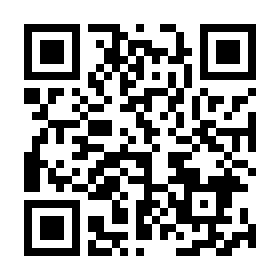

# CHIRIMEN 対応デバイスリスト

市販のセンサーやアクチュエータなどのうち、CHIRIMEN 環境での利用を検証し配線図とサンプルコード一式 (I2C デバイスは CHIRIMEN 用ドライバー含む) を用意しているデバイスの一覧です。

こちらに掲載がないデバイスについても、デジタル GPIO デバイスであればそのまま、アナログ GPIO デバイスであれば ADC を経由で簡単に利用頂けます (I2C デバイスについてはドライバーの用意も必要です)。

Raspberry Pi などの CHIRIMEN の動作環境とそれぞれのチュートリアルは 1. CHIRIMEN について参照 をご覧ください。

## I2C センサー

|カテゴリー|型番|説明|画像 URL|QR|
|:----|:----|:----|:----|:----:|
|ADC(アナログ電圧測定)|ADS1015|アナログ電圧を 12bit 精度のデジタル信号に変換する部品で、アナログセンサ等を利用する際に必要です|{width=100}|{width=100}|
|ADC(アナログ電圧測定)|ADS1115|アナログ電圧を 16bit 精度のデジタル信号に変換する部品で、アナログセンサ等を利用する際に必要です|{width=100}|{width=100}|
|ADC DAC(アナログ電圧出力) 複合|PCF8591|ADC と DAC が一つになった部品です(デジタル側は 8bit)|{width=100}|{width=100}|
|温度センサ|ADT7410|-55℃ から +150℃ まで測定できる温度センサです|{width=100}|{width=100}|
|サーモグラフィ|AMG8833|センサから見て上下左右のおよそ 60 度の範囲を 8x8 ピクセルに分割し、それぞれのエリアについて 0℃ ～ 80℃ の範囲で測定可能なサーモグラフィです|{width=100}|{width=100}|
|温度 圧力 湿度 複合センサ|BME280|温度、湿度、気圧の測定ができる複合センサです|{width=100}|{width=100}|
|温度 圧力 複合センサ|BMP180|温度と気圧の測定ができる複合センサです|{width=100}|{width=100}|
|温度 圧力 複合センサ|BMP280|温度と気圧の測定ができる複合センサです(BMP180 の後継品で精度が向上しています)|{width=100}|{width=100}|
|距離センサ|GP2Y0E03|センサから対象物までの距離を測定できるセンサです( 50cm 程度まで)|{width=100}|{width=100}|
|距離センサ|VL53L0X|センサから対象物までの距離を測定できるセンサです( 2m 程度まで)|{width=100}|{width=100}|
|ジェスチャーセンサ|Grove-Gesture (PAJ7620U2)|手を「上、下、左、右、遠ざかる、近づく、時計回り、反時計回り、手を振る」と動かしたときにそれらを検出するセンサです|{width=100}|.png){width=100}|
|光センサ|Grove-Light (TSL2561)|0.1lx から 40000lx まで測定可能な照度センサです|{width=100}|.png){width=100}|
|小型ディスプレイ Grove-OledDisplay (SSD1308)|0.96inch、128x64dot の小型 OLED (有機 EL) ディスプレイです|-|-|.png){width=100}|
|タッチセンサ|Grove-Touch (MPR121)|指などの接触を検出するセンサです| - |.png){width=100}|
|カラーセンサ|S11059|RGB 各色と赤外線の強度を測定するセンサです|{width=100}|{width=100}|
|紫外線(UV)センサ|VEML6070|紫外線の強度を測定できるセンサです|{width=100}|{width=100}|
|3 軸加速度センサ|Grove-Accelerometer (ADXL345)|3 軸の加速度を検出できるセンサです|-|.png){width=100}|
|3 軸加速度+ジャイロ 複合センサ|MPU6050|3 軸の加速度に加え、ジャイロの測定も可能な複合センサです|{width=100}|{width=100}|
|3 軸加速度+ジャイロ+磁気 複合センサ|MPU9250|3 軸の加速度、ジャイロのほか、磁気も測定可能な複合センサです|{width=100}|{width=100}|
|フルカラー LED アレイ|Neopixel LED コントローラ|多数のフルカラー LED を個々に制御可能なコントローラです(詳細は Examples をご覧ください)|{width=100}|{width=100}|
|フルカラー LED アレイ|Neopixel LED 8x8|NEOPIXEL 対応の 8x8 LED パネルです|{width=100}|{width=100}|
|フルカラー LED アレイ|Neopixel LED 12x12|円形のパネルです|{width=100}|-|
|フルカラー LED アレイ|Neopixel LED 60x60|20 個のパネルを 3 つ組み合わせることで 60 個のパネルとなります|{width=100}|-|
|LED マトリックス|HT16K33 搭載 8x8LED モジュール（その１）|マトリクス LED 制御可能なコントローラが搭載された LED モジュールです(詳細は Examples をご覧ください)。 Adafruit の 8x8LED 搭載品と　 Keyestudio KS0336 8\*8 Matrix Module I2C はピン配置を除き同等品です|{width=100}|{width=100}|
|LED マトリックス|HT16K33 搭載 8x8LED モジュール（その２）|上記と同等のコントローラですが、LED の論理配列が異なる aitendo 製 8x8LED モジュールです。ドライバの設定が若干個なります。|{width=100}|{width=100}|
|LED マトリックス|HT16K33 搭載 16x8LED モジュール|上記と同等のコントローラが載った、16x8 マトリクス LED のモジュールです。|{width=100}|{width=100}|
|LED マトリックス|HT16K33 搭載 7 セグメント LED モジュール|上記と同等のコントローラが載った、7 セグメント LED のモジュールです。|{width=100}|{width=100}|
|LED マトリックス|HT16K33 搭載 14 セグメント LED モジュール|上記と同等のコントローラが載った、14 セグメント LED のモジュールです。|{width=100}|{width=100}|
|サーボモータ・DC モータ コントローラ|PCA9685|サーボモータを PWM 制御できる部品で、サーボモータを利用する際に必要です|{width=100}|{width=100}|
|サーボモータ|SG90 Servo|アームを指定した角度をに動かすことのできる部品です|-|{width=100}|
|サーボモータ・DC モータ コントローラ|PCA9685 PWM|詳細は Examples をご覧ください|{width=100}|{width=100}|
|温湿度複合センサ|SHT30/31|温度と湿度の両方が測定可能なセンサ|{width=100}|{width=100}|
|温湿度複合センサ|AHT10|温度と湿度の両方が測定可能なセンサ|{width=100}|{width=100}|
|温湿度複合センサ|HTU21D|温度と湿度の両方が測定可能なセンサ|{width=100}|{width=100}|
|色センサ|TCS34725|I2C 接続の色センサー|{width=100}|{width=100}|
|レーザー距離センサ|VL53L1X|VL53L0X より高出力長距離タイプ|{width=100}|{width=100}|
|電流センサ|INA219|比較的大きな DC 電流を測定するセンサ|{width=100}|{width=100}|
|非接触温度センサ|MLX90614|赤外線を利用した非接触型温度センサー|{width=100}|{width=100}|
|近接・環境光・ジェスチャーセンサー|APDS9960|近接・環境光・ジェスチャーを読み取るセンサー|{width=100}|{width=100}|
|多目的インターフェース|seesaw|デジタル・アナログ入力・PWM 出力・NeopixelLED ドライブ等の機能を持つ多目的ボード|{width=100}|{width=100}|
|照度センサー|BH1750|照度センサー|{width=100}|{width=100}|
|CO2 センサ|SCD40|CO2 センサ(CO2 濃度が PPM 値で高精度に計測できるセンサーです)|{width=100}|{width=100}|
|CO2+TVOC センサ|CCS811|CO2+TVOC センサ|{width=100}|{width=100}|
|温度 湿度 気圧 ガス 複合センサ|BME680|温度、湿度、気圧さらにガスが測れる複合センサです|{width=100}|{width=100}|

## GPIO センサー・アクチュエータコントローラー

|カテゴリー|型番|説明|画像 URL|QR|
|:----|:----|:----|:----|:----:|
|LED|赤色 LED|通電すると光る部品です(必ず抵抗を挟んで利用してください)|{width=100}|{width=100}|
|LED|黄色 LED|通電すると光る部品です(必ず抵抗を挟んで利用してください)|{width=100}|{width=100}|
|LED|黄緑色 LED|通電すると光る部品です(必ず抵抗を挟んで利用してください)|{width=100}|{width=100}|
|カーボン抵抗|150Ω|必要な場所に電気抵抗を入れる部品です(ここでは通常のものよりサイズが大きく、抵抗値が読みやすい商品を紹介しています)|{width=100}|{width=100}|
|カーボン抵抗|10kΩ|必要な場所に電気抵抗を入れる部品です(ここでは通常のものよりサイズが大きく、抵抗値が読みやすい商品を紹介しています)|{width=100}|{width=100}|
|カーボン抵抗|1kΩ|必要な場所に電気抵抗を入れる部品です(ここでは通常のものよりサイズが大きく、抵抗値が読みやすい商品を紹介しています)|{width=100}|{width=100}|
|タクトスイッチ|2pin|ボタンを押している間だけ電気を流す部品です(chirimen チュートリアルでは 2pin のものを採用しています)|{width=100}|{width=100}|
|タクトスイッチ|4pin|ボタンを押している間だけ電気を流す部品です(chirimen チュートリアルでは 2pin のものを採用しています)|{width=100}|{width=100}|
|マイクロスイッチ|SS-10GL13|小型のスイッチです|{width=100}|{width=100}|
|タッチセンサ/スイッチ|TP223|タッチセンサ(スイッチ)です。金属の近接(1-2mm 程度の接近)も感知でき応用が利きます。|{width=100}|{width=100}|
|Nch パワー MOSFET|2SK4017|直流電流の On/Off 制御を行う部品です|{width=100}|{width=100}|
|Nch パワー MOSFET モジュール|IRF520 (ドライバモジュール)|上の FET を利用したモーター制御と同等の回路が組まれたモジュールです IRF520 パワー MOSFET が用られています|{width=100}|.png){width=100}|
|DC モーター 正逆転コントローラ|L298N (ドライバモジュール)|ST マイクロ社のフルブリッジドライバである L298N を使用した DC モーターコントローラです|{width=100}|.png){width=100}|
|DC モータ 正逆転コントローラ|L9110S|L9110 を使用した DC モータコントローラです|{width=100}|{width=100}|
|DC モータ 正逆転コントローラ|MX1508|L298N を使用した DC モータコントローラです|{width=100}|{width=100}|
|DC モータ 正逆転コントローラ|TB6612FNG|TOSHIBA 製 TB6612FNG を利用したモータドライバです|{width=100}|{width=100}|
|赤外線人感センサ|KP-IR412|人体に反応するセンサです|{width=100}|{width=100}|
|赤外線人感センサ|HC-SR501|人体に反応するセンサです|{width=100}|{width=100}|
|ステッピングモータコントローラ|A4988|バイポーラステッピングモータを制御するドライバです|{width=100}|{width=100}|
|LED|フレキシブルＬＥＤ　緑色|通電すると光る部品です(必ず抵抗を挟んで利用してください)|{width=100}|{width=100}|
|LED|フレキシブルＬＥＤ　赤色|通電すると光る部品です(必ず抵抗を挟んで利用してください)|{width=100}|{width=100}|
|LED|フレキシブルＬＥＤ　黄色|通電すると光る部品です(必ず抵抗を挟んで利用してください)|{width=100}|{width=100}|
|LED|フレキシブルＬＥＤ　ピンク色|通電すると光る部品です(必ず抵抗を挟んで利用してください)|{width=100}|{width=100}|

## アナログセンサー (I2C ADC で読み取り)

|カテゴリー|型番|説明|画像 URL|QR|
|:----|:----|:----|:----|:----:|
|雨センサ|RD-4P|雨(水)を検出するセンサです(GPIO)|{width=100}|{width=100}|
|水センサ|M-WL-J3Y|水を検出するセンサです|{width=100}|{width=100}|
|圧力センサ(小)|FSR 400|圧力が検知できるセンサです|{width=100}|{width=100}|
|可変抵抗 | TSR-3386|抵抗値を変化させられる抵抗です|{width=100}|-|
|ロードセル | ジェネリック品多種|加重により抵抗値が微少に変化する素子。差動入力にした ADS1115 で利用可能です|{width=100}|-|

## アクチュエータ

|カテゴリー|型番|説明|画像 URL|QR|
|:----|:----|:----|:----|:----:|
|サーボモータ|SG90|Tower Pro 製の小型サーボモータです|-|{width=100}|
|DC モータ|各 Examples をご参照ください|-|-|-|
|2 相バイポーラステッピングモータ|多種(例は TS3692N65)|A4988 をご参照ください|{width=100}|.png){width=100}|
|ギヤードモータ|ちびギヤモータ|小型のギヤードモータです|{width=100}|{width=100}|

## その他

|カテゴリー|型番|説明|画像 URL|QR|
|:----|:----|:----|:----|:----:|
|ブレッドボード|-|-|{width=100}|-|
|ジャンパー線|-|-|{width=100}|-|
|カメラ|-|-|{width=100}|-|
|ファン|-|-|{width=100}|-|
|抵抗|-|-|{width=100}|-|

## ボードコンピューター

|カテゴリー|型番|説明|画像 URL|QR|
|:----|:----|:----|:----|:----:|
|マイクロビット|-|-|{width=100}|-|
|ブレークアウト|-|-|{width=100}|-|

