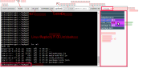
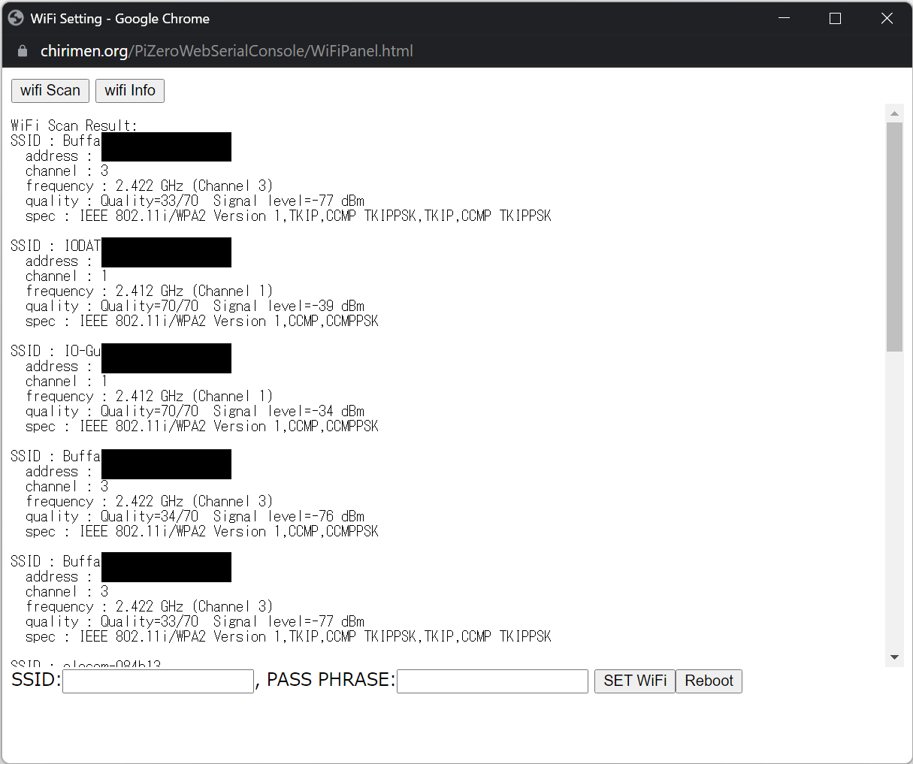
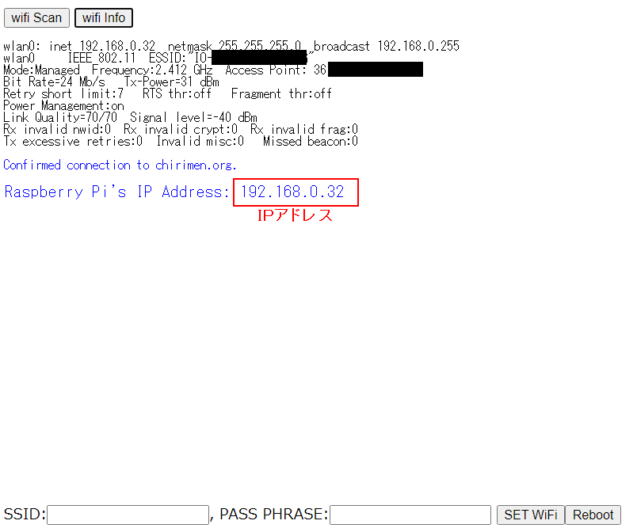
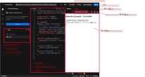

# 概要

CHIRIMEN Raspberry Pi Zero版 を用いたIoT実習資料です。

[pizeronodejs.md](pizeronodejs.md)の内容をもとに、Web Serial RPiZero Terminalを使うことで操作を簡単化し、更にプログラム作法をECMA Script Moduleにあわせています。


# 準備

## ステップ０ (物品準備、PCをWiFiに接続)

### 必要な物品リスト

以下を用意します
* Raspberry Pi Zero W 、( Pi Zero **2** W も使用できます(2022/10/12 update) )
  * Pi Zero: [ケイエスワイ](https://raspberry-pi.ksyic.com/main/index/pdp.id/799/pdp.open/799), [秋月電子](https://akizukidenshi.com/catalog/g/gM-12961/), [スイッチサイエンス](https://www.switch-science.com/catalog/3646/), [マルツ](https://www.marutsu.co.jp/pc/i/1320453/)
  * Pi Zero **2** W: [ケイエスワイ](https://raspberry-pi.ksyic.com/main/index/pdp.id/851/pdp.open/851)
* [Raspberry Pi OS LiteをUSB Serialで使用可能にしたイメージ](https://github.com/chirimen-oh/chirimen-lite/releases)を書き込んだmicroSDカード
* ブラウザの載ったパソコン
  * Windows 10 PC
    * ブラウザは標準のEdgeもしくはChromeを使います。
  * Macintosh
    * ブラウザはChromeが必要です。
  * いずれもUSBとWiFiが使える必要があります。
  * *Note: Linux PCのChromeでは次の設定で利用可能になるとの報告をいただいています*
    * Ubuntu Studio: ```sudo chmod a+rw /dev/ttyACM0```
    * Ubuntu Desktop 20.04 LTS: ```sudo gpasswd -a "$(whoami)" dialout```
* USBケーブル (USB A - MicroB)
* Lチカ用パーツ
  * ブレッドボード
  * LED
  * 1KΩ抵抗
  * ジャンパーワイヤ オス-メス 2本
* GPIO入力実験用追加パーツ
  * タクトスイッチ
* モーター制御用追加パーツ
  * 10KΩ抵抗
  * MOSFET
  * ちびギヤモーター
* 温度センシング実験用追加パーツ
  * [ADT7410モジュール](https://akizukidenshi.com/catalog/g/gM-06675/)　もしくは [SHT30モジュール](https://www.amazon.co.jp/dp/B083NHJSL9/)
  * ジャンパーワイヤ オス-メス 2本

{height=360}

PiZero自体はディスプレイやキーボードを接続する必要はありません。

### PCをWiFiに接続
* 会場(もしくは開発場所)で提供されているWiFiアクセスポイントにまずはPCを接続してください。

<hr class="page-wrap" />

## ステップ１（ターミナル接続）

* [Raspberry Pi OS LiteをUSB Serialで使用可能にしたイメージ](https://github.com/kou029w/chirimen-os/releases/)を書き込んだmicroSDカードをRaspberry Pi Zeroに差し込みます。
* PCのUSBとRaspberry Pi ZeroのUSB OTGポートをUSBケーブルでつなぎます
  * PiZero側はつなぐポート要注意　ここに繋ぎます
  {height=160}
  * PCからのUSB給電でRaspberry Pi Zeroが起動します。
* PCでRaspberry Pi Zeroが認識されたことを確認します ([Windows10のデバイスマネージャ](https://askpc.panasonic.co.jp/beginner/guide/ten07/7013.html)の例) 
  * 給電後USBデバイスとして出現するまでにしばらく(数十秒)かかります）
  * Windowsの場合、ポートの番号(COMnのnの部分)は環境ごとに異なります
  
* [**こちらのWeb Serial RPiZero TerminalページにPCのブラウザでアクセス**](https://chirimen.org/PiZeroWebSerialConsole/PiZeroWebSerialConsole.html)
 (以降、このウィンドを**ターミナルウィンド**と呼びます)
* ```[Connect and Login PiZero]```ボタンを押す
  * 接続ダイアログが出現
    {height=155}
  * 上で認識したデバイス（ポート番号）を接続する
* コンソール(左側の黒い画面の最下部)に以下のコマンドプロンプトが表示されればステップ１完了です。引き続きステップ２に進んでください
  * ```pi@raspberrypi:~$```

<hr class="page-wrap" />

### Note:

* CHIRIMEN Raspberry Pi Zero版では[Raspberry Pi OS Lite](https://www.raspberrypi.com/software/operating-systems/)(Linux)を[コマンドラインインターフェース(CLI)](https://atmarkit.itmedia.co.jp/ait/articles/1602/19/news025.html)・[シェル(bash)](https://atmarkit.itmedia.co.jp/ait/articles/1603/02/news016.html)で操作します。
  * ただしこの講習で使うコマンドはごくわずかです。
    * **node** コマンド(後述)
    * [CTRL+c](https://atmarkit.itmedia.co.jp/ait/articles/1708/04/news015_2.html)(CTRLキーとcを同時に押す:実行中のコマンドを終了させる)
  * その他のほとんどの操作（コマンド）は、ターミナルウィンドやそこから起動される別画面のGUIがコマンド操作を代行しています。図1.1のGUIを操作するとコンソールにコマンドが入力されるのがわかると思います。
* もしもあなたがlinuxのシェルコンソール画面に慣れている場合は、ターミナルウィンドのコンソールにその他のシェル(bash)コマンドをタイプして使用することもできます。
  * たとえば ```ls -al``` とタイプするとおコンソール画面にディレクトリ内のファイルのリストが表示されます。
* ターミナルウィンドの概要 (図1.1)

  

<hr class="page-wrap" />

## ステップ２ (WiFi設定)

* ターミナルウィンドの```[wifi panel]```ボタンを押す
  * ウィンドが開き、WiFiアクセスポイントがスキャンされます。ステルスでないものはリストアップされているので、以降の作業の参考にしてください。
  * Raspberry Pi Zero Wは2.4GHz帯のWiFiにのみ対応しています。
    
* ウィンド下部に、会場(もしくは開発場所)で提供されているWiFiアクセス情報を入力する (いずれも大文字小文字の区別があるので注意してください。)
  * SSID欄
  * PASS PHRASE欄 
* ```[SET WiFi]```ボタンを押す
* ```[Reboot]```ボタンを押す
  * これでRaspberry Pi Zeroが再起動をはじめます
* WiFiウィンドを閉じ、ターミナルウィンドに戻る
* ターミナルウィンドの```[Close Connection]```ボタンを押す
* 30秒ほど待つ（Raspberry Pi Zeroが再起動します）

<hr class="page-wrap" />

* ```[Connect and Login PiZero]```ボタンを押し接続する
  * 接続ダイアログが出現⇒接続するとこれまで同様コマンドプロンプトが出現
* ```[wifi panel]```ボタンを再び押す
* ```[wifi Info]```ボタンを押す
  * 表示された情報をチェックします
  * wlan0: inet xxx.xxx.xxx.xxx　(xxxは数字)のようにIPアドレスが設定されていれば接続成功しています。

  <!--  * あとでping chirimen.org OK も入れよう。-->
  * もしもあなたがsshやscp (WinSCP, teraterm等)などのツールに慣れている場合、上記のアドレスでssh接続できます
    * PORT: 22
    * ID: ```pi```
    * PASSWORD: ```raspberry```
  * 確認できたらWiFi Settingウィンドを閉じてください。

* 以上ですべての初期設定完了です！

<hr class="page-wrap" />

# Hello Real World（Lチカを実行する）

## 配線

PiZero とパーツを使って下の図の通りに配線します。
* [LEDの極性に注意！](https://tutorial.chirimen.org/raspi/hellorealworld#section-1)
  * [LEDの説明](../chirimenGeneric/#led)
* [ブレッドボードの使い方](../chirimenGeneric/#section-1)
* [抵抗値の読み方](../chirimenGeneric/#section-2)
* [その他、配線の基礎知識](https://tutorial.chirimen.org/reference#section-1)


**注意**
* 間違ったピンに差し込むと場合によってはPiZeroが停止したり故障することもあります。（たとえば3.3V端子とGND端子を接続してしまうなど。）
* そのため、慣れるまでは一旦PiZeroをシャットダウン、USBケーブルも外し電源OFFにしてから配線すると安全です
   * シャットダウンコマンド：```sudo shutdown -h now```

{height=200}

* 配線に使うケーブルの色に厳密な決まりはありませんが、一般的にGNDは黒(や黒っぽい色)、電源(VCC, +3.3V, +5V)には赤(や赤っぽい色)が用いられます。配線間違いを防ぐためにもなるべく合わせましょう。
* 抵抗やLEDの足(リード線)は手で簡単に曲げられます。ブレッドボードに差し込めるように適当に成型してください。
* 上図のPiZeroは上から見たものです

<hr class="page-wrap" />

## プログラムを書く

Raspberry Pi に接続した LED を点滅させるプログラムを書きます。

* ターミナルウィンドでRaspberry Pi Zeroに接続します。（ステップ１が完了した状態）
* myAppディレクトリに移動します。
  * コンソールの右側のファイルマネージャでmyApp⇒移動を選ぶ
  * このディレクトリが開発環境が設定されているディレクトリです。
* ```[Create New Text]```ボタンを押す
* 入力欄に```hello.js```と入力
* ```[create]```ボタンを押す
* JS Editorウィンドが出現

以下のプログラムをJS Editorに書き写します ～ コピペ（下記プログラム部分を選択してCTRL+c、JS Editorウィンド上でCTRL+v））

```js
import {requestGPIOAccess} from "./node_modules/node-web-gpio/dist/index.js"; // WebGPIO を使えるようにするためのライブラリをインポート
const sleep = msec => new Promise(resolve => setTimeout(resolve, msec)); // sleep 関数を定義

async function blink() {
  const gpioAccess = await requestGPIOAccess(); // GPIO を操作する 
  const port = gpioAccess.ports.get(26); // 26 番ポートを操作する

  await port.export("out"); // ポートを出力モードに設定

  // 無限ループ
  for (;;) {
    // 1秒間隔で LED が点滅します
    await port.write(1); // LEDを点灯
    await sleep(1000);   // 1000 ms (1秒) 待機
    await port.write(0); // LEDを消灯
    await sleep(1000);   // 1000 ms (1秒) 待機
  }
}

blink();
```

* 書き終えたら保存します。(```[Save]ボタン```もしくはCTRL+s)
* ターミナルウィンドの右側(ファイルマネージャ)に hello.jsが出現していることを確認します
* エディタウィンドを閉じます

## 実行する

* ターミナルウィンドのコンソール部(ウィンド左側)のプロンプト(画面一番下)が以下になっていることを確認します
  * ```pi@raspberrypi:~/myApp$```
* コンソール部をクリックして、入力可能状態にしてから、以下の文字を入力します。
* ```node hello.js``` ENTERキー
  * [**node**](https://atmarkit.itmedia.co.jp/ait/articles/1102/28/news105.html) はJavaScriptのコードを実行するインタープリタ<span class="footnote">https://ja.wikipedia.org/wiki/インタプリタ</span>
* LED が点滅すれば完成です 🎉
* プログラムを止めるには、コンソール部で ```CTRL+c``` を押します。

<hr class="page-wrap" />

# Raspberry Pi について

* 教育・学習用として設計されたシングルボードコンピュータ<span class="footnote">https://elchika.com/dic/シングルボードコンピュータ/</span>
* Linuxが動作するシングルボードコンピュータとして、安価でとても高いシェアを持ち世界中で容易に入手できる
* 今回使用するRaspberry Pi ZeroWは、その中でも特に安価([2000円以下](https://www.switch-science.com/catalog/3200/))で小型・低消費電力の機種、HDMI出力はあるもののブラウザを動かすだけの処理能力がありませんが、IoTのエッジデバイス（センサーやアクチュエータが載ったデバイスでディスプレイはあるとしても簡易のもの）には適しています。
  * フルセットのブラウザが内蔵されたデバイスを作りたい場合は[CHIRIMEN Raspberry Pi版](../raspi/)が使用できます。
  * インターネットを経由してPCやスマホのブラウザから遠隔操作するシステムは　このPi ZeroW版でつくれます。[IoTの章](#iot)まで進めましょう。

## Raspberry Pi Zeroのピン配列

GPIO, 電源, GND, I2C信号線などのピン配列を記載します。

* 白い文字で書かれたピンだけが使えます
* GND、3.3V、5Vはそれぞれ電源とグランドです
* 数字 + PD||PUと書かれているピンはGPIO端子(詳細は次章)
  * PD:プルダウン, PU:プルアップ
* SCL, SDAはI2Cインターフェースのピンです(詳細は次章)


<hr class="page-wrap" />

  

<hr class="page-wrap" />

# CHIRIMEN について

* [こちらを参照ください](../chirimenGeneric/#chirimen)

## CHIRIMEN Raspberry Pi Zero版について

* PiZero上ではWeb Browserを動かさない。
* Node.jsというJavaScriptインタープリターだけが動く
  * ブラウザの機能のうち一部だけがPiZero上で使える
    * プログラミング言語 ～ JavaScript
    * 画面表示やGUIに関わらないAPI
    * 通信プロトコル
  * 使えないのはブラウザを使った画面表示やGUI
* ブラウザを使った画面やGUIは
  * ネットを介してスマホやPCからコントロール ⇒ これが代表的にIoTと呼ばれるデザインパターン
    * このとき、Raspberry Pi Zeroは、IoTエッジデバイスとして動作

# JavaScript の基礎

* [こちらを参照してください](../chirimenGeneric/#javascript-)
* [非同期処理 async/await](../chirimenGeneric/#section-3)を多用します。

<hr class="page-wrap" />

# GPIOを試す

## GPIOを理解する
* [GPIOとは？](../chirimenGeneric/#gpio)

## GPIO出力

GPIOの出力はLチカで実験済みですね。そこで今回はモーターを動かしてみましょう。MOSFETを使った回路図は以下のようになります。

{height=200}

コードはLチカと全く同じです。

### 回路について
* [MOSFETを使った大電力制御](../chirimenGeneric/#mosfet)

### コードを読む
* 前提：CHIRIMEN Rasoberryu Pi ZeroはNode.jsをプログラム実行環境（インタープリタ）として使っています。
  * [Node.jsについて](../chirimenGeneric/#nodejs-chirimen-raspberry-pi-zero)
* ターミナルウィンドの右側のファイルマネージャでhello.js⇒表示 を選び、ソースコードを読んでみましょう
* WebGPIOライブラリを読み込み ([JavaScript Module](../chirimenGeneric/#javascript-module-ecma-script-module)仕様に従って)
　`import {requestGPIOAccess} from "./node_modules/node-web-gpio/dist/index.js";`
  * [JavaScript module](../chirimenGeneric/#javascript-module-ecma-script-module) に基づいてWebGPIOライブラリを読み込みます。これでWeb GPIO APIが使えるようになりました。
* [GPIOポートの初期化処理](../chirimenGeneric/#gpio-2)
* [GPIOPortの出力処理](../chirimenGeneric/#gpioport-)

<hr class="page-wrap" />

## GPIO入力

GPIO端子の**入力が変化したら関数を実行**という機能によってGPIOの入力を使います。

* ターミナルウィンドの```[CHIRIMEN Panel]```ボタンを押す
* 出現したCHIRIMEN Panelの```[Get Examples]```ボタンを押す
* ID : **gpio-onchange**を探します
* 回路図リンクを押すと回路図が出てきますので、回路を組みます。
* ```[JS GET]```ボタンを押すと、開発ディレクトリ(```~/myApp```)に、サンプルコードが保存されます。
  * **main-gpio-onchange.js**というファイル名で保存されます。
  * ターミナルウィンドの右側のファイルマネージャでmain-gpio-onchange.js⇒編集 を選びます。
    * ソースコードを見てみましょう
    * 今回は編集不要ですが、サンプルをベースに応用プログラムを作るときには編集しましょう。
* 実行する
  * ターミナルウィンドのコンソールのプロンプトが```pi@raspberrypi:~/myApp$```となっていることを確認
  * ターミナルウィンドのコンソールに、```node main-gpio-onchange.js``` [ENTER] と入力して実行。
  * タクトスイッチを押してみます。
  * タクトスイッチが押されるたびにコンソール画面に**0**(押された状態)、**1**(離した状態)が交互に表示されます。
    * Note: GPIOポート5は、Pull-Up(開放状態でHighレベル)です。そのため離した状態で１が出力されます。スイッチを押すとポートがGNDと接続され、Lowレベルになり、0が出力されます。
* 終了は CTRL+c

### コードを読む
* ターミナルウィンドの右側のファイルマネージャでmain-gpio-onchange.js⇒表示 を選び、ソースコードを読んでみましょう
* WebGPIOライブラリを読み込み
　`import {requestGPIOAccess} from "./node_modules/node-web-gpio/dist/index.js";`
  * [JavaScript module](../chirimenGeneric/#javascript-module-ecma-script-module) に基づいてWebGPIOライブラリを読み込みます。これでWeb GPIO APIが使えるようになりました。
* [GPIOポートの初期化処理を行う](../chirimenGeneric/#gpio-2)
* [onchangeによる入力処理](../chirimenGeneric/#onchange)

<hr class="page-wrap" />

## GPIO入力(ポーリング)
入力ではイベントの他にポーリングというテクニックが広く使われます。（次章のI2Cデバイスからの入力では専らポーリング）

* ターミナルウィンドの```[CHIRIMEN Panel]```ボタンを押す
* 出現したCHIRIMEN Panelの```[Get Examples]```ボタンを押す
* ID : **gpio-polling**を探します
* 回路は前章と同じなのでそのままにしておきます。
* ```[JS GET]```ボタンを押すと、開発ディレクトリ(```~/myApp```)に、サンプルコードが保存されます。
  * **main-gpio-polling.js**というファイル名で保存されます。
  * ターミナルウィンドの右側のファイルマネージャでmain-gpio-polling.js⇒編集 を選びソースコードを見てみましょう

* 実行する
  * プロンプトが```pi@raspberrypi:~/myApp$```となっていることを確認
  * コンソールに、```node main-gpio-polling.js``` [ENTER] と入力して実行。
  * 0.3秒おきにポート5の値がコンソールに表示されていきます。
  * タクトスイッチを押してみます。
  * タクトスイッチが押されると、**0**に変化します。
* 終了は CTRL+c

### コードを読む
* ターミナルウィンドの右側のファイルマネージャでmain-gpio-polling.js⇒表示 を選び、ソースコードを読んでみましょう
* WebGPIOライブラリを読み込み
　`import {requestGPIOAccess} from "./node_modules/node-web-gpio/dist/index.js";`
  * [JavaScript module](../chirimenGeneric/#javascript-module-ecma-script-module) に基づいてWebGPIOライブラリを読み込みます。これでWeb GPIO APIが使えるようになりました。
* [GPIOポートの初期化処理を行う](../chirimenGeneric/#gpio-2)
* [単純入力＋ポーリングによる入力処理](../chirimenGeneric/#section-7)

<hr class="page-wrap" />

# I2Cデバイスを試す

## I2Cを理解する

* [I2Cとは？](../chirimenGeneric/#i2c)

## SHT30編

SHT30は温度に加えて湿度も測定できるI2C接続の多機能センサーです。SHT31もほぼ同等に使えます。(SHT31のほうが精度が高い)
* [SHT30/SHT31について](../chirimenGeneric/#i2ci2c--sht30-sht31)

* ターミナルウィンドの```[CHIRIMEN Panel]```ボタンを押す
* 出現したCHIRIMEN Panelの```[Get Examples]```ボタンを押す
* ID : sht30を探します
* 回路図リンクを押すと回路図が出てきますので、回路を組みます。なお、接続は下の図のようになります。

  {height=220}

* ```[JS GET]```ボタンを押すと、開発ディレクトリ(```~/myApp```)に、サンプルコードが保存されます。
  * **main-sht30.js**というファイル名で保存されます。
  * Note: ターミナルウィンドの右側のファイルマネージャでmain-sht30.js⇒編集 を選ぶと、エディタで編集できます。
    * ソースコードを見てみましょう
    * 今は編集不要ですが、サンプルをベースに応用プログラムを作るときには編集しましょう。

<hr class="page-wrap" />

### I2Cセンサー(SHT30)が認識されていることを確認する

* CHIRIMEN Panelの```[i2c detect]```ボタンを押すと、[SHT30のI2Cアドレス](https://strawberry-linux.com/pub/Sensirion_Humidity_SHT3x_DIS_Datasheet_V3_J.pdf)　0x**44**が表示されていればうまく接続されています。
  * [ic2 detectとは](../chirimenGeneric/#b-i2cdetect)

<pre>
     0  1  2  3  4  5  6  7  8  9  a  b  c  d  e  f
00:          -- -- -- -- -- -- -- -- -- -- -- -- -- 
10: -- -- -- -- -- -- -- -- -- -- -- -- -- -- -- -- 
20: -- -- -- -- -- -- -- -- -- -- -- -- -- -- -- -- 
30: -- -- -- -- -- -- -- -- -- -- -- -- -- -- -- -- 
40: -- -- -- -- 44 -- -- -- -- -- -- -- -- -- -- -- 
50: -- -- -- -- -- -- -- -- -- -- -- -- -- -- -- -- 
60: -- -- -- -- -- -- -- -- -- -- -- -- -- -- -- -- 
70: -- -- -- -- -- -- -- --                       
</pre>

### 実行する

* ターミナルウィンドのコンソールのプロンプトが```pi@raspberrypi:~/myApp$```となっていることを確認
* ターミナルウィンドのコンソールに、```node main-sht30.js``` [ENTER] と入力して実行。
* 温度と湿度が1秒ごとにコンソールに表示されます。
* 終了は CTRL+c

### コードを読む

* ターミナルウィンドの右側のファイルマネージャでmain-sht30.js⇒表示 を選び、ソースコードを読んでみましょう
* [WebI2CライブラリとSHT30デバイスドライバを読み込み](../chirimenGeneric/#webi2c)

　`import {requestI2CAccess} from "./node_modules/node-web-i2c/index.js";`
  `import SHT30 from "@chirimen/sht30";`
  * [JavaScript module](../chirimenGeneric/#javascript-module-ecma-script-module) に基づいてWebI2Cライブラリを読み込みます。
* [I2C 温湿度センサー (SHT30, SHT31)の初期化と使用](../chirimenGeneric/#i2c--sht30-sht31)

<hr class="page-wrap" />

## ADT7410編

温度センサーADT7410を使います。
もし、SHT30を使用する場合は、「IoTを試す」の章まで読み飛ばしてください。

* ターミナルウィンドの```[CHIRIMEN Panel]```ボタンを押す
* 出現したCHIRIMEN Panelの```[Get Examples]```ボタンを押す
* ID : adt7410を探します(上から5個目ぐらい)
* 回路図リンクを押すと回路図が出てきますので、回路を組みます。なお、接続は下の図のようになります。


* ```[JS GET]```ボタンを押すと、開発ディレクトリ(```~/myApp```)に、サンプルコードが保存されます。
  * **main-adt7410.js**というファイル名で保存されます。
  * Note: ターミナルウィンドの右側のファイルマネージャでmain-adt7410.js⇒編集 を選ぶと、エディタで編集できます。
    * ソースコードを見てみましょう
    * 今は編集不要ですが、サンプルをベースに応用プログラムを作るときには編集しましょう。

#### センサーの極性に注意

    温度センサー ADT7410 を用意した場合、図と同じように配線します。配線(特に電源線)を間違えるとセンサーが高熱になり火傷・破損するので注意してください。

<hr class="page-wrap" />

### I2Cセンサーが認識されていることを確認する

* CHIRIMEN Panelの[```[i2c detect]```](https://tutorial.chirimen.org/ty51822r3/i2cdetect)ボタンを押すと、[ADT7410のI2Cアドレス](https://akizukidenshi.com/download/ds/akizuki/AE-ADT7410_aw.pdf)　0x**48**が表示されていればうまく接続されています。

<pre>
     0  1  2  3  4  5  6  7  8  9  a  b  c  d  e  f
00:          -- -- -- -- -- -- -- -- -- -- -- -- -- 
10: -- -- -- -- -- -- -- -- -- -- -- -- -- -- -- -- 
20: -- -- -- -- -- -- -- -- -- -- -- -- -- -- -- -- 
30: -- -- -- -- -- -- -- -- -- -- -- -- -- -- -- -- 
40: -- -- -- -- -- -- -- -- 48 -- -- -- -- -- -- -- 
50: -- -- -- -- -- -- -- -- -- -- -- -- -- -- -- -- 
60: -- -- -- -- -- -- -- -- -- -- -- -- -- -- -- -- 
70: -- -- -- -- -- -- -- --                       
</pre>

### 実行する

* ターミナルウィンドのコンソールのプロンプトが```pi@raspberrypi:~/myApp$```となっていることを確認
* ターミナルウィンドのコンソールに、```node main-adt7410.js``` [ENTER] と入力して実行。
* 温度が1秒ごとにコンソールに表示されます。
* 終了は CTRL+c

# IoTを試す

## 遠隔LEDコントロール


IoTは、制御されるデバイス（上図ではCHIRIMEN PiZeroW)と、利用者端末（上図ではWebApp PC-side）に加えて、これらの間でデータを中継するサーバ（クラウド）が必要になります。
今回はWeb標準技術であるWebSocketプロトコルを中継するサーバを用いてLEDを備えたCHIRIMENデバイスとスマホやPCのWebAppを繋いだIoTシステムを作ります。

Note: [モーター制御の回路](./#gpio-2)を組めば、そのまま遠隔モーターコントロールができます

- [IoT](../chirimenGeneric/#iot)
- [WebSoeketとRelayServer](../chirimenGeneric/#websocketpubsub-services)

### 配線する

配線は最初のLチカそのままです。

{height=200}

<hr class="page-wrap" />

### CHIRIMENデバイス側にコードを入れ、実行する

* ターミナルウィンドの```[CHIRIMEN Panel]```ボタンを押す
* 出現したCHIRIMEN Panelの```[Get Examples]```ボタンを押す
* ID : **remote_gpio_led**の行を探します（もう一度この行の情報を使います）
* ```[JS GET]```ボタンを押すと、開発ディレクトリ(```~/myApp```)に、サンプルコードが保存されます。
  * **main-remote_gpio_led.js**というファイル名で保存されます。
  * ターミナルウィンドの右側のファイルマネージャでmain-remote_gpio_led.js⇒編集 を選びソースコードを見てみましょう
* 実行する
  * ターミナルウィンドのコンソールのプロンプトが```pi@raspberrypi:~/myApp$```となっていることを確認
  * ターミナルウィンドのコンソールに、```node main-remote_gpio_led.js``` [ENTER] と入力して実行。
    {height=70}
  * なお、実験が終わったら終了は CTRL+c です。

### PC側のコードを準備し、実行する
* CHIRIMEN Panelに戻り、ID : **remote_gpio_led**の行にある、```CSB EDIT```リンクをクリックする。
  * [CodeSandbox](https://csb-jp.github.io/)というオンラインのWebApp開発環境のウィンドが開き、PC側のコードが表示されています。編集もできます。
  * また、右側（もしくは右下）のフレームにはLEDを遠隔コントロールするためのwebAppが既に実行されています。
  * webAppを使ってLEDが制御できることを確かめてみましょう。
{height=260}

<hr class="page-wrap" />

### コードを読む
#### Raspberry Pi Zero側コード
* ターミナルウィンドの右側のファイルマネージャでmain-remote_gpio_led.js⇒表示 を選び、ソースコードを読んでみましょう
* これまで通りWebGPIOライブラリの読み込み
* [relayServer.js](../chirimenGeneric/#relayserverjs)ライブラリの読み込み
  * Node.jsではrelayServerライブラリに加えて、webSocketライブラリの読み込みが必要です。
    ```
    import nodeWebSocketLib from "websocket";
    import {RelayServer} from "./RelayServer.js";
    ```
* [relayServer.js](../chirimenGeneric/#relayserverjs)を使って、PCからの操作指示を受信
  * [初期化](../chirimenGeneric/#section-16)
  * [受信処理](../chirimenGeneric/#section-18)(コールバック関数の設定)
* 受信した内容をもとに[GPIO出力を操作](../chirimenGeneric/#gpioport-)してLEDを点灯・消灯

#### PC側コード
* CodeSandboxで開いているPC.jsを見てみましょう
* [JavaScript Module](../chirimenGeneric/#javascript-module-ecma-script-module)仕様に基づいてrelayServer.jsを読み込み
  ```
  import {RelayServer} from "https://chirimen.org/remote-connection/js/beta/RelayServer.js";
  ```
* [relayServer.js](../chirimenGeneric/#relayserverjs)を使い、UIを通してユーザからの操作指示を送信
  * [初期化](../chirimenGeneric/#section-16)
  * [送信処理](../chirimenGeneric/#section-17)～(UI(ボタン)に設置したコールバック関数をもとに送信

<hr class="page-wrap" />

#### 自分専用チャンネルで制御

  サンプルのコードは共通のチャンネルを使って制御しています。この状態では複数の人が同時に実習していると混信します。(他の人のPCでON/OFFを指示しても、自分のLEDがON/OFFする。同じチャンネルを使っているため。)

  これはこれで使い道はあるのですが、自分のLEDは自分だけで制御したい場合は専用のチャンネルを使って制御しましょう。　チャンネルの指定はPiZero側のコードと、PC側のコード両方を同時に同じ内容で設定する必要があり、以下の部分になります。

  ```channel = await relay.subscribe("chirimenLED");```

  この```chirimenLED```という文字列(チャンネル名)を他の人と被らない別のチャンネル名に書き換えます(```chirimenLED5```など)

<hr class="page-wrap" />

# 他のいろいろなデバイスを試してみる

* ターミナルウィンドの```[CHIRIMEN Panel]```ボタン⇒CHIRIMEN Panelの```[Get Examples]``ボタンで出現するリストのデバイスがすぐ試せます。
* このリストの直リンクは[こちら(サンプル一覧)](esm-examples/)です。CHIRIMEN RPiZeroをPCにつないでいないときはこちらを眺めてください。

また、こちらには、Web GPIO や Web I2C によって扱うことのできる[外部デバイスの写真や様々なCHIRIMEN環境のサンプルコードの一覧があります](https://tutorial.chirimen.org/raspi/partslist)。こちらも参考になるかもしれません。(CHIRIMENは[Raspberry Pi ZeroW以外に、Raspberry Pi 3,4や、micro:bit等](../)でも使用できます）

# 常駐プログラム化する

ターミナルウィンドからnodeコマンドで実行指示しなくても、電源投入後 自動的に指定したコードを起動する設定（常駐プログラム化）ができます。
このチュートリアルでは、[forever](https://www.npmjs.com/package/forever)を使用する設定を専用GUIを用いて行ってみましょう。

* ターミナルウィンドの```[CHIRIMEN Panel]```ボタン⇒CHIRIMEN Panelの```[Resident App Conf.]```ボタンを押します。 
  * 専用画面のUIが使用可能状態になるまで数秒かかります。
* 開発ディレクトリ```~/myApp```内にあるjavascriptコードがリストアップされます。
* 各行の```Now Running```列は常駐状態、```App Name```はコードのファイル名、```Select```は選択用チェックボックスです。
  * ```Now Running```欄には現在常駐プログラム化しているコードに、```RUNNING```が表示されています。（常駐プログラムがなければ全部の行が空白になります）
  * ```Select```欄のチェックボックスをチェックすると、そのコードが常駐プログラム化します。（常駐プログラムは一個だけ指定できます）
    * 設定が反映され、常駐状態が確認できるようになるまで、２０秒ぐらいかかります
      * 常駐状態の再確認は```[Resident App Conf.]```ボタンで可能
      * 設定できたらシャットダウンしてPCとのUSB接続も外します
        * シャットダウンコマンド: ```sudo shutdown -h now```
      * その後PiZeroをモバイルバッテリなどにつないで独立して稼働させます。
        * PiZeroの緑色LEDの点滅が収まると、概ね常駐プログラムが起動
        * その後PCからリモートコントロールしてみましょう
  * PCに接続しなおして、一番上の```STOP ALL APPS```のチェックボックスをチェックすると、常駐プログラムを解除できます。


* *Note: 常駐化のツールとしては、他にもsystemd service unit, openrc, cron, pm2, forever 等があります。Webでそれぞれの特徴を調べて用途に合ったものを選択して設定しても良いでしょう。*

# 予備知識

CHIRIMEN for Raspberry Pi を利用するに際して、知っておくと良い予備知識やツールの使い方が学べるドキュメントです。

- [GitHub ハンズオン](https://github.com/webiotmakers/github-handson)
  - GitHub の基本的な使い方の分かるハンズオン資料です。
- [CodeSandbox ガイド](https://csb-jp.github.io/)
  - ブラウザ上で開発する CodeSandbox の使い方を確認しましょう。
- [JavaScript 初学者向け資料集](/js/)
  - JavaScript 1 Day 講習資料、JavaScript 本格入門書、チートシートなどはこちら

その他、電子工作など一般的な知識は [予備知識・資料集](https://tutorial.chirimen.org/reference) や、[共通資料集](https://tutorial.chirimen.org/chirimengeneric/)を参照してください。

<hr class="page-wrap" />

# CHIRIMEN ブラウザー版との差異

| CHIRIMEN ブラウザー版       | Node.js                                                      |
| --------------------------- | ------------------------------------------------------------ |
| ライブラリ、ドライバーはhtmlで読み込む | jsの中で直接読み込む |
| `<script src="polyfill.js"></script >` | `import {requestGPIOAccess} from "./node_modules/node-web-gpio/dist/index.js";`<br />`import {requestI2CAccess} from "./node_modules/node-web-i2c/index.js";` |
| `<script src="..../adt7410.js"></script >` | `import ADT7410 from "@chirimen/adt7410";`  |
| ー  | Sleep関数を宣言する<br />`const sleep = msec => new Promise(resolve => setTimeout(resolve, msec));` |

# CHIRIMEN環境の任意のディレクトリへのセットアップ

以下のコマンド手順で~/myAppディレクトリ以外にも設定できます。

* ```mkdir [自分用の作業ディレクトリ]```  ([mkdir](https://atmarkit.itmedia.co.jp/ait/articles/1606/07/news015.html) コマンドとは)
* ```cd [自分用の作業ディレクトリ]``` ([cd](https://atmarkit.itmedia.co.jp/ait/articles/1712/14/news021.html)コマンドとは)
* ```wget https://tutorial.chirimen.org/pizero/package.json``` ([wget](https://atmarkit.itmedia.co.jp/ait/articles/1606/20/news024.html)コマンドとは)
* ```wget https://chirimen.org/remote-connection/js/beta/RelayServer.js``` ([RelayServer.js](https://chirimen.org/remote-connection/)を使う場合)
* ```npm install``` ([npm](https://atmarkit.itmedia.co.jp/ait/articles/1606/17/news030.html)とは)
