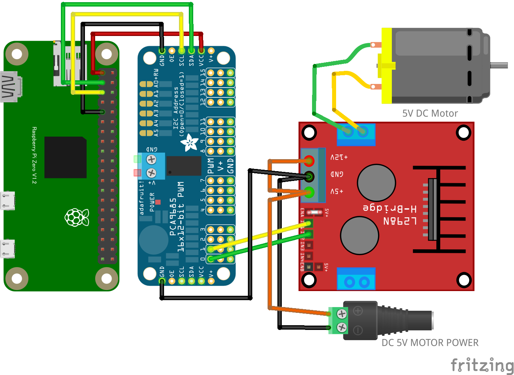

# PCA9685 16 チャンネルPWM ドライバ + HBridgeモーターコントローラ
* PCA9685 16 チャンネルPWM ドライバーとHBridgeモータードライバーで、DCモーターを正転・逆転・速度コントロールします。
* HBridgeコントローラはL298N以外にもL9110S、MX1508等も同様に使用できます。
  * ただし、これらのドライバでは+5Vと+12V端子の代わりに、一個のVCCや電源(+)端子だけのものが多いので、モーター電源はそこに繋げます。

## 配線図

