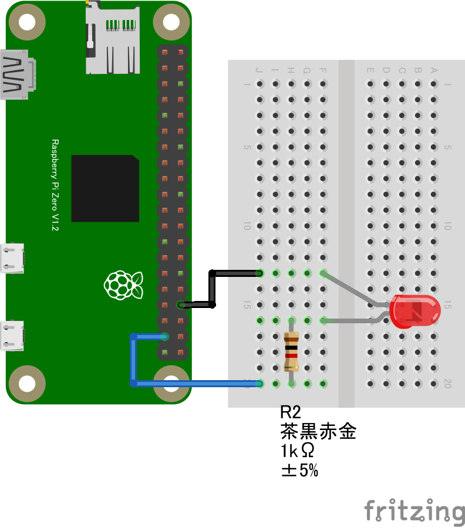
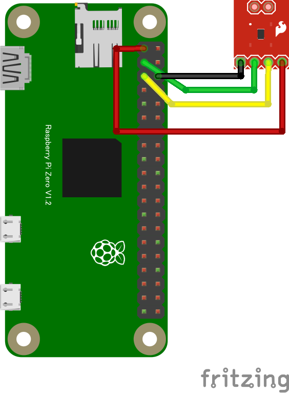

# CHIRIMEN with Node.js / Raspberry Pi Zero W

# 概要

CHIRIMEN with Node.js on Raspberry Pi Zero W を用いたIoT実習資料の Hello Real World編　ドラフトです。

[pizeronodejs.md](pizeronodejs.md)の内容をもとに、Web Serial RPiZero Terminalを使うことで操作を簡単化し、更にプログラム作法をECMA Script Moduleにあわせています。


# 準備

## ステップ０ (PCをWiFiに接続)

* 会場(もしくは開発場所)で提供されているWiFiアクセスポイントにまずは接続してください。

## ステップ１（ターミナル接続）

以下を用意します
* Raspberry Pi Zero W
* [Raspberry Pi OS LiteをUSB Serialで使用可能にしたSDイメージ](https://github.com/kou029w/chirimen-os/releases/)
* ブラウザの載ったパソコン
  * Windows 10 PC
    * ブラウザは標準のEdgeもしくはChromeを使います。
  * Macintosh(多分大丈夫-未確認)
    * ブラウザはChromeが必要です。
* USBケーブル (USB A - MicroB)

* Lチカパーツ類
  * ブレッドボード
  * LED
  * 1KΩ抵抗
  * ジャンパーワイヤ オス-メス 2本

PiZero自体はディスプレイやキーボードを接続する必要はありません。

* [Raspberry Pi OS LiteをUSB Serialで使用可能にしたSDイメージ](https://github.com/kou029w/chirimen-os/releases/)をRaspberry Pi Zeroに差し込みます。
  * 講習会では書き込み済みOSイメージが配布されると思いますが、自分で作る場合は[ここなどを参考に](https://tutorial.chirimen.org/raspi/sdcard)(ただし書き込むべきイメージは違います([これを書き込みます](https://github.com/kou029w/chirimen-os/releases/)))
* PCのUSBとRaspberry Pi ZeroのUSB OTGポートをUSBケーブルでつなぎます
  * PiZero側はつなぐポート要注意　ここに繋ぎます
  
  * PCからのUSB給電でRaspberry Pi Zeroが起動します。
* PCでRaspberry Pi Zeroが認識されたことを確認します (Windows10のデバイスマネージャの例) 
  * 起動してUSBデバイスとして出現するまでにしばらく(数十秒)かかります)
  
* [**こちらのWeb Serial RPiZero TerminalページにPCのブラウザでアクセス**](https://chirimen.org/PiZeroWebSerialConsole/PiZeroWebSerialConsole.html)
 (以降、このウィンドを**ターミナルウィンド**と呼びます)
* ```Connect and Login PiZero```ボタンを押す
  * 接続ダイアログが出現
  
  * 上で認識したデバイス（ポート番号）を接続する
* コンソール(左側の黒い画面の最下部)に以下のコマンドプロンプトが表示されればステップ１完了です。引き続きステップ２に進んでください
  * ```pi@raspberrypi:~$```

## ステップ２ (WiFi設定)

* ターミナルウィンドの```wifi panel```ボタンを押す
  * ウィンドが開き、WiFiアクセスポイントがスキャンされます。ステルスでないものはリストアップされているので、以降の作業の参考にしてください。
* ウィンド下部に、会場(もしくは開発場所)で提供されているWiFiアクセス情報を入力する
  * SSID欄
  * PASS PHRASE欄
* ```SET WiFi```ボタンを押す
* ```Reboot```ボタンを押す
  * これでRaspberry Pi Zeroが再起動をはじめます
* WiFiウィンドを閉じ、ターミナルウィンドに戻る
* ターミナルウィンドの```Close Connection```ボタンを押す
* 30秒ほど待つ（Raspberry Pi Zeroが再起動します
  * ---
* ```Connect and Login PiZero```ボタンを押し接続する
  * 接続ダイアログが出現⇒接続するとこれまで同様コマンドプロンプトが出現
* ```wifi panel```ボタンを再び押す
* ```wifi Info```ボタンを押す
  * 表示された情報をチェックします
  * wlan0: inet xxx.xxx.xxx.xxx　(xxxは数字)のようにIPアドレスが設定されていれば接続成功しています。
  <!--  * あとでping chirimen.org OK も入れよう。-->
  * もしもあなたがsshやscp(winSCP)などのツールに慣れている場合、上記のアドレスでssh接続できます
    * PORT: 22
    * ID: ```pi```
    * PASSWORD: ```raspberry```
  * もしもあなたがlinuxのシェルコンソール画面に慣れている場合は、ターミナルウィンドのコンソールにコマンドをタイプしてそのまま使用することもできます。
  * 確認できたらWiFi Settingウィンドを閉じてください。
* 以上でステップ２完了です。　ステップ3に進んでください。

## ステップ３ (CHIRIMEN環境設定)

* ターミナルウィンドの```CHIRIMEN Panel```ボタンを押す。
* CHIRIMEN Panelウィンドが開いたら、```Setup CHIRIMEN```ボタンを押す。
* ２～３分ほどセットアップ完了するのを待ちます。
  * CHIRIMEN Panelウィンドの進捗メッセージが、CONGRATURATIONS. setup completed!となればセットアップ完了です。
  * Note: ターミナルウィンドのコンソールにはより細かな進捗状況が表示されます。
* ```~/myApp```が今後CHIRIMEN環境でのプログラミングで使用するディレクトリです。
* 以上ですべての初期設定完了です！


# Hello Real World（Lチカを実行する）

## 配線

PiZero とパーツを使って下の図の通りに配線します。




## プログラムを書く

Raspberry Pi に接続した LED を点滅させるプログラムを書きます。

* ターミナルウィンドでRaspberry Pi Zeroに接続します。（ステップ１が完了した状態)
* myAppディレクトリに移動します。
  * コンソールの右側のファイルマネージャでmyApp⇒移動を選ぶ
  * このディレクトリが開発環境が設定されているディレクトリです。
* ```Create New Text```ボタンを押す
* 入力欄に```hello.js```と入力
* ```create```ボタンを押す
* JS Editorウィンドが出現

以下のプログラムをJS Editorに書き写します（コピペ）


```javascript
import {requestGPIOAccess} from "./node_modules/node-web-gpio/dist/index.js";
const sleep = msec => new Promise(resolve => setTimeout(resolve, msec));

async function blink() {
  const gpioAccess = await requestGPIOAccess();
  const port = gpioAccess.ports.get(26);

  await port.export("out");

  for (;;) {
    await port.write(1);
    await sleep(1000);
    await port.write(0);
    await sleep(1000);
  }
}

blink();
```

* 書き終えたら保存します。(CTRL+C、もしくは```Saveボタン```)
* ターミナルウィンドの右側に hello.jsが出来ていることを確認します
* エディタウィンドを閉じます

## 実行する

* ターミナルウィンドのコンソール部(ウィンド左側)のプロンプト(画面一番下)が以下になっていることを確認します
  * ```pi@raspberrypi:~/myApp$```
* コンソール部をクリックして、入力可能状態にしてから、以下の文字を入力します。
* ```node hello.js``` ENTER
* LED が点滅すれば完成です 🎉
* プログラムを止めるには、コンソール部で ```CTRL+C``` を押します。


# いろいろなデバイスのサンプルを試す

色々なデバイスのサンプルが用意されています。まずは、その中から[I2C](https://tutorial.chirimen.org/raspi/section2#:~:text=I2C%20%E3%81%A8%E3%81%AF%202%20%E7%B7%9A,%E3%81%A7%E9%80%9A%E4%BF%A1%E3%82%92%E8%A1%8C%E3%81%84%E3%81%BE%E3%81%99%E3%80%82)センサーのADT7410を試しましょう。

* ターミナルウィンドの```CHIRIMEN Panel```ボタンを押す
* 出現したCHIRIMEN Panelの```Get Examples```ボタンを押す
* ID : adt7410を探します(上から5個目ぐらい)
  * 回路図リンクを押すと回路図が出てきますので、回路を組みます。なお、接続は下の図のようになります。
    
  * ```JS GET```ボタンを押すと、開発ディレクトリ(```~/myApp```)に、サンプルコードが保存されます。
    * **main-adt7410.js**というファイル名で保存されます。
    * ターミナルウィンドの右側のファイルマネージャでmain-adt7410.js⇒編集 を選ぶと、エディタで編集できます。

## I2Cセンサーが認識さていることを確認する
* CHIRIMEN Panelの```i2c detect```ボタンを押すと、**48**が表示されていればうまく接続されています。
<pre>
     0  1  2  3  4  5  6  7  8  9  a  b  c  d  e  f
00:          -- -- -- -- -- -- -- -- -- -- -- -- -- 
10: -- -- -- -- -- -- -- -- -- -- -- -- -- -- -- -- 
20: -- -- -- -- -- -- -- -- -- -- -- -- -- -- -- -- 
30: -- -- -- -- -- -- -- -- -- -- -- -- -- -- -- -- 
40: -- -- -- -- -- -- -- -- 48 -- -- -- -- -- -- -- 
50: -- -- -- -- -- -- -- -- -- -- -- -- -- -- -- -- 
60: -- -- -- -- -- -- -- -- -- -- -- -- -- -- -- -- 
70: -- -- -- -- -- -- -- --                       
</pre>

## 実行する
* ターミナルウィンドのコンソールのプロンプトが```pi@raspberrypi:~/myApp$```となっていることを確認
* ターミナルウィンドのコンソールに、```node main-adt7410.js``` [ENTER] と入力して実行。
* 温度が1秒ごとにコンソールに表示されます。
* 終了は CTRL+C


デバイスを扱うためのパッケージについてさらに知りたい場合は [サンプル一覧](esm-examples/) を参照してください。

また、CHIRIMEN チュートリアルのなかには、Web GPIO や Web I2C によって扱うことのできる[外部デバイスとサンプルコードの一覧があります](https://tutorial.chirimen.org/raspi/partslist)。こちらも参考になるかもしれません。


# CHIRIMEN ブラウザー版との差異

| CHIRIMEN ブラウザー版       | Node.js                                                      |
| --------------------------- | ------------------------------------------------------------ |
| ライブラリ、ドライバーはhtmlで読み込む | jsの中で直接読み込む |
| <pre>```<script src="polyfill.js"></script >```</pre> | <pre>```import {requestGPIOAccess} from "./node_modules/node-web-gpio/dist/index.js";```</pre><br><pre>```import {requestI2CAccess} from "./node_modules/node-web-i2c/index.js";```</pre> |
|  <pre>```<script src="..../adt7410.js"></script >```</pre>   | <pre>```import ADT7410 from "@chirimen/adt7410";```</pre>  |

|   | Sleep関数を宣言する  |
| -- | -- |
|   | <pre>```const sleep = msec => new Promise(resolve => setTimeout(resolve, msec));```</pre> |

# CHIRIMEN環境の任意のディレクトリへのセットアップ

以下の手順で~/myAppディレクトリ以外にも設定できます。

* ```mkdir [自分用の作業ディレクトリ]```  ([mkdir](https://atmarkit.itmedia.co.jp/ait/articles/1606/07/news015.html) コマンドとは)
* ```cd [自分用の作業ディレクトリ]``` ([cd](https://atmarkit.itmedia.co.jp/ait/articles/1712/14/news021.html)コマンドとは)
* ```wget https://tutorial.chirimen.org/pizero/package.json``` ([wget](https://atmarkit.itmedia.co.jp/ait/articles/1606/20/news024.html)コマンドとは)
* ```wget https://tutorial.chirimen.org/pizero/esm-examples/remote_example4/RelayServer.js``` ([RelayServer.js](https://chirimen.org/remote-connection/)を使う場合)
* ```npm install```
