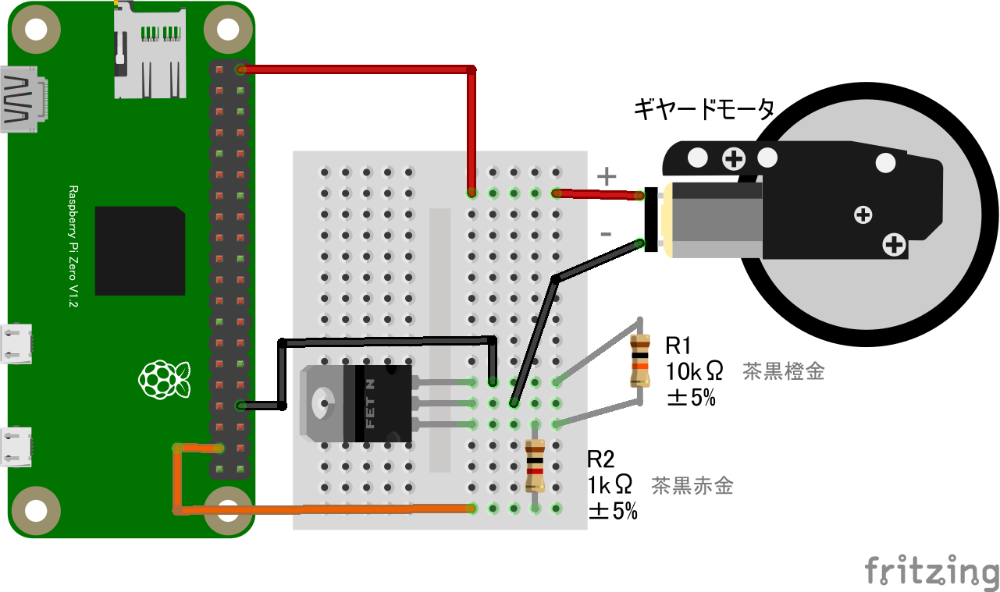
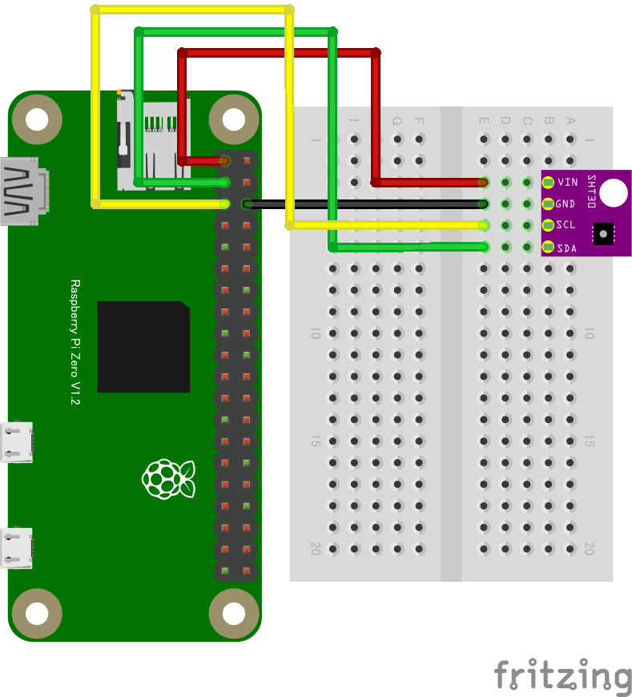

# **CHIRIMEN Raspberry Pi Zero W チュートリアル**

# 概要

CHIRIMEN Raspberry Pi Zero版 を用いたIoT実習資料の Hello Real World編　ドラフトです。

[pizeronodejs.md](pizeronodejs.md)の内容をもとに、Web Serial RPiZero Terminalを使うことで操作を簡単化し、更にプログラム作法をECMA Script Moduleにあわせています。


# 準備

## ステップ０ (物品準備、PCをWiFiに接続)

### 必要な物品リスト

以下を用意します
* Raspberry Pi Zero W
  * [秋月電子](https://akizukidenshi.com/catalog/g/gM-12961/),[スイッチサイエンス](https://www.switch-science.com/catalog/3646/),[マルツ](https://www.marutsu.co.jp/pc/i/1320453/)
* [Raspberry Pi OS LiteをUSB Serialで使用可能にしたSDイメージ](https://github.com/kou029w/chirimen-os/releases/)
  * 講習会では書き込み済みSDが配布されると思いますが、自分で作る場合は[こちら](../raspi/sdcard2)や[こちら](../raspi/sdcard)(書き込むべきイメージはLite版の方です。([これを書き込みます](https://github.com/kou029w/chirimen-os/releases/)))
* ブラウザの載ったパソコン
  * Windows 10 PC
    * ブラウザは標準のEdgeもしくはChromeを使います。
  * Macintosh(多分大丈夫-未確認)
    * ブラウザはChromeが必要です。
  * いずれもUSBとWiFiが使える必要があります。
* USBケーブル (USB A - MicroB)
* Lチカ用パーツ
  * ブレッドボード
  * LED
  * 1KΩ抵抗
  * ジャンパーワイヤ オス-メス 2本
* GPIO入力実験用追加パーツ
  * タクトスイッチ
* モーター制御用追加パーツ
  * 10KΩ抵抗
  * MOSFET
  * ちびギヤモーター
* 温度センシング実験用追加パーツ
  * [ADT7410モジュール](https://akizukidenshi.com/catalog/g/gM-06675/)　もしくは [SHT30モジュール](https://www.amazon.co.jp/dp/B083NHJSL9/)
  * ジャンパーワイヤ オス-メス 2本


PiZero自体はディスプレイやキーボードを接続する必要はありません。

### PCをWiFiに接続
* 会場(もしくは開発場所)で提供されているWiFiアクセスポイントにまずはPCを接続してください。

## ステップ１（ターミナル接続）

* [Raspberry Pi OS LiteをUSB Serialで使用可能にしたイメージ](https://github.com/kou029w/chirimen-os/releases/)を書き込んだSDカードをRaspberry Pi Zeroに差し込みます。
* PCのUSBとRaspberry Pi ZeroのUSB OTGポートをUSBケーブルでつなぎます
  * PiZero側はつなぐポート要注意　ここに繋ぎます
  
  * PCからのUSB給電でRaspberry Pi Zeroが起動します。
* PCでRaspberry Pi Zeroが認識されたことを確認します ([Windows10のデバイスマネージャ](https://askpc.panasonic.co.jp/beginner/guide/ten07/7013.html)の例) 
  * 給電後USBデバイスとして出現するまでにしばらく(数十秒)かかります)
  * Windowsの場合、ポートの番号(COMnのnの部分)は環境ごとに異なります
  
* [**こちらのWeb Serial RPiZero TerminalページにPCのブラウザでアクセス**](https://chirimen.org/PiZeroWebSerialConsole/PiZeroWebSerialConsole.html)
 (以降、このウィンドを**ターミナルウィンド**と呼びます)
* ```Connect and Login PiZero```ボタンを押す
  * 接続ダイアログが出現
  
  * 上で認識したデバイス（ポート番号）を接続する
* コンソール(左側の黒い画面の最下部)に以下のコマンドプロンプトが表示されればステップ１完了です。引き続きステップ２に進んでください
  * ```pi@raspberrypi:~$```

### Note:

* CHIRIMEN with Node.jsではRaspberry Pi OS(Linux)をコマンドラインインターフェース(CLI)・シェル(bash)で操作します。
  * ただしこの講習で使うコマンドはごくわずかです。
    * **node** コマンド(後述)
    * [CTRL+C](https://atmarkit.itmedia.co.jp/ait/articles/1708/04/news015_2.html)(CTRLキーとCを同時に押す:実行中のコマンドを終了させる))
  * その他のほとんどの操作（コマンド）は、ターミナルウィンドやそこから起動される別画面のGUIがコマンド操作を代行しています。GUIを操作するとコンソールにコマンドが入力されるのがわかると思います。
* [CLIとは](https://atmarkit.itmedia.co.jp/ait/articles/1602/19/news025.html)
* [シェルとコマンドプロンプト](https://atmarkit.itmedia.co.jp/ait/articles/1603/02/news016.html)
* もしもあなたがlinuxのシェルコンソール画面に慣れている場合は、ターミナルウィンドのコンソールにその他のシェル(bash)コマンドをタイプして使用することもできます。
* ターミナルウィンドの概要


## ステップ２ (WiFi設定)

* ターミナルウィンドの```wifi panel```ボタンを押す
  * ウィンドが開き、WiFiアクセスポイントがスキャンされます。ステルスでないものはリストアップされているので、以降の作業の参考にしてください。
  * Raspberry Pi Zero Wは2.4GHz帯のWiFiにのみ対応しています。
    
* ウィンド下部に、会場(もしくは開発場所)で提供されているWiFiアクセス情報を入力する
  * SSID欄
  * PASS PHRASE欄
* ```SET WiFi```ボタンを押す
* ```Reboot```ボタンを押す
  * これでRaspberry Pi Zeroが再起動をはじめます
* WiFiウィンドを閉じ、ターミナルウィンドに戻る
* ターミナルウィンドの```Close Connection```ボタンを押す
* 30秒ほど待つ（Raspberry Pi Zeroが再起動します)
  * ---
* ```Connect and Login PiZero```ボタンを押し接続する
  * 接続ダイアログが出現⇒接続するとこれまで同様コマンドプロンプトが出現
* ```wifi panel```ボタンを再び押す
* ```wifi Info```ボタンを押す
  * 表示された情報をチェックします
  * wlan0: inet xxx.xxx.xxx.xxx　(xxxは数字)のようにIPアドレスが設定されていれば接続成功しています。


  <!--  * あとでping chirimen.org OK も入れよう。-->
  * もしもあなたがsshやscp(winSCP)などのツールに慣れている場合、上記のアドレスでssh接続できます
    * PORT: 22
    * ID: ```pi```
    * PASSWORD: ```raspberry```
  * 確認できたらWiFi Settingウィンドを閉じてください。
* 以上でステップ２完了です。　ステップ3に進んでください。

## ステップ３ (CHIRIMEN環境設定)

* ターミナルウィンドの```CHIRIMEN Panel```ボタンを押す。
* CHIRIMEN Panelウィンドが開いたら、```Setup CHIRIMEN```ボタンを押す。
* ２～３分ほどセットアップ完了するのを待ちます。
  * CHIRIMEN Panelウィンドの進捗メッセージが、CONGRATURATIONS. setup completed!となればセットアップ完了です。
  * Note: ターミナルウィンドのコンソールにはより細かな進捗状況が表示されます。
* ```~/myApp```が今後CHIRIMEN環境でのプログラミングで使用するディレクトリです。
* 以上ですべての初期設定完了です！


# Hello Real World（[Lチカ](../chirimenGeneric/#l-)を実行する）

## 配線

PiZero とパーツを使って下の図の通りに配線します。
* [LEDの極性に注意！](https://tutorial.chirimen.org/raspi/hellorealworld#section-1)
  * [LEDの説明](../chirimenGeneric/#led)
* [ブレッドボードの使い方](../chirimenGeneric/#section-1)
* [抵抗値の読み方](../chirimenGeneric/#section-2)
* [その他、配線の基礎知識](https://tutorial.chirimen.org/reference#section-1)


## プログラムを書く

Raspberry Pi に接続した LED を点滅させるプログラムを書きます。

* ターミナルウィンドでRaspberry Pi Zeroに接続します。（ステップ１が完了した状態)
* myAppディレクトリに移動します。
  * コンソールの右側のファイルマネージャでmyApp⇒移動を選ぶ
  * このディレクトリが開発環境が設定されているディレクトリです。
* ```Create New Text```ボタンを押す
* 入力欄に```hello.js```と入力
* ```create```ボタンを押す
* JS Editorウィンドが出現

以下のプログラムをJS Editorに書き写します（コピペ）


```javascript
import {requestGPIOAccess} from "./node_modules/node-web-gpio/dist/index.js"; // WebGPIO を使えるようにするためのライブラリをインポート
const sleep = msec => new Promise(resolve => setTimeout(resolve, msec)); // sleep 関数を定義

async function blink() {
  const gpioAccess = await requestGPIOAccess(); // GPIO を操作する 
  const port = gpioAccess.ports.get(26); // 26 番ポートを操作する

  await port.export("out"); // ポートを出力モードに設定

  // 無限ループ
  for (;;) {
    // 1秒間隔で LED が点滅します
    await port.write(1); // LEDを点灯
    await sleep(1000);   // 1000 ms (1秒) 待機
    await port.write(0); // LEDを消灯
    await sleep(1000);   // 1000 ms (1秒) 待機
  }
}

blink();
```

* 書き終えたら保存します。(```Saveボタン```もしくはCTRL+S)
* ターミナルウィンドの右側(ファイルマネージャ)に hello.jsが出現していることを確認します
* エディタウィンドを閉じます

## 実行する

* ターミナルウィンドのコンソール部(ウィンド左側)のプロンプト(画面一番下)が以下になっていることを確認します
  * ```pi@raspberrypi:~/myApp$```
* コンソール部をクリックして、入力可能状態にしてから、以下の文字を入力します。
* ```node hello.js``` ENTER
  * **node** はjavascriptのコードを実行する[インタープリタ](https://ja.wikipedia.org/wiki/%E3%82%A4%E3%83%B3%E3%82%BF%E3%83%97%E3%83%AA%E3%82%BF)
  * [nodeコマンドについて](https://atmarkit.itmedia.co.jp/ait/articles/1102/28/news105.html)
* LED が点滅すれば完成です 🎉
* プログラムを止めるには、コンソール部で ```CTRL+C``` を押します。

# Raspberry Pi について

* 教育・学習用として設計されたボードコンピュータ
  * ボードコンピュータ～PC・スマホとの違い
* Linuxが動作するボードコンピュータとして、安価でとても高いシェアを持ち世界中で容易に入手できる

## Raspberry Pi Zeroのピン配列

GPIO, 電源, GND, I2C信号線などのピン配列を記載します。
* 白い文字で書かれたピンだけが使えます
* GND、3.3V、5Vはそれぞれ電源とグランドです
* 数字 + PD||PUと書かれているピンはGPIO端子(詳細は次章)
  * PD:プルダウン, PU:プルアップ
* SCL, SDAはI2Cインターフェースのピンです(詳細は次章)


# CHIRIMEN について

* Web技術（Web Browserで使われている技術）を使って、フィジカルコンピューティング、IoTの学習・プロトタイピングができる、開発環境。
  * フィジカルコンピューティングとは？
  * IoTとは？
* 特徴：広く使われている標準技術のなかで学習できるので
  * 学習のハードルが低い
  * 得たスキルが広く長く役立つ
  * インターネットでノウハウを検索しやすい

## CHIRIMEN Raspberry Pi Zero版について

* PiZero上ではWeb Browserを動かさない。
* Node.jsというJava Scriptインタープリターだけが動く
  * ブラウザの機能のうち一部だけがPiZero上で使える
    * プログラミング言語 ～ Java Script
    * 画面表示やGUIに関わらないAPI
    * 通信プロトコル
  * 使えないのはブラウザを使った画面表示やGUI

* ブラウザを使った画面やGUIは
  * ネットを介してスマホやPC上で ⇒ これが代表的にIoTと呼ばれるデザインパターン
  * Raspberry Pi Zeroは、IoTエッジデバイスとして動作

# JavaScript の基礎

* [こちらを参照してください](../chirimenGeneric/#javascript-)
* [非同期処理 async/await](../chirimenGeneric/#section-3)を多用します。

# いろいろなデバイスを試す

色々な[デバイスのサンプル](esm-examples/)が用意されています。これらを用いてデバイスの制御方法を学んでいきましょう。

# GPIOを試す

## GPIOを理解する
* [GPIOとは？](../chirimenGeneric/#gpio)

## GPIO出力

GPIOの出力はLチカで実験済みですね。そこで今回はモーターを動かしてみましょう。回路図は以下のようになります。


コードはLチカと全く同じです。

### コードを読む
* 前提：CHIRIMEN Rasoberryu Pi ZeroはNode.jsをプログラム実行環境（インタープリタ）として使っています。
  * [Node.jsについて](../chirimenGeneric/#nodejs-chirimen-raspberry-pi-zero)
* ターミナルウィンドの右側のファイルマネージャでhello.js⇒表示 を選び、ソースコードを読んでみましょう
* WebGPIOライブラリを読み込み ([javascript Module](../chirimenGeneric/#javascript-module-ecma-script-module)仕様に従って)

　`import {requestGPIOAccess} from "./node_modules/node-web-gpio/dist/index.js";`
  * [javascript module](../chirimenGeneric/#javascript-module-ecma-script-module) に基づいてWebGPIOライブラリを読み込みます。これでWeb GPIO APIが使えるようになりました。
* [GPIOポートの初期化処理](../chirimenGeneric/#gpio-2)
* [GPIOPortの出力処理](../chirimenGeneric/#gpioport-)

## GPIO入力
GPIO端子の**入力が変化したら関数を実行**という機能によってGPIOの入力を使います。

* ターミナルウィンドの```CHIRIMEN Panel```ボタンを押す
* 出現したCHIRIMEN Panelの```Get Examples```ボタンを押す
* ID : **gpio-onchange**を探します
* 回路図リンクを押すと回路図が出てきますので、回路を組みます。

* ```JS GET```ボタンを押すと、開発ディレクトリ(```~/myApp```)に、サンプルコードが保存されます。
  * **main-gpio-onchange.js**というファイル名で保存されます。
  * ターミナルウィンドの右側のファイルマネージャでmain-gpio-onchange.js⇒編集 を選びます。
    * ソースコードを見てみましょう
    * 今回は編集不要ですが、サンプルをベースに応用プログラムを作るときには編集しましょう。

* 実行する
  * ターミナルウィンドのコンソールのプロンプトが```pi@raspberrypi:~/myApp$```となっていることを確認
  * ターミナルウィンドのコンソールに、```node main-gpio-onchange.js``` [ENTER] と入力して実行。
  * タクトスイッチを押してみます。
  * タクトスイッチが押されるたびにコンソール画面に**0**(押された状態)、**1**(離した状態)が交互に表示されます。
    * Note: GPIOポート5は、Pull-Up(開放状態でHighレベル)です。そのため離した状態で１が出力されます。スイッチを押すとポートがGNDと接続され、Lowレベルになり、0が出力されます。
* 終了は CTRL+C

### コードを読む
* ターミナルウィンドの右側のファイルマネージャでmain-gpio-onchange.js⇒表示 を選び、ソースコードを読んでみましょう
* WebGPIOライブラリを読み込み

　`import {requestGPIOAccess} from "./node_modules/node-web-gpio/dist/index.js";`
  * [javascript module](../chirimenGeneric/#javascript-module-ecma-script-module) に基づいてWebGPIOライブラリを読み込みます。これでWeb GPIO APIが使えるようになりました。
* [GPIOポートの初期化処理を行う](../chirimenGeneric/#gpio-2)
* [onchangeによる入力処理](../chirimenGeneric/#onchange)

## GPIO入力(ポーリング)
入力ではイベントの他にポーリングというテクニックが広く使われます。（次章のI2Cデバイスからの入力では専らポーリング）

* ターミナルウィンドの```CHIRIMEN Panel```ボタンを押す
* 出現したCHIRIMEN Panelの```Get Examples```ボタンを押す
* ID : **gpio-polling**を探します
* 回路は前章と同じなのでそのままにしておきます。
* ```JS GET```ボタンを押すと、開発ディレクトリ(```~/myApp```)に、サンプルコードが保存されます。
  * **main-gpio-polling.js**というファイル名で保存されます。
  * ターミナルウィンドの右側のファイルマネージャでmain-gpio-polling.js⇒編集 を選びソースコードを見てみましょう

* 実行する
  * プロンプトが```pi@raspberrypi:~/myApp$```となっていることを確認
  * コンソールに、```node main-gpio-polling.js``` [ENTER] と入力して実行。
  * 0.3秒おきにポート5の値がコンソールに表示されていきます。
  * タクトスイッチを押してみます。
  * タクトスイッチが押されると、**0**に変化します。
* 終了は CTRL+C

### コードを読む
* ターミナルウィンドの右側のファイルマネージャでmain-gpio-polling.js⇒表示 を選び、ソースコードを読んでみましょう
* WebGPIOライブラリを読み込み

　`import {requestGPIOAccess} from "./node_modules/node-web-gpio/dist/index.js";`
  * [javascript module](../chirimenGeneric/#javascript-module-ecma-script-module) に基づいてWebGPIOライブラリを読み込みます。これでWeb GPIO APIが使えるようになりました。
* [GPIOポートの初期化処理を行う](../chirimenGeneric/#gpio-2)
* [単純入力＋ポーリングによる入力処理](../chirimenGeneric/#section-6)


# I2Cデバイスを試す

## I2Cを理解する

* [I2Cとは？](../chirimenGeneric/#i2c)

## SHT30編
SHT30は温度に加えて湿度も測定できるI2C接続の多機能センサーです。SHT31もほぼ同等に使えます。(SHT31のほうが精度が高い)
* [SHT30/SHT31について](../chirimenGeneric/#i2ci2c--sht30-sht31)

* ターミナルウィンドの```CHIRIMEN Panel```ボタンを押す
* 出現したCHIRIMEN Panelの```Get Examples```ボタンを押す
* ID : sht30を探します
* 回路図リンクを押すと回路図が出てきますので、回路を組みます。なお、接続は下の図のようになります。


* ```JS GET```ボタンを押すと、開発ディレクトリ(```~/myApp```)に、サンプルコードが保存されます。
  * **main-sht30.js**というファイル名で保存されます。
  * Note: ターミナルウィンドの右側のファイルマネージャでmain-sht30.js⇒編集 を選ぶと、エディタで編集できます。
    * ソースコードを見てみましょう
    * 今は編集不要ですが、サンプルをベースに応用プログラムを作るときには編集しましょう。

### I2Cセンサー(SHT30)が認識さていることを確認する

* CHIRIMEN Panelの```i2c detect```ボタンを押すと、[SHT30のI2Cアドレス](https://strawberry-linux.com/pub/Sensirion_Humidity_SHT3x_DIS_Datasheet_V3_J.pdf)　0x**44**が表示されていればうまく接続されています。
  * [ic2 detectとは](../chirimenGeneric/#b-i2cdetect)
<pre>
     0  1  2  3  4  5  6  7  8  9  a  b  c  d  e  f
00:          -- -- -- -- -- -- -- -- -- -- -- -- -- 
10: -- -- -- -- -- -- -- -- -- -- -- -- -- -- -- -- 
20: -- -- -- -- -- -- -- -- -- -- -- -- -- -- -- -- 
30: -- -- -- -- -- -- -- -- -- -- -- -- -- -- -- -- 
40: -- -- -- -- 44 -- -- -- -- -- -- -- -- -- -- -- 
50: -- -- -- -- -- -- -- -- -- -- -- -- -- -- -- -- 
60: -- -- -- -- -- -- -- -- -- -- -- -- -- -- -- -- 
70: -- -- -- -- -- -- -- --                       
</pre>

### 実行する
* ターミナルウィンドのコンソールのプロンプトが```pi@raspberrypi:~/myApp$```となっていることを確認
* ターミナルウィンドのコンソールに、```node main-sht30.js``` [ENTER] と入力して実行。
* 温度と湿度が1秒ごとにコンソールに表示されます。
* 終了は CTRL+C

### コードを読む
* ターミナルウィンドの右側のファイルマネージャでmain-sht30.js⇒表示 を選び、ソースコードを読んでみましょう
* [WebI2CライブラリとSHT30デバイスドライバを読み込み](../chirimenGeneric/#webi2c)

　`import {requestI2CAccess} from "./node_modules/node-web-i2c/index.js";`
  `import SHT30 from "@chirimen/sht30";`
  * [javascript module](../chirimenGeneric/#javascript-module-ecma-script-module) に基づいてWebI2Cライブラリを読み込みます。
* [I2C 温湿度センサー (SHT30, SHT31)の初期化と使用](../chirimenGeneric/#i2c--sht30-sht31)


## ADT7410編

まずは、その中からI2CセンサーのADT7410を試しましょう。(SHT30(orSHT31)は次章を参照)

* ターミナルウィンドの```CHIRIMEN Panel```ボタンを押す
* 出現したCHIRIMEN Panelの```Get Examples```ボタンを押す
* ID : adt7410を探します(上から5個目ぐらい)
* 回路図リンクを押すと回路図が出てきますので、回路を組みます。なお、接続は下の図のようになります。
  * [センサーの極性に注意！](https://tutorial.chirimen.org/raspi/hellorealworld#section-2)


* ```JS GET```ボタンを押すと、開発ディレクトリ(```~/myApp```)に、サンプルコードが保存されます。
  * **main-adt7410.js**というファイル名で保存されます。
  * Note: ターミナルウィンドの右側のファイルマネージャでmain-adt7410.js⇒編集 を選ぶと、エディタで編集できます。
    * ソースコードを見てみましょう
    * 今は編集不要ですが、サンプルをベースに応用プログラムを作るときには編集しましょう。

### I2Cセンサーが認識さていることを確認する

* CHIRIMEN Panelの```i2c detect```ボタンを押すと、[ADT7410のI2Cアドレス](https://akizukidenshi.com/download/ds/akizuki/AE-ADT7410_aw.pdf)　0x**48**が表示されていればうまく接続されています。
  * [ic2 detectとは](https://tutorial.chirimen.org/ty51822r3/i2cdetect)
<pre>
     0  1  2  3  4  5  6  7  8  9  a  b  c  d  e  f
00:          -- -- -- -- -- -- -- -- -- -- -- -- -- 
10: -- -- -- -- -- -- -- -- -- -- -- -- -- -- -- -- 
20: -- -- -- -- -- -- -- -- -- -- -- -- -- -- -- -- 
30: -- -- -- -- -- -- -- -- -- -- -- -- -- -- -- -- 
40: -- -- -- -- -- -- -- -- 48 -- -- -- -- -- -- -- 
50: -- -- -- -- -- -- -- -- -- -- -- -- -- -- -- -- 
60: -- -- -- -- -- -- -- -- -- -- -- -- -- -- -- -- 
70: -- -- -- -- -- -- -- --                       
</pre>

### 実行する
* ターミナルウィンドのコンソールのプロンプトが```pi@raspberrypi:~/myApp$```となっていることを確認
* ターミナルウィンドのコンソールに、```node main-adt7410.js``` [ENTER] と入力して実行。
* 温度が1秒ごとにコンソールに表示されます。
* 終了は CTRL+C


# IoTを試す

## 遠隔LEDコントロール

IoTは、制御されるデバイス（上図ではCHIRIMEN PiZeroW)と、利用者端末（上図ではWebApp PC-side）に加えて、これらの間でデータを中継するサーバ（クラウド）が必要になります。
今回はWeb標準技術であるWebSocketプロトコルを中継するサーバを用いてLEDを備えたCHIRIMENデバイスとスマホやPCのWebAppを繋いだIoTシステムを作ります。
### [IoT](../chirimenGeneric/#iot)
### [WebSoeketとRelayServer](../chirimenGeneric/#websocketpubsub-services)

### 配線する
配線は最初のLチカそのままです。


### CHIRIMENデバイス側にコードを入れ、実行する

* ターミナルウィンドの```CHIRIMEN Panel```ボタンを押す
* 出現したCHIRIMEN Panelの```Get Examples```ボタンを押す
* ID : **remote_gpio_led**の行を探します（もう一度この行の情報を使います）
* ```JS GET```ボタンを押すと、開発ディレクトリ(```~/myApp```)に、サンプルコードが保存されます。
  * **main-remote_gpio_led.js**というファイル名で保存されます。
  * ターミナルウィンドの右側のファイルマネージャでmain-remote_gpio_led.js⇒編集 を選びソースコードを見てみましょう

* 実行する
  * ターミナルウィンドのコンソールのプロンプトが```pi@raspberrypi:~/myApp$```となっていることを確認
  * ターミナルウィンドのコンソールに、```node main-remote_gpio_led.js``` [ENTER] と入力して実行。

  * なお、実験が終わったら終了は CTRL+C です。

### PC側のコードを準備し、実行する
* CHIRIMEN Panelに戻り、ID : **remote_gpio_led**の行にある、```CSB EDIT```リンクをクリックする。
  * CodeSandboxというオンラインのWebApp開発環境のウィンドが開き、PC側のコードが表示されています。編集もできます。
  * また、右側（もしくは右下）のフレームにはLEDを遠隔コントロールするためのwebAppが既に実行されています。
  * webAppを使ってLEDが制御できることを確かめてみましょう。


### コードを読む
#### Raspberry Pi Zero側コード
* ターミナルウィンドの右側のファイルマネージャでmain-remote_gpio_led.js⇒表示 を選び、ソースコードを読んでみましょう
* これまで通りWebGPIOライブラリの読み込み
* [relayServer.js](../chirimenGeneric/#relayserverjs)を使って、PCからの操作指示を受信
  * [初期化](../chirimenGeneric/#section-16)
  * [受信処理](../chirimenGeneric/#section-18)(コールバック関数の設定)
* 受信した内容をもとに[GPIO出力を操作](../chirimenGeneric/#gpioport-)してLEDを点灯・消灯

#### PC側コード
* CodeSandboxで開いているPC.jsを見てみましょう
* [javascript Module](../chirimenGeneric/#javascript-module-ecma-script-module)仕様に基づいてrelayServer.jsを読み込み
* [relayServer.js](../chirimenGeneric/#relayserverjs)を使い、UIを通してユーザからの操作指示を送信
  * [初期化](../chirimenGeneric/#section-16)
  * [送信処理](../chirimenGeneric/#section-17)～(UI(ボタン)に設置したコールバック関数をもとに送信

# 他のいろいろなデバイスを試してみる

* ターミナルウィンドの```CHIRIMEN Panel```ボタン⇒CHIRIMEN Panelの```Get Examples```ボタンで出現するリストのデバイスがすぐ試せます。
* **REMOTE Examples**については次の章に進んでから試しましょう。
* このリストの直リンクは[こちら(サンプル一覧)](esm-examples/)です。CHIRIMEN RPiZeroをPCにつないでいないときはこちらを眺めてください。

また、こちらには、Web GPIO や Web I2C によって扱うことのできる[外部デバイスの写真や様々なCHIRIMEN環境のサンプルコードの一覧があります](https://tutorial.chirimen.org/raspi/partslist)。こちらも参考になるかもしれません。(CHIRIMENは[Raspberry Pi ZeroW以外に、Raspberry Pi 3,4や、micro:bit等](../)でも使用できます）


# CHIRIMEN ブラウザー版との差異

| CHIRIMEN ブラウザー版       | Node.js                                                      |
| --------------------------- | ------------------------------------------------------------ |
| ライブラリ、ドライバーはhtmlで読み込む | jsの中で直接読み込む |
| <pre>```<script src="polyfill.js"></script >```</pre> | <pre>```import {requestGPIOAccess} from "./node_modules/node-web-gpio/dist/index.js";```</pre><br><pre>```import {requestI2CAccess} from "./node_modules/node-web-i2c/index.js";```</pre> |
|  <pre>```<script src="..../adt7410.js"></script >```</pre>   | <pre>```import ADT7410 from "@chirimen/adt7410";```</pre>  |

|   | Sleep関数を宣言する  |
| -- | -- |
|   | <pre>```const sleep = msec => new Promise(resolve => setTimeout(resolve, msec));```</pre> |

# CHIRIMEN環境の任意のディレクトリへのセットアップ

以下のコマンド手順で~/myAppディレクトリ以外にも設定できます。

* ```mkdir [自分用の作業ディレクトリ]```  ([mkdir](https://atmarkit.itmedia.co.jp/ait/articles/1606/07/news015.html) コマンドとは)
* ```cd [自分用の作業ディレクトリ]``` ([cd](https://atmarkit.itmedia.co.jp/ait/articles/1712/14/news021.html)コマンドとは)
* ```wget https://tutorial.chirimen.org/pizero/package.json``` ([wget](https://atmarkit.itmedia.co.jp/ait/articles/1606/20/news024.html)コマンドとは)
* ```wget https://chirimen.org/remote-connection/js/beta/RelayServer.js``` ([RelayServer.js](https://chirimen.org/remote-connection/)を使う場合)
* ```npm install``` ([npm](https://atmarkit.itmedia.co.jp/ait/articles/1606/17/news030.html)とは)
