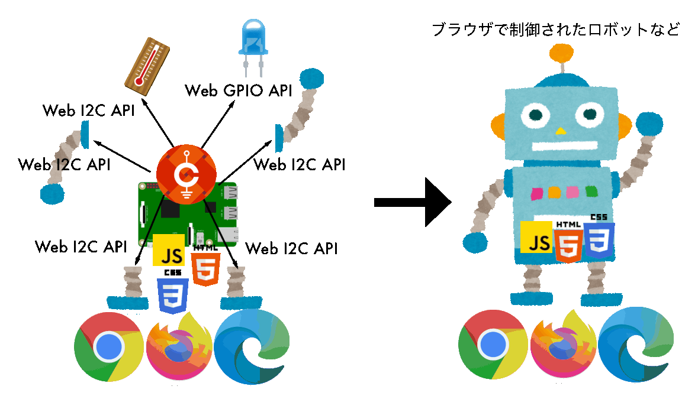

# 1.1 CHIRIMEN について

CHIRIMEN とは、Webの標準的な技術・ブラウザやNode.js等で実行できるJavaScript で電子パーツを制御し、<a href="https://www.iizuka.kyutech.ac.jp/faculty/physicalcomputing" target="_blank" rel="noopener noreferrer">フィジカルコンピューティング</a>や <a href="https://tutorial.chirimen.org/chirimenGeneric/#iot" target="_blank" rel="noopener noreferrer">IoTシステム</a>を開発可能なプロトタイピング環境です。

デジタルのソフトとフィジカルなハードをWWW上で連携するデバイスを Web標準技術、JavaScript だけで容易に実現できます。

* [さらに詳細に知りたい方はこちらを参照ください](https://tutorial.chirimen.org/about.html)

## CHIRIMEN Raspberry Pi Zero版について

* PiZero上ではWeb Browserを動かさない。
* Node.jsというJavaScriptインタープリターだけが動く
  * ブラウザの機能のうち一部だけがPiZero上で使える
    * プログラミング言語 ～ JavaScript
    * 画面表示やGUIに関わらないAPI
    * 通信プロトコル
  * 使えないのはブラウザを使った画面表示やGUI
* ブラウザを使った画面やGUIは
  * ネットを介してスマホやPCからコントロール ⇒ これが代表的にIoTと呼ばれるデザインパターン
    * このとき、Raspberry Pi Zeroは、IoTエッジデバイスとして動作