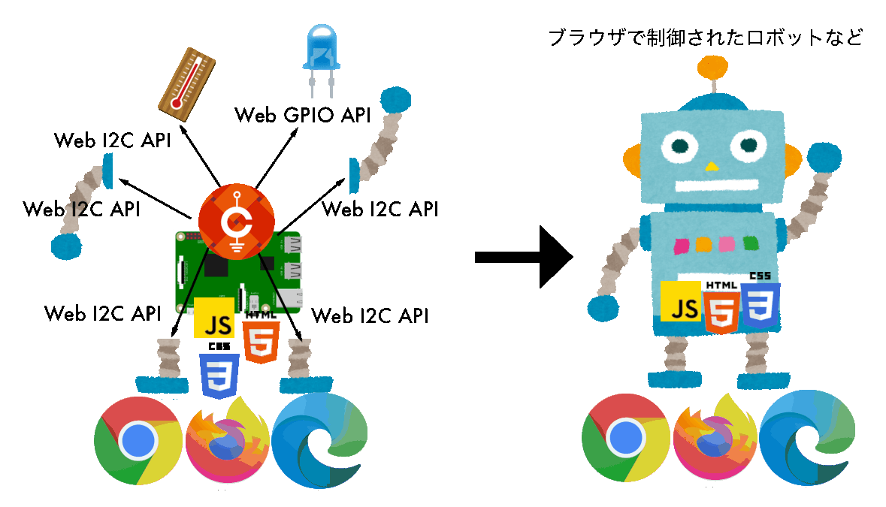

# 1.1 CHIRIMEN について

電子パーツをプログラムで制御するには、C言語やPython向けの専用SDK、あるいはボードごとに異なる開発環境を新しく覚える必要がある、と身構えている人は少なくないでしょう。CHIRIMEN は、その手間を要求しません。Webの標準技術、つまりブラウザやNode.js等で実行できるJavaScriptだけで電子パーツを制御し、<a href="https://www.iizuka.kyutech.ac.jp/faculty/physicalcomputing" target="_blank" rel="noopener noreferrer">フィジカルコンピューティング</a>や<a href="https://tutorial.chirimen.org/chirimenGeneric/#iot" target="_blank" rel="noopener noreferrer">IoTシステム</a>を開発できるプロトタイピング環境、それがCHIRIMENです。

デジタルのソフトとフィジカルなハードをWWW上で連携させる仕組みをWeb標準技術とJavaScriptだけで容易に実現できます。

- [さらに詳細に知りたい方はこちらを参照ください](https://tutorial.chirimen.org/about.html)

## CHIRIMEN Raspberry Pi Zero版について

PiZero上で動くのは、Node.jsというJavaScriptインタープリターです。

次の機能はWebブラウザと同じです。

- プログラミング言語 ～ JavaScript
- 画面表示やGUIに関わらないAPI
- 通信プロトコル

では、Webブラウザを使った画面やGUIはどうするのか。インターネットを介してスマホやPCからコントロールします。これがIoTの代表的な設計パターンです。
このとき、Raspberry Pi Zeroは、IoTエッジデバイスとして動作します。
