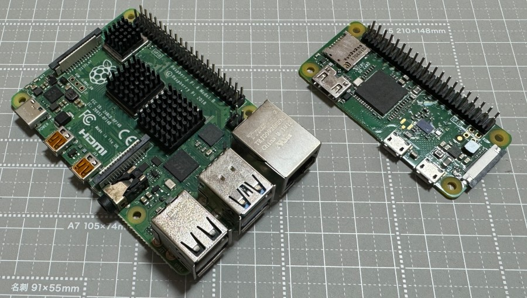

# 1.2 Raspberry Pi について

* 教育・学習用として設計されたシングルボードコンピュータ
  * [シングルボードコンピュータ～PC・スマホとの違い](https://elchika.com/dic/%E3%82%B7%E3%83%B3%E3%82%B0%E3%83%AB%E3%83%9C%E3%83%BC%E3%83%89%E3%82%B3%E3%83%B3%E3%83%94%E3%83%A5%E3%83%BC%E3%82%BF/)
* Linuxが動作するシングルボードコンピュータとして、安価でとても高いシェアを持ち世界中で容易に入手できる
* 今回使用する Raspberry Pi Zero WH は、その中でも特に安価 ([3,000円程度](https://www.switch-science.com/catalog/3646/))で小型・低消費電力の機種、HDMI 出力はあるもののブラウザを動かすだけの処理能力がありませんが、IoT のエッジデバイス（センサーやアクチュエータが載ったデバイスでディスプレイはあるとしても簡易のもの）には適しています。
  * フルセットのブラウザが内蔵されたデバイスを作りたい場合は[CHIRIMEN Raspberry Pi版](../raspi/)が使用できます。
  * インターネットを経由してPCやスマホのブラウザから遠隔操作するシステムは　この Pi Zero W 版でつくれます。[IoTの章](#iot)まで進めましょう。
* 同じサイズの上位機種として、[Raspberry Pi Zero 2 W](https://www.switch-science.com/products/7600) も発売されました。こちらも CHIRIMEN は対応しており、より性能を必要とする開発も可能になりました。