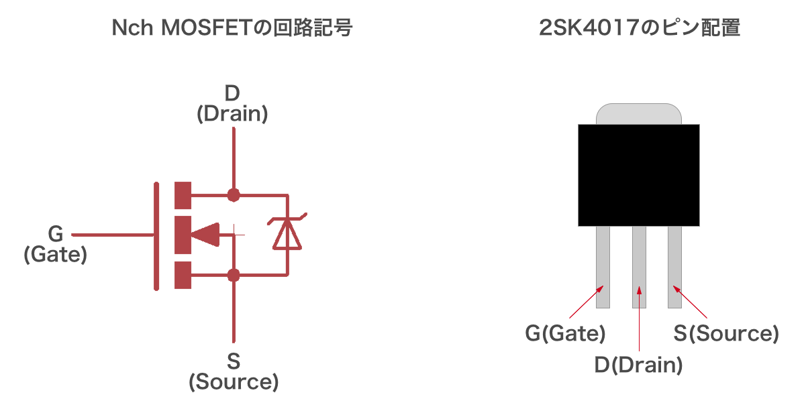
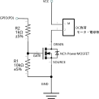

# 11.2.4 MOSFETによる大電力制御
## GPIO の制約事項

LEDが数個ならそのままGPIOにつないで問題なく光る、という体験をすると、モーターも同じように動かせるはずだと思い込みたくなります。実際には、Raspberry Pi の GPIO ポートには、全体で流せる電流の上限が決められています。

- [合計 50mA](https://elinux.org/RPi_Low-level_peripherals#Power_pins)
- 3.3 V

小さな LED 数個であればこの条件内に収まりますが、モーターやソレノイド、パワー LED など電流を多く消費するデバイスは、直接接続して使うことができません。

## MOSFET とは

電流を多く必要とするデバイスを動かすには、GPIOのわずかな電流で、別の大きな電流をオンオフする仕組みが要ります。それを担うのが[MOSFET](https://ja.wikipedia.org/wiki/MOSFET)です。[電界効果トランジスタ (FET)](https://ja.wikipedia.org/wiki/%E9%9B%BB%E7%95%8C%E5%8A%B9%E6%9E%9C%E3%83%88%E3%83%A9%E3%83%B3%E3%82%B8%E3%82%B9%E3%82%BF) の一種で、主にスイッチング素子として利用される部品です。小さな電圧の変更で、大きな電流や電圧のオンオフを切り替えられます。

今回は Nch MOSFET「[2SK4017](http://akizukidenshi.com/catalog/g/gI-07597/)」を利用します。

プルダウンの GPIO ポートを使った典型的な回路は、以下のようになります。

## 電源

回路図の GND 端子は、Raspberry Pi と DC 負荷用電源とで共通です。ここだけを見ると、VCC 端子も Raspberry Pi の 3.3V や 5V 端子から取れそうに思えます。ですが、VCC 端子は基本的にはそれらの端子とは別物です。DC 負荷用には、Raspberry Pi とは別に電源を用意するのが望ましいでしょう。

[ミニモータを使った作例](./chapter_4-2.md)では、その消費電力が十分小さいので、例外的に Raspberry Pi の 5V 端子から電力を供給しています。
