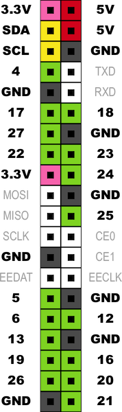

# 10.5.1 各種ボードの I2C端子について
### Raspberry Pi の I2C端子
下図のSCL, SDAがI2C端子です（黄色の端子）

### Raspverry Pi Zero の I2C端子
Raspberry PiのI2C端子と同じ配列です。

### micro:bit の I2C端子
下図のSCL, SDAがI2C端子です (P19,P20～オレンジ色I2C1のグループ)
