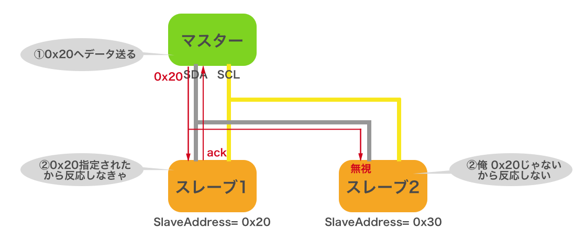

# 10.5 I2C
## I2Cの概要

[I2C](https://ja.wikipedia.org/wiki/I2C) とは 2 線式の同期式シリアル通信インタフェースです。「アイ・スクエア・シー」や「アイ・ ツー・シー」と読みます。I2C では SDA（シリアルデータ）と SCL（シリアルクロック）の 2 本の線で通信を行います。

<!--

-->
上図のように、I2C の SDA、SCL は複数のデバイス間で共有され、これを「I2C バス」と言います。I2C ではマスターとスレーブの間で通信が行われます。常にマスター側からスレーブ側に要求が行われ、スレーブ側からマスター側へ要求を行うことはできません。

本チュートリアルでいえばCHIRIMEN環境を動かすボードコンピュータがマスターとなり、ここに接続されるセンサーやアクチュエータデバイスなどがスレーブとして想定されます。スレーブデバイスの一例として[こちらに紹介](../partslist)されているI2Cデバイスをご覧ください。

マスターは、スレーブが持つ「SlaveAddress (スレーブアドレス)」を指定して、特定のスレーブとの通信を行います。このため、同じ I2C バス上に同じ SlaveAddress のスレーブを繋ぐことはできません。
I2Cデバイスは小型のICチップデバイスとなっており、デバイスによってはSlaveAddressは製品ごとに固定されています。

通信するデバイス同士が同一基板上にない場合には、SDA、SCL の 2 本の通信線に加え電源や GND の線を加えて 4 本のケーブルを用いて接続するのが一般的です。電源電圧はデバイスに応じたものを繋ぐ必要があります。
