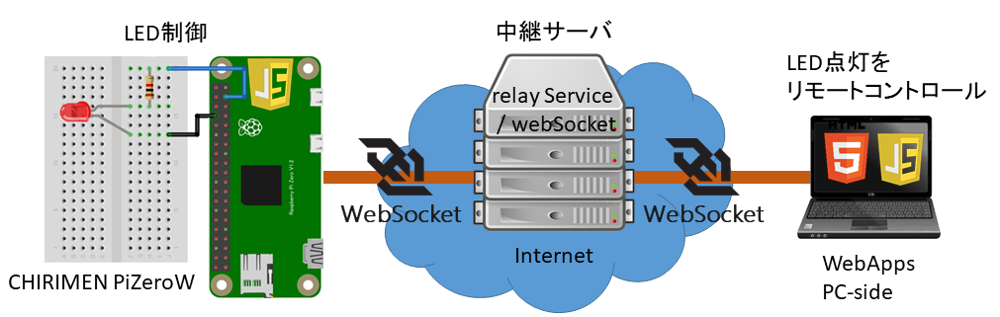

# 10.6.1 webSocketとpub/sub services
## システム構成

今回のチュートリアルでつくるIoTシステムの構成図です。

インターネットを介して、左側のアクチュエータやLEDを右側のウェブアプリから操作したり、
左側でセンシングしたデータを右側のウェブアプリで表示させたりするシステムですね。

構成要素を見ていきます。

* 左側のボードコンピュータはCHIRIMENを使ったプログラミングで使用してきた環境やデバイスを使います。
* 右側のPCはどんなブラウザでも動かせるので、スマートフォンを使うこともできます。 インターネットにつながっていさえすれば別の場所のPCやスマホでも動きます。これがIoTの便利なところ～遠隔操作ですね。

* InternetのrelayServiceが見慣れないものだと思います。以下で解説します。