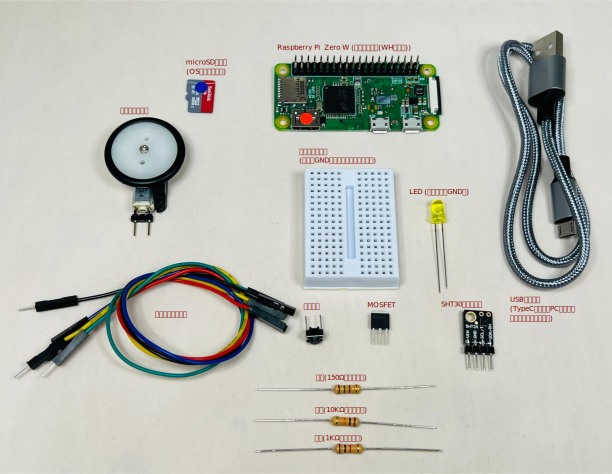

# 2.1 ステップ０ (物品準備、PCをWiFiに接続)
## 必要な物品リスト

以下を用意します



* **Raspberry Pi Zero 2 WH**
  * 販売ページ: [ケイエスワイ](https://raspberry-pi.ksyic.com/main/index/pdp.id/1097), [秋月電子](https://akizukidenshi.com/catalog/g/g129607/), [スイッチサイエンス](https://www.switch-science.com/products/9812), [マルツ](https://www.marutsu.co.jp/pc/i/2848088/)
* **microSDカード**
  * [CHIRIMEN Lite 最新リリース版](https://github.com/chirimen-oh/chirimen-lite/releases/latest)を書き込みます
  * 自分でイメージを書き込む場合は「[SDカードの作成の手順](https://tutorial.chirimen.org/raspi/sdcard)」をご確認ください。
* **USBケーブル (USB A - MicroB)**
* **Lチカ用パーツ**(以下のパーツ一式を用意します)
  * ブレッドボード
  * LED
  * 1KΩ抵抗
  * ジャンパーワイヤ オス-メス 2本
* **GPIO入力実験用追加パーツ**(以下のパーツを用意します)
  * タクトスイッチ
* **モーター制御用追加パーツ**(以下のパーツ一式を用意します)
  * 10KΩ抵抗
  * MOSFET
  * ギヤードモーター（ミニモーター）
* **温度センシング実験用追加パーツ**（温湿度センサーはいずれかを用意します）
  * [**ADT7410モジュール**](https://akizukidenshi.com/catalog/g/gM-06675/)　もしくは [**SHT30モジュール**](https://www.amazon.co.jp/dp/B083NHJSL9/)
  * ジャンパーワイヤ オス-メス 4本（追加 2本）
* **ブラウザの載ったパソコン**（いずれもUSBとWiFiが使える必要があります）
  * Windows
    * ブラウザは標準の Edge もしくは Chrome が必要です。
  * macOS
    * ブラウザは Chrome が必要です。
  * Chrome OS / Chromebook
    * 確認済みハード：Lenovo Chromebook S330
  * Linux
    * ブラウザ Chrome もしくは Edge が必要です。
    * Ubuntu Desktop 24.04 LTS: ```sudo gpasswd -a "$(whoami)" dialout``` コマンドを実行してシリアル通信可能にしておく必要があります。

※ PiZero自体はディスプレイやキーボードを接続する必要はありません。

## 開発用 PC をネットワークに接続
* 会場(もしくは開発場所)で提供されているネットワークにまずはPCを接続してください。
