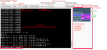

# Note:CHIRIMEN-lite の CLI 操作について

* CHIRIMEN Raspberry Pi Zero 版では [Raspberry Pi OS Lite](https://www.raspberrypi.com/software/operating-systems/) (Linux) をコマンドラインインターフェース (CLI)・シェル (bash) で操作します。
  * ただしこの講習ではターミナルウィンドによる GUI 操作が可能で、使うコマンドはごくわずかです。
    * **node** コマンド(後述)
    * [CTRL+c](https://atmarkit.itmedia.co.jp/ait/articles/1708/04/news015_2.html)（CTRLキーとcを同時に押す:実行中のコマンドを終了させる）
  * その他のほとんどの操作（コマンド）は、ターミナルウィンドやそこから起動される別画面のGUIがコマンド操作を代行しています。図1.1 の GUI を操作するとコンソールにコマンドが入力されるのがわかると思います。
* ターミナルウィンドの概要 (図1.1)

* [CLIとは](https://atmarkit.itmedia.co.jp/ait/articles/1602/19/news025.html)
* [シェルとコマンドプロンプト](https://atmarkit.itmedia.co.jp/ait/articles/1603/02/news016.html)
* もしもあなたがlinuxのシェルコンソール画面に慣れている場合は、ターミナルウィンドのコンソールにその他のシェル(bash)コマンドをタイプして使用することもできます。
  * たとえば ```ls -al``` とタイプするとおコンソール画面にディレクトリ内のファイルのリストが表示されます。
