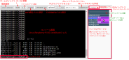

# Note:CHIRIMEN-lite の CLI 操作について

* CHIRIMEN Raspberry Pi Zero 版では、[Raspberry Pi OS Lite](https://www.raspberrypi.com/software/operating-systems/)（Linux）をコマンドラインインターフェース（CLI）やシェル（bash）で操作します。
  * ただし、この講習ではターミナルウィンドによる GUI 操作が可能なので、実際に使うコマンドはごくわずかです。
    * **node** コマンド（後述）
    * [CTRL+c](https://atmarkit.itmedia.co.jp/ait/articles/1708/04/news015_2.html)（CTRLキーとcを同時に押し、実行中のコマンドを終了させる操作）
  * その他のほとんどの操作（コマンド）は、ターミナルウィンドや、そこから起動される別画面の GUI がコマンド操作を代行します。図1.1 の GUI を操作すると、コンソールにコマンドが入力されることがわかります。
* ターミナルウィンドの概要（図1.1）

* [CLIとは](https://atmarkit.itmedia.co.jp/ait/articles/1602/19/news025.html)
* [シェルとコマンドプロンプト](https://atmarkit.itmedia.co.jp/ait/articles/1603/02/news016.html)
* linux のシェルコンソール画面に慣れている場合は、ターミナルウィンドのコンソールに、その他のシェル（bash）コマンドを入力して使用することもできます。
  * たとえば ```ls -al``` と入力すると、コンソール画面にディレクトリ内のファイルの一覧が表示されます。
