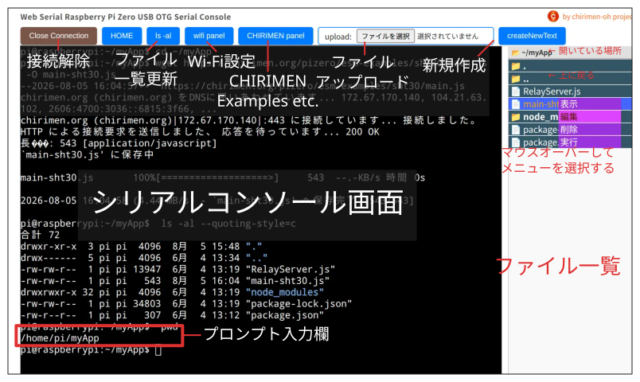

# Note:CHIRIMEN-lite の CLI 操作について

CHIRIMEN Raspberry Pi Zero 版では、[Raspberry Pi OS Lite](https://www.raspberrypi.com/software/operating-systems/)（Linux）をコマンドラインインターフェース（CLI）やシェル（bash）で操作します。

ただし、この講習ではターミナルウィンドによる GUI 操作が可能なので、実際に使うコマンドはごくわずかです。

代表的なコマンド:

- `node` コマンド

重要な操作:

- CtrlキーとCキーの同時押し … 実行中プロセスの終了

その他のほとんどの操作（コマンド）は、ターミナルウィンドや、そこから起動される別画面の GUI がコマンド操作を代行します。図1.1 の GUI を操作すると、コンソールにコマンドが入力されることがわかります。

_ターミナルウィンドの概要（図1.1）_

Linuxのシェルに慣れている方はシリアルコンソール画面に直接シェルのコマンドを入力して使用することもできます。たとえば `ls` と入力すると、ディレクトリ内のファイルの一覧がシリアルコンソール画面に表示されます。

参考リンク:

- [LinuxのCUIとGUI、デスクトップ環境を理解しよう](https://atmarkit.itmedia.co.jp/ait/articles/1602/19/news025.html)
- [Linuxのシェルとコマンドプロンプトを理解しよう](https://atmarkit.itmedia.co.jp/ait/articles/1603/02/news016.html)
