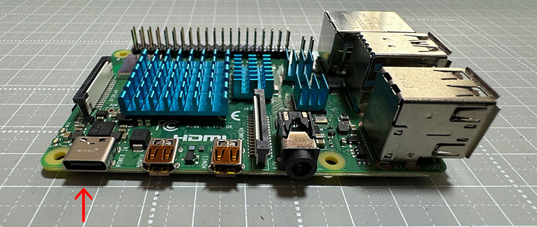

# Note. Raspberry Pi4 の利用方法
- このチュートリアルは PiZero 以外にも Raspberry Pi4 も使用可能です。
- Pi4 の USB 給電口と PC を接続して同様にチュートリアルが可能です。
  - PiZero より Pi4 は消費電力が多いため電力不足になると同様の動作が出来ない場合があります。
  - 使用する USBケーブルは Type-C になります。

