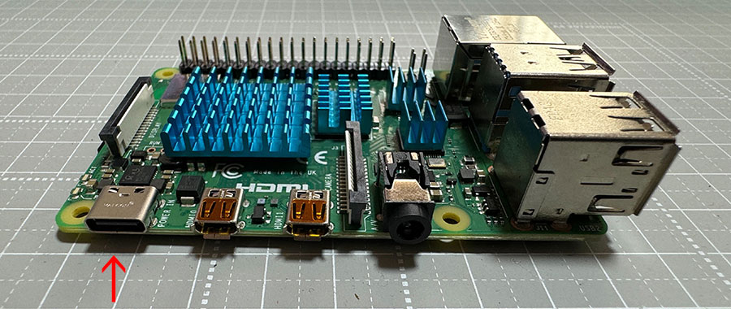

# Note. Raspberry Pi4 の利用方法
- このチュートリアルは、PiZero 以外に Raspberry Pi4 でも利用できます。
- Pi4 の USB 給電口と PC を接続すれば、同様の手順でチュートリアルを進められます。
  - PiZero より Pi4 は消費電力が多いため、電力が不足すると同様に動作しない場合があります。
  - 使用する USB ケーブルは Type-C です。

