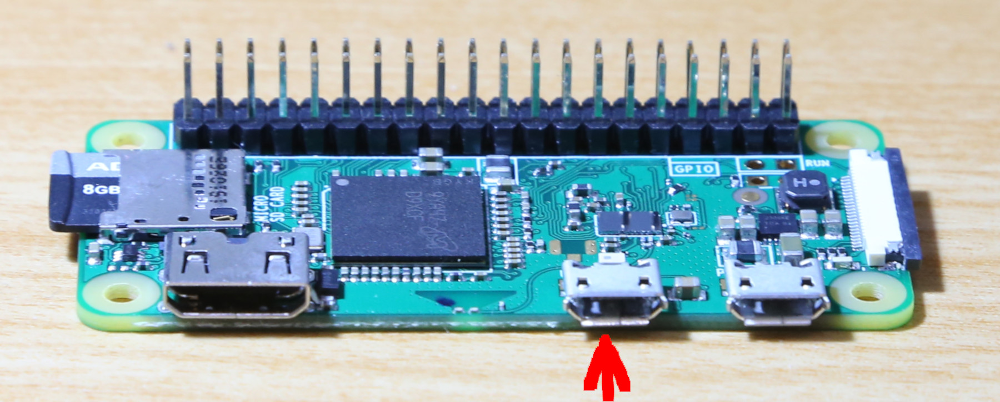
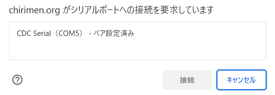

# 2.2 ステップ1（[ターミナル接続](https://chirimen.org/PiZeroWebSerialConsole/PiZeroWebSerialConsole.html)）
1. [CHIRIMEN Lite 最新リリース版](https://github.com/kou029w/chirimen-os/releases/)を書き込んだ microSDカードを Raspberry Pi Zero に差し込みます。
2. PCの USB と Raspberry Pi Zero の USB OTGポートを USBケーブルでつなぎます
   * PiZero側はつなぐポート要注意　下図の矢印の所に繋ぎます
  
   * PC からの USB給電で Raspberry Pi Zero が起動します。
3. PCでRaspberry Pi Zeroが認識されたことを確認します ([Windows10のデバイスマネージャ](https://askpc.panasonic.co.jp/beginner/guide/ten07/7013.html)の例) 
   * 給電後USBデバイスとして出現するまでにしばらく(数十秒)かかります
   * Windowsの場合、ポートの番号(COMnのnの部分)は環境ごとに異なります
  
   * [**こちらのWeb Serial RPiZero TerminalページにPCのブラウザでアクセス**](https://chirimen.org/PiZeroWebSerialConsole/PiZeroWebSerialConsole.html)
 (以降、このウィンドを**ターミナルウィンド**と呼びます)
4. ターミナルウィンドの ```[Connect and Login PiZero]``` ボタンを押す
   * 接続ダイアログが出現
  
   * 上で認識したデバイス（ポート番号）を接続する
5. コンソール(左側の黒い画面の最下部)に以下のコマンドプロンプトが表示されればステップ１完了です。引き続きステップ２に進んでください
   * ```pi@raspberrypi:~$```
