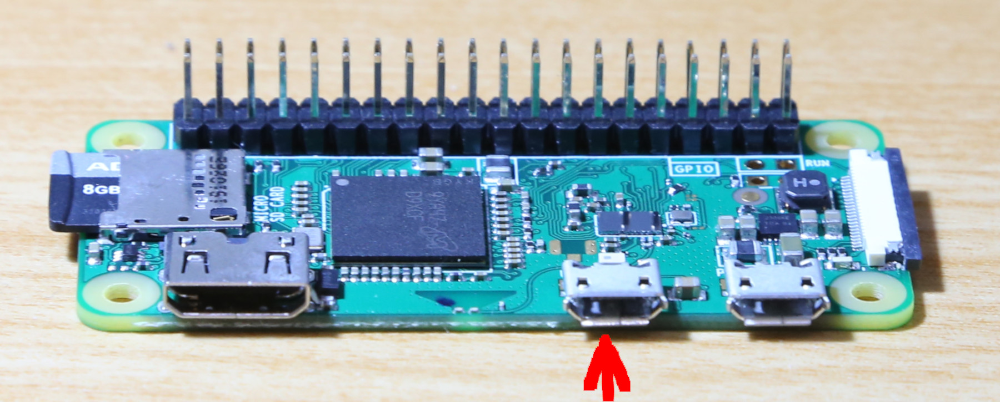
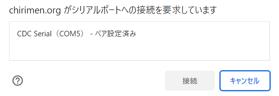

# 2.2 ステップ1（[ターミナル接続](https://chirimen.org/PiZeroWebSerialConsole/PiZeroWebSerialConsole.html)）
1. [CHIRIMEN Lite 最新リリース版](https://github.com/kou029w/chirimen-os/releases/)を書き込んだ microSDカードを Raspberry Pi Zero に差し込みます。
2. PCの USB と Raspberry Pi Zero の USB OTGポートを USBケーブルでつなぎます
   * PiZero側はつなぐポート要注意　下図の矢印の所に繋ぎます
  
   * PC からの USB給電で Raspberry Pi Zero が起動します。
3. PCでRaspberry Pi Zeroが認識されたことを確認します ([デバイスマネージャーの開き方](https://www.youtube.com/watch?v=lCsywP4tMhE) [🔗](https://support.microsoft.com/ja-jp/windows/%E3%83%87%E3%83%90%E3%82%A4%E3%82%B9-%E3%83%9E%E3%83%8D%E3%83%BC%E3%82%B8%E3%83%A3%E3%83%BC%E3%82%92%E9%96%8B%E3%81%8F-a7f2db46-faaf-24f0-8b7b-9e4a6032fc8c)の例) 
   * 給電後USBデバイスとして出現するまでにしばらく(数十秒)かかります
   * Windowsの場合、ポートの番号(COMnのnの部分)は環境ごとに異なります
  
   * [**こちらのWeb Serial RPiZero TerminalページにPCのブラウザでアクセス**](https://chirimen.org/PiZeroWebSerialConsole/PiZeroWebSerialConsole.html)
 (以降、このウィンドを**ターミナルウィンド**と呼びます)
4. ターミナルウィンドの ```[Connect and Login PiZero]``` ボタンを押す
   * 接続ダイアログが出現
  
   * 上で認識したデバイス（ポート番号）を接続する
5. コンソール(左側の黒い画面の最下部)に以下のコマンドプロンプトが表示されればステップ１完了です。引き続きステップ２に進んでください
   * ```pi@raspberrypi:~$```
