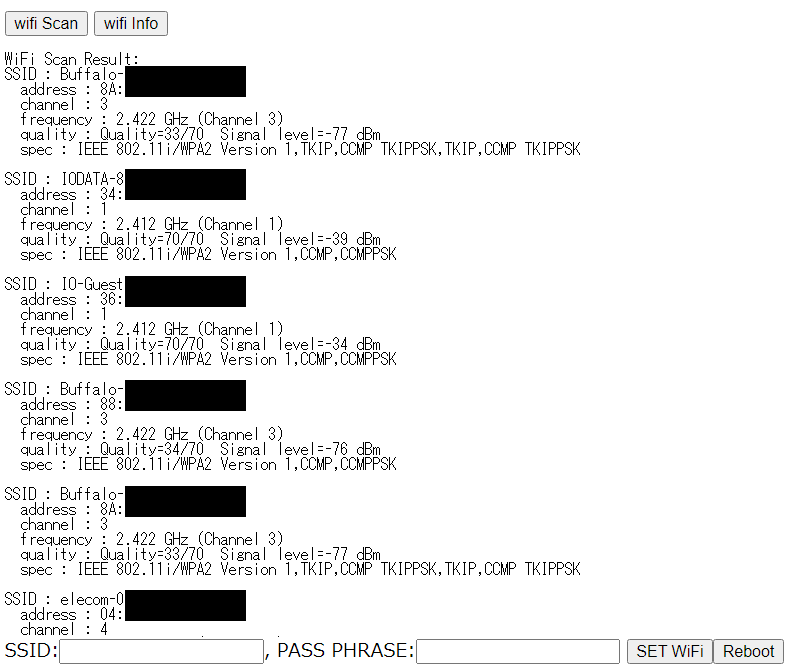
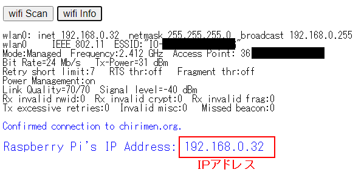

# 2.3 ステップ2 (WiFi設定)
1. ターミナルウィンドの```[wifi panel]```ボタンを押す
   * ウィンドが開き、WiFiアクセスポイントがスキャンされます。ステルスでないものはリストアップされているので、以降の作業の参考にしてください。
   * Raspberry Pi Zero W は **2.4GHz帯の WiFi** にのみ対応しています。
    
2. ウィンド下部に、WiFiアクセス情報を入力する (いずれも大文字小文字の区別があるので注意してください)
   * SSID欄
   * PASS PHRASE欄 
3. ```[SET WiFi]```ボタンを押す
4. ```[Reboot]```ボタンを押す
   * これで Raspberry Pi Zero が再起動をはじめます
5. WiFiウィンドを閉じ、ターミナルウィンドに戻る
6. ターミナルウィンドの```[Close Connection]```ボタンを押す
7. 1-2分程待つ（Raspberry Pi Zeroが再起動します）
8. ```[Connect and Login PiZero]```ボタンを押し接続する
   * 接続ダイアログが出現⇒接続するとこれまで同様コマンドプロンプトが出現
9. ```[wifi panel]```ボタンを再び押す
10. ```[wifi Info]```ボタンを押す
    * 表示された情報をチェックします
    * wlan0: inet xxx.xxx.xxx.xxx　(xxxは数字)のようにIPアドレスが設定されていれば接続成功しています。

11.  確認できたらWiFi Settingウィンドを閉じてください。
  <!--  * あとでping chirimen.org OK も入れよう。-->
* もしもあなたがsshやscp (WinSCP, teraterm等)などのツールに慣れている場合、上記のアドレスでssh接続できます
  * PORT: 22
  * ID: ```pi```
  * PASSWORD: ```raspberry```
