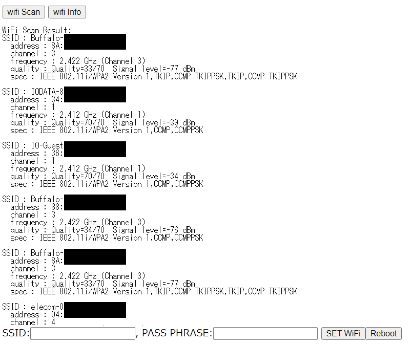
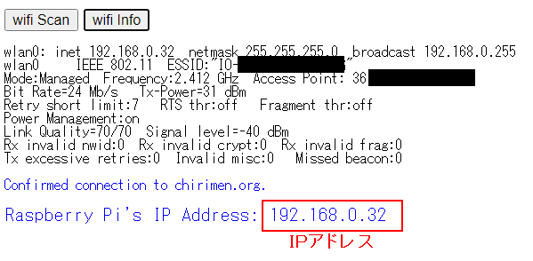

# 2.3 ステップ2 (WiFi設定)

> 

1. ターミナルウィンドウの`[wifi panel]`ボタンを押します
   - ウィンドウが開き、WiFiアクセスポイントがスキャンされます。ステルスでないアクセスポイントは一覧に表示されるので、以降の作業の参考にしてください。
   - Raspberry Pi Zero W は **2.4GHz帯の WiFi** のみ対応しています。
2. ウィンドウ下部に、WiFiアクセス情報を入力します (いずれも大文字と小文字が区別されるので注意してください)
   - SSID欄
   - PASS PHRASE欄
3. `[SET WiFi]`ボタンを押します
4. `[wifi Info]`ボタンを押します
   - 表示された情報を確認します
   - ※ 設定反映に数十秒かかる場合があります。IPアドレスが表示されない場合は少し待ってから再度`[wifi Info]`で確認してください。
   - wlan0: inet xxx.xxx.xxx.xxx (xxxは数字) のようにIPアドレスが設定されていれば接続に成功しています。
     
5. 確認できたら、WiFiウィンドウを閉じてください。

<!--  * あとでping chirimen.org OK も入れよう。-->

> **Note**
>
> sshやscp (WinSCP等) などのツールに慣れている場合は、上記のアドレスでSSH接続できます。
> ただし初期状態ではSSHサービスが無効になっているため、事前にシリアルコンソールで有効化しておく必要があります。
>
> ```sh
> sudo systemctl enable --now ssh
> ```
>
> SSH接続情報:
>
> - ポート番号: 22
> - ユーザー名: `pi`
> - パスワード: `raspberry`
