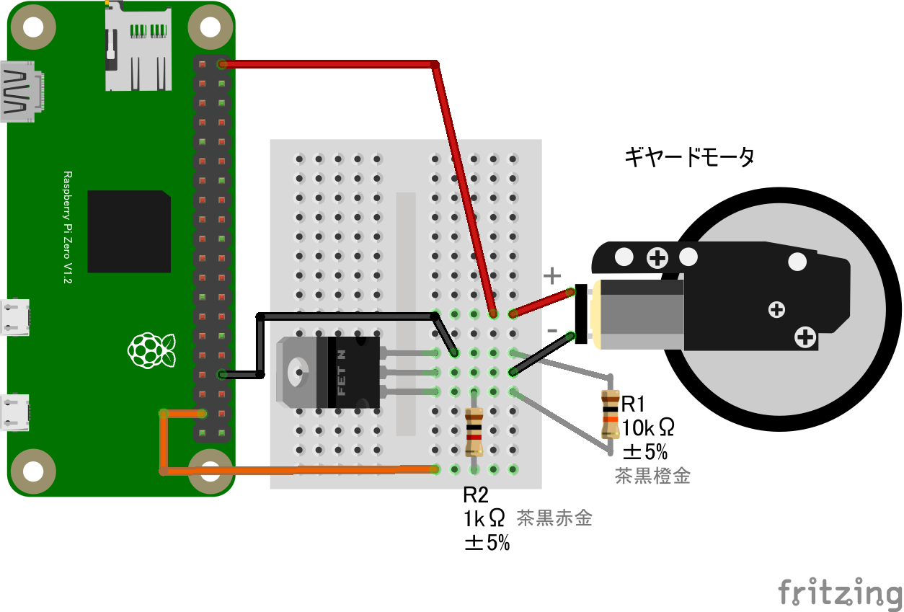

# 4.2 GPIOを出力
GPIOの出力はLチカですでに実験しました。今回はモーターを動かしてみましょう。回路にはMOSFETを使用し、回路図は以下のようになります。



コードはLチカと全く同じ hello.js をそのまま使用できます。
* ```node hello.js``` と入力してENTERキーを押します

### 回路
* [10.2.4 MOSFETを使った大電力制御](./chapter_10-2-4.md)を参照してください
