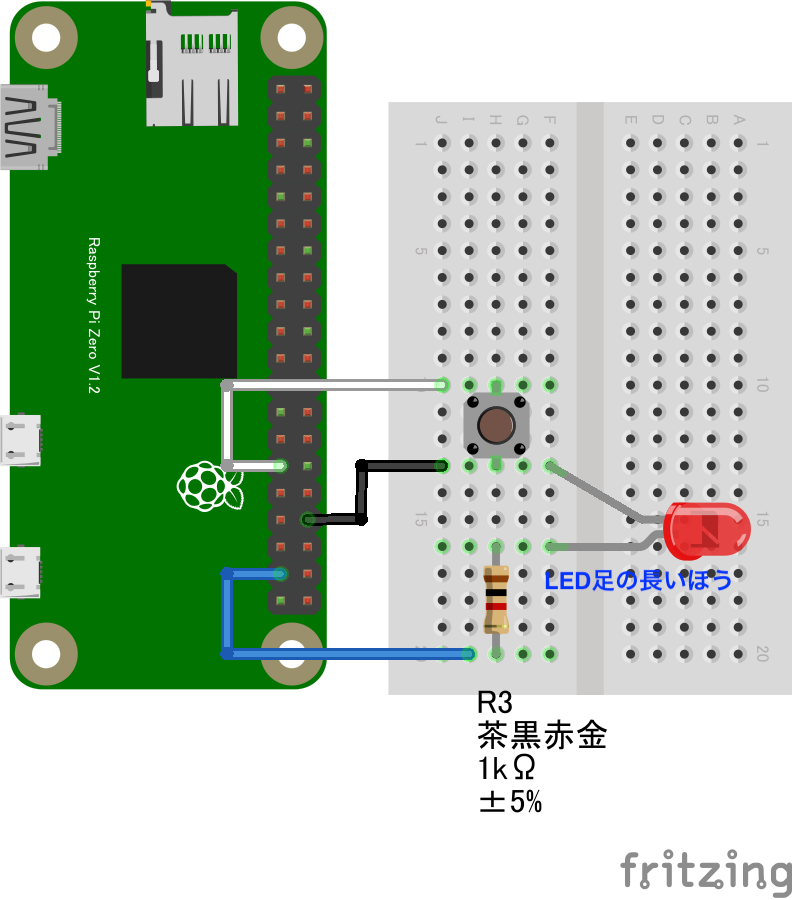

# 4.5 GPIOセンサーを複数同時に使う
## ボタンで点灯する LED ／ 回転するモーター制御
- LED の点滅制御（Lチカ）から、ボタンで点灯する制御に変更してみましょう。
- 回路図は以下の通りに接続します。LED/モーターのどちらかで動作させることが出来ます。
  - GPIO PORT5にスイッチ、GPIOPORT26に抵抗とLED を繋ぎます

- モーターを使用した際の回路図は以下となります。
  - GPIO PORT5にスイッチ、GPIOPORT26にモーター制御回路を繋ぎます

