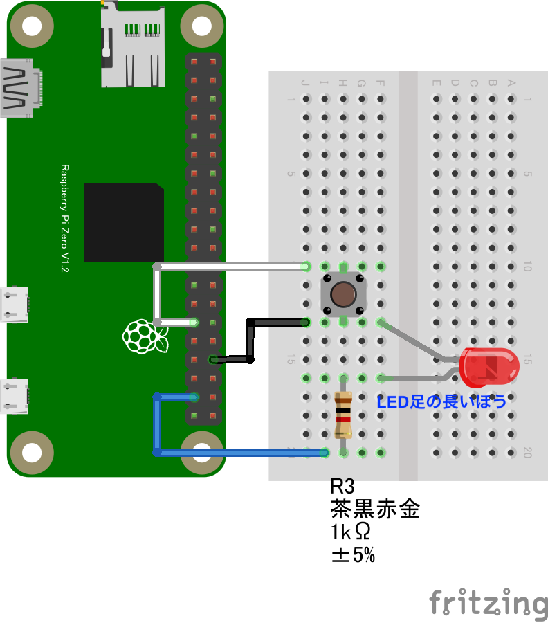

# 4.5 GPIOセンサーを複数同時に使う
## ボタンでLEDとモーターを制御する
- LED の点滅制御（Lチカ）から、ボタンで点灯する制御に変更してみましょう。
- 回路図は以下のとおりに接続します。LEDとモーターのどちらか一方で動作させることができます。
  - GPIO PORT5にスイッチ、GPIOPORT26に抵抗とLED を繋ぎます

- モーターを使用する場合の回路図は以下のとおりです。
  - GPIO PORT5にスイッチ、GPIOPORT26にモーター制御回路を繋ぎます

