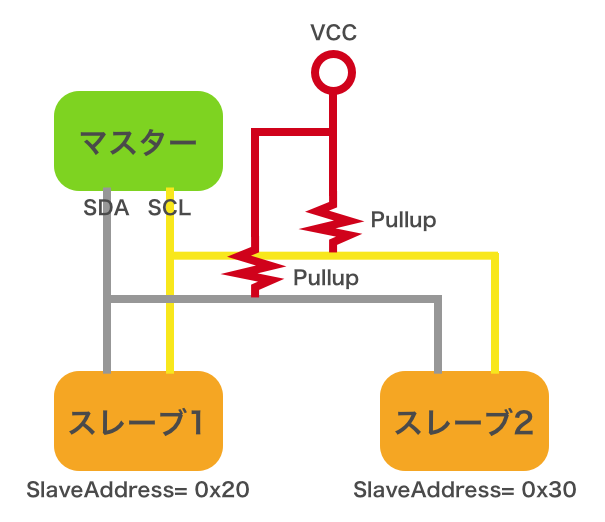
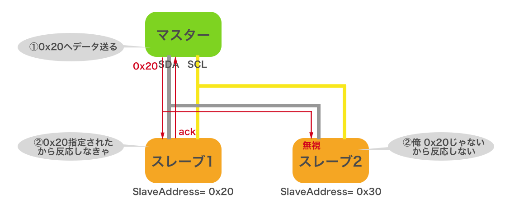

# 5.1 I2Cを理解する
## I2Cの概要

[I2C](https://ja.wikipedia.org/wiki/I2C) は、名前だけ見ると独自規格に見えるかもしれませんが、実体は 2 線式の同期式シリアル通信インタフェースです。「アイ・スクエア・シー」や「アイ・ツー・シー」と読みます。通信に使う線は SDA（シリアルデータ）と SCL（シリアルクロック）の 2 本だけです。

上図のように、この SDA、SCL は複数のデバイス間で共有されます。これを「I2C バス」と言います。バス上の通信は、マスターとスレーブという非対称な関係で行われます。要求はマスター側から一方的にスレーブ側へ送られ、スレーブ側からマスター側へ要求を送ることはできません。

本チュートリアルでは、CHIRIMEN環境を動かすボードコンピュータがマスターにあたります。ここに接続されるセンサーやアクチュエータデバイスが、スレーブです。スレーブデバイスの一例として、[こちらに紹介](https://tutorial.chirimen.org/partslist)されているI2Cデバイスを見てみてください。

複数のスレーブが同じバスにぶら下がっているとき、マスターはどうやって相手を選ぶのでしょうか。マスターは、スレーブが持つ「SlaveAddress (スレーブアドレス)」を指定して、特定のスレーブとの通信を行います。このため、同じ I2C バス上に、同じ SlaveAddress のスレーブを繋ぐことはできません。I2Cデバイスは小型のICチップで、デバイスによってはSlaveAddressが製品ごとに固定されています。

通信するデバイス同士が同一基板上にない場合には、SDA、SCL の 2 本の通信線に加えて電源や GND の線を加え、4 本のケーブルで接続するのが一般的です。電源電圧は、デバイスに応じたものを選ぶ必要があります。