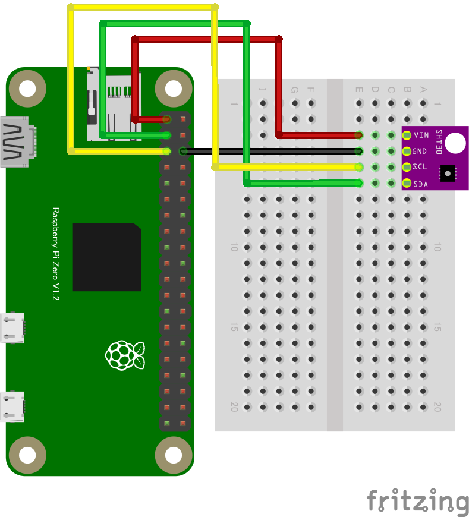

# 5.2 I2Cセンサーを動作させる（SHT30編）
SHT30は温度に加えて湿度も測定できる、I2C接続の多機能センサーです。
SHT31もほぼ同等に使えます（精度はSHT31のほうが高くなります）。
* [SHT30/SHT31について](../chirimenGeneric/#i2ci2c--sht30-sht31)

* ターミナルウィンドの```[CHIRIMEN Panel]```ボタンを押す
* 出現したCHIRIMEN Panelの```[Get Examples]```ボタンを押す
* ID : [**sht30**](https://tutorial.chirimen.org/pizero/esm-examples/#I2C_sht30) を探します
* 回路図リンクを押すと回路図が出てきますので、回路を組みます。なお、接続は下の図のようになります。


