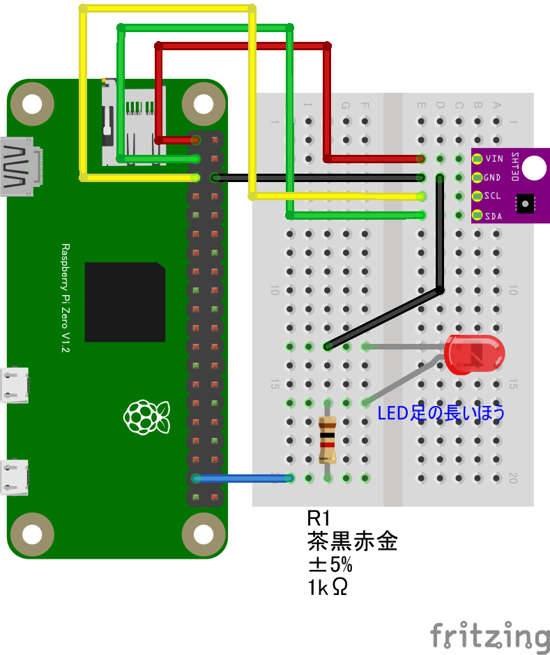

# 5.4 GPIO と I2Cセンサーを組み合わせる
GPIO センサーと I2Cセンサーは、組み合わせて動作させることもできます。
このチュートリアルで使用した LED（GPIOセンサー）と SHT30温湿度センサー（I2Cセンサー）を組み合わせて、決まった温度になったら LED を光らせるサンプルを試してみましょう。

`CHIRIMEN パネル` の `Get Examples` から ID: [**sht30_led**](https://chirimen.org/pizero/esm-examples/#I2C_sht30_led) を参考にします。
回路図を確認し、サンプルコードを取得して動作を確認してみましょう。

