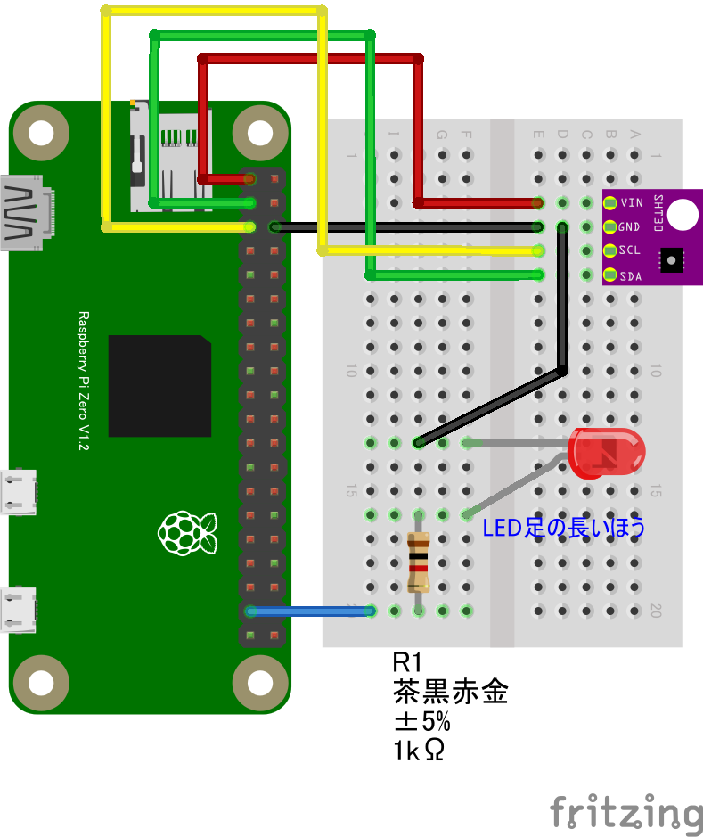

# 5.4 GPIO と I2Cセンサーを組み合わせる
GPIO センサーと I2Cセンサーは、それぞれを組み合わせて動作させることも可能です。このチュートリアルで使用した LED（GPIOセンサー）と SHT30温湿度センサー（I2Cセンサー）を組み合わせて、決まった温度になったら LED を光らせるサンプルを試してみましょう。

`CHIRIMEN パネル` の `Get Examples` の中より ID: [**sht30_led**](https://tutorial.chirimen.org/pizero/esm-examples/#I2C_sht30_led) を参考にして回路図の確認やサンプルコードを取得して動作を確認してみましょう。

