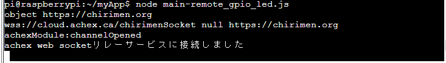

# 6.2 PiZero サンプルコードの実行
IoT の実行を行う為に PiZero 用のサンプルコードの実行と、PC 用のサンプルコードの実行が必要になります。それぞれのコードの実行方法は以下を参考に実施してください。

## CHIRIMENデバイス側にコードを入れ、実行する
* ターミナルウィンドの```[CHIRIMEN Panel]```ボタンを押す
* 出現したCHIRIMEN Panelの```[Get Examples]```ボタンを押す
* ID : **remote_gpio_led**の行を探します（もう一度この行の情報を使います）
* ```[JS GET]```ボタンを押すと、開発ディレクトリ(```~/myApp```)に、サンプルコードが保存されます。
  * **main-remote_gpio_led.js**というファイル名で保存されます。
  * ターミナルウィンドの右側のファイルマネージャでmain-remote_gpio_led.js⇒編集 を選びソースコードを見てみましょう
* 実行する
  * ターミナルウィンドのコンソールのプロンプトが```pi@raspberrypi:~/myApp$```となっていることを確認
  * ターミナルウィンドのコンソールに、```node main-remote_gpio_led.js``` [ENTER] と入力して実行。

  * なお、実験が終わったら終了は CTRL+c です。

