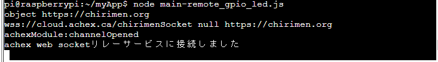

# 6.2 PiZero サンプルコードの実行
IoT を動かすには、PiZero 用と PC 用、両方のサンプルコードを実行する必要があります。それぞれの実行方法は、以下を参考にしてください。

## CHIRIMENデバイス側にコードを入れ、実行する
* ターミナルウィンドの```[CHIRIMEN Panel]```ボタンを押す
* 出現した CHIRIMEN Panel の```[Get Examples]```ボタンを押す
* ID: **remote_gpio_led** の行を探します（この行の情報は、あとでもう一度使います）
* ```[JS GET]```ボタンを押すと、開発ディレクトリ(```~/myApp```)に、サンプルコードが保存されます。
  * **main-remote_gpio_led.js** というファイル名で保存されます。
  * ターミナルウィンドの右側のファイルマネージャで main-remote_gpio_led.js ⇒ 編集 を選び、ソースコードを見てみましょう
* 実行する
  * ターミナルウィンドのコンソールのプロンプトが```pi@raspberrypi:~/myApp$```となっていることを確認
  * ターミナルウィンドのコンソールに、```node main-remote_gpio_led.js``` [ENTER] と入力して実行。

  * なお、実験を終えるときは CTRL+c で終了します。

