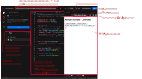

# 6.3 PC サンプルコードの実行
* CHIRIMEN Panel に戻り、ID : **remote_gpio_led** の行にある、```CSB EDIT``` リンクをクリックする。
  * CodeSandbox というオンラインの WebApp開発環境のウィンドが開き、PC側のコードの表示と実行がされています。
    * CodeSandbox を使って編集もできます。
    * 詳しい解説：[CodeSandbox ガイド](https://csb-jp.github.io/)
  * 参考画像では右側のフレームに LED を遠隔コントロールするための WebApp が既に実行されています。
  * WebApp を使って LED が制御できることを確かめてみましょう。

* CodeSandbox の画面構成について
