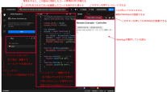

# 6.3 PC サンプルコードの実行
* CHIRIMEN Panel に戻り、ID: **remote_gpio_led** の行にある ```CSB EDIT``` リンクをクリックする。
  * CodeSandbox というオンラインの WebApp開発環境のウィンドが開き、PC側のコードが表示され、実行されます。
    * CodeSandbox を使って編集もできます。
    * 詳しい解説：[CodeSandbox ガイド](https://csb-jp.github.io/)
  * 参考画像では、右側のフレームで LED を遠隔コントロールする WebApp がすでに実行されています。
  * WebApp を使って LED を制御できることを確かめてみましょう。

* CodeSandbox の画面構成は次のとおりです。
