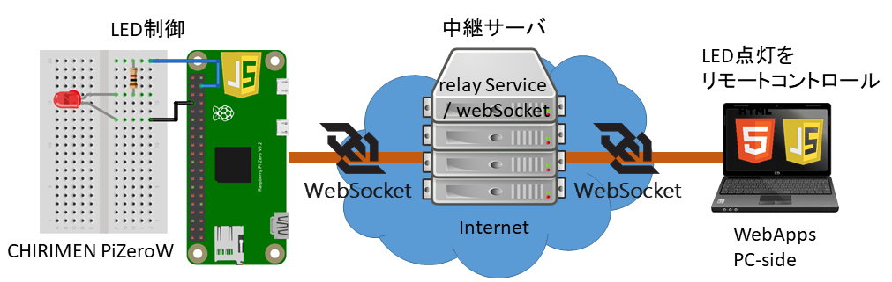

# 6. IoTを試す

IoT は、制御されるデバイス（上図では **CHIRIMEN PiZero W** ）と、利用者端末（上図では **WebApp PC-side** ）に加えて、これらの間でデータを中継するサーバ（**クラウド**）が必要になります。
今回は Web標準技術である WebSocketプロトコルを中継するサーバを用いて LED を備えた CHIRIMENデバイスと、スマホや PC の WebApp を繋いだ IoTシステムを作ります。

Note: [モーター制御の回路](./#gpio-2)を組めば、そのまま遠隔モーターコントロールができます

用語の詳細な説明は共通資料で解説を行っていますので、興味のある方はそちらをご確認ください。
- [IoT](./chapter_10-6.md)
- [WebSoeketとRelayServer](./chapter_10-6.md)