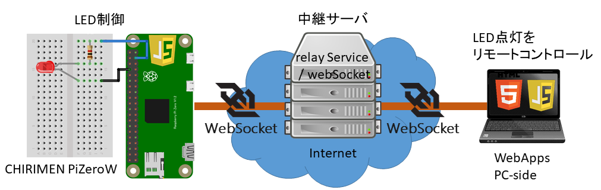

# 6. IoTを試す

IoT には、制御されるデバイス（上図の **CHIRIMEN PiZero W**）と利用者端末（上図の **WebApp PC-side**）に加えて、両者の間でデータを中継するサーバ（**クラウド**）が必要です。
今回は、Web標準技術である WebSocketプロトコルを中継するサーバを使い、LED を備えた CHIRIMENデバイスとスマホや PC の WebApp をつないだ IoTシステムを作ります。

Note: [モーター制御の回路](./chapter_4-2.md)を組めば、そのまま遠隔モーターコントロールができます。

用語の詳細な説明は共通資料に記載していますので、興味のある方はご確認ください。
- [IoT](./chapter_10-6.md)
- [WebSoeketとRelayServer](./chapter_10-6.md)
