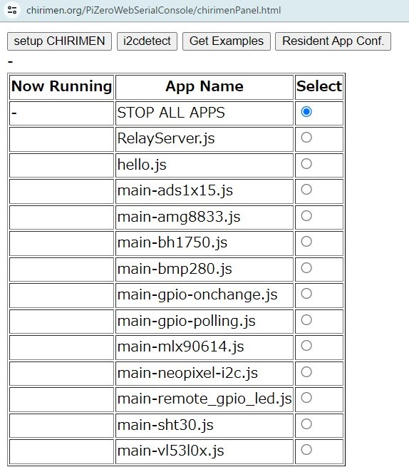

# 7. 常駐プログラム化する
ターミナルウィンドからnodeコマンドで実行指示しなくても、電源投入後 自動的に指定したコードを起動する設定（常駐プログラム化）ができます。</br>
このチュートリアルでは、[forever](https://www.npmjs.com/package/forever) を使用する設定を専用GUIを用いて行ってみましょう。



* ターミナルウィンドの ```[CHIRIMEN Panel]``` ボタン ⇒ CHIRIMEN Panel の ```[Resident App Conf.]``` ボタンを押します。 
  * 専用画面の UI が使用可能状態になるまで数秒かかります。
* 開発ディレクトリ```~/myApp```内にある JavaScript コードがリストアップされます。
* 各行の ```Now Running``` 列は常駐状態、```App Name```はコードのファイル名、```Select``` は選択用チェックボックスです。
  * ```Now Running```欄には現在常駐プログラム化しているコードに、```RUNNING```が表示されています。（常駐プログラムがなければ全部の行が空白になります）
  * ```Select```欄のチェックボックスをチェックすると、そのコードが常駐プログラム化します。（常駐プログラムは一個だけ指定できます）
    * 設定が反映され、常駐状態が確認できるようになるまで、２０秒ぐらいかかります
      * 常駐状態の再確認は```[Resident App Conf.]```ボタンで可能
      * 設定できたらシャットダウンしてPCとのUSB接続も外します
        * シャットダウンコマンド: ```sudo shutdown -h now```
      * その後PiZeroをモバイルバッテリなどにつないで独立して稼働させます。
        * PiZeroの緑色LEDの点滅が収まると、概ね常駐プログラムが起動
        * その後PCからリモートコントロールしてみましょう
  * PCに接続しなおして、一番上の ```STOP ALL APPS``` のチェックボックスをチェックすると、常駐プログラムを解除できます。


* *Note: 常駐化のツールとしては、他にも systemd service unit, openrc, cron, pm2, forever 等があります。Webでそれぞれの特徴を調べて用途に合ったものを選択して設定しても良いでしょう。*