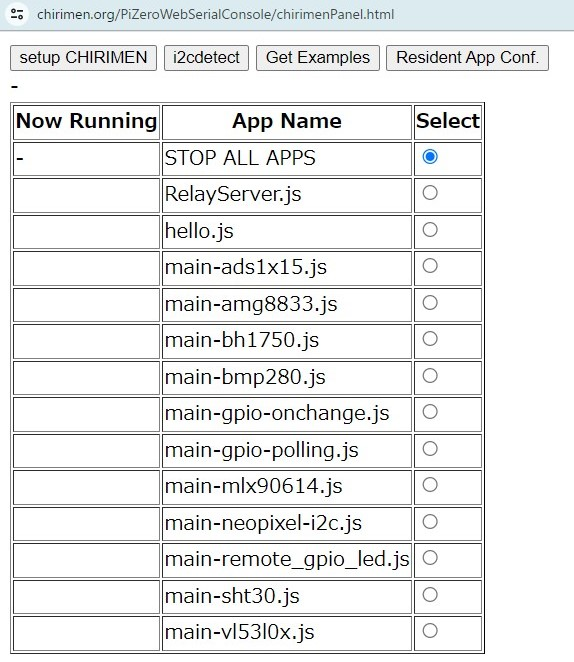

# 7. 常駐プログラム化する
ターミナルウィンドから node コマンドで実行を指示しなくても、電源を入れると自動的に指定したコードを起動する設定（常駐プログラム化）ができます。</br>
このチュートリアルでは、専用 GUI を使って [forever](https://www.npmjs.com/package/forever) の設定を行ってみましょう。



* ターミナルウィンドの ```[CHIRIMEN Panel]``` ボタン ⇒ CHIRIMEN Panel の ```[Resident App Conf.]``` ボタンを押します。
  * 専用画面の UI が使えるようになるまで、数秒かかります。
* 開発ディレクトリ```~/myApp```内にある JavaScript コードが一覧表示されます。
* 各行には、常駐状態を示す```Now Running```列、コードのファイル名を示す```App Name```列、選択用チェックボックスの```Select```列があります。
  * ```Now Running``` 欄には、現在常駐プログラム化しているコードの行に```RUNNING```と表示されます（常駐プログラムがなければ、すべての行が空欄です）。
  * ```Select``` 欄のチェックボックスを選択すると、そのコードが常駐プログラム化されます（常駐プログラムは一つだけ指定できます）。
    * 設定が反映され、常駐状態が確認できるようになるまで、20秒ほどかかります。
      * 常駐状態は```[Resident App Conf.]```ボタンで再確認できます。
      * 設定できたら、シャットダウンして PC との USB 接続も外します。
        * シャットダウンコマンド: ```sudo shutdown -h now```
      * その後、PiZero をモバイルバッテリなどにつなぎ、独立して稼働させます。
        * PiZero の緑色 LED の点滅が収まると、常駐プログラムはおおむね起動しています。
        * その後、PC からリモートコントロールしてみましょう。
  * PC に接続しなおし、一番上の ```STOP ALL APPS``` チェックボックスを選択すると、常駐プログラムを解除できます。


* *Note: 常駐化のツールには、他にも systemd のサービスユニット、openrc、cron、pm2、forever などがあります。Web でそれぞれの特徴を調べ、用途に合ったものを選んで設定してもよいでしょう。*