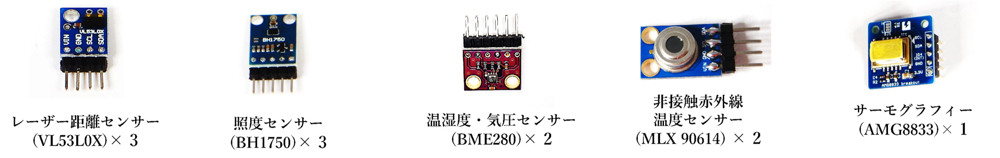
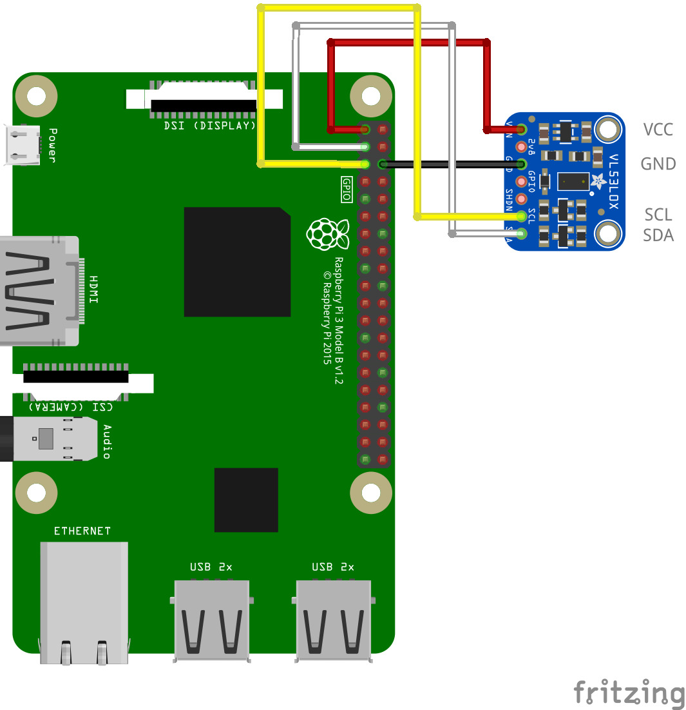
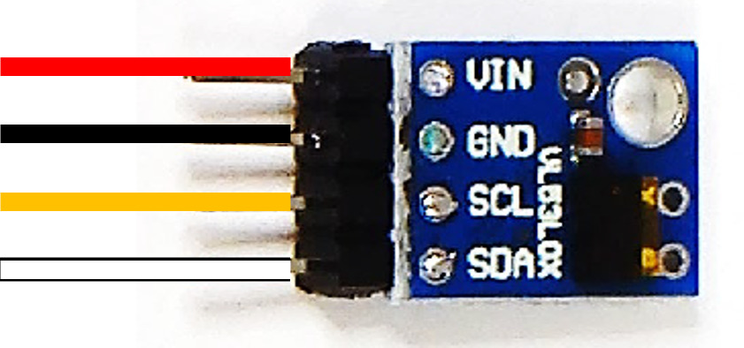

# 8.1.1 単体で動作確認できるセンサー



- I2C Examples より回路図とサンプルコードを使って試すことが出来ます。
  - 上記のセンサーのカッコ内はセンサーの型番で、Examples の ID と同じ記載になります。
  - 上記のセンサーはそれぞれ単体で使う事が出来ます。

### 回路図とプログラムサンプル

 

動作を確認するためのサンプルコードは `CHIRIMENパネル` から入手できます。<br>
ブラウザでサンプルコードの中を確認したい場合は `コードを確認する` から確認出来ます。
- レーザー距離センサー ＞ **ID：vl53l0x　タイトル：距離センサ**
  -  [※コードを確認する](https://tutorial.chirimen.org/pizero/esm-examples/vl53l0x/main.js) 
- 照度センサー ＞ **ID：bh1750　タイトル：照度センサ**
  -  [※コードを確認する](https://tutorial.chirimen.org/pizero/esm-examples/bh1750/main.js) 
- 温湿度・気圧センサー ＞ **ID：bme280　タイトル：温度・湿度・気圧**
  -  [※コードを確認する](https://tutorial.chirimen.org/pizero/esm-examples/bme280/main.js) 
- 非接触赤外線温度センサー ＞ **ID：mlx90614 タイトル：赤外線温度センサ**
  -  [※コードを確認する](https://tutorial.chirimen.org/pizero/esm-examples/mlx90614/main.js) 
- サーモグラフィー ＞ **ID：amg8833　タイトル：サーモグラフィー**
  -  [※コードを確認する](https://tutorial.chirimen.org/pizero/esm-examples/amg8833/main.js) 

【注意！】回路図と実物のセンサーは製品によって形状が異なる場合があります。
- 実際の応用センサーキットに入っている距離センサーは写真の物となります。
  - 写真のレーザーセンサーを基板の表記に合わせた接続例です。回路図と同じ色のジャンパーワイヤーで接続します。 
- I2C センサーは例の図の基盤に書かれた 4つのピン（**VIN / GND / SCL / SDA**）を接続するのが基本となります。
```
※注意
回路図のセンサー画像は形は異なっていますが、写真の部品と同じセンサーを示しています。センサーは物により形状が異なる物がありますが搭載されたチップが同じになります。
形状が異なる場合は実物の基板に書かれた文字を確認して、回路図と同じ文字の書かれたピンに接続します。
センサーのピンは接続しない部分も物によってあります。回路図に従って必要な部分を繋ぎます。必ずセンサーの全てのピンを繋ぐ必要はありません。
```
[応用センサー一覧に戻る](./chapter_8-1.md)
