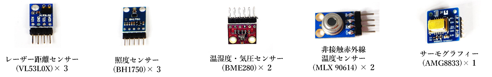
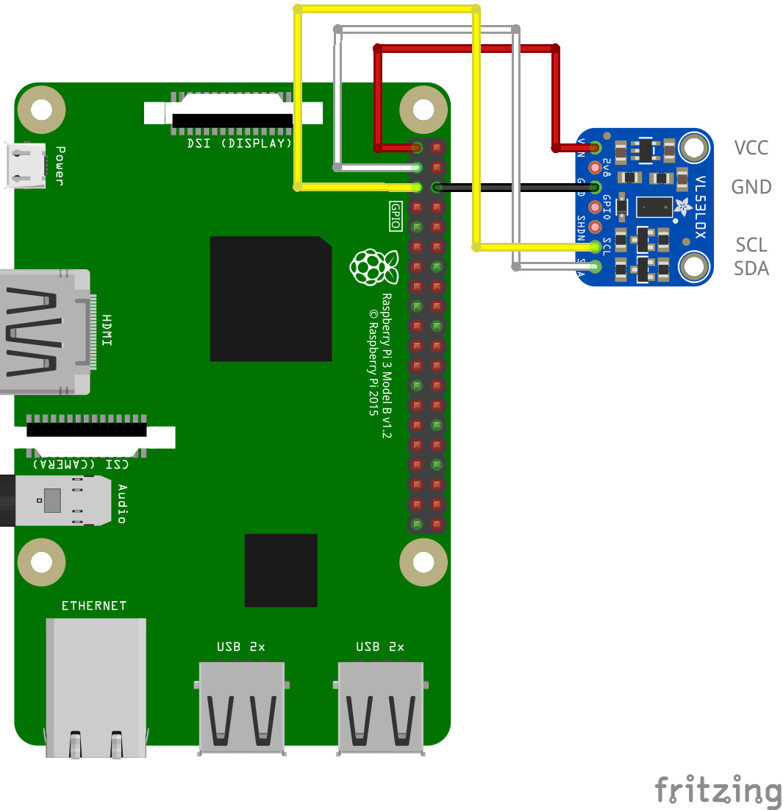
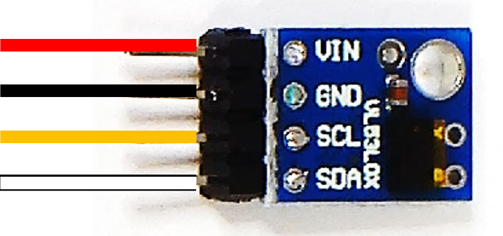

# 9.1.1 単体で動作確認できるセンサー

- I2C Examples の回路図とサンプルコードを使って、動作を試せます。
  - センサー名のカッコ内は型番で、Examples の ID と同じ表記です。
  - 上記のセンサーは、それぞれ単体で使えます。

### 回路図とプログラムサンプル

 

動作を確認するためのサンプルコードは `CHIRIMENパネル` から入手できます。 
ブラウザでコードの中身を確認したい場合は、`コードを確認する` から確認できます。

- レーザー距離センサー ＞ **ID：vl53l0x 　タイトル：距離センサ**
  - [※コードを確認する](https://chirimen.org/pizero/esm-examples/vl53l0x/main.js)

<iframe width="560" height="315" src="https://www.youtube.com/embed/tbsRP100y-0" title="レーザー距離センサーの使い方(VL53L0X)" frameborder="0" allow="accelerometer; autoplay; clipboard-write; encrypted-media; gyroscope; picture-in-picture; web-share" allowfullscreen></iframe>

- 照度センサー ＞ **ID：bh1750 　タイトル：照度センサ**
  - [※コードを確認する](https://chirimen.org/pizero/esm-examples/bh1750/main.js)

<iframe width="560" height="315" src="https://www.youtube.com/embed/fACKm0sbhlM" title="照度センサーの使い方(BH1750)" frameborder="0" allow="accelerometer; autoplay; clipboard-write; encrypted-media; gyroscope; picture-in-picture; web-share" allowfullscreen></iframe>

- 温湿度・気圧センサー ＞ **ID：bme280 　タイトル：温度・湿度・気圧**
  - [※コードを確認する](https://chirimen.org/pizero/esm-examples/bme280/main.js)

<iframe width="560" height="315" src="https://www.youtube.com/embed/nYU7s2bF60c" title="温湿度・気圧センサーの使い方(BME280)" frameborder="0" allow="accelerometer; autoplay; clipboard-write; encrypted-media; gyroscope; picture-in-picture; web-share" allowfullscreen></iframe>

- 非接触赤外線温度センサー ＞ **ID：mlx90614 タイトル：赤外線温度センサ**
  - [※コードを確認する](https://chirimen.org/pizero/esm-examples/mlx90614/main.js)

<iframe width="560" height="315" src="https://www.youtube.com/embed/s-GyjbBfnEg" title="非接触赤外線温度センサーの使い方(MLX90614)" frameborder="0" allow="accelerometer; autoplay; clipboard-write; encrypted-media; gyroscope; picture-in-picture; web-share" allowfullscreen></iframe>

- サーモグラフィー ＞ **ID：amg8833 　タイトル：サーモグラフィー**
  - [※コードを確認する](https://chirimen.org/pizero/esm-examples/amg8833/main.js)

<iframe width="560" height="315" src="https://www.youtube.com/embed/aTyOGfQF3lY" title="サーモグラフィーの使い方(AMG8833)" frameborder="0" allow="accelerometer; autoplay; clipboard-write; encrypted-media; gyroscope; picture-in-picture; web-share" allowfullscreen></iframe>

【注意】回路図と実物のセンサーは、製品によって形状が異なる場合があります。

- 実際の応用センサーキットに入っている距離センサーは、写真のものです。
  - 写真は、レーザーセンサーを基板の表記に合わせて接続した例です。回路図と同じ色のジャンパーワイヤーで接続してください。
- I2C センサーは、例の図にある基板の 4 つのピン（**VIN / GND / SCL / SDA**）を接続するのが基本です。

回路図に描かれたセンサーの絵は実物と形が異なる場合がありますが、写真の部品と同じセンサー（同じチップ）を示しています。
形状が異なる場合は、実物の基板に印字された文字を確認し、回路図と同じ文字が書かれたピンに接続してください。

センサーによっては、接続しないピンがある場合もあります。
回路図に従って必要なピンだけを接続すればよく、すべてのピンを繋ぐ必要はありません。

[応用センサー一覧に戻る](./chapter_8-1.md)
